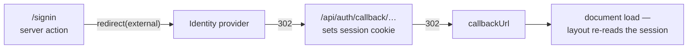
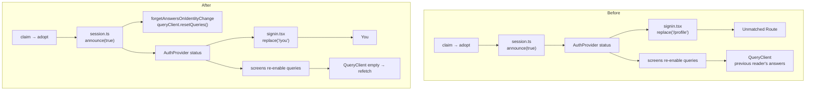

# Work Order: Session takes effect on sign-in without a reload

---

## 1. Metadata

| Field           | Value                                                                        |
| --------------- | ---------------------------------------------------------------------------- |
| id              | `WO-auth-session-refresh`                                                    |
| version         | `1`                                                                          |
| status          | `In Review`                                                                  |
| repo_target     | `switchback`                                                                 |
| base_sha        | `d7c2fad3f260ecc2add7c95f588e9a8a6aa144e0` (rebased at v1r4; was `1789198f`) |
| created_at      | `2026-08-29T06:40:00+00:00`                                                  |
| harness_version | `3.1.0`                                                                      |
| overrides       | none — no `AGENTS.md` or `CLAUDE.md` in `switchback`                         |
| supersedes      | N/A                                                                          |

The dispatch brief named `7d593956` as the base. This worktree branched from `origin/master`,
which had moved on to `1789198f`; `7d593956` is an ancestor of it. The later SHA is recorded
because it is what the work was built and verified against.

---

## 2. Problem statement

Completing sign-in leaves the reader looking at a signed-out application. The account exists,
the session is live, and everything is correct on the server — but the client keeps showing the
state it had before, and only restarting fixes it.

Two surfaces had to be told apart before anything could be fixed, because the report named
neither. The finding is that **the website is not affected and the iOS app is**, on two distinct
mechanisms: the sign-in screen's completion path navigates to a route the app does not have, and
the query cache is keyed by question rather than by who asked, so answers given to the previous
reader outlive the sign-in that replaced them.

---

## 3. Scope

**In**

- `apps/mobile/app/signin.tsx` — where a completed sign-in sends the reader.
- `apps/mobile/src/api/` — discarding cached answers when the signed-in identity changes.
- `apps/mobile/src/offline/` — laying the phone's copy of a trail down again afterwards. Added
  at v1r2; see A6 and the log entry at seq 4.
- `apps/mobile/src/auth/session.ts` — making the announcement that drives all of the above
  unskippable. Added at v1r2; see A7.
- `apps/mobile/app/lists/[key].tsx` — the one account query in the app not gated on being
  signed in. Added at v1r2.
- Mobile tests covering all of it.
- `docs/mobile.md` — the sessions section, which describes this seam.

**Out**

- The website. Measured, not assumed — §4 D1 carries the evidence. Nothing in `apps/web`
  changes.
- The Auth.js configuration, the CSRF helper, the mobile handshake, and the token lifecycle.
  All were read; none is implicated.
- The website's own React Query cache surviving a sign-out. Real, and the mechanism first
  recorded here was wrong: `enabled: viewerId !== null` gates the _fetch_, not the cached read,
  and `useSaved` returns `saved.data ?? EMPTY_SAVED_IDS` to a `TrailCard` that calls it
  unconditionally — so a reader who has just signed out keeps seeing their own favourite rings
  on the anonymous explore index for the life of the tab. The conclusion survives, because web
  sign-_in_ is always a document load and no cross-account exposure follows; the reasoning did
  not. Still out of scope: a different surface and a different code path.
- The recorder journal (`apps/mobile/src/record/store.ts`), which survives an identity change
  holding the previous reader's GPS trace. Same class of defect as the query cache and a real
  one, but that file is being rewritten by `feat/mobile-background-tracking` and the requirement
  has gone to that stream.
- Generating expo-router's typed-route declarations in CI. `typedRoutes` is already set in
  `app.config.ts` and is inert, so the compiler would name this bug outright — see the log entry
  at seq 4. Repo-wide, and spun out separately.
- `e2e/` and `playwright.config.ts`. A sign-in end-to-end spec belongs there and the harness to
  write one now exists (§4 D1), but that tree is owned by a sibling stream in flight.

---

## 4. Definition of Done

| id  | predicate                                                                                                                                        | verification                                                                                                                                                                                                                                                                                                                                                                                                                                                                                  |
| --- | ------------------------------------------------------------------------------------------------------------------------------------------------ | --------------------------------------------------------------------------------------------------------------------------------------------------------------------------------------------------------------------------------------------------------------------------------------------------------------------------------------------------------------------------------------------------------------------------------------------------------------------------------------------- |
| D1  | The website reflects a completed sign-in with no reload, on every route that offers one, in a production build with the service worker installed | A driver script walks the real OIDC round trip against a stub issuer for `/`, `/lists`, `/settings`, `/record`, `/plan`, `/downloads`; each prints the same signed-in chrome before and after a manual reload. **The driver is not in the tree** — see A5 — so this is reproducible only from the transcript in §10, not by running a command in this repo. An earlier `next dev` sweep agreed, and is not evidenced: the production sweep is the stricter of the two and is the one recorded |
| D2  | Every literal navigation target in the iOS app resolves to a route the app actually has                                                          | `npx vitest run apps/mobile/test/navigation-targets.test.ts` exits 0                                                                                                                                                                                                                                                                                                                                                                                                                          |
| D3  | A change of signed-in identity empties the query cache, in both directions                                                                       | `npx vitest run apps/mobile/test/identity-cache.test.ts` exits 0                                                                                                                                                                                                                                                                                                                                                                                                                              |
| D4  | Both new tests fail against the unfixed source, naming the defect rather than crashing                                                           | run each on the pre-fix tree; D2 names `/profile`, D3 finds the cache still populated                                                                                                                                                                                                                                                                                                                                                                                                         |
| D5  | Nothing else regressed — the suite gains the new tests and loses nothing                                                                         | `npm run lint`, `npm run typecheck` and `npm run format:check` each exit 0. `npm run test` does **not** exit 0 on this host: it is run against the base commit and again against the branch, and the same pre-existing failures must appear on both sides with the new tests added to the passing count                                                                                                                                                                                       |

---

## 5. Assumptions & defaults

| #   | Ambiguity                                                    | Default chosen                                          | Why                                                                                                                                                                                                                                                                                                                                                                                                                                  |
| --- | ------------------------------------------------------------ | ------------------------------------------------------- | ------------------------------------------------------------------------------------------------------------------------------------------------------------------------------------------------------------------------------------------------------------------------------------------------------------------------------------------------------------------------------------------------------------------------------------ |
| A1  | Web or iOS — the report named neither                        | Establish it by measurement, fix only what is affected  | The brief forbids silently narrowing to whichever is easier. The website was driven through a real authorization-code flow on six routes and did not reproduce; the iOS defects are visible in source and provable without a device                                                                                                                                                                                                  |
| A2  | Where a cold-start sign-in should land                       | `/you`                                                  | It is the iOS app's account screen and the counterpart of the website's `/profile`, which is the route the code was reaching for. `(tabs)/you.tsx` is the screen the sign-in prompt is reached from                                                                                                                                                                                                                                  |
| A3  | How much of the query cache to discard on an identity change | All of it                                               | Which procedures are account-scoped is not knowable from the cache seam without a list that will drift out of date silently. A list that is wrong leaks one reader's answers to the next; a blunt clear costs one refetch at a moment the app is already navigating                                                                                                                                                                  |
| A4  | iOS could not be run here                                    | Prove the defects at source level and state the gap     | Windows host, no simulator, and the app has no `react-native-web` target. Recorded as **UNVERIFIED** in the report: no device recording exists                                                                                                                                                                                                                                                                                       |
| A5  | Whether to add an end-to-end sign-in spec                    | No                                                      | `e2e/` and `playwright.config.ts` are the write set of a sibling stream. The reproduction harness is described in the final report so it can be landed after that stream                                                                                                                                                                                                                                                             |
| A6  | What to do about the ownership flags on a re-seeded copy     | Seed them false, on every seed and not only the re-seed | `isMine` on a stored photo or report is a fact about whoever downloaded the trail. It sits on disk and outlives both the session that wrote it and the account that owned it, so it is never a claim about the reader now. False is the only value that claims nothing; the true answer arrives with the live fetch. One behaviour rather than two, because a seed that means different things on different paths is the next defect |
| A7  | Whether a Keychain failure should still propagate to callers | Yes                                                     | `try/finally` makes the announcement unskippable, which is the part this Work Order created by making it the sole cache-clearing trigger. The unhandled rejection above it is older than this change and belongs to the sign-in screen's error handling, not here                                                                                                                                                                    |

---

## 6. Design sketch

### What the website does, and why it is fine



Every leg out of the provider is a document load, so there is no client state to go stale. All
41 routes render dynamically (`next build` marks every one `ƒ`), the responses carry
`Cache-Control: private, no-cache, no-store`, and the service worker is network-first for
navigations and keys RSC requests by their `?_rsc=` query, so nothing it holds can answer for a
page. Measured on six routes rather than argued: D1.

### What the iOS app does



**The dead route.** `app/signin.tsx` leaves a completed sign-in with
`router.canGoBack() ? router.back() : router.replace('/profile')`. There is no `/profile` in
`apps/mobile/app` — that is the _website's_ route; the app's account screen is `(tabs)/you.tsx`,
so `/you`. The fallback branch is the cold-start path `resumeSignIn` exists for: iOS reclaimed
the app while the browser sheet was open, the deep link launches the app straight at `/signin`,
and with no `unstable_settings.initialRouteName` anywhere in the app there is nothing on the
stack to go back to. The reader signs in successfully and is replaced onto expo-router's
Unmatched Route screen, where the only way out is restarting the app.

**The cache that does not know who asked.** `ApiProvider` builds one `QueryClient` for the
process, with `staleTime: 60_000`, and nothing empties it when the signed-in identity changes.
React Query keys an entry by procedure and input, never by reader. So a sign-out followed by a
sign-in — the ordinary way to correct a wrong account — re-enables `me.get`, `lists.mine` and
`me.stats` onto entries that are still inside their stale window and still hold the _previous_
reader's answers. The new reader is shown the old account until the window lapses or the app is
restarted. `app/lists/[key].tsx` asks `me.get` without gating it on being signed in, so the same
entry can also be filled by nobody at all.

The seam already exists: `session.ts` announces every transition to its subscribers, and it is
the only thing that does. The new unit hangs off it.

**The seed that is not a fetch.** Emptying the cache is only half an answer, because not every
entry in it came from the network. `offline/hydrate.ts` writes a downloaded trail into four live
query keys with `setQueryData`, so the gallery, the reports and the detail all render from the
phone without knowing a download exists. A reset destroys those entries; an active query
refetches itself, but nothing refetches a seed, and in a valley there is nothing to refetch
from. Its effect cannot notice on its own — every dependency it has is referentially stable —
so it would stay destroyed for the life of that mounted screen, and the trail screen would
report "Trail not found" over a trail the phone is holding in full.

That is on the path this Work Order fixes: open a downloaded trail, press Save, sign in, and the
sign-in screen pops back to the still-mounted trail screen. It also happens unattended, when a
401 signs the device out wherever the reader is standing.

So the reset publishes a generation, and the hydration effect depends on it. One subscriber does
both, in one synchronous step, so the order is a property of the code rather than of React:

```
announce(signedIn)
  └─ forgetAnswersOnIdentityChange
       ├─ resetQueries()      the answers go, and every observer is told
       └─ generation += 1     the seeds are laid again by the effects that own them
```

Key interfaces:

```ts
/** Discard every cached answer whenever the signed-in identity changes. Returns an unsubscribe. */
export function forgetAnswersOnIdentityChange(
  queryClient: Pick<QueryClient, 'resetQueries'>,
  subscribe: (listener: Listener) => () => void,
): () => void;

/** How many identity changes this process has seen, for a component that must re-lay a seed. */
export function useCacheGeneration(): number;

/** Write the phone's copy under the keys the live queries use. Never over live data. */
export function seedFromDisk(
  queryClient: Pick<QueryClient, 'setQueryData'>,
  keys: TrailKeys,
  copy: OfflineTrail,
): void;
```

**`resetQueries`, not `clear`.** `clear` empties the cache without notifying anybody, so a
mounted `useQuery` goes on serving the previous reader's data and never refetches on its own —
the leak would close only when some other re-render happened to reach that screen, which is an
unstated invariant ("every screen showing account data calls `useAuth()`") that the app already
violates. `resetQueries` notifies its observers and refetches the active ones.

`ApiProvider` is mounted inside `AuthProvider`, so its effect subscribes first and the cache is
emptied before any screen re-renders on the new status — which makes the refetch that follows
the first one rather than a second. With `resetQueries` that is a cost argument and no longer a
correctness one, but it is invisible from either file, so `test/conventions.test.ts` holds the
nesting in place.

---

## 7. Task breakdown

| id    | task                                                                                                                                                                                               | acceptance check                                                                                                                      | status |
| ----- | -------------------------------------------------------------------------------------------------------------------------------------------------------------------------------------------------- | ------------------------------------------------------------------------------------------------------------------------------------- | ------ |
| T-001 | Establish which surface is affected: drive the real authorization-code flow against a stub issuer on six website routes, in `next dev` and in a production build with the service worker installed | driver prints identical chrome before and after reload on every route                                                                 | `done` |
| T-002 | Test that every literal navigation target in the iOS app resolves to a real route; observe it name `/profile`                                                                                      | `npx vitest run apps/mobile/test/navigation-targets.test.ts` fails, then passes after T-003                                           | `done` |
| T-003 | Send a completed sign-in to `/you`                                                                                                                                                                 | as T-002                                                                                                                              | `done` |
| T-004 | Test that an identity change empties the query cache, both directions, and stops on unsubscribe; observe it fail                                                                                   | `npx vitest run apps/mobile/test/identity-cache.test.ts` fails, then passes after T-005                                               | `done` |
| T-005 | Add `forgetAnswersOnIdentityChange` and wire it into `ApiProvider`                                                                                                                                 | as T-004                                                                                                                              | `done` |
| T-006 | Record the rule in `docs/mobile.md`'s sessions section                                                                                                                                             | the section names the cache reset                                                                                                     | `done` |
| T-007 | Full verification                                                                                                                                                                                  | `lint`, `typecheck`, `format:check` exit 0; `npm run test` differs from base only by the added tests                                  | `done` |
| T-008 | Reset with `resetQueries` rather than `clear`, so observers are told; assert what a mounted observer serves rather than what the cache holds                                                       | `identity-cache.test.ts` fails against `clear` with the observer still serving the departed reader, and passes against `resetQueries` | `done` |
| T-009 | Publish a generation on every reset and split the seed out of the hook so both are testable; re-lay the phone's copy when it moves                                                                 | `offline-seed.test.ts` fails with nothing re-seeding and passes with it                                                               | `done` |
| T-010 | Strip the stored ownership flags on every seed                                                                                                                                                     | `offline-seed.test.ts` › claims nothing on behalf of whoever downloaded it                                                            | `done` |
| T-011 | Make the announcement unskippable when the Keychain refuses a write                                                                                                                                | `adopt` and `signOutLocally` announce from a `finally`                                                                                | `done` |
| T-012 | Widen the navigation gate to the object and `href` spellings, and gate the one ungated account query                                                                                               | the gate catches `router.push({ pathname: '/profile' })`; `lists/[key].tsx` reads `useAuth()`                                         | `done` |
| T-013 | Lift the source walker into `test/sources.ts` and hold the provider nesting the ordering rests on                                                                                                  | `conventions.test.ts` exits 0 with four rules                                                                                         | `done` |

---

## 8. Test plan

**Unit**

- `navigation-targets.test.ts`
  - every literal `router.push`/`replace`/`navigate` target in `app/` and `src/` resolves to a
    route file — the defect itself
  - the derived route table contains the routes the app plainly has, so a resolver that matched
    nothing could not pass vacuously
  - an invented target does not resolve — so the check can fail
- `identity-cache.test.ts`
  - a sign-in announcement empties the cache — happy path
  - a sign-out announcement empties it too — the symmetry, and the one that matters on a shared
    phone
  - after unsubscribe, an announcement leaves the cache alone — teardown

**Integration**

- The website's real OIDC round trip, driven end to end against a stub issuer that serves
  discovery, authorization, token and JWKS, over six routes and both build modes. This is the
  measurement that decides the scope of the change, so it is evidence rather than a test.

**Edge cases**

- Cold start with no history: `router.canGoBack()` false, which is the branch that was broken.
- Route groups: `(tabs)/you.tsx` is reachable as `/you`, not `/(tabs)/you`.
- Dynamic segments: `trails/[slug]` must be matched by the resolver, not reported missing.

**Regression**

- `npm run test` — the whole suite, including `apps/mobile/test/conventions.test.ts`, which
  enforces the source-level rules this change must not break.
- `npm run lint`, `npm run typecheck`.

---

## 9. Iteration log

```yaml
- seq: 1
  at: 2026-08-29T06:40:00+00:00
  state: WORK_ORDER -> IMPLEMENT
  event: work_order_authored
  detail: >-
    Surface established by measurement before any code was written. The website was driven
    through a real authorization-code flow against a stub issuer on six routes, in next dev
    and in a production build with the service worker installed, and did not reproduce. Two
    defects found in the iOS app: a completed sign-in navigates to /profile, which is the
    website's route and not one this app has, and the query cache is never emptied when the
    signed-in identity changes.
  decision: Fix both iOS defects; change nothing in apps/web; flag the web sign-out cache.
  budget: { implement: 0/3, review: 0/3, replan: 0/2, total: 1/8 }

- seq: 2
  at: 2026-08-29T06:55:00+00:00
  state: IMPLEMENT -> SELF_VERIFY
  event: tasks_complete
  detail: >-
    T-001..T-007 done. Both new tests were observed failing against the unfixed source for the
    right reason: navigation-targets named `app\signin.tsx:104  /profile`, and identity-cache
    failed its two behaviour assertions with the previous reader's entry still in the cache
    while its teardown assertion passed.
  decision: Self-verification pass, then PR.
  budget: { implement: 1/3, review: 0/3, replan: 0/2, total: 1/8 }

- seq: 3
  at: 2026-08-29T07:00:00+00:00
  state: SELF_VERIFY -> IN_REVIEW
  event: definition_of_done_verified
  detail: >-
    D1 met — six routes, production build, service worker installed, identical chrome before
    and after a manual reload. D2 and D3 met — 6 tests pass. D4 met — both observed failing
    first. D5 met — the suite goes from 2285 to 2291 passing with the same 24 failures, all of
    them pre-existing on the base commit in `test/ci-steps-runnable.test.ts` and
    `test/worker-deploy-path.test.ts`, neither of which touches auth. lint, typecheck and
    format:check exit 0.
  decision: >-
    Open the PR. One gap stated rather than papered over: the iOS defects are proven at source
    level and by unit test, not on a device — this machine runs Windows and the app has no
    react-native-web target, which is the verification standard `docs/mobile.md` already sets
    for this repo.
  budget: { implement: 1/3, review: 0/3, replan: 0/2, total: 1/8 }

- seq: 4
  at: 2026-08-29T07:45:00+00:00
  state: IN_REVIEW -> IMPLEMENT
  event: review_board_returned_fail
  detail: >-
    One Blocker, four Majors. The Blocker is mine and was not in the design at all: the reset
    destroys the `setQueryData` seed that `offline/hydrate.ts` lays for a downloaded trail, and
    that effect's dependencies are all referentially stable, so it never re-runs and the seed is
    gone for the life of the mounted screen. Reachable on the very path this Work Order fixes —
    sign in from a downloaded trail, `canGoBack()` pops back to the still-mounted trail screen —
    and offline the screen then says "Trail not found" over a trail the phone holds in full,
    which is verbatim what `hydrate.ts` documents itself as existing to prevent. The Majors:
    `clear()` empties without notifying observers, so the fix was incomplete; an uncaught
    Keychain throw can skip `announce` entirely, which this Work Order promoted from a stranded
    UI to a live cache; the navigation gate matched only the short spelling and missed all nine
    object-form calls, so the original bug could walk back in through
    `router.push({ pathname: '/profile' })`; and `typedRoutes` is already set in `app.config.ts`
    but inert, because `tsconfig.json` excludes the `.expo` directory its declarations are
    generated into — the compiler would name this bug outright if that were wired up.
  decision: >-
    Fix all five in place; no re-plan. Scope amended in writing first — §3 In gains
    `src/offline/`, `src/auth/session.ts` and `app/lists/[key].tsx`, and A6/A7 record the two
    judgement calls. Typed-route generation in CI is repo-wide and stays out, recorded in §3 Out.
  budget: { implement: 1/3, review: 1/3, replan: 0/2, total: 1/8 }

- seq: 5
  at: 2026-08-29T08:10:00+00:00
  state: IMPLEMENT -> IN_REVIEW
  event: record_corrected
  detail: >-
    Correcting seq 3, which recorded two things it should not have. **D1 was marked MET on half
    its predicate**: it claimed both `next dev` and a production build, and every artefact under
    §10 is the production sweep. The dev sweep was run and agreed, but it was not captured, so
    the claim outran the evidence. D1's predicate now says production only, and names at the
    point of the claim that the driver is not in the tree. **D5 and T-007 both read "each exit
    0" for `npm run test`** while the evidence directly beneath them showed 24 failures on both
    sides. The differential run against the base commit is what was actually performed and is
    sufficient for "nothing else regressed"; the predicate now says that instead.
  decision: >-
    Predicates corrected to match what was measured. Nothing was deleted; this entry is the
    record of what the earlier one got wrong.
  budget: { implement: 1/3, review: 1/3, replan: 0/2, total: 1/8 }

- seq: 6
  at: 2026-08-29T08:15:00+00:00
  state: IN_REVIEW
  event: reasoning_corrected
  detail: >-
    Correcting the web sign-out note in §3 Out at seq 1. It said no leak followed because every
    account-scoped client query is gated on a `viewerId` from the re-rendered server tree. That
    gate is on the *fetch*, not on the cached read: `useSaved` returns `saved.data ?? EMPTY` to a
    `TrailCard` that calls it unconditionally, so a reader who has just signed out keeps seeing
    their own favourite rings on the anonymous explore index for the life of the tab. The
    conclusion — out of scope, no cross-account exposure, because web sign-in is a document load
    — is unchanged. The mechanism given for it was wrong.
  decision: Reasoning corrected in §3 Out. No web code changes.
  budget: { implement: 1/3, review: 1/3, replan: 0/2, total: 1/8 }

- seq: 7
  at: 2026-08-29T09:05:00+00:00
  state: IMPLEMENT -> IN_REVIEW
  event: fix_round_verified
  detail: >-
    All six round-2 tasks (T-008..T-013) confirmed present in source rather than trusted from
    the task table, after this agent was terminated mid-round by a platform API outage and
    resumed. Working tree was coherent on resume — no truncated write — and is now committed.
    Correctness returned PASS with a third Major, the `announce` bypass, which is T-011 and was
    already implemented before the outage: `adopt` and `signOutLocally` now announce from a
    `finally`. The ordering Correctness asked to have asserted is T-013, in
    `conventions.test.ts`. Deterministic gates: lint, typecheck and format:check all exit 0.
    Differential re-run on both sides against base `1789198f`, which `git ls-remote` confirms is
    still `origin/master` — the base has not moved, so §1 stands unamended.
  decision: >-
    Two things declared rather than smoothed over. First, an earlier run this round was
    contaminated by a `.env` I created in the worktree; it is deleted and no number from that
    run survives into §10. Second, this host's suite is load-unstable — three runs of one tree
    gave 38, 43 and 27 failures — so the differential rests on the set of failing files and the
    arithmetic, not on a headline count. Corrected at seq 8: that holds at *file* granularity,
    where the set is always the same, and not at test granularity, where the counts within a
    file move between runs. The one file that differs between the two runs,
    `packages/db/test/entra-client.test.ts`, passes 4/4 alone on the branch and is untouched by
    a diff confined to `apps/mobile`, `docs/` and this file.
  budget: { implement: 2/3, review: 1/3, replan: 0/2, total: 1/8 }

- seq: 8
  at: 2026-08-29T11:30:00+00:00
  state: IN_REVIEW -> IMPLEMENT
  event: review_board_returned_fail
  detail: >-
    Round-2 board: six of six FAIL. The round-1 Blocker was not closed — I restored the seed's
    data but not its status. `resetQueries` refetches active queries unconditionally, ignoring
    `staleTime`; nothing in the repo wires `onlineManager`, so offline that refetch fails rather
    than pauses, and query-core keeps `data` while setting `status: 'error'`. Every fatal screen
    branch read `isError`, so a downloaded trail drew and then flipped to "Trail not found"
    seconds later. The root cause was a sentence in `offline/hydrate.ts` asserting query-core
    keeps `status: 'success'` in that case. Measured on 5.101.4, it does not. The belief, not the
    code, is what made this invisible. A second Blocker found by the tests reviewer is worse:
    `actedOn` deduped on a boolean, so a sign-in arriving while a session was already live was
    swallowed entirely — reachable through `signin.tsx`'s cold-start effect, which gates
    `resumeSignIn` on a ref and not on `status`, and it served one reader's record to another.
  decision: >-
    Measured before choosing, rather than reasoning about the library again. Three fix surfaces
    were offered; a probe against the installed query-core rejected the one I would otherwise
    have picked — resetting without a forced refetch leaves every observer `pending` with zero
    fetches even after a re-render, so the forced refetch is load-bearing and the screens are
    what must change. Fatal branches now ask whether they hold data. The dedupe is
    one-directional: only a repeated sign-*out* is a duplicate. `watchGeneration` is exported so
    the notify path can be tested at all, and three structural gates stand in for the behavioural
    tests a renderer would allow — each written by making the mutation and watching it fail.

- seq: 9
  at: 2026-08-29T11:35:00+00:00
  state: IMPLEMENT
  event: record_corrected
  detail: >-
    Correcting two claims in §10 written at seq 7. **The `/bin/bash` explanation was wrong.** I
    wrote that the residual failures shell out to a `/bin/bash` this Windows host lacks, and
    quoted a WSL relay error to support it. `which bash` returns `/usr/bin/bash` and it runs;
    every one of those failures is `Test timed out in 5000ms`, including a synchronous one-liner
    measured at 25,267 ms. They are load timeouts. I read one error line out of a noisy log and
    generalised it into a mechanism I never checked — the same failure that produced the Blocker
    above, in the evidence rather than in the code. **And the stability claim needed its
    granularity stated:** resting on "the set of failing files" is sound at file granularity,
    where the set is identical across runs, but not at test granularity, where counts within a
    file move.
  decision: >-
    Both corrected in §10 in place, each pointing here. The differential's conclusion is
    unchanged and was independently reproduced on a reviewer's host — base 10 failed / 2194
    passed, branch 10 failed / 2208 passed, +14 exactly and only the new mobile tests.
  budget: { implement: 3/3, review: 2/3, replan: 0/2, total: 1/8 }

- seq: 10
  at: 2026-08-29T14:10:00+00:00
  state: IMPLEMENT
  event: rebased_and_scope_reopened
  detail: >-
    Rebased onto `d7c2fad` (PR #80, the CI fix) — seven commits, no conflicts, and no overlap:
    #80 touched `e2e/`, `packages/db/scripts/` and a new root test, nothing under `apps/mobile`.
    §1 `base_sha` updated; the base has genuinely moved this time and the record says so. Caps
    were then lifted, reopening the six items escalated at 3/3. Took four of them.
  decision: >-
    **Declined the test-renderer dependency.** It was offered, and the top-priority item turned
    out not to need it: `session.ts` is a plain module, so `vi.mock` on `expo-secure-store` and a
    stubbed `fetch` reach every branch with no DOM and no renderer. Declining also avoids an
    install on a 99% volume. `test/session.test.ts` is new — 13 cases over the two `try/finally`
    announcements, the 401 sign-out, the single-flight refresh, the offline and 503 paths that
    must *not* sign anybody out, and the guard that stops a failed Keychain delete resurrecting
    a session. Reverting both `finally` blocks now fails 2 of them; a reviewer had shown that
    same mutation leaving the whole suite green.
  budget: { implement: 4, review: 2, replan: 0, total: 2 }

- seq: 11
  at: 2026-08-29T14:20:00+00:00
  state: IMPLEMENT
  event: weak_gates_replaced
  detail: >-
    Three gates strengthened after reviewers demonstrated each passing against the mutation it
    was supposed to catch. **The ordering rule compared two string indices**, which siblings
    satisfy as well as a parent and child — it now reads what sits between `<AuthProvider>` and
    its closing tag, and rewriting the providers as siblings fails it. **The protected-query rule
    hardcoded `me.*`**; it now derives the list from `protectedProcedure` declarations in
    `packages/api/src/routers/`, excluding mutations, and so knows about procedures nobody
    thought to tell it about. That rule immediately found `lifeline.active`, the second ungated
    query, which is now gated — the third such call site this Work Order has closed, and the
    second found by the rule rather than by hand.
  decision: >-
    Also folded in the two remaining Minors. `unowned`/`unclaimed` are one generic `disown`. The
    `isMine: false` decision now records the one affordance it *adds* rather than removes —
    `reviews.tsx` offers the Report control on a report that is not yours, so a seeded page
    offers it on your own — and accepts it: pointless rather than dangerous, corrected by the
    first live fetch, and cheaper than carrying a third "unknown" ownership state through the
    router shapes. Named behaviours now covered: a partial stored copy seeds only what it has,
    and a second identical announcement costs no second reset.
  budget: { implement: 4, review: 2, replan: 0, total: 2 }
```

---

## 10. Evidence

**Round 4, rebased onto `d7c2fad`.** The mobile suite is 46 tests across 6 files, up from 5
tests across 2 on the base:

```
 ✓ apps/mobile/test/navigation-targets.test.ts (7)
 ✓ apps/mobile/test/conventions.test.ts        (7)
 ✓ apps/mobile/test/session.test.ts           (13)
 ✓ apps/mobile/test/identity-cache.test.ts    (10)
 ✓ apps/mobile/test/trail-title.test.ts        (2)
 ✓ apps/mobile/test/offline-seed.test.ts       (7)
 Test Files 6 passed (6)   Tests 46 passed (46)   exit=0

npm run lint          exit=0
npm run typecheck     exit=0
npm run format:check  exit=0
```

Each gate strengthened this round was verified by making the mutation it exists to catch:

| Mutation                                  | Before       | After                                                          |
| ----------------------------------------- | ------------ | -------------------------------------------------------------- |
| Both `try/finally` announcements reverted | suite green  | 2 fail — `expected [] to deeply equal [ true ]` / `[ false ]`  |
| Providers rewritten as siblings           | 4/4 green    | fails — `expected '<AuthProvider>' to contain '<ApiProvider>'` |
| `lifeline.active` left ungated            | not detected | fails — `a protected query needs an \`enabled\` gate`          |

**D1 — the website reflects a sign-in with no reload.** Production build (`next build`, all 41
routes `ƒ`), `next start`, service worker installed and controlling, real authorization-code
flow against a stub OIDC issuer:

```
--- start at / ---
before: url=http://localhost:3000/ signInLinks=1 signOutButtons=0
after sign-in (no reload): url=http://localhost:3000/ signInLinks=0 signOutButtons=1
after manual reload: url=http://localhost:3000/?map=10%2F47.60963%2F-122.33 signInLinks=0 signOutButtons=1
SAME before and after reload
--- start at /lists ---     … SAME before and after reload
--- start at /settings ---  … SAME before and after reload
--- start at /record ---    … SAME before and after reload
--- start at /plan ---      … SAME before and after reload
--- start at /downloads --- … SAME before and after reload
sweep exit=0
```

**D4 — observed failing first.**

```
 FAIL  apps/mobile/test/navigation-targets.test.ts > is never sent somewhere it cannot go
+   { "target": "/profile", "where": "app\\signin.tsx:104" }
 Test Files  1 failed (1)   Tests  1 failed | 2 passed (3)   exit=1

 FAIL  apps/mobile/test/identity-cache.test.ts
 Test Files  1 failed (1)   Tests  2 failed | 1 passed (3)   exit=1
```

**D2, D3, D5 — after the fix.** Superseded at v1r2; the run below replaces the one recorded at
seq 3, which was taken with a stray `.env` in the tree (see the note on contamination after it).

```
 ✓ apps/mobile/test/conventions.test.ts       (4 tests)
 ✓ apps/mobile/test/navigation-targets.test.ts (4 tests)
 ✓ apps/mobile/test/trail-title.test.ts        (2 tests)
 ✓ apps/mobile/test/offline-seed.test.ts       (4 tests)
 ✓ apps/mobile/test/identity-cache.test.ts     (5 tests)
 Test Files  5 passed (5)   Tests  19 passed (19)   exit=0

npm run lint          exit=0
npm run typecheck     exit=0
npm run format:check  exit=0
```

**The differential, both sides run on this host within the hour, base `1789198f` (which is
still `origin/master` — the base has not moved since §1 was written):**

```
base   1789198f: Test Files 2 failed | 115 passed | 5 skipped (122)
                      Tests 24 failed | 2180 passed | 105 skipped (2309)
branch e8a4496 : Test Files 3 failed | 117 passed | 5 skipped (125)
                      Tests 27 failed | 2191 passed | 105 skipped (2323)
```

**Round 3, same host, same base.** The mobile suite grows from 5 tests on the base to 29:

```
base   1789198f: Test Files 2 failed | 115 passed | 5 skipped (122)
                      Tests 24 failed | 2180 passed | 105 skipped (2309)
branch 8e1c576 : Test Files 3 failed | 117 passed | 5 skipped (125)
                      Tests  6 failed | 2222 passed | 105 skipped (2333)
```

**+24 tests, which is exactly the mobile suite's growth** (29 − 5). The failed _count_ moved from
24 to 6 between these two runs, which is the host instability again and not an improvement this
change earned — the failing _file_ set is what is stable, and it is the same three as before:
`ci-steps-runnable`, `worker-deploy-path`, and the known-flaky `entra-client` (4/4 alone, twice).

Read it as: **+14 tests, all of them passing.** The arithmetic closes exactly — total +14,
passed +11, failed +3 — because one file that passed on the base run failed on the branch run.

That file is `packages/db/test/entra-client.test.ts`, and it is **flake, not regression**. Run
alone on the branch it passes 4/4, twice:

```
$ npx vitest run packages/db/test/entra-client.test.ts
run1:  Tests  4 passed (4)
run2:  Tests  4 passed (4)
```

The whole diff against the base is `apps/mobile/**`, `docs/mobile.md` and this file — nothing
under `packages/db` — so there is no path by which this change reaches that test.

The remaining failures are pre-existing and identical on both sides: `ci-steps-runnable` and
`worker-deploy-path`. **The explanation first recorded for them was wrong** and is corrected at
seq 8: they do not fail for want of `/bin/bash`. `which bash` returns `/usr/bin/bash` on this
host and it runs. Every one of those failures is `Test timed out in 5000ms` — including a
synchronous one-liner measured at 25,267 ms. They are load timeouts, and neither file touches
authentication.

**Two cautions on these numbers, both mine to declare.**

_Contamination, corrected._ An earlier run in this round was taken after I created a `.env` in
the worktree to get the database suites to connect. It did not connect them; it un-skipped them
into failures, and the run read 43 failed / 2266 passed / 14 skipped. That file is deleted and
both runs above were taken without it — which is why 105 tests skip on both sides rather than 14. No number from the contaminated run is used here.

_The suite is not stable on this host under load._ Three full runs of the same tree produced 38,
43 and 27 failures as the environment changed around them, with individual files taking 116s and
184s. The host is at 99% disk. A single total from this machine is therefore not evidence on its
own, and the claim above rests on the _set_ of failing files plus the arithmetic, not on a
headline count matching.

**UNVERIFIED.** No iOS device or simulator was driven — the host runs Windows and the app has no
`react-native-web` target. The two defects are proven at source level and by unit test, which is
the standard `docs/mobile.md` § "Verifying a change" already sets for this repository.
