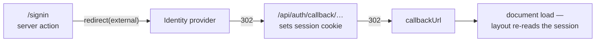
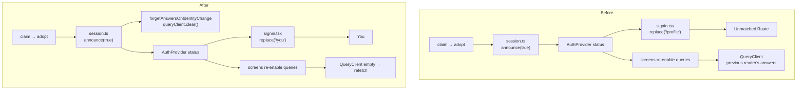

# Work Order: Session takes effect on sign-in without a reload

---

## 1. Metadata

| Field           | Value                                                |
| --------------- | ---------------------------------------------------- |
| id              | `WO-auth-session-refresh`                            |
| version         | `1`                                                  |
| status          | `In Review`                                          |
| repo_target     | `switchback`                                         |
| base_sha        | `1789198ff095cbe84a442e163b7dd2ac28a96341`           |
| created_at      | `2026-08-29T06:40:00+00:00`                          |
| harness_version | `3.1.0`                                              |
| overrides       | none — no `AGENTS.md` or `CLAUDE.md` in `switchback` |
| supersedes      | N/A                                                  |

The dispatch brief named `7d593956` as the base. This worktree branched from `origin/master`,
which had moved on to `1789198f`; `7d593956` is an ancestor of it. The later SHA is recorded
because it is what the work was built and verified against.

---

## 2. Problem statement

Completing sign-in leaves the reader looking at a signed-out application. The account exists,
the session is live, and everything is correct on the server — but the client keeps showing the
state it had before, and only restarting fixes it.

Two surfaces had to be told apart before anything could be fixed, because the report named
neither. The finding is that **the website is not affected and the iOS app is**, on two distinct
mechanisms: the sign-in screen's completion path navigates to a route the app does not have, and
the query cache is keyed by question rather than by who asked, so answers given to the previous
reader outlive the sign-in that replaced them.

---

## 3. Scope

**In**

- `apps/mobile/app/signin.tsx` — where a completed sign-in sends the reader.
- `apps/mobile/src/api/` — discarding cached answers when the signed-in identity changes.
- Mobile tests covering both.
- `docs/mobile.md` — the sessions section, which describes this seam.

**Out**

- The website. Measured, not assumed — §4 D1 carries the evidence. Nothing in `apps/web`
  changes.
- The Auth.js configuration, the CSRF helper, the mobile handshake, and the token lifecycle.
  All were read; none is implicated.
- The website's own React Query cache surviving a sign-out. Real, but a different surface and a
  different code path, and sign-_in_ on the web is always a document load. Recorded under
  "Observed, not addressed" in the final report rather than fixed here.
- `e2e/` and `playwright.config.ts`. A sign-in end-to-end spec belongs there and the harness to
  write one now exists (§4 D1), but that tree is owned by a sibling stream in flight.

---

## 4. Definition of Done

| id  | predicate                                                                                                                                                            | verification                                                                                                                                                                                                       |
| --- | -------------------------------------------------------------------------------------------------------------------------------------------------------------------- | ------------------------------------------------------------------------------------------------------------------------------------------------------------------------------------------------------------------ |
| D1  | The website reflects a completed sign-in with no reload, on every route that offers one, in both `next dev` and a production build with the service worker installed | `scratch-drive.mjs` drives the real OIDC round trip against a stub issuer for `/`, `/lists`, `/settings`, `/record`, `/plan`, `/downloads`; each prints the same signed-in chrome before and after a manual reload |
| D2  | Every literal navigation target in the iOS app resolves to a route the app actually has                                                                              | `npx vitest run apps/mobile/test/navigation-targets.test.ts` exits 0                                                                                                                                               |
| D3  | A change of signed-in identity empties the query cache, in both directions                                                                                           | `npx vitest run apps/mobile/test/identity-cache.test.ts` exits 0                                                                                                                                                   |
| D4  | Both new tests fail against the unfixed source, naming the defect rather than crashing                                                                               | run each on the pre-fix tree; D2 names `/profile`, D3 finds the cache still populated                                                                                                                              |
| D5  | Nothing else regressed                                                                                                                                               | `npm run test`, `npm run lint`, `npm run typecheck` each exit 0                                                                                                                                                    |

---

## 5. Assumptions & defaults

| #   | Ambiguity                                                    | Default chosen                                         | Why                                                                                                                                                                                                                                                                 |
| --- | ------------------------------------------------------------ | ------------------------------------------------------ | ------------------------------------------------------------------------------------------------------------------------------------------------------------------------------------------------------------------------------------------------------------------- |
| A1  | Web or iOS — the report named neither                        | Establish it by measurement, fix only what is affected | The brief forbids silently narrowing to whichever is easier. The website was driven through a real authorization-code flow on six routes and did not reproduce; the iOS defects are visible in source and provable without a device                                 |
| A2  | Where a cold-start sign-in should land                       | `/you`                                                 | It is the iOS app's account screen and the counterpart of the website's `/profile`, which is the route the code was reaching for. `(tabs)/you.tsx` is the screen the sign-in prompt is reached from                                                                 |
| A3  | How much of the query cache to discard on an identity change | All of it                                              | Which procedures are account-scoped is not knowable from the cache seam without a list that will drift out of date silently. A list that is wrong leaks one reader's answers to the next; a blunt clear costs one refetch at a moment the app is already navigating |
| A4  | iOS could not be run here                                    | Prove the defects at source level and state the gap    | Windows host, no simulator, and the app has no `react-native-web` target. Recorded as **UNVERIFIED** in the report: no device recording exists                                                                                                                      |
| A5  | Whether to add an end-to-end sign-in spec                    | No                                                     | `e2e/` and `playwright.config.ts` are the write set of a sibling stream. The reproduction harness is described in the final report so it can be landed after that stream                                                                                            |

---

## 6. Design sketch

### What the website does, and why it is fine



Every leg out of the provider is a document load, so there is no client state to go stale. All
41 routes render dynamically (`next build` marks every one `ƒ`), the responses carry
`Cache-Control: private, no-cache, no-store`, and the service worker is network-first for
navigations and keys RSC requests by their `?_rsc=` query, so nothing it holds can answer for a
page. Measured on six routes rather than argued: D1.

### What the iOS app does



**The dead route.** `app/signin.tsx` leaves a completed sign-in with
`router.canGoBack() ? router.back() : router.replace('/profile')`. There is no `/profile` in
`apps/mobile/app` — that is the _website's_ route; the app's account screen is `(tabs)/you.tsx`,
so `/you`. The fallback branch is the cold-start path `resumeSignIn` exists for: iOS reclaimed
the app while the browser sheet was open, the deep link launches the app straight at `/signin`,
and with no `unstable_settings.initialRouteName` anywhere in the app there is nothing on the
stack to go back to. The reader signs in successfully and is replaced onto expo-router's
Unmatched Route screen, where the only way out is restarting the app.

**The cache that does not know who asked.** `ApiProvider` builds one `QueryClient` for the
process, with `staleTime: 60_000`, and nothing empties it when the signed-in identity changes.
React Query keys an entry by procedure and input, never by reader. So a sign-out followed by a
sign-in — the ordinary way to correct a wrong account — re-enables `me.get`, `lists.mine` and
`me.stats` onto entries that are still inside their stale window and still hold the _previous_
reader's answers. The new reader is shown the old account until the window lapses or the app is
restarted. `app/lists/[key].tsx` asks `me.get` without gating it on being signed in, so the same
entry can also be filled by nobody at all.

The seam already exists: `session.ts` announces every transition to its subscribers, and it is
the only thing that does. The new unit hangs off it.

Key interface:

```ts
/** Discard every cached answer whenever the signed-in identity changes. Returns an unsubscribe. */
export function forgetAnswersOnIdentityChange(
  queryClient: Pick<QueryClient, 'clear'>,
  subscribe: (listener: (signedIn: boolean) => void) => () => void,
): () => void;
```

`ApiProvider` is mounted inside `AuthProvider`, so its effect subscribes first and the cache is
emptied before any screen re-renders on the new status — the refetch that follows is the first
one, not a second.

---

## 7. Task breakdown

| id    | task                                                                                                                                                                                               | acceptance check                                                                            | status |
| ----- | -------------------------------------------------------------------------------------------------------------------------------------------------------------------------------------------------- | ------------------------------------------------------------------------------------------- | ------ |
| T-001 | Establish which surface is affected: drive the real authorization-code flow against a stub issuer on six website routes, in `next dev` and in a production build with the service worker installed | driver prints identical chrome before and after reload on every route                       | `done` |
| T-002 | Test that every literal navigation target in the iOS app resolves to a real route; observe it name `/profile`                                                                                      | `npx vitest run apps/mobile/test/navigation-targets.test.ts` fails, then passes after T-003 | `done` |
| T-003 | Send a completed sign-in to `/you`                                                                                                                                                                 | as T-002                                                                                    | `done` |
| T-004 | Test that an identity change empties the query cache, both directions, and stops on unsubscribe; observe it fail                                                                                   | `npx vitest run apps/mobile/test/identity-cache.test.ts` fails, then passes after T-005     | `done` |
| T-005 | Add `forgetAnswersOnIdentityChange` and wire it into `ApiProvider`                                                                                                                                 | as T-004                                                                                    | `done` |
| T-006 | Record the rule in `docs/mobile.md`'s sessions section                                                                                                                                             | the section names the cache reset                                                           | `done` |
| T-007 | Full verification                                                                                                                                                                                  | `npm run test`, `npm run lint`, `npm run typecheck` exit 0                                  | `done` |

---

## 8. Test plan

**Unit**

- `navigation-targets.test.ts`
  - every literal `router.push`/`replace`/`navigate` target in `app/` and `src/` resolves to a
    route file — the defect itself
  - the derived route table contains the routes the app plainly has, so a resolver that matched
    nothing could not pass vacuously
  - an invented target does not resolve — so the check can fail
- `identity-cache.test.ts`
  - a sign-in announcement empties the cache — happy path
  - a sign-out announcement empties it too — the symmetry, and the one that matters on a shared
    phone
  - after unsubscribe, an announcement leaves the cache alone — teardown

**Integration**

- The website's real OIDC round trip, driven end to end against a stub issuer that serves
  discovery, authorization, token and JWKS, over six routes and both build modes. This is the
  measurement that decides the scope of the change, so it is evidence rather than a test.

**Edge cases**

- Cold start with no history: `router.canGoBack()` false, which is the branch that was broken.
- Route groups: `(tabs)/you.tsx` is reachable as `/you`, not `/(tabs)/you`.
- Dynamic segments: `trails/[slug]` must be matched by the resolver, not reported missing.

**Regression**

- `npm run test` — the whole suite, including `apps/mobile/test/conventions.test.ts`, which
  enforces the source-level rules this change must not break.
- `npm run lint`, `npm run typecheck`.

---

## 9. Iteration log

```yaml
- seq: 1
  at: 2026-08-29T06:40:00+00:00
  state: WORK_ORDER -> IMPLEMENT
  event: work_order_authored
  detail: >-
    Surface established by measurement before any code was written. The website was driven
    through a real authorization-code flow against a stub issuer on six routes, in next dev
    and in a production build with the service worker installed, and did not reproduce. Two
    defects found in the iOS app: a completed sign-in navigates to /profile, which is the
    website's route and not one this app has, and the query cache is never emptied when the
    signed-in identity changes.
  decision: Fix both iOS defects; change nothing in apps/web; flag the web sign-out cache.
  budget: { implement: 0/3, review: 0/3, replan: 0/2, total: 1/8 }

- seq: 2
  at: 2026-08-29T06:55:00+00:00
  state: IMPLEMENT -> SELF_VERIFY
  event: tasks_complete
  detail: >-
    T-001..T-007 done. Both new tests were observed failing against the unfixed source for the
    right reason: navigation-targets named `app\signin.tsx:104  /profile`, and identity-cache
    failed its two behaviour assertions with the previous reader's entry still in the cache
    while its teardown assertion passed.
  decision: Self-verification pass, then PR.
  budget: { implement: 1/3, review: 0/3, replan: 0/2, total: 1/8 }

- seq: 3
  at: 2026-08-29T07:00:00+00:00
  state: SELF_VERIFY -> IN_REVIEW
  event: definition_of_done_verified
  detail: >-
    D1 met — six routes, production build, service worker installed, identical chrome before
    and after a manual reload. D2 and D3 met — 6 tests pass. D4 met — both observed failing
    first. D5 met — the suite goes from 2285 to 2291 passing with the same 24 failures, all of
    them pre-existing on the base commit in `test/ci-steps-runnable.test.ts` and
    `test/worker-deploy-path.test.ts`, neither of which touches auth. lint, typecheck and
    format:check exit 0.
  decision: >-
    Open the PR. One gap stated rather than papered over: the iOS defects are proven at source
    level and by unit test, not on a device — this machine runs Windows and the app has no
    react-native-web target, which is the verification standard `docs/mobile.md` already sets
    for this repo.
  budget: { implement: 1/3, review: 0/3, replan: 0/2, total: 1/8 }
```

---

## 10. Evidence

**D1 — the website reflects a sign-in with no reload.** Production build (`next build`, all 41
routes `ƒ`), `next start`, service worker installed and controlling, real authorization-code
flow against a stub OIDC issuer:

```
--- start at / ---
before: url=http://localhost:3000/ signInLinks=1 signOutButtons=0
after sign-in (no reload): url=http://localhost:3000/ signInLinks=0 signOutButtons=1
after manual reload: url=http://localhost:3000/?map=10%2F47.60963%2F-122.33 signInLinks=0 signOutButtons=1
SAME before and after reload
--- start at /lists ---     … SAME before and after reload
--- start at /settings ---  … SAME before and after reload
--- start at /record ---    … SAME before and after reload
--- start at /plan ---      … SAME before and after reload
--- start at /downloads --- … SAME before and after reload
sweep exit=0
```

**D4 — observed failing first.**

```
 FAIL  apps/mobile/test/navigation-targets.test.ts > is never sent somewhere it cannot go
+   { "target": "/profile", "where": "app\\signin.tsx:104" }
 Test Files  1 failed (1)   Tests  1 failed | 2 passed (3)   exit=1

 FAIL  apps/mobile/test/identity-cache.test.ts
 Test Files  1 failed (1)   Tests  2 failed | 1 passed (3)   exit=1
```

**D2, D3, D5 — after the fix.**

```
 ✓ apps/mobile/test/navigation-targets.test.ts (3 tests)
 ✓ apps/mobile/test/identity-cache.test.ts (3 tests)
 Test Files  2 passed (2)   Tests  6 passed (6)   exit=0

npm run test    base 1789198f: Test Files 2 failed | 120 passed (122)  Tests 24 failed | 2285 passed (2309)
npm run test    this branch:   Test Files 2 failed | 122 passed (124)  Tests 24 failed | 2291 passed (2315)
npm run lint          exit=0
npm run typecheck     exit=0
npm run format:check  exit=0
```

The 24 failures are identical on both sides and pre-existing: `test/ci-steps-runnable.test.ts`
(6) and `test/worker-deploy-path.test.ts` (18), both of which shell out to workflow scripts and
neither of which touches authentication.

**UNVERIFIED.** No iOS device or simulator was driven — the host runs Windows and the app has no
`react-native-web` target. The two defects are proven at source level and by unit test, which is
the standard `docs/mobile.md` § "Verifying a change" already sets for this repository.
