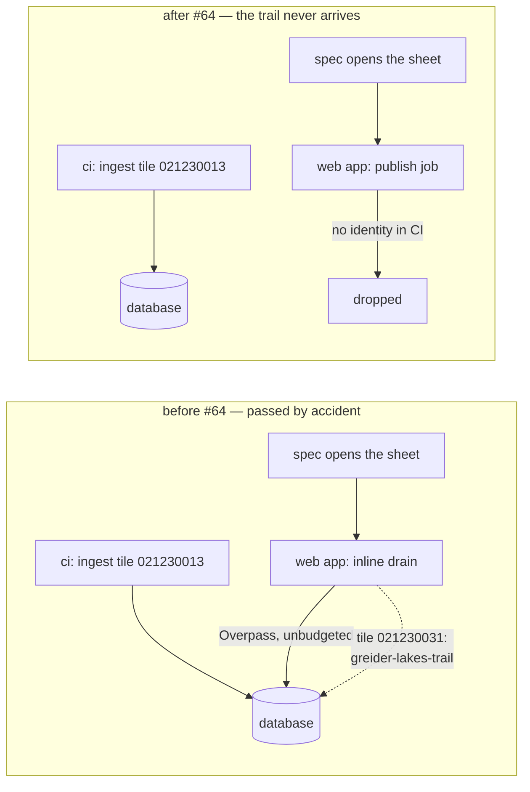
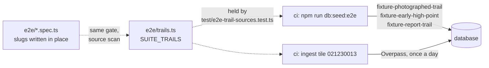

# Work Order: The nightly browser suite reads a trail CI never ingests

---

## 1. Metadata

| Field           | Value                                                     |
| --------------- | --------------------------------------------------------- |
| id              | `WO-ci-pipeline-green`                                    |
| version         | `1`                                                       |
| status          | `In Review`                                               |
| repo_target     | `switchback`                                              |
| base_sha        | `1789198ff095cbe84a442e163b7dd2ac28a96341`                |
| created_at      | `2026-08-29T00:00:00-07:00`                               |
| harness_version | `3.1.0`                                                   |
| overrides       | none — the repository ships no `AGENTS.md` or `CLAUDE.md` |
| supersedes      | N/A                                                       |

> The dispatch brief named `7d593956` as the base. That commit is `#61`, four commits behind
> the tip. `origin/master` is `1789198`, and this work is cut from it.

---

## 2. Problem statement

Every scheduled CI run since 2026-08-10 has failed, and the whole pipeline is held red by one
job. Three cases in `e2e/review.spec.ts` fail identically on every run with `No trail
"greider-lakes-trail" in this database`, and the deploy jobs downstream never start. The
browser suite is the only gate that opens a browser, so while it is red nothing in the
repository can show an honest green tick.

---

## 3. Scope

**In**

- The trail `e2e/review.spec.ts` files its reports against.
- A regression guard that fails in `gates` — on every pull request — when the browser suite
  names a trail CI does not produce.
- The `ci.yml` comments that count the fixtures and the specs depending on them.
- How that guard reads the suite: `e2e/` source rather than only the declarations, since a
  slug reaches a `page.goto` through a constant or typed in place, and only one of those is
  a declaration. With it, a bounded opt-out for the one spec whose subject is a trail the
  database must not hold.
- Atomicity of each fixture write, which the seed did not have and this guard's usefulness
  depends on: a half-written row satisfies `trails.bySlug` and defeats the message.
- `README.md`'s account of what a local browser run needs, which named one seed of two.

**Out**

- The `Unique constraint failed on the fields: (slug)` line in the ingest step. It is not the
  defect (§ Root cause), it is retried successfully, and it appears in the last green run too.
- The number of Overpass queries CI makes. One per day is a deliberate fair-use decision,
  argued at length at the top of `ci.yml`, and nothing here revisits it.
- `packages/ingest/src/publish.ts` reporting no publisher identity under CI. That is correct:
  CI has no Service Bus, and the message says so.
- Anything under "Observed, not addressed".

**Known issue, recorded not chased** — the `slug` unique violation is benign per trail, but it
scales: more tiles means more collisions, and one that exhausted `MAX_SLUG_ATTEMPTS` would cost a
trail row. `commitWithSlugRetry` in `packages/ingest/src/pipeline.ts` is where that would be
fixed. Out of scope here, where it is only the evidence that the retry works.

---

## 4. Definition of Done

| id  | predicate                                                                                    | verification                                                                                                                   |
| --- | -------------------------------------------------------------------------------------------- | ------------------------------------------------------------------------------------------------------------------------------ |
| D1  | The root cause is named with evidence from the logs, not inferred                            | § Root cause below cites run ids, log lines and the commit that removed the mechanism                                          |
| D2  | The browser suite passes, all 50 cases                                                       | `npm run test:e2e` reports `50 passed` on a runner (see A5)                                                                    |
| D3  | The suite passes repeatedly, not once                                                        | three dispatched CI runs, each `50 passed`, each `success`                                                                     |
| D4  | The three reviews cases still exercise the real form, the real routers and the real database | no spec logic changes: `e2e/review.spec.ts` is untouched, and `e2e/offline.spec.ts` gains three comment lines and nothing else |
| D5  | A trail the suite opens that CI cannot produce fails a unit test, not a nightly browser run  | `npx vitest run test/e2e-trail-sources.test.ts` exits 0, and fails when the declaration is wrong                               |
| D6  | Nothing else regressed                                                                       | `npm run format:check`, `npm run typecheck`, `npm run lint`, `npm test` each exit 0                                            |
| D7  | CI is green on the pull request                                                              | run URL with conclusion `success`, browser suite included via `workflow_dispatch`                                              |

---

## 5. Assumptions & defaults

| #   | Ambiguity                                                                                               | Default chosen                                    | Why                                                                                                                                                                                                                                                                                                                                                                                                                               |
| --- | ------------------------------------------------------------------------------------------------------- | ------------------------------------------------- | --------------------------------------------------------------------------------------------------------------------------------------------------------------------------------------------------------------------------------------------------------------------------------------------------------------------------------------------------------------------------------------------------------------------------------- |
| A1  | Fix by seeding the trail offline, or by pointing the spec at a different real trail on the Vesper sheet | Seed it offline, under a reserved `fixture-` slug | `seed-e2e.ts` already states the rule and applies it to two other specs: a spec that is not about the pipeline, opening a trail the one tile does not hold, takes a fixture. `review.spec.ts` is the third such spec. Naming another OSM trail would re-create the same fragility — an upstream rename would red the pipeline again, silently, and only at 04:11 UTC.                                                             |
| A2  | Where the third fixture lives geographically                                                            | New Zealand, beside the other two                 | The existing comment gives the reason: a fixture inside the Vesper or Snowdon viewport changes what a map spec counts.                                                                                                                                                                                                                                                                                                            |
| A3  | Whether to reuse `fixture-photographed-trail` for the reports                                           | No — a third shape                                | The reports specs time a hydration window — they re-click a button until its handler arrives — and neither existing fixture is a quiet page to time anything on: one carries twelve photographs with no file behind them, the other a few thousand profile samples. Two earlier versions of this row argued from write isolation instead; both were checked against `photographs.spec.ts` and neither held. See seq 6 and seq 10. |
| A4  | Whether the guard belongs in `e2e/` or in the unit suite                                                | The unit suite, `test/`                           | `test/` is where this repository already keeps invariants about the CI workflow itself. A guard that only runs inside the browser suite is a guard that only reports at 04:11 UTC, which is the failure mode being fixed.                                                                                                                                                                                                         |
| A5  | Where to run the fixed browser suite, after the workstation could not hold it                           | On runners, `workflow_dispatch`                   | The failing state was reproduced locally and is recorded in seq 2. The fixed suite was not: this workstation had ~350 MB free with other work on it, the Next dev server was killed mid-run, and thirty cases then failed on a dead port. A clean 16 GB runner is the environment CI actually uses, and several runs there beat one contended local pass.                                                                         |

---

## 6. Design sketch

### Root cause

**A test/infra defect, not a product defect.** The application is behaving as designed. The
browser suite depends on data that CI's one-query budget does not produce, and passed for
months only because of a side effect the product deliberately removed.

The chain, with its evidence:

1. `e2e/fixtures.ts` points the reviews specs at `greider-lakes-trail`, described in its own
   comment as "a quieter trail on the same sheet".
2. It is not on that sheet. Overpass returns `Greider Lakes Trail` as ways `68523637` and
   `68757103`, at 47.9692 °N and 47.9613 °N. The tile `ci.yml` ingests is the z9 quadkey
   under `--at 48.01213,-121.51188`, which is `021230013`, whose southern edge is 47.98992 °N.
   Both ways fall in `021230031`, the tile immediately south.
3. Until 2026-08-09 that neighbouring tile was ingested anyway — by the web application, mid
   test-run, through `packages/api/src/inline-drain.ts`. The last green scheduled run
   ([31296301847](https://github.com/mbahgatTech/switchback/actions/runs/31296301847)) logs
   `[WebServer] assembled { quadkey: '021230031', elements: 752, trails: 316 }` during
   `npm run test:e2e`, and the three reviews cases pass 40 seconds later.
4. `fbdade4` — _Make Service Bus the only way a tile is ingested (#64)_, merged 2026-08-09
   07:24 UTC — deleted `inline-drain.ts`. The request path now only publishes a job, and CI
   has no Service Bus identity, so every run since logs
   `switchback-ingest-publish-failed no usable publisher identity for this deployment` and no
   neighbouring tile is ever ingested.
5. The first scheduled run after that merge
   ([31359383694](https://github.com/mbahgatTech/switchback/actions/runs/31359383694),
   2026-08-10) failed on exactly the three cases, and every scheduled run since has failed the
   same way — eighteen of them, plus one cancelled. The failure is deterministic, not flaky:
   same three cases, same message, every time.

**The `slug` unique violation in the ingest step is a red herring.** It is a lost race between
concurrent commits for the same name, `commitWithSlugRetry` retries it, and the last _green_
run raised it twice while committing all 212 trails.

### Before and after





### What changes

`packages/db/scripts/e2e-shapes.ts` — the `Shape` type and the shapes, lifted out of
`seed-e2e.ts` so that the seeding script and the guard read one list rather than two. A third
shape joins them: `fixture-report-trail`, a short day hike with no photographs, which is all
the reviews specs need from a trail.

`e2e/trails.ts` — the trail constants, lifted out of `e2e/fixtures.ts` so a Node test can
import them without loading Playwright's runner, plus one new export:

```ts
export const SUITE_TRAILS: readonly SuiteTrail[];

type SuiteTrail =
  | { slug: string; from: 'seeded' }
  | { slug: string; from: 'ingested'; at: readonly [lng: number, lat: number] };
```

`e2e/fixtures.ts` re-exports them, so no spec changes.

`test/e2e-trail-sources.test.ts` — three cases holding the declaration to CI: every trail
constant is declared, every `seeded` slug is one `seed-e2e.ts` writes, and every `ingested`
slug sits inside the tile the workflow's own `--at` resolves to.

---

## 7. Task breakdown

| id    | task                                                                                                                                                                                 | acceptance check                                                             | status |
| ----- | ------------------------------------------------------------------------------------------------------------------------------------------------------------------------------------ | ---------------------------------------------------------------------------- | ------ |
| T-001 | Lift the fixture shapes into `packages/db/scripts/e2e-shapes.ts`; `seed-e2e.ts` imports them                                                                                         | `npx tsx packages/db/scripts/seed-e2e.ts` writes the same two trails, exit 0 | `done` |
| T-002 | Add the `fixture-report-trail` shape                                                                                                                                                 | the seed prints three lines, one per fixture, exit 0                         | `done` |
| T-003 | Lift the trail constants into `e2e/trails.ts`, add `SUITE_TRAILS`, re-export from `fixtures.ts`, point `REPORT_TRAIL` at the fixture                                                 | `npm run typecheck` exits 0                                                  | `done` |
| T-004 | Add `test/e2e-trail-sources.test.ts`, observed failing first for each of its three cases                                                                                             | `npx vitest run test/e2e-trail-sources.test.ts` exits 0, 3 passed            | `done` |
| T-005 | Correct the fixture counts in the `ci.yml` comments                                                                                                                                  | `npm run format:check` exits 0 and the comment names three trails            | `done` |
| T-006 | Verification: seed, ingest, hermetic gates locally, browser suite on runners                                                                                                         | see § Iteration log for pasted output                                        | `done` |
| T-007 | Carry `cause` through `trailBySlug`, count the ingest steps, add `db:seed:e2e`, name the shapes module for what it holds                                                             | `npx vitest run test/e2e-trail-sources.test.ts` exits 0, 4 passed            | `done` |
| T-008 | Review round 2: scan `e2e/` recursively for both slug shapes, pin the opt-out, count `--at` per occurrence, make each fixture write atomic, fix `--reset`, correct A3 and the README | `npx vitest run test/e2e-trail-sources.test.ts` exits 0, 8 passed            | `done` |

---

## 8. Test plan

**Unit** — `test/e2e-trail-sources.test.ts`, five cases on where trails come from:

- _each say where a CI run gets them_ — happy path. Every exported constant carrying a `slug`
  appears in `SUITE_TRAILS`; a new trail added without a source fails here.
- _are seeded when the ingested tile does not hold them_ — `seeded` slugs and `e2e-shapes.ts`'s
  shapes are the same set, in both directions.
- _keep the ingested one on the tile ci.yml still queries_ — a tripwire on the workflow's `--at`
  moving away from the trail declared against it. Not proof the trail is inside the tile; only
  OSM could say that, and this suite makes no query. It also requires the workflow to ingest
  exactly one tile, counted per occurrence so two inside one `run: |` block are two.
- _include every slug the specs name, however it is written_ — the case that measures the suite
  rather than its declarations. Reads `e2e/` recursively for both routes a slug takes: a
  `/trails/` path segment, and the string a `slug:` property is given.
- _are exempted only where the exemption is already argued for_ — the opt-out is pinned by
  equality. An unbounded one is a gate that discriminates on nothing, which is what the first
  version of this file was.

Three more on the remedy those specs print, in the same file: a seeded trail is sent to
`db:seed:e2e`, an ingested one to `ingest:tile`, and an unknown slug to `ingest:tile`, because
the seed writes three known rows and could not produce it.

**Integration** — `e2e/review.spec.ts`, unchanged. Filing a report through the rendered form,
reading it back off the trail page, filing one into a held tRPC batch, and withdrawing one:
all still against the real Next server, the real routers and the real Postgres.

**Edge cases** — the guard reads `ci.yml` and `e2e/` rather than restating either, so a workflow
edited to ingest a different tile, a constant renamed, or a fixture deleted each fail it. The
evasion shapes it was built against, all verified failing: a slug in a subdirectory spec, a
`/trails/<slug>/print` sub-route, a constant declared in `e2e/fixtures.ts` and reached through a
template literal, a bogus opt-out comment, and two ingests inside one `run: |` block with one of
them using `--at=`. A vacuous scan fails rather than passes, and its floor counts only unexempt
sites — the first version's floor was satisfied by the exempt one.

**Regression** — the other 47 browser cases, and the four hermetic gates. Repeated full browser
runs, because a suite that passes once has not been shown to be deterministic. Master's last
scheduled run reports `Running 50 tests` and `47 passed`; this branch reports `Running 50 tests`
and `50 passed`, which is the same 50 cases and three more of them passing.

---

## 9. Iteration log

```yaml
- seq: 1
  at: 2026-08-29T00:00:00-07:00
  state: RESEARCH -> WORK_ORDER
  event: root_cause_identified
  detail: >-
    17 consecutive scheduled runs fail on the same three e2e/review.spec.ts cases with
    `No trail "greider-lakes-trail" in this database`. Overpass places that trail at
    47.96N, in z9 tile 021230031; ci.yml ingests 021230013, southern edge 47.98992N. The
    last green run (31296301847) shows the web app ingesting 021230031 itself mid-suite via
    packages/api/src/inline-drain.ts, which fbdade4 (#64) deleted on 2026-08-09.
  decision: test/infra defect. Seed the trail offline under a reserved `fixture-` slug, as
    seed-e2e.ts already does for the two other specs that open trails off the tile.
  budget: { implement: 0/3, review: 0/3, replan: 0/2, total: 1/8 }

- seq: 2
  at: 2026-08-29T00:45:00-07:00
  state: IMPLEMENT -> SELF_VERIFY
  event: failure_reproduced_before_change
  detail: >-
    Clean database (switchback_wo, template_postgis), db:push + spatial.sql, db:seed,
    seed-e2e.ts, then `npm run ingest:tile -- --at 48.01213,-121.51188`:
      processing 021230013…
        assembled { quadkey: '021230013', elements: 439, trails: 213 }
      prisma:error Unique constraint failed on the fields: (`slug`)
      021230013: 213 trails in 80.2s   exit 0
    `select count(*) from trails` -> 215. `select slug from trails where name ilike
    '%greider%'` -> 0 rows. `npx playwright test e2e/review.spec.ts` -> 3 failed,
    1 passed (27.3s), exit 1, all three `No trail "greider-lakes-trail" in this database`.
  decision: proceed with the fixture, exactly as `seed-e2e.ts` already does for two specs.
  budget: { implement: 1/3, review: 0/3, replan: 0/2, total: 1/8 }

- seq: 3
  at: 2026-08-29T01:10:00-07:00
  state: SELF_VERIFY
  event: guard_observed_failing
  detail: >-
    Each case of test/e2e-trail-sources.test.ts watched failing for its own reason before
    being trusted. (1) an extra exported trail constant with no source ->
    "expected [ 'fixture-early-high-point', …(4) ] to deeply equal [ …(3) ]". (2) a seeded
    slug seed-e2e.ts does not write -> the two-direction set comparison fails. (3) an
    ingested trail outside the workflow's tile -> "vesper-peak-summit-trail: expected
    '021230031' to be '021230013'" — the historical defect's own tile pair.
  decision: guard is measuring the defect, not adjacent to it.
  budget: { implement: 1/3, review: 0/3, replan: 0/2, total: 1/8 }

- seq: 4
  at: 2026-08-29T01:30:00-07:00
  state: SELF_VERIFY
  event: local_gates_green_browser_suite_not_runnable_here
  detail: >-
    format:check, typecheck, lint all exit 0. `npm test` against a clean database: 123 files,
    2312 tests passed, exit 0 — three more tests than master's baseline run (122 files, 2309),
    which is this file. One earlier full `npm test` on this workstation timed out three
    unrelated files (ci-steps-runnable, worker-deploy-path, entra-client); all three pass in
    isolation, 38 passed, and the repeat run above is clean. The full browser suite could not
    be completed here: ~350 MB free with another agent's Next server and npm install on the
    box, the dev server was killed mid-run, and every case after 12 failed on a dead port.
    Recorded as an environment limit, not as a pass.
  decision: verify the fixed suite where CI runs it, per A5.
  budget: { implement: 1/3, review: 0/3, replan: 0/2, total: 1/8 }

- seq: 5
  at: 2026-08-29T02:05:00-07:00
  state: SELF_VERIFY -> IN_REVIEW
  event: ci_green
  detail: >-
    Three `workflow_dispatch` runs on fix/ci-pipeline-green, every job success, deploy jobs
    correctly skipped (they gate on push to master):
      33239757151  0f3d84b  browser suite `50 passed (6.2m)`  success
      33240178652  0f3d84b  browser suite `50 passed (6.1m)`  success
      33240608824  48d547e  browser suite `50 passed (6.3m)`  success
    Run 33239757151 gates: `test/e2e-trail-sources.test.ts (3 tests) 60ms`, Test Files 123
    passed, Tests 2312 passed. Reports cases 42/43/44 green. `grep -c "assembled { quadkey:
    '021230031'"` over the browser job log -> 0, so the fix adds no Overpass query. The
    `slug` unique violation is still present on the green run, which is the evidence that it
    was never the defect.
  decision: PR #80 opened against master. Review Board next.
  budget: { implement: 1/3, review: 0/3, replan: 0/2, total: 1/8 }

- seq: 6
  at: 2026-08-29T09:30:00-07:00
  state: IN_REVIEW -> IMPLEMENT
  event: review_round_1_corrections
  detail: >-
    Partial board: two Pass, one Fail, no Blockers. Three corrections of record, each naming
    something this Work Order or the code got wrong.
    (a) A3's stated reason was false. It justified a third fixture with "a report changes
    rating and reviewCount, and the gallery spec asserts on the trail it reads" —
    photographs.spec.ts asserts on the Photographs heading, /\d+ frames/, [data-photograph=
    "missing"] and brokenImages(page) === []. None reads rating or reviewCount. The decision
    stands on the whole-page brokenImages assertion instead; A3 and e2e-shapes.ts both restate
    it. A related claim in the same comment — "the report form sits below the photo strip" —
    was also wrong: apps/web/app/trails/[slug]/page.tsx renders Reviews at 342 and PhotoGallery
    at 351. Removed rather than reversed.
    (b) trailBySlug rewrote every failure as a missing row. trpcQuery throws for a dead port
    and a 500 as well, so the newly confident remedy was being asserted over causes it had not
    established — the exact failure this Work Order hit locally in seq 4. Now catch (cause)
    with { cause } passed through.
    (c) D2 and seq 4 cited assumption A5, which did not exist; §5 stopped at A4. The row is
    added above with the substance that was already in seq 4.
  decision: fix all three, take every Minor, defer nothing.
  budget: { implement: 2/3, review: 1/3, replan: 0/2, total: 1/8 }

- seq: 7
  at: 2026-08-29T09:50:00-07:00
  state: IMPLEMENT
  event: gate_hardened_and_observed_failing
  detail: >-
    The gate read Object.values(trails), so it measured the declaration rather than the suite:
    e2e/offline.spec.ts:113 hard-codes '/trails/mount-dickerman-trail' and no case could see
    it. That slug is correctly absent from SUITE_TRAILS — its spec is about the page for a
    trail that was never downloaded — so the fix is a marked opt-out, not a declaration.
    A fourth case now scans e2e/ for /trails/<slug> literals and requires each to be declared
    or to open its line with `not-in-suite:`. ingestedQuadkey took the first --at of any
    number; it now requires exactly one.
    Both watched failing before being trusted. Second ingest step spliced into ci.yml ->
    "ci.yml must ingest exactly one tile: expected 2 to be 1". Marker removed from
    offline.spec.ts -> ["offline.spec.ts:113  mount-dickerman-trail"]. Restored, 4 passed,
    exit 0. format:check, typecheck and lint all exit 0 after the change.
  decision: harden rather than soften; the two prose claims that over-promised (this file's
    header and ci.yml:26) are now true rather than trimmed.
  budget: { implement: 2/3, review: 1/3, replan: 0/2, total: 1/8 }

- seq: 8
  at: 2026-08-29T10:05:00-07:00
  state: SELF_VERIFY
  event: local_full_suite_UNVERIFIED
  detail: >-
    `npm test` on this workstation exited 1 with eight failures across
    test/worker-deploy-path.test.ts and packages/ingest/test/identity.db.test.ts. Every one is
    "Test timed out in 5000ms"; the run contains zero AssertionErrors, and this change touches
    neither file. The box is at 98% disk with three other agents on it, and the same command
    was green here twice already — 123 files / 2312 tests on this branch (seq 4) and 122 /
    2309 on the master baseline.
    Recorded as UNVERIFIED rather than as a pass, and not retried until green. The authoritative
    reading is the `gates` job, which runs the identical command on a clean runner.
  decision: do not retry locally; take CI's gates as the verification, cite it either way.
  budget: { implement: 2/3, review: 1/3, replan: 0/2, total: 1/8 }

- seq: 9
  at: 2026-08-29T10:40:00-07:00
  state: SELF_VERIFY
  event: intermediate_commit_pushed_unformatted
  detail: >-
    Commit 16720a0 was pushed with `npm run format:check` exiting 1. The Work Order edits
    made after seq 6's commit reflowed a table cell past prettier's width, and the check was
    run in the same command as the commit rather than before it — so the failure was visible
    only after the push. Corrected in 81bcfaf; format:check exits 0 there. Recorded rather
    than quietly amended: the branch was momentarily red on a gate this Work Order claims,
    and the tip is the only commit whose green is asserted.
  decision: dispatch a fresh CI run on 81bcfaf; the run on b3be0c9 no longer describes the head.
  budget: { implement: 2/3, review: 1/3, replan: 0/2, total: 1/8 }

- seq: 10
  at: 2026-08-29T12:20:00-07:00
  state: IN_REVIEW -> IMPLEMENT
  event: review_round_2_corrections
  detail: >-
    Seven reviewers, zero Blockers, all seven Pass on the gate rule. Four holes in the gate and
    three documentation defects, every one reproduced here before being fixed.
    The gate discriminated on nothing: one /trails/ literal existed under e2e/ and it was the
    exempt one, so the floor was satisfied by the exempt hit and the undeclared set ran over an
    empty population. It also read one non-recursive directory, required a closing quote right
    after the slug, matched only whole-quoted-string literals, and counted --at once per step
    rather than per occurrence. Five evasion shapes were planted and all five now fail:
    e2e/regression/nested.spec.ts, '/trails/x/print', a constant declared in e2e/fixtures.ts and
    reached by template literal, a bogus not-in-suite: comment, and two ingests in one `run: |`
    block with one written --at=. The opt-out is now pinned by equality against EXEMPTED.
    `npm run db:seed:e2e -- --reset` re-seeded instead of removing: npm does not forward args
    through a nested `npm run`, so seed-e2e.ts saw no argv and exited 0 having written the three
    fixtures again. Reproduced, then fixed by ending the root script with `--`; the flag now
    reaches the script and removes three rows. That indirection was introduced by round 1's own
    Minor, and the PR then documented the broken form.
    writeFixture was four sequential writes; a Ctrl-C between the upsert and writeTrailGeometry
    left a row that satisfies trails.bySlug with no geom and no searchVector — the friendly
    message never fires and the specs fail inside the page render. Now one transaction per
    fixture.
  decision: fix all of 1-7 plus the Majors; nothing deferred to a fourth round.
  budget: { implement: 3/3, review: 2/3, replan: 0/2, total: 1/8 }

- seq: 11
  at: 2026-08-29T12:30:00-07:00
  state: IMPLEMENT
  event: reason_of_record_corrected_by_deletion
  detail: >-
    A3's stated reason has now been wrong three times, and the correction is a deletion rather
    than a fourth attempt. seq 6 recorded the first: rating/reviewCount, which photographs.spec.ts
    does not read. Its replacement claimed a leftover report lands inside brokenImages(page)'s
    whole-page assertion; it cannot, because a review renders an  only through review.photos,
    guarded on length, and review.spec.ts posts conditions: [] and no photographs — zero 
    contributed. The reason that survives was already in the same comment: the reports specs time
    a hydration window, and neither existing fixture is a quiet page to time on. Everything else
    is struck from both the comment and A3 rather than restated in weaker form.
  decision: state only what was checked against the spec it describes.
  budget: { implement: 3/3, review: 2/3, replan: 0/2, total: 1/8 }

- seq: 12
  at: 2026-08-29T12:35:00-07:00
  state: IMPLEMENT
  event: coordinator_claim_corrected
  detail: >-
    The round-1 report said no e2e/*.spec.ts file was touched. True when written, not true at
    9d5bd00: e2e/offline.spec.ts is in the diff, +3 lines, all comments — the marked opt-out. No
    spec logic changed, which is the substance, but D4 now says the accurate thing rather than
    "the specs are not touched at all".
  decision: correct the record here and in D4 and the PR body.
  budget: { implement: 3/3, review: 2/3, replan: 0/2, total: 1/8 }
```
