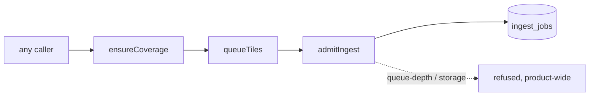
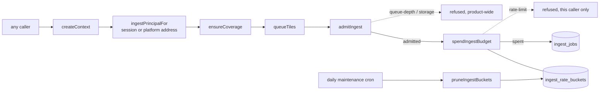

# Work Order: per-principal rate limiting on ingest enqueue

---

## 1. Metadata

| Field           | Value                                                                                                                            |
| --------------- | -------------------------------------------------------------------------------------------------------------------------------- |
| id              | `WO-ingest-rate-limiting`                                                                                                        |
| version         | `1`                                                                                                                              |
| status          | `In Review`                                                                                                                      |
| repo_target     | `switchback`                                                                                                                     |
| base_sha        | `1789198ff095cbe84a442e163b7dd2ac28a96341` (brief named `7d59395`, an ancestor; the worktree was cut from `master` at `1789198`) |
| created_at      | `2026-08-29T00:40:00-04:00`                                                                                                      |
| harness_version | `3.1.0`                                                                                                                          |
| overrides       | none — no `AGENTS.md` or `CLAUDE.md` in this repo                                                                                |
| supersedes      | N/A                                                                                                                              |

---

## 2. Problem statement

Ingest admission control has two product-wide ceilings — `MAX_TILE_QUEUE_DEPTH` and
`MAX_STORAGE_FRACTION` — and no notion of who is asking. One client panning a map over random
cold ground can drive the request queue to 600 on its own, and at that point `admitIngest`
refuses new ingest for **every** reader of the product, not just the one that filled it. The
ceiling is a shared failure domain: it bounds the estate's exposure and does nothing to isolate
one tenant from another.

The missing control is a per-principal one. Nothing in the tree can say "this caller has taken
enough", so nothing can stop one caller from spending the whole allowance.

---

## 3. Scope

**In**

- A per-principal token bucket over the _enqueue of new ground_, spent in tiles, held in Postgres.
- Deriving the principal once per request: the signed-in user where there is one, the platform's
  own address header otherwise, and one shared bucket where neither is available.
- Wiring it into `queueTiles` / `queueNetworkTiles`, beside the existing `admitIngest` call, so
  there is one admission decision rather than two that can disagree.
- A third refusal reason (`rate-limit`) carried to the client alongside `queue-depth` and
  `storage`, with its own sentence on the web.
- Pruning spent buckets from the daily maintenance cron.
- The stored type of `IngestRateBucket.refilledAt`. Added after review round 1: the column is the
  only one in this schema both compared against a `timestamptz` in raw SQL and filtered through
  Prisma, and without a zone the two disagree by the session's UTC offset.

**Out**

- `MAX_TILE_QUEUE_DEPTH` and every other constant in `backpressure.ts`. A separate stream is
  re-measuring the queue depth against real drain rate; this work reads that constant and
  derives from it, and changes nothing in that file.
- Rate limiting reads. Serving already-ingested tiles from Postgres is cheap and stays
  unthrottled — the bucket is never consulted when a request adds no new ground.
- The iOS app's refusal copy. `apps/mobile/**` belongs to another stream; its `busyCopy` falls
  through to the queue-depth sentence for the new reason, which is close but not right.
- Any change to authentication. The principal is read from `ctx.user`, which `createContext`
  already loads from the database.

---

## 4. Definition of Done

| id  | predicate                                                                                                                                                    | verification                                                                                                                                                                  |
| --- | ------------------------------------------------------------------------------------------------------------------------------------------------------------ | ----------------------------------------------------------------------------------------------------------------------------------------------------------------------------- |
| D1  | A principal that has spent its allowance is refused, and the refusal is `rate-limit`                                                                         | `npx vitest run packages/ingest/test/rate-limit.db.test.ts -t "refuses the enqueue"` exits 0                                                                                  |
| D2  | One abusive principal can no longer drive the request queue to the product-wide ceiling, and a second principal is still served after the first is throttled | `npx vitest run packages/ingest/test/rate-limit.db.test.ts -t "shared failure domain"` exits 0, and the same test fails with the limiter removed                              |
| D3  | A request that adds no new ground touches neither the bucket nor the ceiling                                                                                 | `npx vitest run packages/ingest/test/rate-limit.db.test.ts -t "already-ingested"` exits 0                                                                                     |
| D4  | A first-time anonymous visitor's cold viewport is admitted in full                                                                                           | `npx vitest run packages/ingest/test/rate-limit.db.test.ts -t "first cold viewport"` exits 0                                                                                  |
| D5  | A refused request spends nothing, so repeated refusals cannot hold a bucket empty                                                                            | `npx vitest run packages/ingest/test/rate-limit.db.test.ts -t "cannot latch"` exits 0                                                                                         |
| D6  | A spent bucket recovers on the clock alone, with no job, sweep or operator involved                                                                          | `npx vitest run packages/ingest/test/rate-limit.db.test.ts -t "refills"` exits 0                                                                                              |
| D7  | The bucket key is never a raw network address, and a client-set header cannot become one                                                                     | `npx vitest run packages/api/test/ingest-principal.test.ts` exits 0                                                                                                           |
| D8  | The burst allowance always covers one deliberate area fetch, whatever the queue ceiling is re-tuned to                                                       | `npx vitest run packages/ingest/test/rate-limit.db.test.ts -t "area fetch"` exits 0                                                                                           |
| D9  | The whole tree typechecks and lints                                                                                                                          | `npm run typecheck` exits 0; `npm run lint` exits 0                                                                                                                           |
| D11 | Two instances that share no memory cannot both spend one allowance, and no grant is lost between them                                                        | `npx vitest run packages/ingest/test/rate-limit.db.test.ts -t "raced by instances"` exits 0, and both tests fail when the spend is split into a read and a write              |
| D12 | `/plan` debits the caller's bucket, and says `rate-limit` when it is empty                                                                                   | `npx vitest run packages/api/test/ingest-wiring.db.test.ts -t "/plan"` exits 0, and both tests fail when the router passes `principal: null`                                  |
| D13 | Every ingest-facing procedure charges a principal, so the limiter cannot be switched off unnoticed                                                           | `npx vitest run packages/api/test/ingest-wiring.db.test.ts` exits 0, and 5 of its 6 tests fail when the routers pass `principal: null`                                        |
| D14 | Refill and retention measure elapsed time, whatever session zone an instance is in                                                                           | `npx vitest run packages/ingest/test/rate-limit.db.test.ts -t "different session time zone"` exits 0, and both tests fail while `refilledAt` is `timestamp without time zone` |
| D10 | The unit suite is no worse than it was before the change                                                                                                     | `npx vitest run` — the failing set matches the recorded pre-change baseline                                                                                                   |

---

## 5. Assumptions & defaults

| #   | Ambiguity                                                    | Default chosen                                                    | Why                                                                                                                                                                                                                                                                                                                                                                                                     |
| --- | ------------------------------------------------------------ | ----------------------------------------------------------------- | ------------------------------------------------------------------------------------------------------------------------------------------------------------------------------------------------------------------------------------------------------------------------------------------------------------------------------------------------------------------------------------------------------- |
| A1  | Which principal for anonymous traffic                        | The caller's network address, from the platform's header          | It is the only anonymous identifier that costs an attacker anything. A cookie is dropped and re-issued for free, so a cookie-keyed limit is a limit on nobody.                                                                                                                                                                                                                                          |
| A2  | Whether `X-Forwarded-For` can be trusted                     | Yes, on this deployment, and only in the platform's own order     | Vercel's request-header reference states it overwrites `X-Forwarded-For` and does **not** forward external IPs, "to prevent IP spoofing". `x-vercel-forwarded-for` is read first because it is the one a proxy in front of the deployment cannot displace.                                                                                                                                              |
| A3  | Shared NAT and carrier-grade NAT put strangers in one bucket | Accepted, and made cheap                                          | A throttled bucket loses only _new ground_; every already-ingested tile still serves at full speed. A campus behind one address sees a slower map, never a broken one.                                                                                                                                                                                                                                  |
| A4  | IPv6 clients can rotate addresses for free                   | Bucket IPv6 by its `/64` prefix                                   | A residential or mobile IPv6 client is usually delegated a whole `/64`; keying on the full address would let it rotate out of its bucket every request.                                                                                                                                                                                                                                                 |
| A5  | Where limiter state lives                                    | Postgres, in one row per principal                                | Vercel runs many instances, so in-process state gives each instance a full allowance and resets on every cold start — it would bound nothing. Postgres is already on this path (`admitIngest` queries it on every viewport), it is the only store shared across instances, and a single `INSERT … ON CONFLICT … WHERE` makes the check-and-spend atomic without holding a lock across the enqueue loop. |
| A6  | What the allowance should be                                 | 20% of `MAX_TILE_QUEUE_DEPTH`, refilling from empty in 30 minutes | Derived rather than fixed so the queue-depth re-measurement re-tunes it too. At 20% it takes five simultaneous abusers to fill the queue, where it took one.                                                                                                                                                                                                                                            |
| A7  | Cost unit                                                    | Tiles of new ground, not requests                                 | The expensive thing is a tile ingest, and pricing in tiles is what makes the bucket a share of the queue rather than a share of the traffic.                                                                                                                                                                                                                                                            |
| A8  | A caller the platform did not identify                       | One shared bucket, not an exemption                               | Skipping the limit on a missing header would make the header the bypass. A shared bucket degrades new-ground ingest for unidentified callers and leaves the rest of the product alone.                                                                                                                                                                                                                  |
| A9  | Whether a partial spend should be allowed                    | No — all or nothing per call                                      | A partial enqueue would report a viewport as covered when half of it was refused. With the burst at ten times the per-request cap, all-or-nothing only bites at the tail.                                                                                                                                                                                                                               |
| A10 | Who deletes spent bucket rows                                | The daily maintenance cron                                        | A row older than the refill window is by definition full, and a full row and a missing row are the same answer. Retention, not state.                                                                                                                                                                                                                                                                   |

---

## 6. Design sketch

### What changes

`queueTiles` and `queueNetworkTiles` are the choke point every writing path crosses, and they
already ask `admitIngest` there. The per-principal check is added **in the same place, after the
product-wide one**, so the two never disagree and a caller is only charged for work that is
actually going to be queued.

Two new modules, one seam:

- `packages/ingest/src/rate-limit.ts` — the token bucket. Owns the allowance, the refill, the
  atomic spend, and the retention sweep. Knows nothing about HTTP.
- `packages/api/src/ingest-principal.ts` — who is asking. Owns header trust and pseudonymisation.
  Knows nothing about tiles.

`ingest` stays a leaf: it declares the `IngestPrincipal` shape, and `api` is what fills it in.

### Before



### After



### Key interfaces

```ts
// packages/ingest/src/rate-limit.ts
export interface IngestPrincipal {
  key: string; // u:<userId> | a:<hmac> | x:shared
  kind: 'user' | 'address' | 'unidentified';
}
export type RateRefusal = 'rate-limit';
export const BUCKET_CAPACITY: number; // floor(MAX_TILE_QUEUE_DEPTH * 0.2), min MIN_BUCKET_CAPACITY
export const BUCKET_REFILL_MS: number; // 30 minutes, empty to full
export function spendIngestBudget(db, principal, cost, now): Promise<BudgetOutcome>;
export function pruneIngestBuckets(db, now): Promise<number>;

// packages/ingest/src/coverage.ts
export type QueueRefusal = IngestRefusal | RateRefusal;

// packages/api/src/ingest-principal.ts
export function ingestPrincipalFor(headers: Headers, user: User | null): IngestPrincipal;
```

### The bucket, and why it cannot latch

One statement does the whole thing:

```sql
INSERT INTO ingest_rate_buckets AS b (principal, tokens, "refilledAt")
VALUES (…, capacity - cost, now)
ON CONFLICT (principal) DO UPDATE
   SET tokens = <refilled> - cost, "refilledAt" = now
 WHERE <refilled> >= cost
RETURNING tokens
```

where `<refilled>` is `LEAST(capacity, tokens + elapsed_seconds * rate)`.

Three properties follow from that shape:

1. **It recovers on the clock alone.** `<refilled>` is a function of `now` and `refilledAt` and
   nothing else. No job decrements it, no sweep resets it, no counter has to come back down —
   which is the shape `DERIVED_QUEUE_WARN_DEPTH` warns against, where ingest latched off
   product-wide with nothing in the tree able to clear the count.
2. **A refusal writes nothing.** When the `WHERE` fails no row is touched and no token is spent,
   so a client polling into a refusal cannot hold its own bucket at zero.
3. **A missing row is a full bucket.** Deleting rows is safe at any time, which is what makes
   retention trivial and gives an operator a one-line escape (`DELETE FROM ingest_rate_buckets`).

---

## 7. Task breakdown

| id    | task                                                                                               | acceptance check                                                                                         | status |
| ----- | -------------------------------------------------------------------------------------------------- | -------------------------------------------------------------------------------------------------------- | ------ |
| T-001 | Add `IngestRateBucket` to the schema and push it                                                   | `npm run db:push` exits 0                                                                                | `done` |
| T-002 | `packages/ingest/src/rate-limit.ts`: allowance, atomic spend, prune, log                           | `npx vitest run packages/ingest/test/rate-limit.db.test.ts` exits 0                                      | `done` |
| T-003 | Thread `principal` through `queueTiles`/`ensureCoverage`/`requestArea` and widen the refusal union | `npx vitest run packages/ingest/test/backpressure.test.ts packages/ingest/test/coverage.test.ts` exits 0 | `done` |
| T-004 | Same for `queueNetworkTiles`/`ensureNetworkCoverage`                                               | `npx vitest run packages/ingest/test/network.test.ts` exits 0                                            | `done` |
| T-005 | `packages/api/src/ingest-principal.ts` and its tests                                               | `npx vitest run packages/api/test/ingest-principal.test.ts` exits 0                                      | `done` |
| T-006 | Put the principal on `Context` and pass it from both routers                                       | `npm run typecheck` exits 0                                                                              | `done` |
| T-007 | Carry `rate-limit` through `@switchback/core` and give it its own sentence on the web              | `npm run typecheck` exits 0; `npm run lint` exits 0                                                      | `done` |
| T-008 | Prune spent buckets from the daily maintenance cron                                                | `npm run typecheck` exits 0                                                                              | `done` |
| T-010 | Race the spend from instances that share nothing, in `rate-limit.db.test.ts`                       | both tests fail against a read-then-write spend and pass against the shipped one                         | `done` |
| T-011 | `packages/api/test/ingest-wiring.db.test.ts`: `/plan`, `fetchArea` and the context charge a caller | 5 of 6 fail with `principal: null` in the routers                                                        | `done` |
| T-012 | `refilledAt @db.Timestamptz`, pushed, with the two zone tests that hold it                         | both tests fail against the untyped column; `prisma db push` applies it with no `--accept-data-loss`     | `done` |
| T-013 | Correct the record: the schema-convention premise, and the base this was measured against          | §9 seq 7 and seq 8                                                                                       | `done` |
| T-009 | Update `docs/architecture.md` where it says the limiter does not exist                             | `npx vitest run test/mermaid-blocks.test.ts` exits 0                                                     | `done` |

---

## 8. Test plan

**Unit** — `packages/api/test/ingest-principal.test.ts`, no database.

- a signed-in caller is keyed by user id, whatever address they arrive from
- an anonymous caller is keyed by address, and the key is never the address itself
- `x-vercel-forwarded-for` outranks `x-forwarded-for`, which outranks `x-real-ip`
- two addresses in one `/64` share a bucket; two `/64`s do not
- a header carrying something that is not an address falls to the shared bucket rather than
  becoming a key
- no header at all falls to the shared bucket

**Integration** — `packages/ingest/test/rate-limit.db.test.ts`, real Postgres.

- within the allowance, the tiles are queued
- past it, the enqueue is refused as `rate-limit` and writes no job row
- the bucket refills on the clock, and a caller who waited the window out is served again
- a refused call spends nothing, so a client polling into refusals still recovers on schedule
- two principals are independent
- concurrent spends cannot double-spend one allowance
- the shared-failure-domain regression: one principal hammering cold ground cannot reach the
  product-wide ceiling, and a second principal is still served afterwards

**Edge cases**

- zero new ground — the bucket is not consulted at all, and no query is issued
- a cost larger than the whole allowance — refused rather than driven negative
- an allowance smaller than one area fetch — asserted impossible, so the button cannot go dead
- clock skew between instances — elapsed time is clamped at zero rather than draining a bucket

**Regression**

- `packages/ingest/test/backpressure.test.ts` and `coverage.test.ts` still pass unchanged: with
  no principal supplied the limiter is not consulted, so every existing admission path behaves
  exactly as before.
- `npx vitest run` overall: the failing set must match the pre-change baseline recorded in §9.

---

## 9. Iteration log

```yaml
- seq: 1
  at: 2026-08-29T00:40:00-04:00
  state: RESEARCH -> WORK_ORDER
  event: work_order_authored
  detail: >-
    Read backpressure.ts, coverage.ts, network.ts, context.ts and both routers before writing.
    The global ceiling already exists and is asked at the one choke point; what is missing is
    any notion of who is asking. admitIngest's own docstring already names the fix and points
    at packages/api/src/context.ts, and docs/architecture.md records that "a rate limiter in
    front is the prerequisite, and does not exist yet".
  decision: >-
    Build the per-principal bucket beside admitIngest rather than in front of the router, so
    that reads stay unthrottled and only new ground is priced. Derive the allowance from
    MAX_TILE_QUEUE_DEPTH rather than restating a number, so the separate re-measurement of that
    constant re-tunes this too.
  budget: { implement: 0/3, review: 0/3, replan: 0/2, total: 1/8 }

- seq: 2
  at: 2026-08-29T01:05:00-04:00
  state: WORK_ORDER -> IMPLEMENT
  event: baseline_recorded
  detail: >-
    Pre-change `npx vitest run` on this worktree: 10 files failing, 53 tests. Every one of them
    is a database test racing another database test file over one shared Postgres, or a 5-second
    timeout on a machine running eight agents at once — apps/web/test/env-preview-database.test.ts
    passes on its own, packages/db/test/entra-client.test.ts fails only on timeouts. The
    baseline is recorded so the post-change run is compared against it rather than against zero.
  decision: Proceed; compare the failing set rather than the failing count.
  budget: { implement: 1/3, review: 0/3, replan: 0/2, total: 1/8 }

- seq: 3
  at: 2026-08-29T02:30:00-04:00
  state: IMPLEMENT -> SELF_VERIFY
  event: implementation_complete
  detail: >-
    T-001..T-009 done. Backpressure's own file was left untouched: rather than widening
    `IngestRefusal` there, `QueueRefusal = IngestRefusal | RateRefusal` is declared in
    coverage.ts, which keeps the contended file out of the diff entirely.
  decision: Self-verify, then raise the pull request.
  budget: { implement: 1/3, review: 0/3, replan: 0/2, total: 1/8 }
```

```yaml
- seq: 4
  at: 2026-08-29T03:20:00-04:00
  state: SELF_VERIFY -> IN_REVIEW
  event: verification_complete
  detail: >-
    lint exit 0, typecheck exit 0, format:check exit 0. Both new files green: 11 tests each.
    Full suite 2324 passed / 7 failed across 3 files — every one of them in the pre-change
    baseline of 10 files / 53 tests, and every one reproducing in isolation as a five-second
    timeout on a loaded machine (worker-deploy-path, entra-client) or the known race between
    database test files (identity.db, which passes alone). Both regressions were watched failing
    first: with the spend removed, one caller queued 132 tiles where the guard holds it to 120.
  decision: Raised as pull request 82 against master. Not merged.
  budget: { implement: 1/3, review: 0/3, replan: 0/2, total: 1/8 }
```

```yaml
- seq: 5
  at: 2026-08-29T03:25:00-04:00
  state: IN_REVIEW
  event: correction
  detail: >-
    Corrects the base recorded at seq 1, which repeated the commit the brief named. The worktree
    was cut from master at 1789198, which already carries #63, #64, #67, #72 and #75 — so
    INGEST_QUEUE_DRIVER is absent from the tree this was written against and nothing here
    branches on a drain driver. origin/master is unmoved from that commit; no rebase was needed.
  decision: No change to the work; the record now says which commit it was built on.
  budget: { implement: 1/3, review: 0/3, replan: 0/2, total: 1/8 }
```

```yaml
- seq: 6
  at: 2026-08-29T10:35:00-04:00
  state: IN_REVIEW -> IMPLEMENT
  event: review_findings_reproduced
  detail: >-
    The board held the gate on three behaviours that had no test able to fail, and each was
    reproduced here before anything was written. Rate limiting switched off at all five router
    call sites (`principal: null`): 22/22 still green. The spend split into a read and a write:
    11/11 still green, including the concurrency test, because `Promise.all` over one
    PrismaClient runs down a single connection and serialises — the test could never race.
  decision: >-
    Test the atomicity through separate PrismaClients, which is what a second Vercel instance
    actually is, and test the wiring through `appRouter` rather than through `queueTiles`. Eight
    contending instances turn the read-then-write into 8 winners where 1 is allowed, five trials
    out of five.
  budget: { implement: 2/3, review: 1/3, replan: 0/2, total: 2/8 }
```

```yaml
- seq: 7
  at: 2026-08-29T10:50:00-04:00
  state: IMPLEMENT
  event: correction
  detail: >-
    The timezone defect is real and is now fixed, but the reason given for it in the review brief
    was not. The brief stated that "every other timestamp in this schema is `@db.Timestamptz`".
    It is the reverse: `schema.prisma` has 60 `DateTime` fields and zero `@db.Timestamptz`, and
    the only `@db.` attributes in the file are three `@db.Text` and one `@db.Char`. `refilledAt`
    is now the single zoned column in the schema, not one of sixty. Recorded so no later reader
    takes the convention claim as fact.
  decision: >-
    Fixed anyway, on its own merits rather than on the convention. Measured, not assumed: a row
    written by the raw-SQL spend under one session zone and read under another reports 25200
    seconds elapsed for 3600 seconds of real time — seven hours of allowance nobody waited for —
    and `pruneIngestBuckets`, which reads the same column through Prisma, deletes a bucket that
    is still spent. Those two paths must agree about what instant the row holds, and only a
    zoned column makes them agree without a convention every future reader has to remember.
  budget: { implement: 2/3, review: 1/3, replan: 0/2, total: 2/8 }
```

```yaml
- seq: 8
  at: 2026-08-29T11:05:00-04:00
  state: IMPLEMENT -> IN_REVIEW
  event: correction
  detail: >-
    Corrects seq 5, which said "origin/master is unmoved from that commit". It has since moved
    twice: `git ls-remote origin master` is d11b1cd, which carries #80 and #84 on top of the
    1789198 this branch was cut from. The only file both sides touch is
    `packages/ingest/src/index.ts`, where each appends one `export *` line. The branch has not
    been rebased — this round was asked to push, not to merge.
  decision: >-
    Left unrebased and recorded. D10 is reported UNVERIFIED rather than met: the two files that
    fail on this machine (`test/worker-deploy-path.test.ts`, `packages/db/test/entra-client.test.ts`)
    are byte-identical to master, read nothing this branch changes, and fail a different subset
    every run — 3, 2 and 5 failures across three consecutive runs of the unchanged file, which
    `spawnSync`s bash against a 5-second timeout. A non-deterministic baseline cannot support a
    "no worse than before" claim on this machine; CI's `gates` job is the authority.
  budget: { implement: 2/3, review: 1/3, replan: 0/2, total: 2/8 }
```
