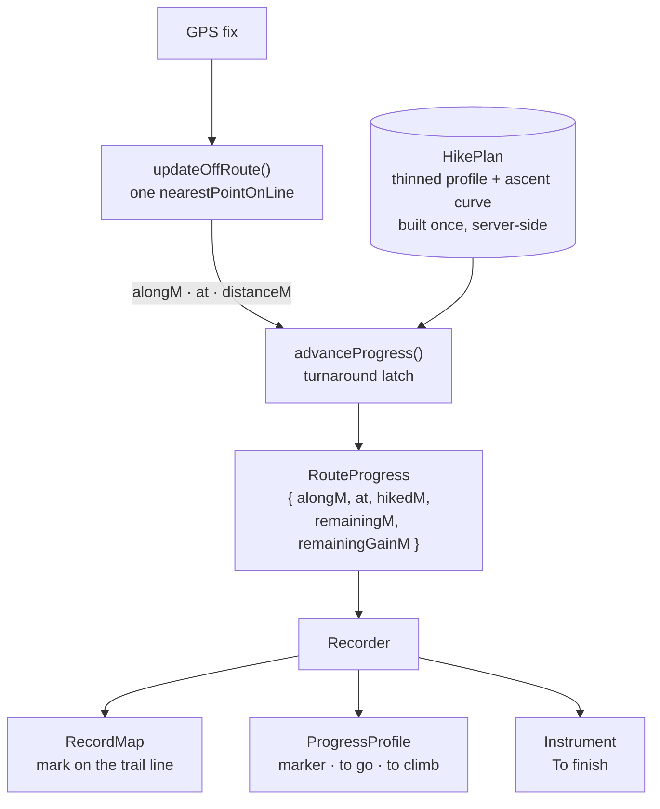

# Work Order: Live tracking visualisation

---

## 1. Metadata

| Field           | Value                                                  |
| --------------- | ------------------------------------------------------ |
| id              | `WO-live-tracking-visualization`                       |
| version         | `1`                                                    |
| status          | `In Review`                                            |
| repo_target     | `switchback`                                           |
| base_sha        | `1789198ff095cbe84a442e163b7dd2ac28a96341`             |
| created_at      | `2026-08-28T23:40:00-07:00`                            |
| harness_version | `3.1.0`                                                |
| overrides       | none — `switchback` ships no `AGENTS.md` harness block |
| supersedes      | N/A                                                    |

The dispatch brief named `7d593956` on the local `master`, which is twelve commits behind
`origin/master`. The branch is cut from `origin/master` so the three sibling streams and this
one share a base.

---

## 2. Problem statement

Three reports about the same screen, from a hiker recording against a trail.

The trail is drawn on the recording map, but it disappears exactly when it is needed: the
recorded track's casing is wider than the trail line it covers, so every metre already walked
erases the route ahead of nothing and behind everything. The green survives only where the
hiker has not been.

There is no reading of progress along the route. The screen reports distance walked and
distance to the finish, but nothing says how much climbing is left, and nothing shows where on
the trail's shape the hiker currently stands.

And press-and-hold on the elevation profile on a trail page starts a text selection that runs
from the graphic into every paragraph, table and stat block below it — 2,400 characters of the
page highlighted from one gesture over a chart.

---

## 3. Scope

**In**

- The recording map's line hierarchy, so the trail and the recorded track are both legible
  where they coincide.
- A progress readout on the recording screen: the trail's own section, a marker at the
  hiker's position on it, and the distance and ascent still to come.
- One value carrying that position, read by both the map and the section.
- Suppressing text selection on the two elevation graphics, and nowhere else.

**Out**

- `map/track-layers.ts` and the finished-activity map. A completed hike deliberately draws no
  trail line; that decision is about a different screen and is untouched.
- The mobile app's own recorder and section renderer (`fix/mobile-background-tracking`).
- The out-and-back progress ambiguity beyond the turnaround latch described in A4 —
  see §9 and _Observed, not addressed_.
- `remainingM`'s existing definition. The new ascent figure is derived on the same axis so the
  two agree; neither is redefined.
- The e2e suite and `ci.yml` (`fix/ci-pipeline-green`).

---

## 4. Definition of Done

| id  | predicate                                                                                                                                    | verification                                                                                                                                                               |
| --- | -------------------------------------------------------------------------------------------------------------------------------------------- | -------------------------------------------------------------------------------------------------------------------------------------------------------------------------- |
| D1  | The trail line stays visible along ground already recorded — the recorded track is narrower than the trail beneath it and both read at once. | screenshot of the recording map after ~30 fixes walked along the trail, showing green either side of the recorded track                                                    |
| D2  | The recording screen shows the trail's section with a marker at the hiker's position on it.                                                  | screenshot of the recording screen mid-hike                                                                                                                                |
| D3  | Remaining distance and remaining ascent are both readable on the recording screen.                                                           | the same screenshot shows a "to go" and a "to climb" figure                                                                                                                |
| D4  | Remaining ascent at the trailhead equals the trail's published ascent, so the screen never reports two climbs for one trail.                 | `npx vitest run packages/geo/test/progress.test.ts` exits 0 with the `spends the whole published ascent` case passing                                                      |
| D5  | The map's progress mark and the section's marker are the same value, not two computations that can disagree.                                 | `apps/web/test/record-progress.test.ts` asserts one `RouteProgress` reaches both components; `npx vitest run apps/web/test/record-progress.test.ts` exits 0                |
| D6  | A press-and-drag beginning on either elevation graphic selects nothing.                                                                      | `window.getSelection().toString()` is `''` after the drag — before/after screenshots, and `npx vitest run apps/web/test/conventions.test.ts` covering the class's presence |
| D7  | Selection elsewhere on the trail page is unaffected.                                                                                         | screenshot of a drag over the caption below the graphic, still highlighting                                                                                                |
| D8  | The section marker is reachable and readable without sight or a pointer.                                                                     | `apps/web/test/record-progress.test.ts` asserts the summary string; screenshot of the readout text                                                                         |
| D9  | Nothing already green goes red.                                                                                                              | `npx vitest run` exits 0; `npm run typecheck` exits 0; `npm run lint` exits 0; `npm run format:check` exits 0                                                              |

---

## 5. Assumptions & defaults

| #   | Ambiguity                                                                                               | Default chosen                                                                                      | Why                                                                                                                                                                                                                                                                                                  |
| --- | ------------------------------------------------------------------------------------------------------- | --------------------------------------------------------------------------------------------------- | ---------------------------------------------------------------------------------------------------------------------------------------------------------------------------------------------------------------------------------------------------------------------------------------------------- |
| A1  | "There should be a green marking showing you the path" — the path is already drawn in `field.woodland`. | Read the report as _it vanishes_, not _it is absent_, and fix the occlusion.                        | Reproduced: before recording the line is green; after thirty fixes the recorded track's 8 px casing has covered the 5 px trail for the whole walked stretch. The hue was never the defect.                                                                                                           |
| A2  | Which green.                                                                                            | `SCHEMES.field.woodland`, unchanged.                                                                | Every map in this repo draws cartography in the field plate whatever mode the reader chose — the palette's own note says `SCHEMES` is for the thing drawn and `PALETTES` for the reader. Legibility is bought with the `CASING` rule and with weight, which is what `basemap.ts` says casing is for. |
| A3  | Where the section goes on a screen whose readout column is 420 px.                                      | A new compact strip, not `<TrailProfile>`.                                                          | `<Section>`'s lettering is sized in viewBox units; at 420 px its axis labels resolve to ~5 px. A shrunk instrument is an unreadable one.                                                                                                                                                             |
| A4  | An out-and-back's marker would run backwards down the mirrored profile on the return leg.               | Latch a turnaround once the hiker reaches the far end of the mapped line, then read the return leg. | Otherwise the most common route type shows a marker that reverses at the summit. The latch is four lines of pure function and three tests.                                                                                                                                                           |
| A5  | Remaining ascent could be computed on the wire-thinned profile.                                         | Compute the cumulative-ascent curve server-side on the full profile and thin the two together.      | Ascent under a 10 m hysteresis is sampling-dependent: measured on 220 samples it disagrees with the trail's published figure by a few per cent, and one screen would report two climbs.                                                                                                              |
| A6  | The record page deliberately drops the profile to halve its payload.                                    | Send it thinned to `SECTION_DISPLAY_POINTS`, with its ascent curve.                                 | The old note's reason was "to draw nothing", which no longer holds; its cost concern still does, and thinning answers it at roughly a tenth of the bytes.                                                                                                                                            |
| A7  | `touch-action` on the graph.                                                                            | Not set.                                                                                            | The existing note in `profile.tsx` explains that the graphic is two-thirds down a scrolling page and must not capture the swipe. `pan-y pinch-zoom` would be inert against the reported defect and would still narrow a gesture nobody complained about.                                             |
| A8  | Which declarations actually stop an iOS touch-and-hold.                                                 | `user-select`, `-webkit-user-select` and `-webkit-touch-callout`, as one named class.               | Safari needs the prefixed selection property, and the callout is what turns a long press into the system menu rather than the cursor move the graphic wants.                                                                                                                                         |

---

## 6. Design sketch

### The seam

One value describes where the hiker is on the trail. It is computed once per fix, inside the
recorder, from the fix that also places the map's position dot — so the map mark and the
section marker cannot drift apart, because there is nothing for them to drift from.



Before, the same facts were three unrelated pieces of `useRecorder` state
(`offRouteDistanceM`, `alongM`, `remainingM`), two of them reaching one consumer each and
nothing tying them to a position on the profile — which is why a second consumer would have
had to recompute rather than read.

### Interfaces

```ts
// packages/geo/src/progress.ts

/** The hike a recording is measured against: its section, thinned, and what it climbs. */
export interface HikePlan {
  /** The section as drawn — mirrored already, when the trail is retraced. */
  profile: readonly ElevationPoint[];
  /** Ascent accrued from the trailhead to each sample, computed on the full profile. */
  gainToM: readonly number[];
  /** Length of the line as mapped, which is what `alongM` is measured on. */
  storedLengthM: number;
}

/** Where the hiker is on the trail, as one value. */
export interface RouteProgress {
  /** Along the mapped line. */
  alongM: number;
  /** Along the hike, which past an out-and-back's turnaround runs on past `alongM`. */
  hikedM: number;
  /** The fix projected onto the line — the mark on the map and the marker on the section. */
  at: LngLat;
  remainingM: number;
  remainingGainM: number;
}

export function buildHikePlan(profile, opts): HikePlan;
export function cumulativeGainM(profile, thresholdM?): number[];
export function advanceProgress(plan, previous, nearest): RouteProgress;
```

`buildHikePlan` runs in the record page's server component, where the full profile already is.
`advanceProgress` runs per fix in `useRecorder`, folding the previous `hikedM` forward so the
turnaround latch needs no separate state.

### Drawing

The map's two lines part on weight rather than on hue, which is what makes them survive
lying on top of one another: the trail is a green ribbon (casing 11, line 8) and the recorded
track a thread down the middle of it (casing 5, line 3). `map/track-layers.ts` records the
opposite decision for a _finished_ hike — that two coincident lines read as one thick one —
and that stays true when both lines are the same weight and the reader has no reason to tell
them apart. Recording, they are the plan and the doing, and a ribbon with a thread down it is
one line neither of them could be mistaken for.

The section strip is a silhouette, not an instrument: no axes, no ticks, no lettering inside
the graphic. Ground behind the hiker is filled woodland, ground ahead is a hairline, and the
marker sits on the join. Every number it would have printed is HTML beside it, where it is
selectable, announced, and set in the real type ladder.

---

## 7. Task breakdown

| id    | task                                                                                                                      | acceptance check                                                                  | status |
| ----- | ------------------------------------------------------------------------------------------------------------------------- | --------------------------------------------------------------------------------- | ------ |
| T-001 | `cumulativeGainM` and `buildHikePlan` in `@switchback/geo`, with the thinning that keeps the curve paired to its samples. | `npx vitest run packages/geo/test/progress.test.ts` exits 0                       | `done` |
| T-002 | `advanceProgress` and the turnaround latch.                                                                               | same file, exits 0                                                                | `done` |
| T-003 | `updateOffRoute` returns the projected point, so progress costs no second pass over the route.                            | `npx vitest run packages/geo/test/offroute.test.ts` exits 0                       | `done` |
| T-004 | `useRecorder` exposes one `progress: RouteProgress \| null`; the record page builds and passes the plan.                  | `npm run typecheck` exits 0                                                       | `done` |
| T-005 | The recording map's line hierarchy and the progress mark.                                                                 | `npx vitest run apps/web/test/record-progress.test.ts` exits 0; screenshot        | `done` |
| T-006 | `<ProgressProfile>` — silhouette, marker, and the two figures in HTML.                                                    | same file, exits 0; screenshot                                                    | `done` |
| T-007 | `.plot-surface` on both graphics' interaction surfaces.                                                                   | `npx vitest run apps/web/test/conventions.test.ts` exits 0; selection screenshots | `done` |
| T-008 | Full suite, lint, typecheck, format.                                                                                      | each exits 0                                                                      | `done` |

---

## 8. Test plan

**Unit — `packages/geo/test/progress.test.ts`**

- `cumulativeGainM` rises only where `computeGainLoss` counts a climb, and its last value is
  that function's total — the property D4 rests on.
- `buildHikePlan` thins to the cap while keeping `gainToM` aligned to the samples it kept, and
  keeps the summit.
- `advanceProgress` on a point-to-point: `hikedM` tracks `alongM`, remaining figures fall.
- `advanceProgress` at a turnaround: past the far end of a mirrored line, `hikedM` continues
  past `storedLengthM` while `alongM` falls back.
- `advanceProgress` before the far end: an early wobble does not latch.
- Empty profile, one-point profile, zero-length trail.

**Unit — `apps/web/test/record-progress.test.ts`**

- One `RouteProgress` reaches both the map's mark and the strip's marker (D5).
- The strip's summary names remaining distance and remaining ascent (D8).
- No trail, or a trail with no profile: the strip is absent rather than empty.

**Regression — `apps/web/test/conventions.test.ts`**

- Selection is suppressed on the graphics and nowhere else: `.plot-surface` appears on the two
  interaction surfaces and on no page-level container.

**Edge cases**

- A trail with no elevation pass yet (`profile: []`) — the strip does not mount.
- A fix too inaccurate to trust — progress holds its last value rather than jumping.
- A hike started with no trail — every progress path is `null`, nothing renders.

**Regression**

- `map/track-layers.ts` untouched: the finished-activity map and the iOS WebView draw exactly
  what they drew.
- `remainingM` and the "To finish" dial keep their values.
- The full vitest suite, lint, typecheck and format check.

---

## 9. Iteration log

```yaml
- seq: 1
  at: 2026-08-28T23:40:00-07:00
  state: RESEARCH -> WORK_ORDER
  event: defects_reproduced
  detail: >
    All three reproduced against a local dev server on the seeded database.
    #3 is occlusion, not absence — screenshots before-01-idle / before-02-recording.
    #5 selects 2,400 characters from one drag — before-03-selection.
  decision: One Work Order; the three land in the same files.
  budget: { implement: 0/3, review: 0/3, replan: 0/2, total: 1/8 }

- seq: 2
  at: 2026-08-29T01:20:00-07:00
  state: IMPLEMENT -> SELF_VERIFY
  event: tasks_complete
  detail: T-001..T-008 done, each with its acceptance check run.
  decision: Hand to the Review Board.
  budget: { implement: 1/3, review: 0/3, replan: 0/2, total: 1/8 }
```
