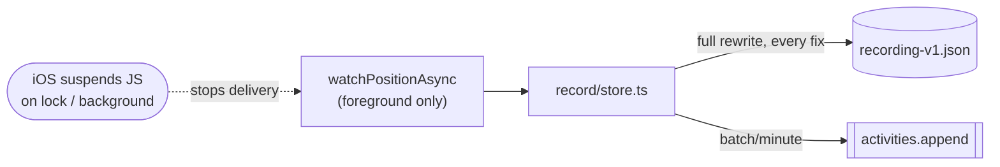
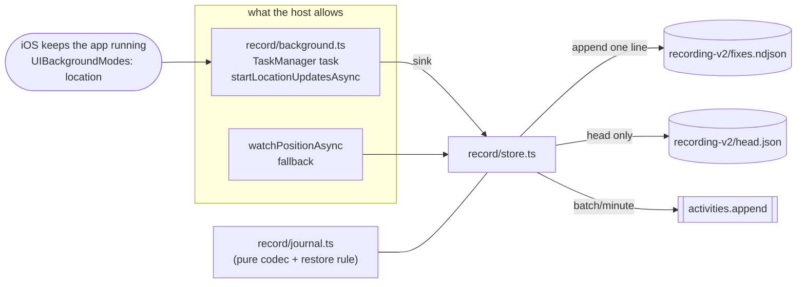

# Work Order: Recording survives the screen going off

---

## 1. Metadata

| Field           | Value                                             |
| --------------- | ------------------------------------------------- |
| id              | `WO-mobile-background-tracking`                   |
| version         | `1`                                               |
| status          | `In Review`                                       |
| repo_target     | `switchback`                                      |
| base_sha        | `1789198ff095cbe84a442e163b7dd2ac28a96341`        |
| created_at      | `2026-08-28T00:00:00-04:00`                       |
| harness_version | `3.1.0`                                           |
| overrides       | none — no `AGENTS.md` or `CLAUDE.md` in this repo |
| supersedes      | N/A                                               |

The brief named `7d593956b079704300666f22b0d6d8900012ef59` as the base. That commit is an
ancestor of this worktree's `master` head, which is what the branch is cut from.

---

## 2. Problem statement

A hike recorded on the phone stops the moment the phone does. `apps/mobile/src/record/store.ts`
takes its fixes from `Location.watchPositionAsync`, a foreground-only subscription, and holds
the screen awake with `expo-keep-awake` as the only mitigation. iOS suspends the JavaScript
runtime when the app is backgrounded or the screen locks, so the subscription stops delivering,
the flush and clock intervals stop firing, and the track resumes only when the app comes
forward. A four-hour hike with the phone in a pocket records as a straight line between two
points. The screen's own caveat text admits it.

The journal that survives a crash is written in full on every fix, so the same file that makes
recording durable rewrites the entire track once a second — tolerable for a foreground-only
recorder that rarely ran long, expensive for one meant to run for six hours in a pocket.

---

## 3. Scope

**In**

- `apps/mobile/src/record/` — a background location task as the fix source, with the foreground
  watcher kept as the fallback for hosts that cannot run one.
- The journal format: append-only, so a fix costs one line rather than a rewrite.
- `apps/mobile/app.config.ts` — the iOS capability and permission declarations the task needs.
- `apps/mobile/app/(tabs)/record.tsx` — the caveat text, which currently states the opposite of
  what will be true.
- `docs/mobile.md` — the battery, permission, and host consequences.
- Tests under `apps/mobile/test/`.

**Out**

- Android. `app.config.ts` declares `platforms: ['ios']` and `docs/mobile.md` records that as a
  product decision, not an oversight: there is no `android/`, no `react-native-web`, and the
  "web version" is `apps/web`. Adding a second platform is not this change.
- `packages/core`, `packages/geo`, `packages/api`. `TrackFix` and the wire shape are untouched,
  so the sibling live-tracking stream drawing the in-progress track on the web map is unaffected.
- `apps/web`, `apps/ingest-worker`, `e2e/`, `.github/`.
- The Lifeline ping loop. It keeps its own cadence and its own `AppState` listener; nothing there
  pauses recording.
- Server-side handling of a longer or denser track. The upload path and batch size do not change.

---

## 4. Definition of Done

| id  | predicate                                                                                                                                        | verification                                                                                                                                                                    |
| --- | ------------------------------------------------------------------------------------------------------------------------------------------------ | ------------------------------------------------------------------------------------------------------------------------------------------------------------------------------- |
| D1  | The recorder asks the OS for background location updates, through a `TaskManager` task registered at module load rather than inside a component  | `apps/mobile/src/record/background.ts` contains a top-level `TaskManager.defineTask`, and `store.ts` calls `startBackgroundUpdates` before falling back to `watchPositionAsync` |
| D2  | The iOS capability the task requires is declared in config, not merely requested at runtime                                                      | `apps/mobile/app.config.ts` declares the `expo-location` plugin with `isIosBackgroundLocationEnabled: true`; asserted by `apps/mobile/test/background-config.test.ts`           |
| D3  | Fixes reach disk as they arrive, at a cost that does not grow with the length of the hike                                                        | `apps/mobile/src/record/store.ts` appends rather than rewrites; `npx vitest run apps/mobile/test/record-journal.test.ts` exits 0                                                |
| D4  | A journal torn by a kill mid-write restores every complete fix and drops only the partial one                                                    | `npx vitest run apps/mobile/test/record-journal.test.ts` exits 0 with the torn-tail case passing                                                                                |
| D5  | A recording restores as `recording` after a kill only when the OS still has the location task running, and as `paused` otherwise                 | `restoredPhase` in `apps/mobile/src/record/journal.ts`, covered by `record-journal.test.ts`                                                                                     |
| D6  | Nothing in the recorder stops tracking on an `AppState` change to `background` or `inactive`                                                     | `apps/mobile/test/background-config.test.ts` scans `src/record/**` for an `AppState` handler that pauses, and asserts none                                                      |
| D7  | A host that cannot run a background task falls back to the foreground watcher rather than recording nothing                                      | `npx vitest run apps/mobile/test/record-background.test.ts` exits 0 with the unavailable-host case passing                                                                      |
| D8  | The Record screen tells the truth about what happens with the screen off, in both modes, and a hiker who refuses "Always" is told what they lose | `apps/mobile/app/(tabs)/record.tsx` prints a caveat derived from the live tracking mode; `background-config.test.ts` asserts the old, now-false sentence is gone                |
| D9  | The whole suite passes                                                                                                                           | `npm run test` exits 0                                                                                                                                                          |
| D10 | Types and lint pass                                                                                                                              | `npm run typecheck` and `npm run lint` exit 0                                                                                                                                   |

---

## 5. Assumptions & defaults

| #   | Ambiguity                                                                   | Default chosen                                                            | Why                                                                                                                                                                                                                                                                                                                                                                                                                                                |
| --- | --------------------------------------------------------------------------- | ------------------------------------------------------------------------- | -------------------------------------------------------------------------------------------------------------------------------------------------------------------------------------------------------------------------------------------------------------------------------------------------------------------------------------------------------------------------------------------------------------------------------------------------- |
| A1  | Android is named in the brief but the app is iOS-only                       | iOS only                                                                  | `platforms: ['ios']` is a recorded product decision in `app.config.ts` and `docs/mobile.md`. Android config for a platform with no build would be dead configuration asserting a capability nobody can test.                                                                                                                                                                                                                                       |
| A2  | How to tell a host that supports background location from one that does not | Attempt the start and read the failure                                    | `expo-location`'s iOS module throws `LocationUpdatesUnavailable` from `startLocationUpdatesAsync` when the host's `Info.plist` lacks `location` in `UIBackgroundModes` (`ios/LocationModule.swift`, `ios/LocationExceptions.swift`). Expo Go's does lack it. So the attempt is the probe, and no `Constants` heuristic is needed — one would have been wrong anyway, since a development build reports the same `executionEnvironment` as Expo Go. |
| A3  | Whether to keep the foreground watcher                                      | Keep it, as the fallback                                                  | `docs/mobile.md`: development builds need an Apple Developer account this project does not have, so Expo Go is the only host anybody can run today. Deleting the watcher would trade a broken background recording for no recording at all.                                                                                                                                                                                                        |
| A4  | Whether to ask for "Always" authorization                                   | Ask, after "When In Use", and carry on without it                         | With `UIBackgroundModes: location`, When In Use is enough to keep recording with the screen off. Always additionally lets iOS relaunch the app after it is terminated. Refusing Always is a smaller degradation than refusing location, and is reported as such rather than treated as failure.                                                                                                                                                    |
| A5  | `pausesUpdatesAutomatically`                                                | `false`                                                                   | `EXLocationTaskConsumer.m` defaults it to **true**. CoreLocation then pauses updates when it decides the user has stopped and, with no `activityType` set, may not resume. That is the reported symptom arriving a second way. `activityType: Fitness` is set alongside it.                                                                                                                                                                        |
| A6  | `showsBackgroundLocationIndicator`                                          | `true`                                                                    | Default is false. A tracker following someone with the screen off should be visible in the status bar while it does.                                                                                                                                                                                                                                                                                                                               |
| A7  | Journal format change                                                       | New version, old journal dropped rather than migrated                     | A v1 journal can only exist from a launch that predates this change, on a device whose recording already stopped at the lock screen. Migration code for that window would never run in production and could not be tested against a real file.                                                                                                                                                                                                     |
| A8  | Where the fix sink lives                                                    | `background.ts` knows nothing about the store; the store registers a sink | One-way dependency. The task must be defined at module load for a headless relaunch, and a module importing the store to call `pushFix` would make that a cycle.                                                                                                                                                                                                                                                                                   |

---

## 6. Design sketch

Before — one source, alive only while the app is:



After — the OS keeps a task alive, and the store is fed by whichever source the host allows:



Three modules where there was one, each with a single reason to change:

- `record/journal.ts` — **pure**, no `expo-*` import, so it loads under plain node and is unit
  tested directly. The same trick `src/offline/titled.ts` already uses and documents. Owns the
  encoding, the tolerance for a torn tail, and the rule for what phase a restored hike takes.
- `record/background.ts` — owns the OS subscription and the `TaskManager` task. Knows nothing
  about recording; it delivers `LocationObject`s to whatever sink is registered, and buffers the
  ones arriving before there is a sink so a headless relaunch loses nothing.
- `record/store.ts` — unchanged in its role: the recording state machine. It gains a tracking
  mode, and its persistence becomes an append.

Key interfaces:

```ts
// record/journal.ts — pure
export interface JournalHead {
  v: number;
  id: string;
  startedAt: number;
  trailId: string | null;
  routeId: string | null;
  sent: number;
  /** Whether the hike was meant to still be running when this head was written. */
  live: boolean;
}
export function encodeHead(head: JournalHead): string;
export function decodeHead(raw: string): JournalHead | null;
export function encodeFixes(fixes: readonly TrackFix[]): string;
export function decodeFixes(raw: string): TrackFix[];
export function restoredPhase(head: JournalHead, stillTracking: boolean): 'recording' | 'paused';

// record/background.ts
export type FixSink = (readings: readonly Location.LocationObject[]) => void;
export function setFixSink(sink: FixSink | null): void;
export async function startBackgroundUpdates(): Promise<boolean>;
export async function stopBackgroundUpdates(): Promise<void>;
export async function isTrackingInBackground(): Promise<boolean>;

// record/store.ts — added to RecorderSnapshot
/** How fixes are arriving: from the OS in the background, from a foreground watcher, or not. */
tracking: 'background' | 'foreground' | null;
/** Recording without the authorization iOS needs to relaunch the app after terminating it. */
mayNotSurviveTermination: boolean;
```

---

## 7. Task breakdown

| id    | task                                                                                                                                                                                           | acceptance check                                                    | status               |
| ----- | ---------------------------------------------------------------------------------------------------------------------------------------------------------------------------------------------- | ------------------------------------------------------------------- | -------------------- |
| T-001 | `record/journal.ts`: the append-only format, the torn-tail tolerance, and the restore rule, with its tests                                                                                     | `npx vitest run apps/mobile/test/record-journal.test.ts` exits 0    | `done` — 13 tests    |
| T-002 | `record/background.ts`: the `TaskManager` task, start/stop/probe, the sink and its pre-registration buffer, with its tests                                                                     | `npx vitest run apps/mobile/test/record-background.test.ts` exits 0 | `done` — 10 tests    |
| T-003 | `app.config.ts`: declare the `expo-location` plugin so `UIBackgroundModes` carries `location`, and drop the legacy always-usage key rather than let the plugin write placeholder prose into it | `npx vitest run apps/mobile/test/background-config.test.ts` exits 0 | `done` — 8 tests     |
| T-004 | `record/store.ts`: background-first start with foreground fallback, append-only persistence, restore that promotes to `recording` only when the OS still has the task                          | `npm run typecheck` exits 0                                         | `done` — exit 0      |
| T-005 | `record.tsx`: caveat text derived from the live tracking mode, and the "Always" degradation stated                                                                                             | `npx vitest run apps/mobile/test/background-config.test.ts` exits 0 | `done` — 8 tests     |
| T-006 | `docs/mobile.md`: what the two hosts do, what each permission buys, what it costs the battery                                                                                                  | `docs/mobile.md` contains a recording-in-the-background section     | `done`               |
| T-007 | Full verification: suite, typecheck, lint                                                                                                                                                      | `npm run test`, `npm run typecheck`, `npm run lint` each exit 0     | `done` — 2235 passed |

---

## 8. Test plan

**Unit — `record-journal.test.ts`**

- round-trips a head and a run of fixes — the happy path.
- reads a file whose last line was cut mid-write: every complete fix survives, the partial is
  dropped, nothing throws. This is the app-kill case.
- refuses a head from an older format version, and refuses garbage, returning `null` so the
  caller drops the journal rather than adopting an activity id the server may not hold.
- `restoredPhase`: live and still tracking restores `recording`; live but no longer tracking
  restores `paused`; not live restores `paused`.

**Unit — `record-background.test.ts`** (`expo-location` and `expo-task-manager` mocked)

- a host that supports the task: `startBackgroundUpdates` resolves `true`, and the options it
  passes disable CoreLocation's automatic pausing.
- a host that does not: `startLocationUpdatesAsync` throws, `startBackgroundUpdates` resolves
  `false` so the caller falls back rather than recording nothing.
- readings delivered by the task with no sink registered — the app backgrounded, or relaunched
  headless — are replayed to the sink when it registers. The background/foreground transition.
- a batch of readings arrives as one task execution and every reading in it reaches the sink.

**Unit — `background-config.test.ts`** (reads sources, as `conventions.test.ts` does)

- `app.config.ts` declares the `expo-location` plugin with iOS background location enabled.
- the always-and-when-in-use permission string is present and mentions the screen being off.
- no module under `src/record/` pauses or stops tracking from an `AppState` handler.
- the Record screen no longer carries the sentence claiming a locked phone stops the track.

**Edge cases**

- Empty fixes file, and a head with no fixes file at all.
- A fix line that parses as JSON but is not a fix (wrong types) — dropped, not adopted.
- `sent` in the head greater than the number of fixes on disk — clamped, as the current code does.
- Sink registered twice; the buffer is drained once.

**Regression**

- `apps/mobile/test/conventions.test.ts` still passes: new files take colour from the theme and
  cast no shadows.
- `apps/mobile/test/trail-title.test.ts` untouched.
- Nothing in `packages/**` changes, so the server and web suites are unaffected — proven by the
  full `npm run test` run.

---

## 9. Iteration log

```yaml
- seq: 1
  at: 2026-08-28T00:00:00-04:00
  state: WORK_ORDER -> IMPLEMENT
  event: work_order_authored
  detail: >-
    Root cause confirmed by reading apps/mobile/src/record/store.ts: the only fix source is
    Location.watchPositionAsync, which iOS stops delivering when the JS runtime is suspended.
    The lead pointing at lifeline.ts was a false alarm — its AppState listener only sends a
    ping on 'active' and never touches the recorder.
  decision: >-
    Background TaskManager task as the primary source, foreground watcher as the fallback,
    chosen by attempting the start rather than by guessing at the host.
  budget: { implement: 0/3, review: 0/3, replan: 0/2, total: 1/8 }

- seq: 2
  at: 2026-08-28T00:00:00-04:00
  state: IMPLEMENT -> SELF_VERIFY
  event: tasks_complete
  detail: >-
    T-001..T-007 done. 31 new tests across three files; each behaviour was watched failing
    under a deliberate mutation of the code under test before being recorded as passing.
    npm run test 2235 passed / 0 failed, npm run typecheck exit 0, npm run lint exit 0,
    prettier --check clean.
  decision: >-
    Two findings worth recording. EXLocationTaskConsumer.m defaults pausesUpdatesAutomatically
    to true, which is a second, independent way tracking stops on its own; it is now set false
    with activityType Fitness. And the journal was rewritten whole on every fix, which a
    six-hour background recording cannot afford — it now appends one line per fix.
  budget: { implement: 1/3, review: 0/3, replan: 0/2, total: 1/8 }

- seq: 3
  at: 2026-08-28T00:00:00-04:00
  state: SELF_VERIFY -> REVIEW_BOARD
  event: unverified_declared
  detail: >-
    UNVERIFIED, and not verifiable from this machine: that a real iPhone keeps recording with
    the screen off. It needs a development build, which needs an Apple Developer account this
    project does not have (docs/mobile.md), and there is no macOS or simulator here — the host
    is Windows. Everything asserted above is asserted about code and config, not about a device.
  decision: >-
    Implement correctly, test what is testable, and name the device steps rather than claim
    them. The steps are in the PR body under "What a device still has to prove".
  budget: { implement: 1/3, review: 0/3, replan: 0/2, total: 1/8 }
```
