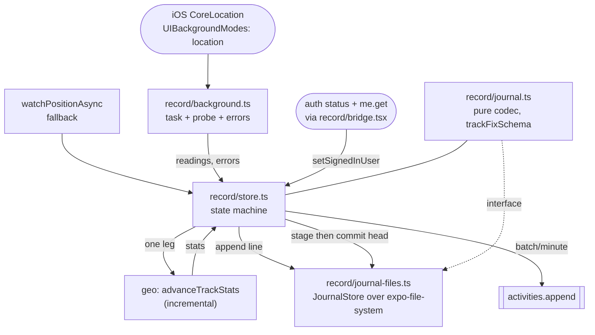

# Work Order: Recording survives the screen going off — v2

---

## 1. Metadata

| Field           | Value                                                              |
| --------------- | ------------------------------------------------------------------ |
| id              | `WO-mobile-background-tracking`                                    |
| version         | `2`                                                                |
| status          | `In Review`                                                        |
| repo_target     | `switchback`                                                       |
| base_sha        | `1789198ff095cbe84a442e163b7dd2ac28a96341`                         |
| created_at      | `2026-08-29T00:00:00-04:00`                                        |
| harness_version | `3.1.0`                                                            |
| overrides       | none — no `AGENTS.md` or `CLAUDE.md` in this repo                  |
| supersedes      | `.plans/WO-mobile-background-tracking-v1.md` (status `Superseded`) |

---

## 2. Problem statement

v1 made recording survive the lock screen and was returned FAIL by the Review Board: five of the
first six reviewers failed it, on four Blockers and fifteen Majors.

The board named one defect underneath most of them, and it is the right diagnosis. **v1 removed a
bound that untouched code silently depended on.** Fix count `n` used to be capped by screen-on
time, because `watchPositionAsync` stops delivering when iOS suspends the runtime. Removing that
cap is the entire point of the change — but nothing outside the diff was re-examined against the
new `n`, and nothing outside the diff was re-examined against the new _delivery shape_ either:
fixes now arrive in batches, from a process that may outlive the screen, the session, and the
signed-in user.

So the v2 problem statement is not "add background location". It is: **background location is in,
and every assumption that rested on a foreground-only, screen-bounded, single-fix-at-a-time,
one-identity-per-launch recorder is now false and must be re-derived.**

A seventh finding arrived separately, from PR #78's security board, and belongs to the same
family: the journal outlives the identity that created it, so user A's per-second location trace
is restored and presented to whoever signs in next.

---

## 3. Scope

**In**

- `apps/mobile/src/record/**` — the whole directory, including `lifeline.ts`, which the change's
  blast radius reaches (M11) even though its behaviour is not being altered.
- `apps/mobile/app/(tabs)/record.tsx` and `apps/mobile/app/_layout.tsx`.
- `apps/mobile/app.config.ts` — the purpose string (M9).
- **`packages/geo`, now explicitly in scope.** v1 put it out, which is precisely why the plan could
  not catch B3. The change is purely additive: a new incremental accumulator beside
  `summariseTrack`, with an equivalence test. `summariseTrack` itself is not touched.
- `docs/mobile.md`.
- Tests under `apps/mobile/test/` and `packages/geo/test/`.

**Out**

- `apps/mobile/src/api/**`, `src/auth/**`, `src/offline/**` — the auth stream owns these and is
  fixing the query-cache half of the identity defect in parallel. Read freely, edit nothing.
- **The Lifeline's behaviour.** M11 establishes that `UIBackgroundModes: location` keeps the ping
  loop firing from a locked phone, which is new egress to a publicly shareable link. Mazen is
  deciding whether that is desirable or should be bounded to foreground. v2 corrects the two false
  statements and changes no behaviour, on instruction.
- `packages/core`. `TrackFix` and the `activities.append` wire shape stay exactly as they are, so
  the sibling live-tracking-visualization stream is unaffected.
- Android, for the reasons in v1 §5 A1, unchanged.
- `apps/web`, `apps/ingest-worker`, `e2e/`, `.github/`.

### What depended on the thing I removed

The board asked for this as an explicit research section. It is the checklist v1 lacked.

| Removed bound                       | What silently depended on it                                                               | Finding  |
| ----------------------------------- | ------------------------------------------------------------------------------------------ | -------- |
| One fix per delivery                | `pushFix` stamping `t` from `Date.now()` at delivery; the `t <= previous.t` dedupe guard   | B1       |
| `n` bounded by screen-on time       | `summariseTrack(fixes)` on every fix — a full re-walk, quadratic in `n`                    | B3       |
| `n` bounded by screen-on time       | `Math.min(...elevations)` in `packages/geo/src/track.ts:227` — argument-count limit        | minor    |
| Journal written whole, one file     | restore's `Math.min(head.sent, fixes.length)` self-healing a stale `sent`                  | M4       |
| A hike ends when the app is left    | one identity per recording; `hydrate()` guarded once per launch and keyed to nothing       | identity |
| A hike ends when the app is left    | every OS-side stop being fire-and-forget, because the app was the thing doing the tracking | M6       |
| The app is awake when a fix arrives | `lifeline.ts`'s stated contract that timers stop when the app is off screen                | M11      |
| Foreground-only egress              | `docs/mobile.md`'s claim that nothing new leaves the phone                                 | M11      |

---

## 4. Definition of Done

Corrections to v1's DoD are recorded here rather than in the v1 file, per §8.5 of the workspace
rules. v1's **D3 and D5 were marked MET on `record-journal.test.ts`, which never imports
`store.ts`** — they were true of the codec and unproven of the module that uses it. v1's **D8 was
marked MET on a source-spelling assertion that B4 walked straight past.** Neither predicate is
carried forward as met; both are re-verified below against the module under test.

| id  | predicate                                                                                                           | verification                                                                                                                           |
| --- | ------------------------------------------------------------------------------------------------------------------- | -------------------------------------------------------------------------------------------------------------------------------------- |
| E1  | A batch of `k` readings delivered in one task execution yields `k` fixes, stamped from each reading's own timestamp | `record-store.test.ts` — batch of 8 across 8 seconds produces 8 fixes with `t` 0..7                                                    |
| E2  | The live position reflects the newest reading in a batch, never the oldest                                          | `record-store.test.ts` — snapshot `position` equals the last reading's coordinates after a batch                                       |
| E3  | The head is never observed partially written: it is staged and renamed into place                                   | `journal-files.test.ts` — asserted against the real `expo-file-system` calls, including a kill inside the move                         |
| E4  | Stats are accumulated incrementally and agree exactly with `summariseTrack`                                         | `packages/geo/test/track-stats.test.ts` — fold equals `summariseTrack` over 500 randomised ascending-`t` tracks                        |
| E5  | Per-fix cost does not grow with the length of the hike                                                              | `packages/geo/test/track-stats.test.ts` — 20k-fix fold completes within a fixed budget; `record-store.test.ts` counts one fold per fix |
| E6  | Every recorder state maps to a distinct, true sentence, and the mapping is exhaustive over the union                | `record-store.test.ts` — every `(phase, tracking)` pair the store can produce yields a note, none claiming recording while paused      |
| E7  | A CoreLocation failure reaches the user rather than being swallowed                                                 | `record-background.test.ts` + `record-store.test.ts` — task error sets `geoError`                                                      |
| E8  | An unsupported host is distinguished from every other start failure                                                 | `record-background.test.ts` — the unavailable code falls back; any other error is reported                                             |
| E9  | "Always" is asked for only after the capability probe succeeds                                                      | `record-background.test.ts` — no permission request when the start throws                                                              |
| E10 | `mayNotSurviveTermination` is read from the OS, not from a module variable, on every restore path                   | `record-store.test.ts` — restored session with Always granted reports `false`                                                          |
| E11 | An upload that resolves after a new hike began cannot write its `sent` into the new hike's head                     | `record-store.test.ts` — interleaved `begin` during an in-flight upload leaves `pending` non-negative                                  |
| E12 | A failed hydrate never stops a live OS subscription                                                                 | `record-store.test.ts` — throwing store leaves `stopBackgroundUpdates` uncalled                                                        |
| E13 | A journal that is not live while the OS still tracks is reconciled by stopping the OS                               | `record-store.test.ts` — restore of a paused journal with the task running calls `stopBackgroundUpdates`                               |
| E14 | No location trace outlives the identity that created it                                                             | `record-store.test.ts` — a journal owned by A is erased, not presented, when B is confirmed signed in                                  |
| E15 | Clearing a session notifies mounted subscribers rather than waiting for a re-render                                 | `record-store.test.ts` — a subscriber is called during the identity change                                                             |
| E16 | The legacy `recording-v1.json` is deleted, not ignored                                                              | `record-store.test.ts` — the store's `clearLegacy` is invoked at hydrate                                                               |
| E17 | Fix lines are validated by `trackFixSchema`, the canonical contract, not a hand-rolled twin                         | `record-journal.test.ts` — a line the schema rejects is dropped                                                                        |
| E18 | A torn tail costs one fix, not two: the next append starts on a clean line                                          | `record-journal.test.ts` + `record-store.test.ts` — a fixes file with no trailing newline is repaired at restore                       |
| E19 | Background registration has a structural guarantee, not an incidental import path                                   | `background-config.test.ts` — the Expo entry layout imports the task module for its side effect                                        |
| E20 | Existing suites pass; types, lint and format clean                                                                  | `npm run test`, `npm run typecheck`, `npm run lint`, `npx prettier --check .` each exit 0                                              |

---

## 5. Assumptions & defaults

v1's A1–A8 stand unless restated. New decisions:

| #   | Ambiguity                                                      | Default chosen                                                 | Why                                                                                                                                                                                                                                                                                                                                     |
| --- | -------------------------------------------------------------- | -------------------------------------------------------------- | --------------------------------------------------------------------------------------------------------------------------------------------------------------------------------------------------------------------------------------------------------------------------------------------------------------------------------------- |
| B1  | Where the incremental stats accumulator lives                  | `packages/geo`, beside `summariseTrack`                        | The stated design property is that both clients compute the same numbers from the same code. An accumulator in `apps/mobile` would be a second implementation of the same arithmetic, free to drift from the server's answer. Additive: `summariseTrack` is untouched, and an equivalence test pins the two together.                   |
| B2  | Clear the journal on identity change, or key it to an identity | **Key it**, and erase on confirmed mismatch                    | Both have a case. Clear-always is simpler but destroys an in-progress hike on every sign-out, and a token expiry mid-hike is an ordinary event on a mountain. Keying keeps A's hike across A signing back in, and erases it the moment a _different_ identity is confirmed — which is the only moment the disclosure exists. See below. |
| B3  | Identity while offline                                         | Absence of a confirmed identity is never treated as a mismatch | Changing identity requires a network sign-in — the handshake goes through our server. So an offline cold launch cannot be a different user than the last launch, and refusing to restore offline would lose a hike for a hazard that cannot occur offline. The check bites on sign-in, which is online by construction.                 |
| B4  | A journal whose head carries no owner                          | Erased when a concrete identity is first confirmed             | It can only come from a hike begun before `me.get` resolved. Rare, and the safe direction is to destroy an unattributable trace rather than hand it to the first identity that appears.                                                                                                                                                 |
| B5  | Journal format version                                         | Stays `2`; `ownerId` added as a required head field            | v2 was never released — it exists only on this branch. Requiring `ownerId` invalidates exactly the unreleased test journals and nothing a user holds.                                                                                                                                                                                   |
| B6  | Recovery when the head cannot be decoded                       | Delete the whole journal                                       | Deleting an intact `fixes.ndjson` alongside a _torn_ head was B2 and is indefensible. Staging-and-renaming the head removes torn heads entirely, so an undecodable head now means real corruption of an unattributable trace — and leaving that on disk is M7 and M10 wearing a third filename. Atomicity is what licenses the delete.  |
| B7  | Where the sink is registered                                   | Only once an identity is known                                 | Falls out of B2: nothing may be presented before the owner is checked. It also makes `background.ts`'s pre-registration buffer genuinely load-bearing, which answers the minor honestly instead of with a headless-relaunch story the import graph forecloses.                                                                          |
| B8  | Whether to change the Lifeline                                 | No — correct the two false statements only                     | On instruction: Mazen is deciding whether the new egress is desirable. Recording a known-false contract as if it were true is the part that cannot wait.                                                                                                                                                                                |

**On B2, the argument for the road not taken.** Clear-on-any-identity-event is defensible: it is
one line, it has no failure mode that leaks, and it never has to reason about what "the same user"
means. It was rejected because it makes signing out — which this app does on any HTTP 401, and
which a 60-day refresh token makes routine — destroy a hike in progress. That converts a privacy
control into a data-loss bug, and users would learn to avoid signing out, which is worse for
privacy than the thing it fixed. Keying costs one field in the head and one comparison.

---

## 6. Design sketch



The seam that did not exist in v1 is `JournalStore`: `store.ts` no longer constructs
`expo-file-system` concretes inline, so a test can hand it an in-memory implementation. That is the
design defect behind M15, and fixing the seam is what makes E1–E16 testable at all.

Key interfaces:

```ts
// record/journal.ts — pure, no expo-*
export interface JournalStore {
  readHead(): string | null;
  /** Staged then renamed. A reader never observes a partially written head. */
  writeHead(raw: string): void;
  readFixes(): string | null;
  appendFixes(raw: string): void;
  /** Rewrites the fixes file whole. Used once at restore to repair a torn tail. */
  rewriteFixes(raw: string): void;
  open(): void;
  clear(): void;
  /** Erases journals written by formats this build no longer reads. */
  clearLegacy(): void;
}

// packages/geo/src/track.ts — additive
export interface TrackStatsState {
  /* constant size */
}
export function initialTrackStats(): TrackStatsState;
export function advanceTrackStats(state: TrackStatsState, fix: TrackFix): TrackStatsState;
export function accumulatedStats(state: TrackStatsState): ActivityStats;

// record/store.ts
export function setSignedInUser(userId: string | null): void;
export type TrackingNote =
  'background-durable' | 'background-fragile' | 'foreground' | 'not-tracking';
export function trackingNote(snapshot: RecorderSnapshot): TrackingNote;
```

`trackingNote` moves out of `record.tsx` and returns a **discriminated tag**, not prose. B4
happened because the parameter type was widened to `string | null`, discarding the union and
foreclosing exhaustiveness. A tag computed in the store, from the store's own union, with a
`satisfies never` exhaustiveness check on the screen's mapping, is what makes the fourth state
impossible to forget.

---

## 7. Task breakdown

| id    | task                                                                                                                                                 | acceptance check                                                    | status |
| ----- | ---------------------------------------------------------------------------------------------------------------------------------------------------- | ------------------------------------------------------------------- | ------ |
| U-001 | `packages/geo`: incremental accumulator + equivalence and cost tests (B3, E4, E5)                                                                    | `npx vitest run packages/geo/test/track-stats.test.ts` exits 0      | `done` |
| U-002 | `journal.ts`: `trackFixSchema` validation, `JournalStore` interface, torn-tail repair, `ownerId` in the head (M12, E17, E18, identity)               | `npx vitest run apps/mobile/test/record-journal.test.ts` exits 0    | `done` |
| U-003 | `journal-files.ts`: staged head write, legacy erasure, documented storage class (B2, M7, M10, E3, E16)                                               | `npm run typecheck` exits 0                                         | `done` |
| U-004 | `background.ts`: error surfacing, coded probe, probe-before-prompt, Always re-read (M1, M2, M8, M3, E7–E9)                                           | `npx vitest run apps/mobile/test/record-background.test.ts` exits 0 | `done` |
| U-005 | `store.ts`: batch stamping, incremental stats, injected store, flush guard, hydrate/reconcile, identity, extracted adoption (B1, B2, B3, M3–M6, M14) | `npm run typecheck` exits 0                                         | `done` |
| U-006 | `record-store.test.ts`: the coverage gap that let all of this through (M15, E1–E3, E6, E10–E16)                                                      | `npx vitest run apps/mobile/test/record-store.test.ts` exits 0      | `done` |
| U-007 | `record.tsx` + `_layout.tsx`: exhaustive note mapping, honest pre-start copy, entry-side registration (B4, M13, E6, E19)                             | `npx vitest run apps/mobile/test/background-config.test.ts` exits 0 | `done` |
| U-008 | `app.config.ts`, `lifeline.ts`, `docs/mobile.md`: purpose string, the two false statements, retention and at-rest (M9, M10, M11)                     | `npx vitest run apps/mobile/test/background-config.test.ts` exits 0 | `done` |
| U-009 | Minors, and the ones deliberately declined with a reason                                                                                             | recorded in §9                                                      | `done` |
| U-010 | Full verification                                                                                                                                    | `npm run test`, `npm run typecheck`, `npm run lint` exit 0          | `done` |

---

## 8. Test plan

**`packages/geo/test/track-stats.test.ts`** — the fold equals `summariseTrack` over randomised
ascending-`t` tracks including teleports, duplicate `t`, out-of-range accuracy, absent elevation,
single-fix and empty tracks; and a 20k-fix fold inside a fixed time budget.

**`record-store.test.ts`** — new, and the centre of gravity. `expo-file-system`, `expo-haptics`,
`expo-keep-awake`, `expo-location` and `expo-task-manager` mocked; an in-memory `JournalStore`
injected. Covers batch stamping and ordering, head staging, restore and reconciliation, the flush
race, identity change, subscriber notification, and every `(phase, tracking)` pair.

**`record-background.test.ts`** — extended for error delivery, coded probe failures, and
probe-before-prompt ordering.

**`record-journal.test.ts`** — extended for schema validation and torn-tail repair.

**Regression** — `conventions.test.ts`, `trail-title.test.ts`, and the full suite.

---

## 9. Iteration log

Append-only. Entries 1–3 are in `.plans/WO-mobile-background-tracking-v1.md` and are not repeated
or edited here.

```yaml
- seq: 4
  at: 2026-08-29T00:00:00-04:00
  state: REVIEW_BOARD -> REPLAN
  event: review_failed
  detail: >-
    Six of eight reviewers in, five FAIL. Four Blockers, fifteen Majors, plus a cross-stream
    identity finding from PR #78's board. v1 superseded by this file.
  decision: replan rather than patch — the defects share one cause and a patch round would
    have closed symptoms.
  budget: { implement: 1/3, review: 1/3, replan: 1/2, total: 1/8 }

- seq: 5
  at: 2026-08-29T00:00:00-04:00
  state: REPLAN -> WORK_ORDER
  event: v1_record_corrected
  detail: >-
    Correcting three v1 claims rather than editing them. (a) v1 §6 and §8 documented
    startBackgroundUpdates as Promise<boolean>; it returns Promise<BackgroundStart>, and §8
    repeated the dead shape twice. (b) v1 D3 and D5 were recorded MET via
    record-journal.test.ts, which never imports store.ts — true of the codec, unproven of the
    module. (c) v1 D8 was recorded MET via a source-spelling assertion in
    background-config.test.ts, which B4 passed straight through: the screen told a paused hike
    it was recording, and the gate asserted only that a function name appeared in the file.
    None of the three is carried forward as met.
  decision: >-
    Positive assertions on source spellings are removed from the config gate. Negative scans
    stay — they are the right idiom for "this code does not exist". Behaviour is asserted
    against the module under test or not asserted at all.
  budget: { implement: 1/3, review: 1/3, replan: 1/2, total: 1/8 }

- seq: 6
  at: 2026-08-29T01:00:00-04:00
  state: WORK_ORDER -> IMPLEMENT
  event: tasks_complete
  detail: >-
    U-001..U-008 done. `packages/geo` gained an incremental accumulator pinned to
    `summariseTrack` over 500 randomised tracks; `store.ts` gained a `JournalStore` seam and 31
    tests where it had none. Every blocker was reintroduced as a mutation and watched failing
    before being recorded as closed.
  decision: >-
    Intra-directory imports in `src/record/**` were made relative rather than adding a global
    `@/` alias to the shared `vitest.config.ts`. Same unlock, and it matches what `src/offline`
    and `src/auth` already do — a global alias would have resolved `@/` to mobile for every
    workspace, including apps/web.
  budget: { implement: 2/3, review: 1/3, replan: 1/2, total: 1/8 }

- seq: 7
  at: 2026-08-29T01:45:00-04:00
  state: IMPLEMENT -> IMPLEMENT
  event: interrupted_and_resumed
  detail: >-
    A platform-wide API outage terminated the run mid-task. The working tree was inspected on
    resume — no truncated writes — and committed before any further work. `origin/master` was
    re-fetched and had *not* moved: it is still 1789198, the base this branch was cut from, so
    no rebase was performed and none is claimed.
  decision: commit early on resume, then continue.
  budget: { implement: 2/3, review: 1/3, replan: 1/2, total: 1/8 }

- seq: 8
  at: 2026-08-29T02:00:00-04:00
  state: IMPLEMENT -> SELF_VERIFY
  event: minors_declined
  detail: >-
    Taken - `timeInterval` dropped from the task options (inert on iOS), `distanceInterval`
    comment corrected, `JOURNAL_DIR` derived from `JOURNAL_VERSION`, the torn tail now costs one
    fix rather than two, `startWatch`/`stopWatch` renamed to `startTracking`/`stopTracking`, the
    duplicated adoption body extracted, `MAX_BUFFERED` re-justified against the reason it is now
    genuinely load-bearing, and the positive source-spelling assertions removed from the config
    gate. Declined - `Math.min(...elevations)` in `packages/geo/src/track.ts:227` is left alone
    - the recorder no longer reaches it, since the fold never spreads an array, and changing
    `summariseTrack` would touch the server's path for a limit UNVERIFIED on Hermes.
  decision: >-
    The Hermes argument-count ceiling is recorded as UNVERIFIED with a one-line device repro
    rather than guessed at.
  budget: { implement: 2/3, review: 1/3, replan: 1/2, total: 1/8 }

- seq: 9
  at: 2026-08-29T04:00:00-04:00
  state: REVIEW_BOARD -> IMPLEMENT
  event: round_two_findings
  detail: >-
    Eight of eight reviewers reported - five FAIL, two PASS, one FAIL from the Tests reviewer,
    which applied 65 mutations and found 26 survivors. Closed this round - the Lifeline panel's
    hiker-facing copy (a third statement of the old behaviour, and the only one a hiker reads);
    hydrate() unreachable on an offline launch, which dropped the rest of a hike and is a
    regression against master; the server's 20,000-sample ceiling retrying the same batch every
    60 s for the rest of a hike; journal-files.ts having no tests at all, where five of five
    mutations survived; E3 asserting only its own test double; bridge.tsx being untestable; an
    age horizon so the retention claim is true; a `starting` arm for the note the screen shows
    between Start and the permission dialogs; the decode regression; and the sweep of false or
    stale statements in the docs, the config comment and the config gate.
  decision: >-
    The `@/` alias was added to vitest.config.ts after all. Relative imports unlocked store.ts
    but could not reach bridge.tsx, which imports `@/api/trpc` and `@/auth/context` - and that is
    the file wiring the whole feature to the app. Anchored to the directories under
    apps/mobile/src, and the full suite is the evidence that apps/web is unaffected.
  budget: { implement: 3/3, review: 2/3, replan: 1/2, total: 1/8 }

- seq: 10
  at: 2026-08-29T04:30:00-04:00
  state: IMPLEMENT -> SELF_VERIFY
  event: correction_and_deferral
  detail: >-
    Correcting seq 6, which recorded "31 tests" against a pasted suite total of 552. Two
    reviewers independently measured 564 on the tree; the block had been assembled from more
    than one run rather than pasted from one. It is replaced in the PR body with a verbatim
    per-file listing from a single command, and no number in this file is carried over from it.
    Also correcting the E3, E4 and E5 citations - E3 cited a test of the in-memory double rather
    than of the files, and E4/E5 cited packages/geo/test/track.test.ts, which this change never
    touched; the tests are in track-stats.test.ts. That is the same shape of error this Work
    Order's section 4 says it is correcting from v1.
  decision: >-
    Deferred at the cap, with reasons. (a) Re-expressing `summariseTrack` as the fold - a
    reviewer proved the equivalence total over 4000 tracks, so the finding is upheld, but it
    changes the function the server computes every stored activity with, and doing that in the
    last hours of the last implement round is the wrong trade. The concrete divergence it named
    is real and is recorded as UNFIXED - `computeGainLoss` takes `thresholdM` as a parameter
    while `foldElevation` hard-codes the constant, so the two agree only at the default and the
    property test cannot see it. (b) Stripping the round-by-round narration from the PR body.
    Both are listed in the PR under what is deferred, and neither is claimed as done.
  budget: { implement: 3/3, review: 2/3, replan: 1/2, total: 1/8 }
```
