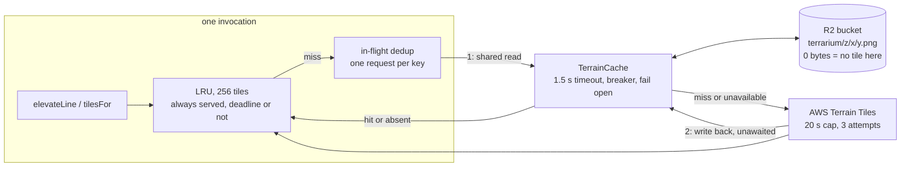

# Work Order: Shared, persistent cache for terrarium elevation tiles

---

## 1. Metadata

| Field           | Value                                                 |
| --------------- | ----------------------------------------------------- |
| id              | `WO-shared-terrain-cache`                             |
| version         | `1`                                                   |
| status          | `Active`                                              |
| repo_target     | `switchback`                                          |
| base_sha        | `1789198ff095cbe84a442e163b7dd2ac28a96341`            |
| created_at      | `2026-08-29T06:57:03Z`                                |
| harness_version | `3.1.0`                                               |
| overrides       | none — no `AGENTS.md`/`CLAUDE.md` under `switchback/` |
| supersedes      | N/A                                                   |

The brief named `7d593956b0797043` as the base. That commit is nine behind the worktree's
`master`; the branch is cut from the tip, `1789198`, and every number below was measured there.

---

## 2. Problem statement

Elevation fetching dominates ingest wall clock. Quadkey `021231030` (144 trails) takes 490.5 s
sequentially and 88.0 s at concurrency 6 — near-linear from 1 to 6, which says the phase is bound
on terrain round trips rather than on CPU.

`TerrainSource` already caches 256 tiles in process, sized to exactly one z9 tile's z13 terrain
footprint, with in-flight deduplication. That cache dies with the invocation. A retry, a
subdivided child tile, a 30-day refresh and every cold start all re-fetch terrain that was
fetched minutes earlier, and terrarium tiles never change.

It is also a prerequisite. A per-trail fan-out would put each trail in its own invocation, which
destroys the locality the 256-tile LRU depends on — without a tier that outlives an invocation,
fanning out makes ingest slower.

---

## 3. Scope

**In**

- A second cache tier for terrarium tiles, shared between processes and outliving them, behind
  the existing per-process LRU.
- Two stores behind one interface: Cloudflare R2 for the deployed estate, a directory for a
  laptop drain and for the benchmark.
- Fail-open policy: a bounded lookup timeout, a breaker after repeated failure, and every
  failure degrading to the origin fetch that happens today.
- Wiring in `packages/ingest/src/config.ts` so `getTerrain()` builds the tier from environment.
- Azure Function App application settings for the four R2 variables.
- A repeatable cold/warm benchmark script.

**Out**

- The per-trail fan-out this unblocks. Separate work.
- Replacing or resizing the in-process LRU. It stays exactly as it is.
- `pipeline.ts`, `jobs.ts`, `maintenance.ts`, `backpressure.ts`, `apps/ingest-worker/**`,
  `apps/web/**`, `apps/mobile/**` — owned by other streams in flight.
- Vercel project environment variables. `apps/web/src/env.ts` is another stream's file; the
  variables are recorded in `infra/azure/README.md` and listed in §5/A7 instead.
- De-duplicating SigV4 against `packages/api/src/storage.ts`. See A5.
- Caching anything other than terrarium tiles. Overpass responses are not immutable.

---

## 4. Definition of Done

| id  | predicate                                                                                                                           | verification                                                                                                              |
| --- | ----------------------------------------------------------------------------------------------------------------------------------- | ------------------------------------------------------------------------------------------------------------------------- |
| D1  | A stored tile is served without an origin request.                                                                                  | `npx vitest run packages/ingest/test/terrain-cache.test.ts -t 'serves a stored tile without touching the origin'` exits 0 |
| D2  | A cache miss falls through to the origin and stores what it fetched.                                                                | `npx vitest run packages/ingest/test/terrain-cache.test.ts -t 'falls through to the origin on a miss'` exits 0            |
| D3  | A cache that throws, times out or is absent degrades to the origin fetch rather than failing the ingest.                            | `npx vitest run packages/ingest/test/terrain-cache.test.ts -t 'unavailable'` exits 0                                      |
| D4  | A tile the origin does not have (`null`) is stored and read back as `null`, distinctly from an unavailable cache.                   | `npx vitest run packages/ingest/test/terrain-cache.test.ts -t 'no tile'` exits 0                                          |
| D5  | The in-process LRU is still served past the deadline, and the shared tier is not started past it.                                   | `npx vitest run packages/ingest/test/elevate.test.ts -t 'deadline'` exits 0                                               |
| D6  | One lookup is bounded by its own timeout, tighter than the origin's, and clamped by the invocation deadline.                        | `npx vitest run packages/ingest/test/terrain-cache.test.ts -t 'timeout'` exits 0                                          |
| D7  | Repeated lookup failure stops the tier being consulted, and it recovers after the cool-down.                                        | `npx vitest run packages/ingest/test/terrain-cache.test.ts -t 'breaker'` exits 0                                          |
| D8  | A cold and a warm pass over the same z9 tile's terrain footprint are measured against the real origin, and the warm pass is faster. | `npx tsx scripts/bench-terrain-cache.ts 021231030 --tiles 64` prints both timings and a hit rate                          |
| D9  | The four R2 settings reach the Function App only when all four are supplied, so an unset variable leaves the cache off.             | `infra/azure/ingest.bicep` `optionalWorkerSettings` gates them on all four being non-empty                                |
| D10 | The whole suite passes.                                                                                                             | `npm test` exits 0                                                                                                        |
| D11 | Lint and typecheck pass.                                                                                                            | `npm run lint` and `npm run typecheck` exit 0                                                                             |

---

## 5. Assumptions & defaults

| #   | Ambiguity                                                | Default chosen                                                                                                              | Why                                                                                                                                                                                                                                              |
| --- | -------------------------------------------------------- | --------------------------------------------------------------------------------------------------------------------------- | ------------------------------------------------------------------------------------------------------------------------------------------------------------------------------------------------------------------------------------------------ |
| A1  | Which store                                              | **Cloudflare R2**, private bucket, SigV4-signed GET and PUT                                                                 | Argued in §6. Postgres cannot hold it, and R2 is the only candidate both drain paths reach without new identity plumbing.                                                                                                                        |
| A2  | Cache the PNG or the decoded raster                      | The **PNG bytes**, byte-identical to origin                                                                                 | A decoded 256×256 RGBA tile is 262 KB against ~50 KB compressed. Storing the origin's own bytes also makes a warm read provably equivalent to a cold one.                                                                                        |
| A3  | How "the origin has no tile here" is recorded            | A **zero-length object** at the tile's key                                                                                  | A terrarium PNG is never empty, so the encoding cannot collide with real data, and it needs no metadata the presigned-GET path cannot read back.                                                                                                 |
| A4  | Does the always-serve-on-hit rule extend to the new tier | **No.** It stays scoped to the in-process LRU                                                                               | The rule is justified by the hit costing nothing. A shared lookup is a network round trip; a caller past its clock must not start one, exactly as it must not start an origin fetch. Held by a test.                                             |
| A5  | SigV4 lives in `packages/api/src/storage.ts`             | **Reimplemented, GET and PUT only, in `terrain-cache-r2.ts`**                                                               | `@switchback/api` depends on `@switchback/ingest`; importing back is a cycle. The shared home is `@switchback/core`, and that move edits `packages/api/src/storage.ts`, which is outside this Work Order's write set. Recorded as the follow-up. |
| A6  | Lookup timeout                                           | **1,500 ms**, clamped by `requestBudgetMs`                                                                                  | A miss pays it before the origin fetch starts, so it is budgeted against the fetch it replaces. A 64 KB GET slower than this will not beat AWS's CDN.                                                                                            |
| A7  | Which environment variables                              | `TERRAIN_CACHE_R2_ACCOUNT_ID`, `_ACCESS_KEY_ID`, `_SECRET_ACCESS_KEY`, `_BUCKET`; `TERRAIN_CACHE_DIR` for a directory store | Named apart from the photo bucket's `R2_*` so the credential can be an API token scoped to the terrain bucket alone, and so a misconfiguration cannot write terrain tiles into the bucket that serves user photographs.                          |
| A8  | Both stores configured                                   | **R2 wins**                                                                                                                 | A stray `TERRAIN_CACHE_DIR` in a deployed environment must not silently take the estate off its shared tier.                                                                                                                                     |
| A9  | Whether write-back blocks the pipeline                   | **No.** Unawaited, its own timeout, errors swallowed                                                                        | A cache write is not part of the answer. `flushWrites()` exists as a test seam.                                                                                                                                                                  |

---

## 6. Design sketch

### Why R2 and not Postgres or Azure Blob

**Postgres is not big enough.** `infra/azure/main.bicepparam` deploys a Burstable `Standard_B2s`
with `storageSizeGB = 64` on the P6 tier — 240 IOPS. One z9 tile's terrain footprint is 256 z13
tiles at ~50 KB, so a thousand ingested z9 tiles is 12.8 GB, a fifth of the whole disk, on the
same volume as the trail geometry. `postgres.bicep` already alerts at 80% because autogrow is a
permanent doubling that invalidates the committed `storageSizeGB`/`storageTier` pair. World
coverage is 250–500 GB. The cache would exceed the database it lives in, and it would spend the
same 240 IOPS the commit loop needs — the phase `docs/architecture.md` measures at a 133 s median.

**Azure Blob is not reachable from both drains.** The worker reaches its storage account by
system-assigned managed identity, which is exactly what makes it free of secrets. Vercel has no
identity in that account, and the estate has been moving the other way — `master` carries "Revoke
drain capability from Vercel's identity". Granting Vercel a key or a SAS to read terrain is a step
backwards, and terrain read from Vercel would pay Azure egress on every tile.

**R2 is reachable from both, over plain HTTPS, with no egress bill.** Both surfaces run terrain
today: `apps/ingest-worker` drains ingest, and `packages/api/src/routers/routes.ts:222` elevates a
planned route through `getTerrain()` on Vercel while `activities.ts:95` builds its own
`TerrainSource`. Four environment variables configure it in either place; Consumption egress is
unrestricted and Vercel's is too. Storage is $0.015/GB-month — $7.50 a month at full world
coverage — class A writes $4.50/million one-off per tile, class B reads $0.36/million, and
**egress is zero in both directions**, which is the term that decides it between two clouds. The
signer is ~90 lines of published algorithm rather than the ~1.5 MB `@aws-sdk/client-s3` that
`packages/api/src/storage.ts` already refused for the same reason.

The cost of choosing it, stated plainly: four application settings on the Function App, one of
them a secret, on a template whose comments take care to record that the storage account key was
removed. It is a bucket-scoped API token, not the database password, and an absent one leaves the
cache off rather than breaking anything.

### Data flow



### Modules

`packages/ingest/src/terrain-cache.ts` — the seam and the policy. Owns the timeout, the breaker
and the conversion of every store failure into `unavailable`. Knows nothing about R2.

`packages/ingest/src/terrain-cache-r2.ts` — the R2 store, with the two-verb SigV4 it needs.

`packages/ingest/src/terrain-cache-dir.ts` — the directory store, for a laptop drain and the
benchmark. Mirrors the R2/local split `packages/api/src/storage.ts` already uses.

`packages/ingest/src/elevate.ts` — `TerrainSource` gains an optional `cache`, consults it inside
the deduplicated path and writes back after an origin fetch. The LRU, the semaphore, the retry
ladder and the deadline rules are untouched.

`packages/ingest/src/config.ts` — `getTerrain()` builds the tier from environment.

Key interfaces:

```
type StoredTerrain =
  | { kind: 'tile'; body: Buffer }   // the origin's own PNG bytes
  | { kind: 'absent' }               // origin has no tile here — ocean, or off the DEM
  | { kind: 'miss' }                 // not stored yet

type CachedTerrain = StoredTerrain | { kind: 'unavailable' }   // only the client produces this

interface TerrainCacheStore {
  readonly kind: 'r2' | 'directory';
  read(z, x, y, signal: AbortSignal): Promise<StoredTerrain>;
  write(z, x, y, body: Buffer | null, signal: AbortSignal): Promise<void>;
}

class TerrainCache {
  read(z, x, y, deadlineAt?): Promise<CachedTerrain>;   // never throws
  write(z, x, y, body: Buffer | null): Promise<void>;   // never throws
}
```

`unavailable` being absent from `StoredTerrain` is deliberate: the type says a store reports what
it found or throws, and only the policy layer may answer "the cache could not be reached".

---

## 7. Task breakdown

| id    | task                                                                                                    | acceptance check                                                                 | status |
| ----- | ------------------------------------------------------------------------------------------------------- | -------------------------------------------------------------------------------- | ------ |
| T-001 | `terrain-cache.ts`: types, `TerrainCache` policy (timeout, breaker, fail-open), `terrainCacheFromEnv`   | `npx vitest run packages/ingest/test/terrain-cache.test.ts` exits 0              | `todo` |
| T-002 | `terrain-cache-dir.ts`: directory store, atomic write, zero-length absent marker                        | same file, directory-store cases exit 0                                          | `todo` |
| T-003 | `terrain-cache-r2.ts`: R2 store with GET/PUT SigV4, 404 as miss                                         | same file, R2-store cases exit 0                                                 | `todo` |
| T-004 | `elevate.ts`: consult the tier inside the dedup path, write back unawaited, preserve the deadline rules | `npx vitest run packages/ingest/test/elevate.test.ts` exits 0                    | `todo` |
| T-005 | `config.ts`: `getTerrain()` builds the tier from environment                                            | `npx vitest run packages/ingest/test/config.test.ts` exits 0                     | `todo` |
| T-006 | `infra/azure/ingest.bicep` + `.bicepparam` + README: four settings, gated on all four                   | `npm test` exits 0; the gate is visible in `optionalWorkerSettings`              | `todo` |
| T-007 | `scripts/bench-terrain-cache.ts`: cold/warm over a real z9 footprint against the real origin            | `npx tsx scripts/bench-terrain-cache.ts 021231030 --tiles 64` prints both passes | `todo` |
| T-008 | Full verification: suite, lint, typecheck                                                               | `npm test`, `npm run lint`, `npm run typecheck` exit 0                           | `todo` |

---

## 8. Test plan

**Unit — `packages/ingest/test/terrain-cache.test.ts`**

- serves a stored tile without touching the origin — the hit path, and the origin request count is zero
- falls through to the origin on a miss, and stores what it fetched — the populate path
- an unavailable cache still yields the tile from the origin — a store that throws
- a lookup that outruns its timeout is unavailable, not fatal — a store that never settles
- a tile the origin does not have is stored and read back as `null` — round-trips the marker
- no tile is distinct from unavailable — a store that throws must not be read as ocean
- the breaker stops consulting a failing store, and reopens after the cool-down
- a write that fails is swallowed
- directory store: round-trips a tile, reports a missing file as a miss, round-trips no-data
- R2 store: signs a GET, reads a 404 as a miss, reads zero bytes as absent, PUTs the bytes
- `terrainCacheFromEnv`: R2 when all four are set, directory for `TERRAIN_CACHE_DIR`, `null` when
  neither, R2 when both

**Integration — `packages/ingest/test/elevate.test.ts`**

- one shared lookup for forty concurrent callers of one tile — the tier sits inside the dedup path
- `elevateLine` end to end against a warm store with no origin at all

**Edge cases**

- deadline already passed: the LRU still answers; the shared tier is not consulted
- lookup timeout clamped by a deadline nearer than 1,500 ms
- an origin 404 written back as the absent marker, then read back as `null`
- a store returning garbage bytes: decode throws, and the ingest must not die on it
- concurrent writes of one tile by two processes (directory store, temp-file rename)

**Regression**

- every existing `TerrainSource` test passes unchanged with no cache configured — the default is
  today's behaviour exactly
- `npm test` over the whole repo

---

## 9. Iteration log

```yaml
- seq: 1
  at: 2026-08-29T06:57:03Z
  state: WORK_ORDER -> IMPLEMENT
  event: work_order_authored
  detail: Store chosen as Cloudflare R2 on disk ceiling, IOPS contention and zero egress.
  decision: Proceed to T-001.
  budget: { implement: 0/3, review: 0/3, replan: 0/2, total: 1/8 }
```
