# Architecture

Switchback is trail discovery, planning and navigation: a Next.js website that is also a PWA, an
Expo/React Native iOS app, and one tRPC API both consume. There is no seeded trail corpus —
OpenStreetMap is read on demand, tile by tile, as people look at places. See also
[design.md](design.md), [mobile.md](mobile.md) and [auth-apple.md](auth-apple.md).

## System context

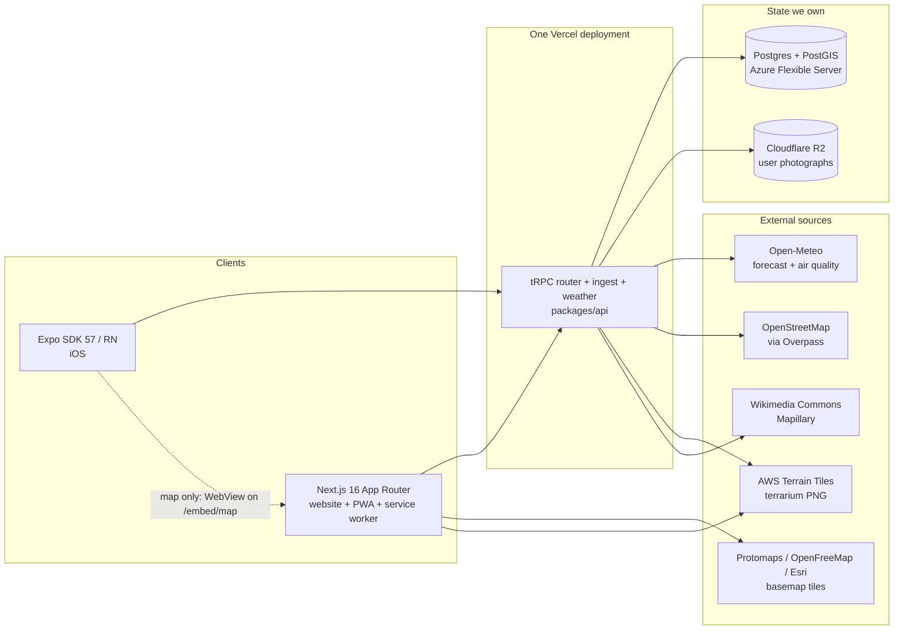


`packages/` holds the shared reasoning: `core` (types, zod schemas, difficulty and unit formulas,
the WebView protocol), `api` (tRPC routers, moderation, mobile token exchange, R2 signing), `db`
(Prisma schema — raw SQL confined to `spatial.ts`, the only file touching PostGIS columns), `geo`
(quadkeys, terrarium, Tobler, corridors, GPX/FIT, routing graph), `ingest` (Overpass, the tile
pipeline, the job queue and its admission control), `weather`, `busyness`, `ui` (one token source
for Tailwind and React Native). All source-only: no build step, no `dist/`.

## Lazy ingest: viewport to trails

The heart of the product. A viewport is covered with z9 quadkeys; tiles already in Postgres and
fresher than 30 days serve immediately, and the rest are queued while the request returns what we hold.

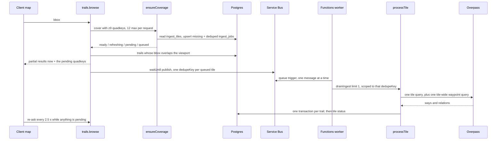

Inside `processTile`, per tile:

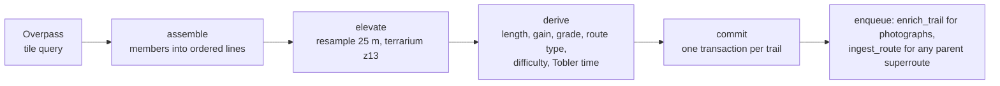

Three properties make this safe to run unattended. Every trail is keyed by `(osmType, osmId)` and
every write is an upsert, so an at-least-once queue is harmless. Each trail commits in its own
transaction and its own `try`, so one broken geometry does not abort the other thirty-nine. And a
tile reaches `ready` only when Overpass answered _and_ every trail it assembled either committed or
was deliberately skipped — a tile that lost one keeps its reason and fails, so the job's retry
ladder runs it again rather than selling `TILE_TTL_MS` of coverage it does not have.

**A failing tile is bounded in both directions, by two different mechanisms.** The re-run unit is a
whole tile, so "retry it" needs a floor and a ceiling. For a tile the viewport queues, `IngestJob`
supplies both: five attempts on a 30 s / 2 m / 10 m / 30 m backoff, then `dead`. `ensureCoverage`
reads that job status rather than the tile row, because `IngestTile.status` reads `failed` both for
a tile thirty seconds from its next attempt and for one that has given up — and reviving a `dead`
job resets `attempts` to zero, so a viewport poll that re-queued it would restart the ladder every
2.5 s and the tile would re-run for as long as one map stayed open. A buried tile is therefore
neither queued nor reported `pending` by anything a request reaches.

**The way back from a burial is a schedule, not a reader.** `reconcileDeadJobs` runs inside
`sweepQueue` on `ingestPump`'s two-minute tick and decides each buried row on what killed it, read
off `lastError`. A failure it can name as transient — the reaper's lease expiry, an Overpass 5xx or
429, a clock that ran out, a database it could not reach — earns one further attempt, after a delay
that lengthens with each revival. Everything else is abandoned: a malformed query, an incomplete
payload, and every message no rule explains, on the position `scripts/requeue-jobs.ts` already
takes, that an error nobody recognises is a reason to stop rather than to retry harder.

The budget is `maxAttempts`, raised by one per revival and capped at `REVIVAL_CEILING`. It has to be
that column rather than `attempts` for the same reason `SPLIT_CHILD_ATTEMPT_CAP` counts in
`IngestTile.attempts`: `enqueue` clears `attempts` on every revival and never writes `maxAttempts`,
so a budget kept in the former restarts. Raising it grants exactly one attempt, because `claimJobs`
increments `attempts` to meet it and `isFinalAttempt` buries the row again if that attempt fails.
An abandoned row is marked by setting `maxAttempts` past the ceiling — an integer rather than the
`lastError` prose beside it, because `lastError` is nullable and a `NOT LIKE` over NULL drops
exactly the unexplained burial the mark exists for. `fetchArea` and `scripts/requeue-jobs.ts` remain
the operator's way back, and are now the second way rather than the only one.

The additions are the two `dead` edges and the `abandoned` mark. `abandoned` is not a sixth
`JobStatus`: it is a `dead` row whose `maxAttempts` has been pushed past `REVIVAL_CEILING`, which
is an integer rather than the `lastError` prose beside it because `lastError` is nullable and a
`NOT LIKE` over NULL drops exactly the unexplained burial the mark exists for.

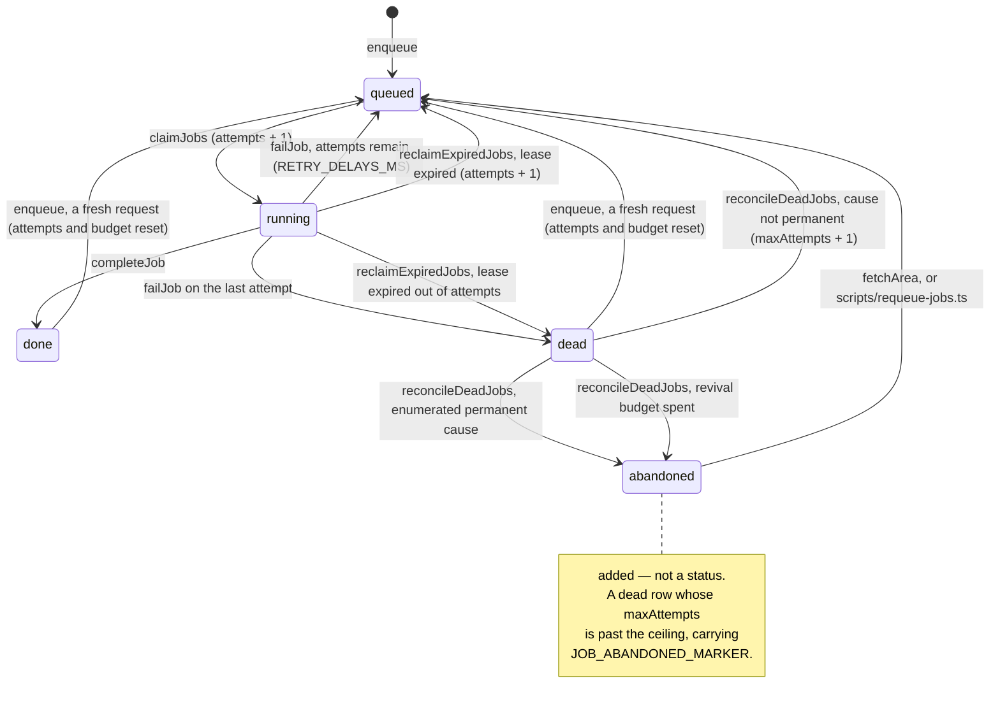

Only `REQUEST_JOB_KINDS` take those three new edges. `revivalBudget` counts outstanding revivals
of request kinds alone — the same population `admitIngest` weighs — so reviving a derived kind
would spend a slot no later pass counts back. A dead `enrich_trail` or `ingest_route` stays buried
and is collected at `FAILED_JOB_TTL_MS`, as it is today.

**A split child is bounded by a second counter, because the job ladder alone does not reach it.**
`queueStaleChildren` revives a `dead` child deliberately — `ensureCoverage` covers z9 alone and
never sees a z10 row — and that revival bypasses the `ensureCoverage` guard above entirely.
`reconcileDeadJobs` does not make a second path out of it: a child already past
`SPLIT_CHILD_ATTEMPT_CAP` is **retired** there rather than granted a second budget, so the two
revival routes do not sum into an unbounded one. Retiring rather than skipping is what closes the
path, and it is also what reports it, at a price worth knowing: `ingestPump` logs one
`JOB_ABANDONED_MARKER` per retired child, and that marker is an arm of the Sev-2
`switchback-ingest-ground-lost` rule, so a fully-capped parent puts four lines in that rule's
window on top of the `SUBTREE_STUCK_MARKER` on its own row. Sixteen of them is sixty-four — which
is the population this triage was written for, so the noise arrives exactly when it is least
welcome. The ladder is therefore not the child's ceiling: each revival resets it.
`SPLIT_CHILD_ATTEMPT_CAP` is, counted in `IngestTile.attempts`, which `processTile` increments per
run and nothing resets.

Past the cap the child is abandoned and the parent is **held** — not promoted, not failed. `rollUp`
needs all four children settled, so a parent short one child keeps whatever it committed and does
not claim the area is complete. `rollUpSplitTile` writes `SUBTREE_STUCK_MARKER` and the abandoned
quadkeys onto the parent's `lastError`, which is what `queueHealth`'s `stuckSubtrees` gauge counts,
and `unsplitTile` is the operator's way back.

Separately, a `failed` tile that committed most of its trails is served from what it holds rather
than reported as still loading — `trailCount`, not the status word, decides whether there is
anything to draw. A split parent writes that count for the same reason: a parent left at zero reads
as holding nothing and lands in the client's polling set until its last child arrives.

**Durability.** `waitUntil` buys latency and nothing else; a deploy or timeout mid-flight loses the
work. So every kick also writes an `IngestJob` row, and the message published alongside it only
names that row. Claims are a visibility timeout, never a transaction held open for minutes, which
would exhaust a serverless pool. Admission control (`ingest/backpressure.ts`) is asked inside
`queueTiles` — the choke point every writing path crosses — rather than at the one button that has a
person behind it.

**Two admissions, in that order: the estate's, then the caller's.** `admitIngest` answers whether
the product can take more work at all; `spendIngestBudget` (`ingest/rate-limit.ts`) answers whether
_this_ caller may have any of it. The ceilings alone were a shared failure domain — one client
panning random cold ground could drive the request queue to `MAX_TILE_QUEUE_DEPTH` and the refusal
that followed was product-wide. The allowance is a token bucket of tiles in `ingest_rate_buckets`,
keyed on the signed-in account or, failing that, on an HMAC of the address Vercel observed; it is a
fifth of the queue ceiling and is _derived_ from it, so re-measuring the ceiling re-tunes the share.
Only new ground is priced, so a reader panning over tiles we already hold never touches it.

**The queue ceiling is a wait, not a job count.** `MAX_TILE_QUEUE_DEPTH` is
`MAX_QUEUE_WAIT_HOURS` × `ESTATE_DRAIN_TILES_PER_HOUR` (`ingest/drain-rate.ts`) — 18 hours at the
28.5 tiles an hour measured on 2026-08-08 — so the promise the ceiling makes is stated in the unit
it is judged in, and one re-measurement retunes the ceiling, the per-caller allowance and the
revival bound together. A count could not be checked against the drain, and the count that stood
here described 21 hours of backlog as one hour.

**Eighteen hours is near a floor, not a preference.** One press of "fetch this area" is
`MAX_AREA_TILES` = 96 tiles, which at a serial drain is 3.4 hours on its own; below
`MAX_AREA_TILES / PRINCIPAL_QUEUE_SHARE` = 480 jobs the per-caller allowance stops being a share of
the ceiling and becomes a clamp above it, so one area fetch would pin the product-wide ceiling.
Shortening the wait meaningfully means shrinking the area fetch first, or draining faster; it is not
reachable from this constant. `packages/ingest/test/backpressure.test.ts` holds that floor.

State lives in Postgres because Vercel runs many instances: an in-process counter would hand each
instance a full allowance and forget it on the next cold start. The spend is one
`INSERT … ON CONFLICT … WHERE`, which makes the check and the decrement the same operation without
holding a lock across the enqueue loop. Refill is a function of the clock and the row's
`refilledAt`, so a spent bucket recovers unaided and a refusal — which writes nothing — cannot hold
one empty. A full bucket and a missing row are the same answer, which is why the daily maintenance
cron can delete settled rows and why `DELETE FROM ingest_rate_buckets` is a safe operator escape.

**Service Bus is the only way a tile is ingested.** A request publishes one `{dedupeKey}` message
per queued tile and makes no Overpass call at all; the Azure Functions worker drains one job per
message. There is no second driver and no flag selecting between them — the Vercel-side drainers
(`/api/cron/drain`, `kickIngest`'s inline pass and `kickNetwork`'s) are deleted, not disabled.

**So there is no rollback switch for ingestion, and that is the operational story.** Nothing can be
flipped to make Vercel drain again; the code is not there to run. What an operator has instead is
three brakes of increasing severity, all on the Function App — and the honest last one is _stop the
Function App_:

| Symptom                                                                    | Do this                                  | Reverse it with                                        | What it costs                                                                                                                      |
| -------------------------------------------------------------------------- | ---------------------------------------- | ------------------------------------------------------ | ---------------------------------------------------------------------------------------------------------------------------------- |
| The queue is filling faster than it drains, or a bad tile is being retried | `INGEST_PUMP_ENABLED=false`              | `INGEST_PUMP_ENABLED=true`                             | new work stops reaching the queue; in-flight messages finish, each idempotent, and a lease the sweep reclaims is still republished |
| Overpass is rate-limiting, or the drain itself is the fault                | `AzureWebJobs.ingestDrain.Disabled=true` | `AzureWebJobs.ingestDrain.Disabled=false`              | nothing drains, but the pump keeps reporting queue health, so there is still a gauge                                               |
| Everything is wrong, or a bad build is running                             | `az functionapp stop`                    | `az functionapp start` — **or any deploy to `master`** | nothing drains and nothing is observed; wake-up signals older than the `PT1H` queue TTL are dropped                                |

**The stop does not survive a deploy, and that is the one an operator has to know.**
`.github/scripts/deploy-worker.sh` reads the host's state and starts it when it is not `Running` —
before it points the app at the new package, because ARM proxies `syncfunctiontriggers` to the
host's own extensions endpoint and a stopped host refuses it. `ci.yml` runs `deploy ingest worker`
on every push to `master`, so merging anything restarts a stopped worker and ingestion resumes.
Stopping the host is a brake against a bad build or a bad hour, not a way to hold ingestion off
across a release.

The first brake narrows the pump to reclaimed leases rather than silencing it. `classifyDisposition`
completes a Service Bus message on the strength of the reaper returning the row to `queued` at
`RECLAIM_PRIORITY` and the pump republishing it, and a completion cannot be taken back — so
suppressing the republish would leave the row correct and unreachable until someone lifted the
brake. Reclaimed work is not new work, and two things bound the band. `reclaimExpiredJobs` is its
only writer and spends an attempt every time it writes, so a tile that reliably kills its handler is
retired rather than republished forever; and `enqueue` resets `priority` when it revives a finished
row, so a request for a tile that was once reclaimed re-enters at its own band and the brake still
holds it.

Where each piece of that hangs off the one timer, and how far the brake reaches:

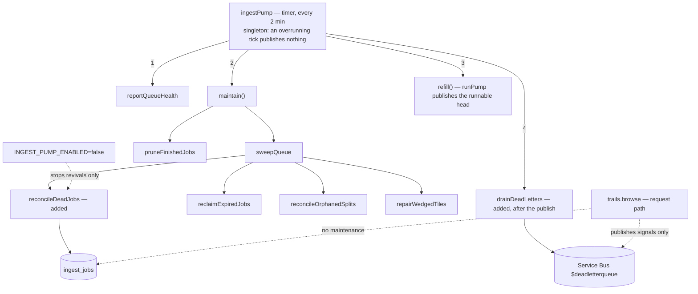

The brake reaches the triage and nothing else in the sweep: reviving is the only part that puts
work back on the queue, which is what an operator stopping new ingest means to stop, while reclaim
and the two repairs have to keep running under a brake because that is when losing them is least
affordable.

The order is load-bearing in both directions. `sweepQueue` runs ahead of the publish because
`classifyDisposition` settles a message on the strength of the reaper returning the row to `queued`
and _this_ tick republishing it. `drainDeadLetters` runs after it because `DEAD_LETTER_WAIT_MS` is a
blocking receive a healthy estate spends in full, the timer is singleton, and nothing in `runPump`
reads the broker's dead-letter sub-queue — in front of the publish it was five seconds of every tick
charged to a viewport tile already queued in Postgres.

None loses a tile. `ingest_jobs` is the record and the pump re-derives the runnable head every two
minutes, so a brake costs the queue its throughput and not its contents — though work queued while
one is pulled joins the tail of its priority band and is reached in that order. Reading trails,
browsing and every other request path are untouched by all three — ingestion is the only thing that
stops.

The commands, and the read-back that proves each landed, are under _Rolling a control back_ below.
A bad _build_ is a different lever from a bad _tile_: see the code rollback there.

`ingest_jobs` stays the queue of record: a message names work, it never carries it, so a lost
message costs a row its position and never the row. A timer pump in the worker re-derives the
runnable head of `ingest_jobs` every two minutes and tops the queue back up, which is what keeps
`priority DESC` meaningful behind a FIFO broker.

**What the pump does not do is reach a particular tile.** It publishes at most
`PUMP_QUEUE_DEPTH - PUMP_DERIVED_SHARE` primary rows a tick, taken from the head of
`priority DESC, "runAfter" ASC`. Every viewport tile carries the same `VIEWPORT_PRIORITY`, so a
freshly queued one is the newest `runAfter` of its band and sorts to the tail — behind the 44,884
due `queued` rows, oldest since 2026-07-30, that `DRAIN_SILENCE_MS` in
`packages/ingest/src/maintenance.ts` records and is sized against. A tile whose doorbell was lost is
therefore reached when the backlog ahead of it drains, not on the next tick. Raising its `priority`
is the one lever that moves it to the head, because `priority DESC` leads both this order and
`claimJobs`.

**A reclaimed lease is the one exception, and the reaper pulls that lever for it.**
`reclaimExpiredJobs` returns an expired lease to `queued` at `RECLAIM_PRIORITY`, above every band
`enqueue` assigns, and `runPump` sweeps before it selects — so the row clears the ordinary backlog
instead of rejoining the tail of its own band. `classifyDisposition` completes a Service Bus
message on the strength of that, which the broker will never undo.

**What the elevation does not buy is the head of the queue.** It is a fixed value, so reclaimed
rows form one band ordered among themselves by `runAfter`, and that band is published at the same
`PUMP_QUEUE_DEPTH - PUMP_DERIVED_SHARE` rows a tick as any other. Recovery therefore costs one tick
while the band fits inside a tick's window and the band's own drain when it does not — never the
five-figure backlog, which is the bound the elevation exists to escape. A fixed value rather than
an increment is also what keeps repeated reclaims idempotent instead of a ladder. A retired row
keeps the priority it had, because the elevation exists to reach a worker and a buried row is not
going to one; `enqueue` resets `priority` when it revives such a row, so the band cannot outlive
the lease that earned it.
`apps/ingest-worker/test/pump.test.ts` runs `runPump` over an ordered backlog and asserts all
three: the elevated row is reached, an unelevated one is not, and an elevated row behind a backlog
of its own band is not either.

**What happens if Service Bus is unreachable.** With no fallback path the failure has to be explicit
rather than silent, so `publishIngestSignals` does not swallow it: the row is already committed to
`ingest_jobs` before any publish is attempted, and the publish failure is logged under
`PUBLISH_FAILED_MARKER`. That marker is written by a Vercel process, which has no Application
Insights, so it is visible in Vercel's logs only — and since the pump's reach is the head of the
queue rather than the affected tile, it is the only place a lost doorbell is named.

**Lease recovery does not depend on a drain happening.** It used to: `reclaimExpiredJobs` ran only
inside `drainJobs`, and a drain was a side effect of traffic on cold ground plus a cron that Hobby
allows to fire once a day. So a cron tick that claimed ten jobs at 04:51 UTC on 2026-08-07, then
died on Vercel's 60 s wall clock still holding them, left ten leases 5.9 h old against the
thirty-minute lease of that regime — four of them at their last attempt, so the next reclaim would
have buried them. Recovery now runs from three places that do not require a drain, two of them on
the pump's two-minute tick: `maintain()` calls `sweepQueue` in `packages/ingest/src/maintenance.ts`,
which is that reclaim plus the split-marker repair below; `runPump` reclaims again before it selects
the head, so a tick publishes with the reclaim already applied rather than one tick behind it; and
`drainSlotGate` calls `reclaimExpiredJobs` inside the transaction that admits a drainer, so a dead
drainer cannot hold the slot shut.

**A parent can claim a subdivision that has nothing behind it.** `splitTile` upserts four child
rows, enqueues four jobs and only then marks the parent, so the marker is the _last_ write and a
process that dies part-way leaves no marker at all — the split cannot produce this state, and
reading it as a crash window sends the next reader hunting for a window that does not exist. What
does produce it is a later deletion of the subtree: production's six marked parents were split,
their stranded z10 rows were cleared afterwards, and no z10 row remains anywhere in the table.
Anything that deletes a subtree must clear its parent's marker in the same pass. Nothing else
repairs the parent — `promoteFrom` needs four children to read, `queueStaleChildren` needs children
to queue, and `processTile` only reaches its roll-up branch when `childTiles` returns four. Six such
rows are in production, marked 2026-08-05 21:03 to 2026-08-06 00:54 UTC.
`reconcileOrphanedSplits` clears the marker and re-queues the parent, writing `status` and
`lastError` and nothing else: `trailCount`, `fetchedAt`, `fetchMs` and every trail the tile ever
produced are untouched, and a parent still serving trails keeps the status it is serving them
under. The predicate is the marker the repair removes, so a second pass finds nothing. The write
order is also what makes the repair safe beside a live split: a split that has written the marker
has already written its four children, so `childTiles` returns four and the parent is left alone.

The six do not all get the same number of tries. `enqueue` resets `attempts` and `priority` only
for a job in `done`, `failed` or `dead`, so a parent whose job is already `queued` keeps its ladder
— measured
on 2026-08-07, `ingest_tile:120221231` re-enters at 4 of 5 and has one attempt left, while
`ingest_tile:120230212` was `done` and starts again at 0. Preserving the ladder is the intent; the
consequence is that the densest of the six can reach `dead`, which `queueHealth` counts and the
distress rule reports.

**Stopping it.** There is no driver flag and no second path, so "roll back the cutover" is not a
thing that can be done — there is nowhere to roll back _to_. What exists instead is three brakes,
and the right one depends on what has gone wrong. None needs a deploy to _pull_. The third is
undone by one: `deploy-worker.sh` starts a host it finds stopped, ahead of everything it writes to
the app, and `deploy ingest worker` runs on every push to `master`, so a merge restarts a stopped
worker whether or not that was the intent.

```bash
RG=rg-switchback-prod-northcentralus
APP=func-switchback-ingest-37ywppu5p7fri

# The queue is filling faster than it drains, or a bad tile is being retried.
# Stops new work reaching the queue. In-flight messages finish; each is idempotent. A lease the
# sweep reclaims is still republished, because the drain already completed its message.
az functionapp config appsettings set -g "$RG" -n "$APP" --settings INGEST_PUMP_ENABLED=false -o none

# Overpass is rate-limiting, or the drain itself is the fault.
# Stops the drain and leaves the pump's health reporting running, so the queue still has a gauge.
az functionapp config appsettings set -g "$RG" -n "$APP" \
  --settings AzureWebJobs.ingestDrain.Disabled=true -o none

# Everything is wrong. Nothing drains and nothing is observed. This one is undone by the next
# merge to master as well as by the command below: `deploy ingest worker` starts a stopped host
# before it publishes anything to it.
az functionapp stop -g "$RG" -n "$APP"

# And back. Messages that expired against the PT1H TTL while it was down are gone; their
# `ingest_jobs` rows are not, and the pump republishes from the head of the queue on its next tick.
az functionapp start -g "$RG" -n "$APP"
az functionapp show -g "$RG" -n "$APP" --query state -o tsv   # expect: Running
```

Verify by reading the setting back, not by assuming the write took:

```bash
az functionapp config appsettings list -g "$RG" -n "$APP" \
  --query "[?name=='INGEST_PUMP_ENABLED'].value | [0]" -o tsv
```

**A stop longer than an hour loses wake-up signals, not work.** Queue TTL is `PT1H`. The
`ingest_jobs` rows outlive any message, and the pump republishes the runnable head every two minutes
once it is back — so what a long stop costs is one pump tick at the head of the queue and a place in
line for everything queued while it was down.

**Rolling the code back is a separate lever, and it is a script rather than a setting.**
`WEBSITE_RUN_FROM_PACKAGE` names the zip the host runs, and the release container keeps prior builds
under their commit SHA — but changing it by hand is not enough. After the package changes, the scale
controller still holds the old trigger set: the host comes back reporting `0 functions loaded`, `az
functionapp function list` returns nothing, and a restart does not clear it, because a Consumption
app with no registered triggers has nothing to scale on. `.github/scripts/deploy-worker.sh` POSTs
`syncfunctiontriggers` for exactly that reason, then re-reads the setting and waits for a
`switchback-ingest-queue-health build=<sha>` heartbeat before reporting success.

So: **re-run `deploy-worker.sh` against the previous SHA.** By hand it is the same two calls, in this
order — `appsettings set` is read-modify-write on the one key, so it does not disturb the rest of the
collection:

```bash
az functionapp config appsettings set -g "$RG" -n "$APP" -o none \
  --settings "WEBSITE_RUN_FROM_PACKAGE=https://<storage>.blob.core.windows.net/function-releases/<sha>-<ts>.zip"
az rest --method POST -o none --url \
  "https://management.azure.com/subscriptions/$(az account show --query id -o tsv)/resourceGroups/${RG}/providers/Microsoft.Web/sites/${APP}/syncfunctiontriggers?api-version=2023-12-01"
```

Confirm the build that came up rather than the URL that went in: `BUILD_COMMIT` is stamped into the
bundle, so the heartbeat names the package that actually mounted.

**Do not restart within ten minutes of stopping.** The queue carries
`duplicateDetectionHistoryTimeWindow: PT10M` and the pump republishes the same `dedupeKey` as
`messageId`. Signals published before the stop are still remembered by the broker, so a restart
inside that window has the republished ones silently discarded — the rows are safe and the next
tick picks them up, but the first tick does nothing and looks like a broken worker. Wait the window
out, or expect one dead tick.

**The publisher holds no credential.** Vercel signs a short-lived OIDC token per deployment and puts
it on every function request as `x-vercel-oidc-token`; `publishIngestSignals` posts that to Entra as
a `client_assertion` and gets back an access token for Service Bus. What makes Entra accept it is a
federated identity credential on a user-assigned managed identity, declared in `ingest.bicep`,
pinned to issuer `https://oidc.vercel.com/<team>` and subject
`owner:<team>:project:<project>:environment:production` — a second credential covers `preview`,
because Entra matches those fields exactly and allows no wildcard. The namespace has
`disableLocalAuth: true`, so no SAS key would work even if one existed. The three variables Vercel
holds — namespace host, tenant id, client id — are identifiers, not secrets.

The access token is cached in module scope, so a warm lambda pays one exchange rather than one per
request and a cold one pays a single extra round trip before the send. When the exchange fails the
publisher logs and returns a failure count; it never throws. That is deliberate and load-bearing:
the `ingest_jobs` rows were written before the publish, so an Entra or Service Bus incident costs the
wake-up and leaves the rows queued for the pump to reach in its own order. A broker outage must not
empty the map, and it cannot.

**Two concurrent Overpass requests, fleet-wide, and `packages/ingest/src/drain-slot.ts` is what
makes that true.** This paragraph is the one statement of the bound; everything else that quotes a
number points here.

Overpass allots slots per client IP and exceeding the allowance gets the IP blocked, which takes
ingest down for the product rather than for one job. So the bound is a correctness requirement, and
it is the product of two factors:

| Factor                                 | Value | Enforced by                                                            |
| -------------------------------------- | ----- | ---------------------------------------------------------------------- |
| Processes holding Overpass-making work | 1     | `INGEST_MAX_DRAINERS`, via a Postgres advisory lock in `drainSlotGate` |
| Requests in flight per process         | 2     | `OVERPASS_MAX_CONCURRENT`, inside one module-level `OverpassClient`    |
| **Concurrent Overpass requests**       | **2** |                                                                        |

The second factor alone was the whole argument until now, and it bounds a _process_. On the Function
App that is the fleet — `functionAppScaleLimit: 1` and
`WEBSITE_MAX_DYNAMIC_APPLICATION_SCALE_OUT: 1` give one host instance,
`FUNCTIONS_WORKER_PROCESS_COUNT: 1` one Node process, and `getOverpass()` one client inside it, all
declared in `infra/azure/ingest.bicep`. On Vercel it is one lambda. The platform starts as many
lambdas as the traffic asks for, each with its own module scope and its own client, and they share
one egress IP — so a per-process singleton bounded a fraction of the drainer and nothing bounded the
fleet. `packages/ingest/src/config.ts` had said as much since it was written: _two clients at
`maxConcurrent: 2` are one client at 4_.

**The Function App is the drainer that runs, and the only one.** The Vercel drain paths are deleted,
so the Azure clamp above bounds the process that actually performs Overpass work. The first factor
is what holds that bound across host instances, because the clamp alone does not: around a
Consumption instance replacement two hosts are briefly alive at once, each with its own client.

The first factor is enforced where it has to be — across processes, in the database.
`drainSlotGate` takes `pg_advisory_xact_lock`, reclaims expired leases, counts
`count(distinct "lockedBy")` over `running` jobs, and claims, all in one transaction. Check and
claim cannot be two statements: under `READ COMMITTED` two lambdas both read "nobody is draining"
before either commits. Each caller's `workerId` is unique to its process, because a fleet sharing
the string `inline` counts as one drainer however many lambdas are running.

**`lockedBy` proves the bound only while a job is mid-drain, which is almost never observable.**
Every exit from `running` used to null it — a released lease must stop matching, or a stale
worker's write could overwrite a live one's — so a finished job named no process at all, and eight
samples over 70 s of production caught zero running rows. `writeOutcome` now fences on `status` as
well as `(lockedBy, lockedAt)`, so the status change alone releases the lease and the pair can
stay. No column was added: `lockedAt` and `completedAt` bound one drain and `lockedBy` names it,
which is more than a "which process" column could have given, because concurrency is a question
about overlapping intervals rather than about distinct names.

```sql
-- Peak concurrent drains in the last hour. Must not exceed INGEST_MAX_DRAINERS.
-- A sweep line over lease start and end, not a distinct count of names: two strictly serial cron
-- invocations use two ids and are not two drainers.
select max(concurrent) as peak from (
  select sum(delta) over (order by at, delta desc) as concurrent
    from (select "lockedAt" as at,  1 as delta from ingest_jobs
           where "completedAt" >= now() - interval '1 hour' and "lockedAt" is not null
          union all
          select "completedAt" as at, -1      from ingest_jobs
           where "completedAt" >= now() - interval '1 hour' and "lockedAt" is not null) edges
) swept;

-- Which processes, and how much each ran.
select "lockedBy", count(*), min("lockedAt"), max("completedAt") from ingest_jobs
 where "completedAt" >= now() - interval '1 day' group by 1 order by 2 desc;
```

`lockedBy` carries no index and `lockedAt` carries the one the lease sweep needs. The table is
45,225 rows, these are forensic queries rather than a hot path, and a second index would cost a
write on every job outcome to save a sequential scan nobody runs in a request.

**The gate is `drainIngest`'s default, not a call site's to remember.** Two entry points on Vercel
reach the queue — `trails.ts:394` for viewport tiles and `routes.ts:119` for the route planner's
network tiles — and both publish a signal rather than drain; the maintenance cron is not a third,
because it touches the auth tables and R2 and never the ingest queue. `drainIngest` supplies
`drainSlotGate` unless the caller passes `gate: null`, and `packages/ingest/test/drain-slot.test.ts`
holds that: a caller that asks for no gate is still refused while another process holds the slot.

No process opts out. `gate: null` appears at exactly one place in the tree — that test — and both
production callers, `apps/ingest-worker/src/drain.ts:211` and `scripts/ingest.ts:56`, take the
default. The worker used to opt out on the argument that `functionAppScaleLimit=1` made it the whole
fleet; that argument holds only while exactly one host is running, and across a Consumption instance
replacement two overlap. An operator draining from a laptop counts against the same slot, which is
conservative rather than exact, since that run leaves from a different egress IP.

The cost is honest and deliberate: a drainer that dies holding claims keeps the slot shut until its
lease expires. That is why the gate sweeps inside its own transaction, and why `sweepQueue` runs off
request traffic as well — `LEASE_TIMEOUT_MS`, not a day. Throughput is the thing traded, and an IP
block is the thing bought off.

The queue sets `requiresSession: false` so session count is not a third multiplier. Around a
Consumption instance replacement two host instances of the worker are briefly alive at once, so the
worker's own contribution can reach 4 for the seconds of a recycle — measured, and recorded under
the clamp section of `infra/azure/ingest.bicep`.

**"Vercel fetches nothing" is now a property of the deployment.** It used to be a statement about a
per-environment driver flag: Production and Preview held it independently, both pointed
at the production database, and an environment left on `postgres` — or with the variable simply
absent, which resolved to `postgres` — was a second drainer against the same `ingest_jobs` with its
own `OverpassClient` on every warm lambda. Measured at 2026-08-03T23:26Z, Production read `postgres`
and Preview carried no such variable at all.

None of that is reachable now. The three call sites that could reach Overpass from a Vercel process
are gone from the bundle, so there is no value of any environment variable that turns one back on.
The residue is branches cut before the deletion: their code still contains the inline drainers, so a
preview built from one drains unbounded until it rebases onto master.

**The client's retry budget has to fit inside `functionTimeout` — and fitting it is not enough.**
Consumption ends an invocation at ten minutes and will not raise it; `OverpassClient`'s own worst
case on the defaults is six attempts of 190 s plus backoff — about 24 minutes for one query, and
`processTile` makes several. That is not theoretical: `ingest_tile:120221221` ran 600008 ms on
2026-08-03 and the host killed the worker mid-tile. Two numbers bound the Overpass part of it.
`OVERPASS_MAX_TOTAL_MS` (190 s), set in `ingest.bicep`, is the most one query may spend across every
retry; the last moment the worker will _start_ a query is derived rather than set, as
`INGEST_DEADLINE_MS - OVERPASS_MAX_TOTAL_MS - INGEST_COMMIT_RESERVE_MS` — 200 s — so the budgets
cannot fail to add up. Past that moment the Overpass view throws, `drainJobs`
catches it per job, writes `lastError` and releases the lease, which is a far cheaper failure than
the host killing the process. And the pump calls `reclaimExpiredJobs` on its two-minute tick, so a
lease that _is_ stranded comes back in minutes.

**540 s bounds Overpass. `INGEST_DEADLINE_MS` bounds the invocation, and it had to.** Overpass was
never the handler's only wall clock. `TerrainSource` fetched a terrarium tile per DEM sample with a
bare `fetch` — no signal, no per-request timeout, no budget — and the per-trail writes are their own
time; neither was inside the 540 s. Measured on 2026-08-03 with the flag on, five tiles through the
worker: 021212220 at 205 s, 031313102 at 415 s, 031313120 at 491 s — then 120221230 and 120221203,
both dense alpine tiles, killed at 612,947 ms and 615,938 ms. The same window has
`[HostMonitor] Host CPU threshold exceeded (99 >= 80)` repeating from 22:24 to 23:04 and
`ingestPump` ticks of 19,901 ms and 57,939 ms in the same process, so a saturated single instance
with the timer contending against the queue trigger is a second, independent term — and one
`maxConcurrentCalls: 1` does not cover, because the pump is not a queue message.

**The saturation is not confined to that window, and it tracks the commit rather than the fetch.**
Over the 24 hours to 2026-08-09T09:08Z the host wrote `Host CPU threshold exceeded` in 130 distinct
minutes; 47 of those also carried a `prisma.trail.upsert` trace and 12 carried an Overpass one,
against 50 minutes carrying any Overpass trace at all. That is a coincidence count rather than a
mechanism — traces are sampled, and those upsert lines are `slug` collisions rather than healthy
writes, so both figures undercount — but what pins a Consumption instance is the tile committing its
thousand-odd trails, not the query that fetched them. Read it as a capacity fact: more Overpass
window buys nothing here, and relief is a plan tier or a smaller commit.

So there is now one wall clock rather than one per subsystem: `INGEST_DEADLINE_MS` (540 s) is passed
to every phase as `PipelineDeps.deadlineAt`. Past it terrain refuses to start a fetch, the commit
loop refuses to start a trail, and `processTile` marks the tile `failed` and throws — the same
cheap, caught, lease-releasing failure the Overpass deadline already produced, 60 s before the host
would kill the process. Each terrarium request also carries its own 20 s `AbortSignal.timeout`,
because Node's `fetch` imposes none and a stalled socket is how you reach 615,938 ms without any
phase ever _starting_ late.

**And it now alerts — on the job, which is where the failure actually lands.** A killed invocation
does not dead-letter: the redelivery finds the row still under the killed invocation's lease and
`classifyDisposition` reads that as `rescheduled`, because the pump is what re-runs it, so the
message is completed in ~165 ms, `DeliveryCount` never reaches 2, and
`switchback-ingest-deadletter` — which fires on `DeadletteredMessages` — structurally cannot see it.
`deadLetterMessageCount` was 0 for the whole run while this happened twice. The one delivery that
does _not_ complete is the one whose row is past `LEASE_TIMEOUT_MS` or has no `lockedAt` at all:
that means the reaper itself has stopped, so `assertSettleable` throws and
`switchback-ingest-signal-stranded` says so.

Reading `requests | where success == false` alone is blind to the failure mode these rules exist
for. `drainJobs` catches every handler error, writes it to the job row and returns normally, so the
2026-08-04 run was 14/14 successful
invocations while six Alps tiles were failing — the failure existed only as six `traces` lines.
`switchback-ingest-drain-degraded` unions the request arm with a `traces` arm keyed on the literal
`ingest-job-failed` that `runIngestSignal` logs beside every job-level failure. Matching a token
rather than a sentence is deliberate, and `apps/ingest-worker/test/drain.test.ts` asserts the code
and the template still agree on it. Severity 3, onto the same action group, `autoMitigate: true` —
each arm names a repair that runs unaided, so what deserves a look is a sustained rate, and a drain
that recovers clears the alert instead of leaving it open for a person to close.

**Every arm of that rule reads telemetry the Function App emits, and the Function App is now the
drainer.** That was not always true: while the drain ran on Vercel, which has no Application
Insights, a split marker, a stuck-subtree marker and a 429 from a mirror all reached a console no
rule could query, and "no 429s observed" was a statement about what could be seen rather than about
what happened. With the Vercel path deleted, every signal the drain produces is emitted by a process
inside this Application Insights resource.

Two of those signals needed arms of their own. A handler the host kills at `functionTimeout` writes
no request row, so `switchback-ingest-lease-expired` — logged by `reclaimExpiredJobs`, the process
that actually discovers the dead lease — is what the rule matches on instead. And a 429 that
failover absorbs never reaches a job row, so `switchback-ingest-overpass-limited` reads the request
path directly rather than relying on the `rateLimited` gauge below.

What covers the rest is `switchback-ingest-queue-distress`. Six of those conditions are a row —
a job buried inside the last hour, a lease past `LEASE_TIMEOUT_MS`, a `lastError` naming a 429, a
tile carrying a split marker with no children, a subtree marked stuck, a tile left mid-fetch that no
job can finish — and two are the absence of one: `stalledDrain` for due work with no terminal
transition, and `photoSeedBlackout` for a window of `enrich_trail` jobs that all finished without a
photograph landing. `ingestPump` runs inside
the alert's own subscription every two minutes and already reads that database.
`apps/ingest-worker/src/health.ts`
counts them and logs the token when any is non-zero, ahead of the pump's `INGEST_PUMP_ENABLED`
brake, because a queue somebody has deliberately stopped feeding is exactly when its depth still
needs watching.
`apps/ingest-worker/test/health.test.ts` asserts the token, the query and that ordering. Severity 3
and `autoMitigate: true`: this is a gauge re-read every two minutes, so a queue that has been
repaired should clear it rather than leave a resolved condition open.

**The sixth condition is the absence of one.** A drain that has stopped writes no error, takes no
lease and marks no tile: jobs simply stay `queued`, which is what they do while a healthy drain
works through a backlog. All five row-shaped fields read zero and the pump keeps heartbeating, so a
`/api/cron/drain` returning 500, a cron entry dropped from `apps/web/vercel.json` or a bad deploy
would have presented as "tiles are slow" indefinitely — the same shape as a worker that had stopped
doing its job while looking identical to one doing it. `stalledDrain` is the field that names it:
1 when work is due _and_ nothing has reached a terminal state inside `DRAIN_SILENCE_MS`.

**A gauge that cannot reach zero is not a gauge, and three fields could not have been.** `failJob`
buries a
job as `dead` rather than deleting it and `pruneFinishedJobs` keeps that row for thirty days, so an
unwindowed count sits at production's twenty-five for a month and a new 429 — the signal the rule
exists to raise — changes nothing an operator can see. `DISTRESS_WINDOW_MS` bounds `dead` and
`rateLimited` to the last hour, longer than the rule's fifteen-minute window so nothing falls
between evaluations, and `orphanedSplits` counts parents whose children are actually absent rather
than every parent carrying a marker — a legitimate subdivision holds its marker for as long as its
four children take, and counting those would report dozens of wedged tiles on a healthy system.
`stalledDrain` is the third, and the trap there is subtler: the obvious implementation counts due
work, and `ingest_jobs` holds 44,884 `queued` rows overdue since 2026-07-30, which is a light left
on rather than a gauge. Silence is the signal instead. `DRAIN_SILENCE_MS` is 6 h — roughly forty
tiles at the nine-minute handler bound, so a drain that is merely slow clears it while one that has
stopped is named the same working day. The 27.90 h widest gap measured over the fortnight to
2026-08-08 belongs to the old regime, where the only scheduled drain was a once-a-day cron; that
cron is gone, `ingestPump` runs every two minutes and the queue trigger drains continuously, so a
day and a half of silence is no longer a quiet weekend. The number is due a re-measurement once the
continuous regime has a fortnight of history.

Measured read-only against production on 2026-08-07 17:50 UTC, every field reads zero:
`dead` 0 windowed against 25 unwindowed, `staleLeases` 0, `rateLimited` 0, and no `ingest_tiles` row
carries a split marker or a stuck-subtree marker. The gauge is clear and can fire on the next real 429.

**The code that arms these rules is deployed; three of the rules themselves are not yet.** Read on
2026-08-10T19:20Z, `az monitor scheduled-query list -g rg-switchback-prod-northcentralus` returns
`switchback-ingest-drain-failed`, `switchback-ingest-queue-distress`,
`switchback-ingest-worker-silent`, `switchback-ingest-overpass-limited`,
`switchback-ingest-overpass-skipped` and `switchback-db-token-alarm`. `ground-lost`,
`drain-degraded` and `pump-failing` are declared in `infra/azure/ingest.bicep` and arrive with the
next deployment of it, which also leaves `drain-failed` running until it is deleted by hand. That
deletion is not a one-liner — the resource-group lock refuses a delete at any scope inside the
group, so it has to be lifted and re-PUT around it, and `infra/azure/README.md` carries the three
steps. The Function App runs a bundle published by
`.github/scripts/deploy-worker.sh`, which is the file `ci.yml`'s `deploy ingest worker` job will
invoke on every push to master — and which refuses to report success until the running host emits a
heartbeat naming the commit it just pushed.

**The distress rule alone would still read a dead worker as a healthy estate**, because its whole
firing condition is a log line and a host that is down or serving an old bundle produces none.
`switchback-ingest-worker-silent` is the answer: `reportQueueHealth` logs
`switchback-ingest-queue-health` on _every_ reading, so fifteen lines per thirty-minute window is
the resting state and zero is alertable. That rule is the only one in this file whose firing
condition a stale build cannot suppress.

**Overpass strain reaches Application Insights, and an alert reads the part that matters.**
`packages/ingest/src/overpass.ts` emits `switchback-ingest-overpass-strain` on a retried 429, a
transport failure, a mirror failover and every breaker transition. The drain runs in the Function
App, so those lines land as `traces` — which is what makes
`switchback-ingest-overpass-limited` possible: it matches `status=429` on that token directly.

That rule exists because the older gauge is narrower than its name suggests. `queueHealth`'s
`rateLimited` counts `ingest_jobs.lastError` containing '429', so it only sees a rate limit that
outlived the retry budget and failed a job; failover absorbs most of them first, and an absorbed
429 touches no job row. Measured on 2026-08-08, the distress line reported `rateLimited=0` on every
tick while five real 429s landed between 16:37:28 and 18:24:51 UTC. Etiquette is a correctness
requirement here — the failure mode is an IP block that takes the product down — so the signal is
read where it actually arrives rather than where it happens to be convenient.

Retrieving them, which no rule can do for you:

```bash
vercel logs switchback-three.vercel.app --follow | grep switchback-ingest-overpass-strain
```

`--follow` is the flag that streams _runtime_ output; without it the command lists request lines
rather than what the handler printed. It is a live tail, so it answers "is a mirror refusing us
right now" and nothing about last week — a durable record would need a Vercel log drain, which is
not configured. Until it is, the part of this signal that survives is the `lastError` on a job that
exhausted its retries, which is what `queueHealth`'s `rateLimited` counts and
`switchback-ingest-queue-distress` alerts on.

**What the deadline does not do is make a dense tile ingestable, and the second flag-on run says so
plainly.** 2026-08-04T00:14Z-01:23Z, ten `ingestDrain` invocations, none killed — the longest was
543,653.9 ms against a 600,000 ms `functionTimeout`, where the previous run's longest was
615,938 ms and `FAILED`. Five of the ten were alpine z9 tiles (`120221203`, `120221212`,
`120221213`, `120221223`, `120213322`); every one of them spent its whole 540 s and ended on
`IngestDeadlineError`, written to `lastError`, lease released, retry scheduled off the backoff
ladder — and one job reached the end of that ladder and was `retired`. Two tiles finished:
`120221232` at 448,188.0 ms and `031313103` at 347,561.9 ms. The Consumption instance was over its
CPU threshold for the entire window (75 `[HostMonitor] Host CPU threshold exceeded` lines,
00:17:37Z to 01:22:19Z) with `ingestPump` ticks up to 30,941 ms in the same process, so the drain
was never running alone.

So the honest statement is: a z9 tile in dense alpine terrain does not fit in one Consumption
invocation, and no bound on the handler can change that — the bound only decides whether the
failure is clean and visible or a silent ten-minute kill loop.

### What the commit phase was actually spending its clock on

Almost all of it went on two scans that had nothing to do with the database. `attachWaypoints` and
`terminusFeatures` each looped every feature the tile-wide waypoint query returned, once per trail,
and `attachWaypoints` called `nearestPointOnLine` on each — a full segment walk. The tile cost
`O(trails × features × vertices)`, and the two densities the fixtures hold are 55× apart in feature
count:

| tile        | features | trails | ms per trail | whole tile |
| ----------- | -------- | ------ | ------------ | ---------- |
| `021231030` | 556      | 144    | 11.75        | 1.7 s      |
| `023010230` | 30,838   | 1,518  | 349.45       | 530.5 s    |

530.5 s of single-core arithmetic, inside a 540 s budget that also has to pay for Overpass and
elevation. That is the shape of the alpine failures above, and it is not I/O: Postgres sat at 8–12%
CPU and consumed no burst credits through the whole window.

`buildFeatureIndex` puts a uniform grid over the tile's features once, after the feature query, and
each trail sweeps only the cells its own segments pass through, grown by the widest buffer any
consumer applies. The same tiles then cost 0.193 and 0.509 ms per trail — 0.77 s for the dense one
against 530.5 s, on a 16.4 ms build holding 2.5 MiB. Both tiles attach exactly what they attached
before: 146 waypoints over all 144 trails of the sparse tile, 14,881 over all 1,518 of the dense one.

**The index decides nothing; it only decides what to look at.** `near` returns a _subset of the
tile's own feature array, in the tile's own order_, and `attachWaypoints` and `terminusFeatures` then
run exactly as before. That is what makes the output byte-identical rather than approximately equal:
the buffer test, the dedupe key that keeps whichever duplicate it sees first, and the stable sort all
see the same sequence they would have seen unindexed. A wider sweep than necessary costs a few
candidates and cannot change an answer; a narrower one loses waypoints silently, which is why the
swept box is derived from what `nearestPointOnSegment` can answer rather than from a cell count.

**A PostGIS spatial join was implemented and measured against it, and lost on the numbers.** Both
forms are byte-identical to the baseline over both whole tiles, so accuracy did not decide it. The
whole of `023010230`, build counted apart from the queries it serves:

| candidate                | build   | ms per trail | tile total |
| ------------------------ | ------- | ------------ | ---------- |
| unindexed baseline       | —       | 349.454      | 530.5 s    |
| in-memory grid           | 16.4 ms | 0.509        | 0.79 s     |
| PostGIS, one query/trail | 362 ms  | 2.228        | 3.74 s     |
| PostGIS, one bulk join   | 868 ms  | 0.332        | 1.37 s     |

The features are not table rows — they are an Overpass response held in memory — so either PostGIS
form has to upload 30,838 points per tile before it can answer anything, and that upload is most of
its cost. The bulk join is the only form that beats the grid per query, and it cannot be used here:
it needs every trail's line before the first commit, and the line `attemptCommit` asks about is
`resolved.coords` — the union `resolveIdentity` computes against rows other tiles wrote, per trail,
inside the loop, under a claim that can be lost and retried. A join keyed on the assembled geometry
would silently miss features beside the merged extension of any seam-crossing trail. It also needs a
session held for the tile's whole life, because the staging table is temporary and the commit loop's
pool hands out a different connection each time. Both candidates are kept and exercised against the
same fixtures in `packages/ingest/test/enrich-association.test.ts`; the grid is what ships.

### Subdivision: a tile that will not fit is replaced by its four children

A quadkey is a prefix code, so the four z10 tiles covering `120221203` are that string with `0`,
`1`, `2` and `3` appended, and `IngestTile` already stores `z`/`x`/`y` per row. Splitting therefore
needs no schema change and no new geometry — `childQuadkeys` in `packages/geo/src/tiles.ts` is the
whole of the maths.

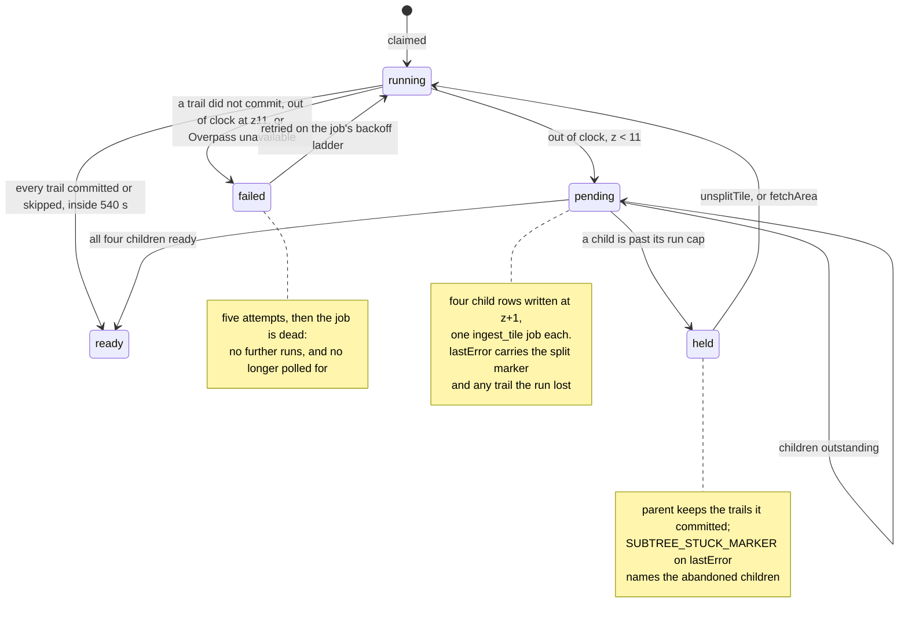

`held` is a state of the subtree, not a `TileStatus`: the parent row stays `pending` or keeps the
status it was serving, and what distinguishes it is the marker on `lastError` plus four children
that will never all settle on their own.

**Out of clock has two shapes and both split.** The commit loop can exhaust `deadlineAt`, which is
the failure the 2026-08-04 run measured; and the tile's own Overpass query can exhaust the Overpass
budget, in which case `processTile` never reaches the commit loop at all. Both mean the same thing —
this box cannot be served in one invocation — so both subdivide. Every other Overpass failure is
kept apart deliberately: a breaker that is open, a mirror answering 504 and a malformed query all
mean come back later, and subdividing on those would quadruple the load on a service already
refusing.

**Split on failure, not up front.** Pre-sizing every tile with an Overpass `out count` costs one
query per tile forever — measured at 3.2 s and one request for `120221203` — to save a wasted run on
the small minority that are dense. Deadline exhaustion is free and it is the exact signal: the tile
that could not be finished is the tile that has to be split. What a post-hoc split costs is one
ten-minute invocation per dense tile per TTL, and not even that is wasted, because every trail the
run committed before the clock ran out is already in `trails` and the children only re-upsert it.

**Splitting is a status, not a flag.** `splitTile` writes the four child rows, enqueues one
`ingest_tile` job each at viewport priority, and leaves the parent out of `readyTiles` while the
children run — `pending` for a parent with nothing to serve, and its existing `ready`/`empty` and
`fetchedAt` for one that was already serving trails, for the reason given four paragraphs down. What
it never writes is `failed`, because a split is no longer a failure. Admission control is
deliberately not consulted: this is ground already admitted and already paid for, and a refusal here
would strand a parent with no children and no route to ready.

**A parent is ready only when every descendant is.** `rollUp` takes the four child rows and returns
the parent's row or null; it returns null unless all four exist and all four are `ready` or `empty`.
`fetchedAt` is the _oldest_ child's, so the parent leaves the TTL when its stalest quarter does —
taking the freshest would let one child refreshed yesterday hold three stale ones out of the refresh
sweep for another month. `trailCount` sums. A parent whose children are all `empty` is `empty`; one
child with trails in it makes the parent `ready`, because that is a place worth re-querying.

**Nothing in `coverage.ts` changed, and that is the design.** `ensureCoverage` still covers a
viewport with z9 quadkeys and still reads the z9 row, so `readyTiles`, `pendingTiles` and the TTL
all keep working with no knowledge of the split — precisely because the roll-up writes the answer
onto the z9 row. A parent being ingested for the first time reads `pending` while children are
outstanding, the client keeps polling, and the trails the finished children committed are already on
the map: `browse` selects by bounding box, not by tile status, so three-quarters done looks like
three-quarters of the map.

**A parent that was already serving trails keeps serving them.** `splitTile` preserves a
`ready`/`empty` status and its `fetchedAt` instead of writing `pending`. `ensureCoverage` classifies
a settled-but-stale tile as ready-and-refreshing and everything else as pending, so demoting a tile
that split on a TTL refresh would flip a reader from "here are your trails" back to "still loading"
for however long four children sit in the drain queue — which is not a length anybody is watching.
A parent with no `fetchedAt` has nothing to serve and still reads `pending`.

**That status is passed in, not read back, and the difference was a live bug.** `processTile` writes
`running` to the parent before it fetches, so a `splitTile` that re-read the row saw `running` for
every caller, decided the parent had never served anything, and wrote `pending` — on every
production path. It passed its unit test because the test called `splitTile` directly with a
hand-built `ready` row that `processTile` cannot produce. `previous` is now a required parameter and
`packages/ingest/test/pipeline.test.ts` proves the behaviour through `processTile` against a fake
that stores rows rather than replaying a fixed answer.

Because coverage is unchanged, a viewport over split ground keeps queueing the z9 parent. That path
is cheap and useful rather than wasteful: `processTile` sees four child rows, makes no Overpass call
at all, re-queues any child that is not fresh, and promotes the parent if it can. It is also how a
split tile refreshes — the parent goes stale when its oldest child does, `ensureCoverage` queues the
parent, and the parent re-queues exactly the stale children.

**Whether to re-queue a child is a question about its job, not about its tile.** `IngestTile.status`
reads `failed` both for a child thirty seconds from its next attempt and for one that has given up,
and `enqueue` clears `attempts` — so deciding on the tile row resets the backoff ladder of a child
that was already coming back, on every viewport poll, which is how a rate-limited tile becomes one
we hammer once per render. `failJob` writes the _job_ `queued` with a future `runAfter` while
attempts remain and `dead` only when they are gone, and that is what `queueStaleChildren` reads: a
`queued` or `running` child is left alone, anything else is enqueued.

**A `dead` child is revived, because nothing else can revive it.** `splitTile` enqueues each child
exactly once, `ensureCoverage` covers z9 alone (`coverBBox(bbox, INGEST_ZOOM)`), `JobKind.refresh_tile`
has no producer, and `reclaimExpiredJobs` does not touch a dead row. Skipping dead children — which
an earlier revision of this section described as deliberate — left a subtree that could never finish
and a z9 ancestor permanently `pending`, with no documented manual recovery. Reviving from the
parent's drain restores exactly the recovery a z9 tile had before subdivision, where a viewport poll
revived a dead job through `ensureCoverage`, and it is bounded the same way: the revived child gets a
five-attempt ladder, and while it is `queued` the next drain leaves it alone.

**Five failed attempts is still worth a human, and it is reported once.** `queueStaleChildren`
returns the revived-from-dead children as `exhausted`; `rollUpSplitTile` writes them to the parent's
`lastError` and logs `switchback-ingest-subtree-stuck` — but only when that message differs from what
the row already says. Edge-triggering is load-bearing rather than tidy: a blocked parent is `pending`,
so `ensureCoverage` re-queues it on every viewport poll and `explore.tsx` polls _because_ it is
pending, and `switchback-ingest-ground-lost` fires on one event in fifteen minutes. A line per drain
would page every quarter of an hour for as long as anyone left that map open, on the same rule as the
genuine failure signal — which trains an operator to ignore the signal the rule exists to carry.
`promoteFrom` nulls `lastError` when the roll-up lands, so the edge re-arms itself.

**The floor is a parameter and it fails honestly at the bottom.** `INGEST_SUBDIVIDE_MAX_ZOOM` is the
deepest zoom a tile may reach; at the floor a tile that still exhausts its budget is marked `failed`
and throws, exactly as before. Sixteen z11 tiles cover one z9, and each level quadruples the fixed
per-tile cost — a region lookup and a tile-wide waypoint query that a smaller box does not make
cheaper — so deeper than z11 the overhead, not the work, is what fills the invocation.

**It ships off, and turning it on takes two settings, not one.** `ingest.bicepparam` resolves
`ingestSubdivideMaxZoom` to `9` — subdivision disabled — unless the deploying shell exports
otherwise, and takes `ingestTrailIdentity` from the environment with no fallback at all, so a deploy
either states the identity mode or fails. The two are coupled in code as well as in the
template: `subdivideMaxZoom` returns `INGEST_ZOOM` whenever `INGEST_TRAIL_IDENTITY` is not `claim`,
whatever the ceiling says, so the combination that cuts fresh seam while trail identity is still
`min(wayId)` cannot be reached by setting one variable.

**Both settings have to be set on the process that is actually draining, which is the Function App.**
`ingest.bicep` is the only place either is declared — `apps/web/src/env.ts` declares neither, and the
Function App is the only process that drains `ingest_jobs`, so there is no second copy for a value to
drift from. Both entries read a template parameter rather than a literal, because an
application-settings write replaces the collection whole and a baked-in value would re-enable a
control an operator had turned off. `@switchback/ingest` reads both from `process.env` itself.

**And `claim` needs a database privilege the flag cannot grant.** `resolveTrail` reads `TrailWay`
before it decides anything, so a runtime role without SELECT on `trail_ways` fails every trail in
every tile with `42501` rather than falling back. Check it before flipping, not after:

```bash
# Expect four `t`. Anything else and the flag will empty the tiles it touches.
psql -Atc "select has_table_privilege('sbapp','trail_ways','SELECT'),
                  has_table_privilege('sbapp','trail_ways','INSERT'),
                  has_table_privilege('sbapp','trail_slug_aliases','SELECT'),
                  has_table_privilege('sbapp','trail_slug_aliases','INSERT')"
```

`scripts/converge-runtime-grants.ts` is what keeps that true — the migrate job runs it after every
push and fails on any application table the runtime role cannot use.

**The ceiling stays at 9 even though the seam is fixed, and the reason is arithmetic rather than
correctness.** Every split observed in production ran out of clock in the _commit_ phase, never the
query: four `switchback-ingest-tile-split` events, all `"phase":"commit"`, having already assembled
989–2,160 trails. Dividing each tile's own measured commit rate by four puts every z10 child between
554 s and 2,306 s against a 540 s wall, so no child of any observed tile fits; at z11 the densest
still needs 577 s with nowhere left to split. Subdivision spends Overpass — the one resource under a
hard etiquette bound — 4× and 16× over to relieve DEM and database time, which is under none.

**Turning it off takes both processes, and it does not undo a split that has already happened.** The
full procedure, with what each control's rollback actually costs, is in _Rolling a control back_
below. The asymmetry worth stating here: an absent or unusable value resolves to `INGEST_ZOOM`, not
to the ceiling, and the committed parameter is `9`, so a forgotten `export` and a routine template
deploy both land on off. Turning subdivision on for an experiment is therefore a hand-set app
setting that the next deploy revokes, which is the correct asymmetry.

**A split is a deferral and must not read as a success.** Before subdivision a tile that exhausted
its deadline threw, `drainJobs` recorded a failure, and the drain-failure alert armed. Now it
returns normally and `report()` logs `done`, so an operator would read 8/8 tiles succeeded while
two of them ingested nothing. `switchback-ingest-ground-lost` therefore has an arm matching
`switchback-ingest-subtree-stuck`.

That alert is scoped to `appi-switchback-ingest`, and the Function App is the drainer, so
`switchback-ingest-subtree-stuck` — the edge-triggered "five failures, a human is needed" signal —
lands where the rule can read it. That was not true while the drain ran on
Vercel: the markers went to `console` because there was nowhere else for them to go, and there is no
Vercel log drain in the estate or in any template. Deleting the Vercel drain is what closed that
gap, rather than any change to the rule.

**The split gate is unattempted work, not the clock.** `forEachConcurrent` visits every assembled
trail, so a tile is only short when the deadline _refused_ one — `processTile` counts
`IngestDeadlineError` separately from ordinary per-trail failures and splits on that count alone. A
tile whose last commit lands a millisecond past the wall is finished; splitting it would throw away
the `ready` write and queue four children over rows already in `trails`.

**Children wait for the backlog, and that is the pump's shape rather than subdivision's.** They are
enqueued at `SPLIT_PRIORITY` — level with a live viewport — but the pump only refills the broker
when fewer than `INGEST_PUMP_LOW_WATER` (4) messages are in flight, and at equal priority
`claimJobs` and the pump both order by `runAfter ASC`, so a child created now sorts behind every
tile already queued. With eight dense tiles ahead of it and one message worked at a time, a child
can wait the better part of an hour before its signal is published. Nothing is lost — the row is
durable and the parent stays `pending` — but "the tile splits" and "the tile is ready" are separated
by the queue, not by the split.

**Overpass budget.** A split z9 costs four tile queries, four waypoint queries and four region
lookups where it cost one of each, so roughly 4x for the tiles that split and nothing at all for the
tiles that do not. The 2-concurrent bound is untouched: children are ordinary jobs, the host takes
one message at a time, and the ceiling is the shared `OverpassClient`'s queue, not the number of
tiles in play.

**Boundary trails cost a duplicate fetch, not a duplicate row.** A way crossing a child seam is
returned by both children's bbox queries: `buildTileQuery` filters per statement and declares no
global `[bbox:]`, so Overpass returns each intersecting way whole to both tiles rather than clipped.
That shared way is what makes identity recoverable.

**A multi-way trail spanning a seam keeps one row, because `trail_ways` decides identity.**
`assembleTrails` still labels a standalone way-trail `Math.min(...line.wayIds)` over only the ways
that tile's query returned, so the same trail cut by a seam still arrives under two different labels
— ways 10/20/30/40 become `(way, 10)` in one child and `(way, 30)` in the other. What changed is that
the label is no longer the identity. Every commit claims its member ways in `trail_ways`, whose
primary key is the way id; the second tile's assembly finds its ways already claimed and resolves
onto the existing row instead of creating a second one.

The two fragments overlap rather than butt-join, so the halves are unioned geometrically —
`ST_LineMerge(ST_UnaryUnion(ST_Collect(…)))` in `mergeTrailGeometry` — and never concatenated.
Across the 269 fragmented pairs measurable in production today, concatenation overstates length by a
mean 4,358 m; on `Hastings Heritage Trail` it overstates by 13,138 m against a true union of 62,110 m.
The union happens before `elevateLine`, because every statistic, the elevation profile and each
waypoint's `distM` are derived from the coordinate array — a merge applied at the write would leave
all of them describing one fragment.

**A union that is still a MultiLineString is refused, and the whole resolution goes with it.** 53 of
those 269 pairs fork or do not touch, and `Trail.geom` is `geometry(LineString, 4326)`, so no single
line represents them. The assembly therefore keeps its own row, its own line and the member ways
nobody else holds, exactly as the `osm-id` default would give it — `resolveIdentity` returns the
unresolved fallback rather than the winner's id.

Adopting the winner on a refusal is what the earlier shape of this code did, and it is not a no-op:
the winner's stored line comes back unchanged, so the incoming arm is written nowhere, while its ways
are still claimed for the winner — after which no later ingest can restore it, because resolution
keeps finding those ways claimed and keeps refusing the same union. Standing down leaves that trail
fragmented across two rows, which is a worse corpus than one row but a strictly better one than a
trail that has been deleted with no way back. `packages/ingest/test/identity.db.test.ts` asserts both
halves against a real PostGIS: the arm's northern tip is on the arm's own line, and way `900005` is
claimed by the arm rather than by the ridge.

Where two rows already exist, the older wins and the younger is folded into it: reviews, photos,
activities, completions, list items, lifeline sessions and way claims are re-pointed. Two of those
carry a uniqueness that spans `trailId`, and a collision there is a duplicate rather than a loss — a
`(source, sourceId)` photo is the same upstream photograph attached to both halves, and a list must
not hold the merged trail twice — so the loser's row is dropped. Busyness buckets are a derived prior
recomputed from activity, so the losers' are dropped whole. A `Review` collision is none of those: it
is one person who reported both halves, and `canMergeTrails` refuses the entire merge rather than
delete either report. The retired slug is written to `trail_slug_aliases`, and `trails.bySlug` falls
back to it, so the public URL the loser was indexed under keeps answering.

Relation-derived trails never resolve through claims — a relation id is the same in every tile, so
`(osmType, osmId)` already identifies them — but they do claim their member ways, which is how a
way-assembly in a neighbouring tile learns to stand down rather than shadow the route. It stands down
only when it also carries the relation's name: both halves of the rule `assembleTrails` applies
inside one tile. A way a relation claims under a _different_ name — the Mist Trail inside the John
Muir Trail — is a trail in its own right, keeps its own row, and yields the contested way rather than
fighting for it on every ingest.

**The primary key on `trail_ways.wayId` is the concurrency control.** Two tiles racing for one way is
the expected case: `COMMIT_CONCURRENCY` is 6, so the one drainer has six commits in flight at once.
The loser's insert raises P2002, which unwinds the whole commit — not just the transaction, because
the line and every statistic derived from it were built on a resolution that is now stale — and the
retry re-reads the claims and adopts the row the winner created.

**The rollback is one setting, and it is a rollback of behaviour, not of state.** `osm-id` never
writes `trail_ways` or `trail_slug_aliases` and never reads `trail_ways`, so the default path
depends on neither table's contents. It does read `trail_slug_aliases` — `uniqueSlug` and
`trails.bySlug` both consult it in every mode, which is what keeps a retired URL answering after the
flag goes off — but both tolerate `P2021` and treat a missing table as no aliases, so a runtime that
reaches a database where the DDL has not been applied still ingests and still serves. That mattered
while Vercel Preview builds ran branch code against the production database; Preview no longer holds
a connection string, and `ci.yml`'s `migrate` job still only runs on a push to `master`, so the
tolerance is what covers the window between a merge and that job.
Setting the flag to `claim` needs no backfill: claims fill in as tiles re-ingest on the 30-day TTL,
and until a trail's ways are claimed it resolves exactly as it does today. Setting it back to
`osm-id` returns behaviour to the `(osmType, osmId)` upsert with `trail_ways` sitting unread.

What it does not do is un-merge: a merge that has already run has deleted the loser `Trail` row, and
no setting brings it back. The merge is built so that this costs nothing a reader wrote — everything
user-authored moves, and the one case that cannot move refuses the merge — but an operator turning
the flag off is stopping future merges, not reversing past ones. `trail_slug_aliases` is the residue
that says a merge happened, and `processTile` logs `identity resolved` per tile with a count for each
of `adopted`, `merged`, `refused-geometry`, `refused-review` and `yielded-to-relation`, so the
irreversible half is measurable while it is happening rather than only afterwards. Existing fragments
heal on their own as tiles re-ingest — no Overpass backfill run, no hours of mirror load.

**Observed in production, 2026-08-06**, and re-read from App Insights on 2026-08-07. Subdivision
fires, and the trace that says so is the one this round wired. Four dense alpine z9 tiles reached the
wall and split rather than failing. `appi-switchback-ingest` retains `traces` for 90 days, so this
table stops being reproducible after 2026-11-04 — the rows below are the record after that.

| tile        | at (UTC) | elapsed    | committed | unattempted | children      |
| ----------- | -------- | ---------- | --------- | ----------- | ------------- |
| `120230202` | 00:00:25 | 542,349 ms | 127       | 2,032       | `1202302020…` |
| `120230220` | 00:09:25 | 540,513 ms | 160       | 1,488       | `1202302200…` |
| `120230203` | 00:21:45 | 540,582 ms | 196       | 793         | `1202302030…` |
| `120230212` | 00:37:11 | 540,244 ms | 241       | 748         | `1202302120…` |

```
switchback-ingest-tile-split 120230202: ran out of clock with 2032 trail(s) unattempted
  {"phase":"commit","committed":127,"failed":2033,"refused":2032,
   "children":["1202302020","1202302021","1202302022","1202302023"],"fetchMs":542349}
```

All four are the commit-loop shape: the tile query returned, the deadline refused the rest,
`refused > 0` selected the split, and each invocation returned normally between 540,244 ms and
542,349 ms against a 540,000 ms budget — inside the host's 600,000 ms.
Two thousand unattempted trails is the size of the problem stated plainly: these boxes are an order
of magnitude past what one invocation can commit. Overpass was healthy throughout: no 429, no
`Retry-After`, no breaker trip in `traces` between 23:00Z and 00:45Z, and `ingest-jobs` held 0
dead-lettered messages.

**No child ran, and the reason is the queue rather than the split.** Children are enqueued at
`SPLIT_PRIORITY`, level with a live viewport, but `claimJobs` and the pump break a priority tie on
`runAfter ASC` — so a child created at 00:00 sorts behind every tile queued before it, and the
alpine backlog ahead of these was itself made of nine-minute tiles. Twenty-four z10 rows across six
parents were `pending` with durable jobs behind them; none was ever claimed. **So the chain is
proven as far as the split and no further: no `done` at z10, no roll-up, and no z9 that
`trails.browse` calls ready because it subdivided.** The deepest zoom reached is z10, as rows, not as
work.

**Traces before 2026-08-06 say nothing either way about splitting.** `PipelineDeps.logger` was set
on no deployed path until the worker wired it, so an invocation that ran past its deadline logged
`done` and could not have emitted `switchback-ingest-tile-split` whatever it did. Absence of the
token in that window is a property of the logging, not of the pipeline. The first observed split in
this system is 2026-08-06T00:00:25Z.

**The seam baseline, measured against the tiles that actually split.** Re-taken 2026-08-07. It is
still a true "before": no tile below z9 exists, no trail is owned by a quadkey longer than nine
characters, and neither parent has a `fetchedAt`, so nothing beneath either tile has ever ingested.

| tile        | trails | distinct names | way / relation | total `lengthM` |
| ----------- | ------ | -------------- | -------------- | --------------- |
| `120230203` | 477    | 425            | 289 / 188      | 2,901,784       |
| `120230212` | 232    | 231            | 6 / 226        | 2,644,035       |

Two names already span the seam between those two tiles. Corpus-wide, 503 way-trails — 1.1% of
47,279 — have a same-name way-trail in another quadkey whose line comes within 50 m of their own.
That proximity test is the point: a shared name alone puts 6,296 rows (13.3%) in the set, and most of
those are unrelated "Ridge Trail"s in different ranges that share no way and no claim table will ever
merge. `scripts/baseline-228.sql` reports both figures side by side, the second labelled as the upper
bound it is; the 50 m predicate is the one `scripts/verify-merge.sql` uses to select the pairs the
merge primitive was measured on. Re-run it to watch the first number fall as tiles re-ingest.

**Direct Postgres is reachable from a maintainer workstation with ProtonVPN disconnected**, using an
Entra access token as the password — `scripts/pgenv.sh` assembles the session and never prints the
token. The earlier finding that only HTTPS egress was permitted described the sandbox of the day, not
the server.

**How this was run before the branch was merged, and what it cost.** The worker is deployed from a
zip, so it could carry a branch's `processTile` while Vercel still served `master`. Pointing the
worker at the broker while `master` still drained inline got subdivision into production without a
merge — but it left two drainers on one `ingest_jobs` table. That was survivable for a bounded
experiment and wrong as a resting state:

- `claimJobs` uses `FOR UPDATE SKIP LOCKED`, so the two never work the same row.
- `master`'s inline drain was scoped to `coverage.queued`, which is `coverBBox(bbox, INGEST_ZOOM)` —
  z9 keys only. It structurally could not claim a z10 child, which is what made the arrangement safe
  enough to try. `master`'s daily `/api/cron/drain` at 04:17 UTC was not scoped and could.
- The Overpass ceiling during the window was 2 per drainer, not 2 overall.
- Reviving one of the six failed tiles needed `ensureCoverage`, which only `trails.browse` reaches —
  and the same request kicked `master`'s inline drain, which claimed the tile for the full
  `LEASE_TIMEOUT_MS` and died at Vercel's function limit with nothing written.

Deleting the Vercel path removes all four. It is the reason none of this is a live concern rather
than a caveat to be remembered.

**Subdivision is on.** `INGEST_SUBDIVIDE_MAX_ZOOM` is `11` on the worker, which is the only process
that drains. `INGEST_TRAIL_IDENTITY` is `claim`, without which `subdivideMaxZoom` clamps the ceiling
to `INGEST_ZOOM` however it is set.

The first split under this configuration is `120221313` at 2026-08-08T17:55:05Z: 4,069 Overpass
elements assembled into 1,397 trails, the deadline refused the rest, and the tile became `pending`
with `lastError = 'split into 4 tiles at z10'` and four child rows `1202213130`–`1202213133`.

Rolling back is `INGEST_SUBDIVIDE_MAX_ZOOM=9` on the worker. That stops new splits and undoes
nothing: a tile already split has four children and `processTile` routes it to the roll-up with no
flag to read. `npm run ingest:unsplit -- <quadkey>` is the undo, and it restores the pre-split state
including its failure.

**The state left by the pre-merge run, 2026-08-06, is retired.** Six z9 tiles had split —
`031313112`, `120221231`, `120230202`, `120230203`, `120230212` and `120230220` — leaving twenty-four
z10 child rows and twenty-four queued `ingest_tile` jobs.

**Those children are retired, not finished, and the reason is the arithmetic above.** None had ever
run: every row was `pending` with `fetchedAt` NULL, `attempts` 0 and `trailCount` 0, and no trail in
the corpus was ever owned by a z10 quadkey. They could not have finished either — each sits between
554 s and 2,306 s of commit work against a 540 s wall — and nothing would have rolled them up, since
the ceiling stays at `9`. Leaving twenty-four claimable jobs pointed at work that cannot complete
spends Overpass, which is the one budget under a hard etiquette bound. `scripts/retire-244.sql`
deletes them in one transaction, guarded on the never-ingested predicate so a child that had really
run would survive and show up in the after-count. The six parents keep their own rows and their own
jobs, and `childTiles` now reports zero for each, so each re-fetches at z9 exactly as it did before
subdivision existed.

Two residues are left deliberately, because neither is debris subdivision created and repairing
production state by hand is not a rollback anybody could audit. `120230212`'s tile row is `pending`
while its `ingest_tile` job is `done`; it predates the splits. And three of the six parents —
`120221231`, `120230202`, `120230203` — read `running` with `fetchedAt` NULL and no lease holder,
which is what a tile row looks like after an invocation was killed mid-write. Neither state is
visible to a reader: `isTileFresh` refuses `pending` and `running` alike, so both areas serve as cold
and are re-queried, which is the correct outcome for a tile that never finished. Until they are
re-attempted, what each of the six serves is every trail carrying its quadkey, accumulated over all
of its attempts — 38, 134, 119, 477, 232 and 158 for `031313112`, `120221231`, `120230202`,
`120230203`, `120230212` and `120230220`, read on 2026-08-07. The 127, 160, 196 and 241 in the split
table above are what each _split run_ committed before the wall, which is a smaller and different
number; do not read either as the other.

**Say "no scale-out", not "deployment-wide ceiling of 2".** `functionAppScaleLimit` caps how many
instances the scale controller adds; it does not stop Consumption _replacing_ an instance, and for a
few seconds around a recycle two host instances of the same app are alive. Telemetry from
2026-08-03T17:32 shows exactly that: `0--f7e39076-13` took sequence 1 at 17:32:00.884, `0--3f3e4037-7d`
logged "Starting Host" at 17:32:13.797 and took sequence 2 at 17:32:15.175. Nothing in the telemetry
proves the first instance's Overpass client had quiesced, so the honest ceiling during a recycle
window is 4, not 2. It is brief, it is not sustained, and Overpass's fair-use limit is about sustained
load — but the number to put in a review is "2 per instance, one instance except across a recycle".

The same trace exposes the cost of a mid-drain recycle, which is worth knowing before you see it: the
evicted instance never releases its message lock, so the message sits invisible for the full `PT5M`
`lockDuration` and then redelivers with `DeliveryCount 2` — and the `ingest_jobs` row it names is
still under the dead lease it took on the first attempt, so the redelivery logs "nothing claimable"
and the tile waits for `reclaimExpiredJobs`. That is a slower path than #172 promised, and it is the
argument for keeping the cron's `reclaimExpiredJobs` call on the `servicebus` branch rather than
skipping the cron entirely.

**Least privilege on the queue.** Three role assignments, all queue-scoped, all in the template: the
worker holds Data Sender and Data Receiver, and the publisher holds Data Sender alone. Data Owner
was the earlier choice because reading the queue depth looked like an administration operation — it
is, for `ServiceBusAdministrationClient`, but both data roles already carry the control-plane
`queues/read` action and ARM exposes `countDetails.activeMessageCount`, so the pump reads the depth
through ARM and the role is unnecessary. At queue scope Data Owner would have let the worker rewrite
or delete the queue it drains.

The publisher's asymmetry — Sender but not Receiver — is deliberate, and it is the answer to who can
drain the production ingest queue. `id-switchback-vercel-publisher` is the shared runtime identity
that every Vercel deployment carries, previews included, so a Receiver grant on it would reach all
of them over the same REST surface `packages/ingest/src/publish.ts` already uses to send. Assignment
`0090d328-0cee-592f-8359-e4cc64940694` was exactly that grant and was **revoked on 2026-08-08**,
with the resource-group lock lifted; the queue now carries three assignments. The declaration
mattered as much as the assignment: incremental ARM does not delete what a template stops declaring,
but it does re-create what a template still names, so `ingest.bicep` had to stop declaring it too.
The worker is unaffected: its trigger binding sets no `__clientId`, so the host receives as the
Function App's own system-assigned principal.

**Progress is polled, not streamed.** The client re-asks `browse` every 2.5 s while tiles are
outstanding. An SSE stream was the plan; with a twelve-tile cap it would cost a long-lived connection
and a held-open function per open map to carry a few messages. Revisit past hundreds of tiles.

**Long-distance routes bypass tiles.** A bbox query never recurses into member relations, so no tile
can see the Pacific Crest Trail itself — only its sections, each committed under its own name and
length. `processRoute` walks the `type=superroute` hierarchy by id, flattens it in declared order and
hands the members to the same assembler.

## Deploying the ingest worker

**`infra/azure/ingest.bicep` declares `WEBSITE_RUN_FROM_PACKAGE`, and the zip it names arrives by a
separate path.** That setting is what Linux Consumption runs from, and an ARM application-settings
write replaces the collection whole — so a template that left it out unmounted the code on every
deployment that ran without a package push. It is declared from the `packageUrl` parameter, which
has no fallback: `INGEST_PACKAGE_URL` must be read off the live app first, and an unset variable
fails the build with `BCP427` rather than pointing production at another build. What a template
cannot do is upload `function-releases/<commit>-<utc>.zip`, so both steps still exist:

| Step | Command                                                                 | Why the order                                                                                                                            |
| ---- | ----------------------------------------------------------------------- | ---------------------------------------------------------------------------------------------------------------------------------------- |
| 1    | `az deployment group create … --template-file infra/azure/ingest.bicep` | Writes the app settings, including the package URL it was handed. Harmless when that URL is the live one; wrong when it is not.          |
| 2    | `bash .github/scripts/deploy-worker.sh <bundle>.zip <commit>`           | Uploads the package, brings the host up, points the setting at it, syncs the trigger cache, and waits for a heartbeat naming `<commit>`. |

Step 2 alone is the routine case; step 1 is only needed when the template changes. Step 1 no longer
leaves the app codeless, so the two are independent — but the trigger cache still has to be synced
whenever the **package** changes, which is what step 2 does and step 1 never needs to.

**Step 2 uploads the blob itself rather than calling `az functionapp deployment source config-zip`.**
That command chooses between the blob path and a Kudu `/api/zipdeploy` by reading the plan to see
whether it is Consumption, inside a bare `except:`. The deploy identity is Website Contributor on the
_site_, which does not carry read on the plan resource, so the lookup fails, is swallowed, and the
app is treated as non-Consumption — and the Kudu fallback is refused with **409**, because a site
already running from an external package URL cannot also be extracted into. The command succeeds for
an operator who can read the plan and fails for CI, which is how a deploy path that only a
workstation had ever exercised came to look sound.

**Nothing in the setting is a credential.** `config-zip` writes a SAS with a 520-week expiry; the
script writes a bare `https://…/function-releases/<commit>-<utc>.zip` and the host authenticates with
its own system-assigned identity, which `ingest.bicep` grants Storage Blob Data Reader on that
container. This is the mechanism Microsoft documents for external package URLs and recommends over a
SAS, and it is what lets the deploy log name the package it just shipped.

**Nothing in the storage account is a credential either.** `allowSharedKeyAccess` is `false`, so the
two account keys authorise no data-plane request whatever their value — `az storage blob list
--auth-mode key` answers `Key based authentication is not permitted on this storage account`. The
host reads its own leases, keys and diagnostics through `AzureWebJobsStorage__blobServiceUri`,
`__queueServiceUri`, `__tableServiceUri` and `__credential=managedidentity`, backed by Storage Blob
Data Owner and Storage Table Data Contributor at account scope. Owner reaches `function-releases`
as well as the host's own containers, which means the worker's identity can rewrite the package it
runs from; that is not a new way in, because the token is only obtainable from inside the app, and
the alternative it replaces was an account key sitting in an application setting. Separating host
storage from the release container into two accounts is what would remove the residue.

The Azure Files content share went with the key: Azure Files has no identity-based connection, so
`WEBSITE_CONTENTAZUREFILECONNECTIONSTRING` is a key by construction. Linux Consumption does not need
it — the content root is the package URL. Windows Consumption and Elastic Premium do, and could not
make this trade.

**The script does not trust its own exit codes.** An exit code says a blob was uploaded, which is a
statement about the deploy and not about the host — and a package setting that still names last
month's blob passes every check built from exit codes alone. So it asserts three independent things
and fails on any: the uploaded blob is the same length as the bundle on disk, the live setting names
that blob, and `switchback-ingest-queue-health build=<commit>` appears in Application Insights with a
timestamp after the push began. The last is behaviour, not a version string: that line is emitted
by the first statement of the `ingestPump` handler, on a two-minute timer, ahead of the
`INGEST_PUMP_ENABLED` brake, and the commit in it is substituted into the bundle by
`apps/ingest-worker/scripts/bundle.ts`, so it travels inside the zip. A bare marker would have been
weaker than it looks: from the second deploy onward any build already carrying the current
`health.ts` satisfies one, so a package that failed to mount would pass on the previous build's
telemetry. An application setting would have been weaker still — it survives a package that never
loaded.

**`ci.yml`'s `deploy ingest worker` job is what will run that script on every push to master**,
under `id-switchback-worker-deploy` — Website Contributor on the one site, Monitoring Reader on the
one Application Insights component, federated to `refs/heads/master` only. If either of the two
repository variables it needs is unset the job **fails rather than skips**, because a deploy job
that silently skips is exactly the failure it exists to prevent wearing a green tick.

It has not run yet, and saying so matters: the job is gated on pushes to master and this branch is
not master, so the first execution is the merge. What has been exercised is everything a branch can
exercise — the script itself, run by hand against production, and the federated credential's
subject, which `.github/scripts/assert-oidc-subject.sh` compares against a freshly minted token on
every push including this one.

**The credential's subject is not `repo:<owner>/<repo>`.** GitHub issues an immutable subject built
from numeric account and repository ids — `gh api repos/<owner>/<repo>/actions/oidc/customization/sub`
returns the prefix — and a federated credential written against the human-readable form matches
nothing, failing `azure/login` with AADSTS70021. The suffix is the job's to determine: naming a
GitHub `environment` replaces `:ref:refs/heads/master` with `:environment:<name>`, so `worker-deploy`
deliberately declares none. `infra/azure/ingest.bicep` carries the prefix as a parameter and the
check above reads it back out of that file, so the template and the token cannot drift apart
unobserved.

**The trigger sync is not optional.** After the package changes, a Consumption app whose scale
controller still holds the old trigger set comes back reporting `0 functions loaded`,
`az functionapp function list` returns nothing, and a restart does not fix it — there is no trigger
left to scale on.

## Rolling a control back

Two environment variables change what ingest does, and **only the Function App's copies matter.** It
is the only process that drains, so it is the only process whose value changes behaviour;
`apps/web/src/env.ts` declares neither, and nothing the web app serves reads them. Every rollback
below is therefore one write, against the Function App.

Both are **not fully reversible**, and the table says which part is not. Reversing the setting is
never the same as reversing what happened while it was on.

| Control                     | Setting rolls back         | What does not roll back                                                                                                                         | Reversal for that                                                                                                                          |
| --------------------------- | -------------------------- | ----------------------------------------------------------------------------------------------------------------------------------------------- | ------------------------------------------------------------------------------------------------------------------------------------------ |
| `INGEST_SUBDIVIDE_MAX_ZOOM` | new splits only            | a tile already split never fetches again — `processTile` routes any tile with four children to the roll-up with no flag to read                 | `npm run ingest:unsplit -- <quadkey>`, which restores the pre-split state including its failure — read the outcome below before running it |
| `INGEST_TRAIL_IDENTITY`     | new claims and merges only | a merge is permanent: the losing trail's row is gone and its reviews, activities, lifeline sessions and photographs are repointed at the winner | none — the retired slug keeps answering through `trail_slug_aliases`, which `trails.bySlug` and `uniqueSlug` both read in every mode       |

### Before any of them: the Vercel CLI has to be pointed at the project

`vercel env ls`, `env add`, `env rm` and `redeploy` all fail with
`Your codebase isn't linked to a project on Vercel` from a fresh checkout, and that failure is loud.
`vercel ls` is the exception — it reads the whole team scope and works unlinked. Link once, from
anywhere:

```bash
npm i -g vercel && vercel login
vercel link --yes --project switchback
```

Every `vercel` invocation in this section is written for the flags available in **CLI 54.1.0**, the
version these were exercised against. Newer releases add shorthands that older ones reject —
`vercel ls --limit 1 --json` is one, and it errors with `unknown or unexpected option` here — so the
checks use the plain `--environment` form, whose newest row carries the `Age` the verification
turns on.

### And for `npm run ingest:unsplit`: a `DATABASE_URL` with no password in it

`npm run ingest:unsplit` is the one command here that reaches Postgres rather than a control plane,
and the only one that needs `DATABASE_URL`. `DATABASE_AUTH=entra` is what makes that URL
credential-free: `entraPoolConfig` in `packages/db/src/entra-pool.ts` refuses a `DATABASE_URL` that
carries a password, and `DefaultAzureCredential` supplies an access token from your `az login` at
connect time instead. There is no stored secret to fetch, and no token is placed in the URL or in
your shell history.

```bash
# From a fresh clone, once: npm ci && npm run db:generate
az login

export DATABASE_AUTH=entra
db_user="$(node -p 'encodeURIComponent(process.argv[1])' \
  "$(az ad signed-in-user show --query userPrincipalName -o tsv)")"
export DATABASE_URL="postgresql://${db_user}@psql-switchback-prod-37ywppu5p7fri.postgres.database.azure.com:5432/switchback?sslmode=verify-full"
```

The username is your own UPN, percent-encoded. The database role's _name_ is the UPN — Azure matches
the token to the role by object id, but `pg` sends the name — and a guest account's carries `#EXT#@`,
either character of which ends the authority component early if it goes in raw. `sslmode=verify-full`
is honoured on this path by `pg` against Node's own trust store, so the `PGSSLROOTCERT` a libpq
client needs has no part in it. An exported `DATABASE_URL` wins over any `.env` in the working tree,
which `--env-file-if-exists` would otherwise supply.

Disconnect ProtonVPN first: its `ProTUN` adapter lets the TCP connection establish and then tears the
Postgres session down, which reads as a rejected credential. That and the rest of the break-glass
diagnosis — in `PG*` form, for `psql` and `pg_dump` — are in
[infra/azure/README.md](../infra/azure/README.md#connecting-by-hand-with-no-password).

### `INGEST_SUBDIVIDE_MAX_ZOOM` → `9`

One write, against the Function App, for the reason at the top of this section.

```bash
az functionapp config appsettings set -g rg-switchback-prod-northcentralus \
  -n func-switchback-ingest-37ywppu5p7fri --settings INGEST_SUBDIVIDE_MAX_ZOOM=9 -o none

# Read it back. An app-settings write recycles a Consumption host on its own schedule, so budget a
# tick or two before the running process honours it.
az functionapp config appsettings list -g rg-switchback-prod-northcentralus \
  -n func-switchback-ingest-37ywppu5p7fri \
  --query "[?name=='INGEST_SUBDIVIDE_MAX_ZOOM'].value | [0]" -o tsv                # expect 9
```

The next template deployment will write `11` back unless the deploying shell exports `9` —
`ingest.bicepparam` has no fallback for this parameter precisely so the value is always stated. An
incident rollback that is meant to outlive the incident belongs in that export.

**Tiles already split stay split.** To put one back, delete its subtree and clear its marker in the
same operation:

```bash
npm run ingest:unsplit -- 120230202
```

**What this gets you is the pre-subdivision state, including the pre-subdivision breakage — say it
out loud before running it.** The tiles this exists for are by construction too dense for one
invocation: the four that split in production refused 2,032, 1,488, 793 and 748 trails unattempted
against 127, 160, 196 and 241 committed. Unsplit one with the ceiling down and the re-queued parent
takes the ordinary fetch path, runs out of clock exactly as it did before, and
`processTile` writes it `failed` and throws `IngestDeadlineError` — consuming the retry ladder until
the row is `dead`. The subtree's rows are gone and an area that was rolling up to `ready` no longer
serves as `ready`. Failing is what a too-dense z9 did before subdivision existed; this restores that,
not a working tile. Run it when a split itself is the problem, not when the split area is.

**Run it after the ceiling is actually down, not before.** `unsplitTile` re-queues the parent, and
`processTile` routes on child count — so a parent with its subtree removed takes the ordinary fetch
path and `canSubdivide` splits it straight back if the drainer is still on the old value. That is
what step 2 above is for, and why step 4 checks the deployment rather than the variable.

Doing that by hand is what wedges a tile: a parent whose `lastError` still starts `split into ` with
no children on the ground is a row claiming a subdivision that is not there, and only
`reconcileOrphanedSplits` — which runs inside `sweepQueue` on `ingestPump`'s two-minute tick —
repairs it, on its own schedule rather than yours. `unsplitTile` does both halves in one
transaction, and it takes the same advisory lock the drain holds, so a descendant job cannot start
between the check and the delete and write its tile row back afterwards. It refuses outright while
one is already `running`; wait out the lease (12 minutes at most) and run it again.

### `INGEST_TRAIL_IDENTITY` → `osm-id`

One surface, because the Function App is the only process that reads it. Vercel carries the name
with an empty value and reaches no code that resolves an identity mode, so there is nothing to
change there and no redeploy to wait on.

```bash
# `ingest.bicep` declares this setting explicitly, so set it rather than delete it — a deleted
# setting is written back by the next template deploy from whatever the deploying shell exports,
# and the two states would otherwise read as drift.
az functionapp config appsettings set -g rg-switchback-prod-northcentralus \
  -n func-switchback-ingest-37ywppu5p7fri --settings INGEST_TRAIL_IDENTITY=osm-id -o none

# Verify. Anything other than the exact string `claim` is osm-id, but say it explicitly.
az functionapp config appsettings list -g rg-switchback-prod-northcentralus \
  -n func-switchback-ingest-37ywppu5p7fri \
  --query "[?name=='INGEST_TRAIL_IDENTITY'].value | [0]" -o tsv                     # expect osm-id
```

This also drops `INGEST_SUBDIVIDE_MAX_ZOOM` to `INGEST_ZOOM` wherever it is set, because
`subdivideMaxZoom` clamps to `INGEST_ZOOM` unless identity is `claim` — the two cannot be flipped
independently into the combination that cuts fresh seam under `min(wayId)` identity.

**Merges are not undone.** `mergeTrails` deletes the losing trail row after moving its user content
to the winner, so there is nothing to restore from. What survives the rollback is the retired public
URL: `trails.bySlug` falls through to `trail_slug_aliases` on every identity mode, and `uniqueSlug`
consults the same table on every mode before handing a slug to a different trail. Gating either read
on the flag — which both were — would have made the rollback strictly worse for readers than never
flipping it: every merge kept, every redirect withdrawn, and a retired URL free to be taken by an
unrelated trail on the next ingest.

**Recovering a merge needs the backup.** `psql-switchback-prod-37ywppu5p7fri` carries 14 days of
point-in-time retention (LRS), restored to a _new_ server; there is no in-place undo. That is the
whole procedure that exists, and it is a data-recovery exercise, not a flag flip.

## Along-trail weather

A trailhead forecast describes the warmest, most sheltered point of the hike at an hour you are not
there. This samples the route and asks about each point at its own predicted arrival hour.

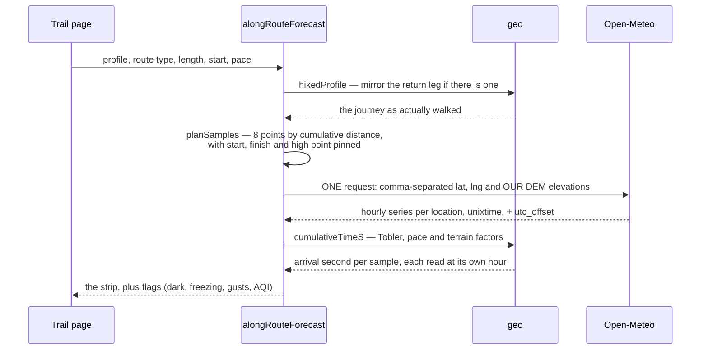


Three details carry the feature. Elevation is **sent**, not inferred — left alone Open-Meteo uses the
model cell's average, which over mountains can sit hundreds of metres below the summit; our own DEM
figure triggers its downscaling, and that is the difference between 8 °C and 1 °C. Timestamps come
back as `unixtime`, so matching an arrival to a forecast hour is integer comparison, not string
parsing across a DST boundary. And the plan is computed twice against the same pure function — once
to learn _where_ to ask, then again once the response has given us the trail's UTC offset and so what
"the next 07:00 local" means. No second call.

## Offline

Downloads are per trail and always user-initiated. The web unit of download is a **page**, not a data
blob — a trail page is server-rendered end to end, so keeping the HTML, the chunks it names, a
corridor of tiles and the photographs makes the offline page byte-for-byte the one you downloaded.

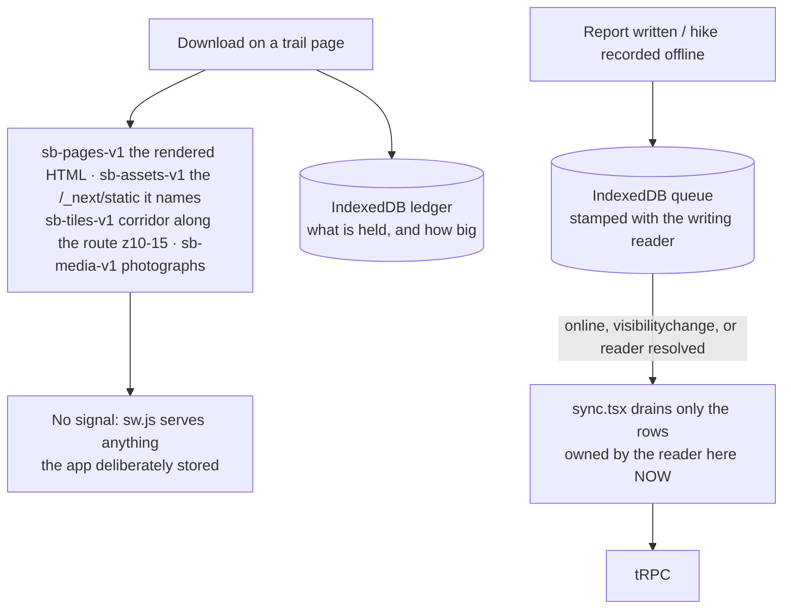


The service worker owns no URL patterns and does not know what a tile is: the app decides what is
worth keeping and writes it into a named cache, and the worker's whole rule is "if it is in one of
our caches, serve it". Caches are versioned by name rather than cleared on upgrade, and split
deliberately — four carry a hand-bumped `-v1` because their contents belong to the reader and a
deploy must not throw away a download made for a trip somebody is on; only `sb-shell-<build id>` is
build-scoped. `apps/web/test/offline-caches.test.ts` fails the build if the worker's copy of any of
these strings drifts from `src/offline/caches.ts`.

On iOS the same feature stores JSON payloads fetched with the procedures and arguments the screens
use, and `hydrate.ts` seeds them into the React Query cache under the same keys — never over live
data. The basemap is not included and the control says so: under Expo Go nothing can sit between the
map's WebView and its tile requests.

## The activity heatmap

Every public recording, aggregated onto a fixed lattice. Every control lives in the SQL rather than
the renderer, because k-anonymity applied client-side is k-anonymity an attacker declines by reading
the response. No row leaves with fewer than `HEATMAP_MIN_HIKERS` contributors, and no coordinate
leaves at all — only lattice indices.

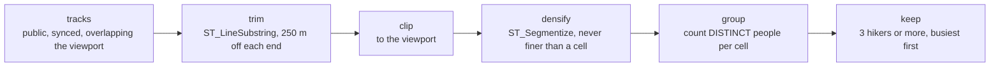

**Trimming runs before clipping, and the order is load-bearing.** `ST_LineSubstring` takes fractions
of a line, so trimming the visible part rather than the whole track would move the censored zone as
the reader pans, and uncensor a front door the moment it sits mid-screen. Clipping second is also
what bounds the work, making cost track screen area rather than track length.

`packages/core/src/heatmap.ts` carries the numbered list of controls beside the constants they
justify, and records what was turned down: differential privacy, because noise sufficient to defeat
snapshot-differencing invents traffic on ground nobody has hiked.

## Authentication

Twelve trust relationships are drawn below. Seven present an Entra token and hold no stored secret;
two more are Entra-mapped and privileged but carry nothing yet; two pass the stored `sbapp`
password, and moving those is the work in progress; the last is a reader's session cookie. This
section is the single picture — the story otherwise lives in a Bicep comment, a workflow and a
Vercel setting.

### Where it all runs


The boundary to notice is the one that is not there. Nothing in Azure sits on a virtual network:
`publicNetworkAccess` is Enabled and the Postgres firewall is a single rule spanning all of IPv4,
because Vercel serverless has no static egress address to allow-list. Identity and the credential
are the whole perimeter. `docs/diagrams/README.md` covers why that diagram is a committed SVG rather
than Mermaid.

### Who trusts whom

Solid edges are identity-based — the caller proves who it is and Entra issues a short-lived token —
with one exception drawn solid because it is not a stored secret either: the reader's session cookie
into Vercel. Two of the identity edges carry nothing yet: `sbapp_vercel` and `sbapp_func` are mapped
and already hold `sbapp`'s grants by membership, and each label names the setting it waits on. The
two dashed edges are the stored `sbapp` password, which is what both applications connect with
today. `sbadmin`, which holds full DDL, is not drawn: it reaches this server by password too, but
the secret holding that password has no consumer left.

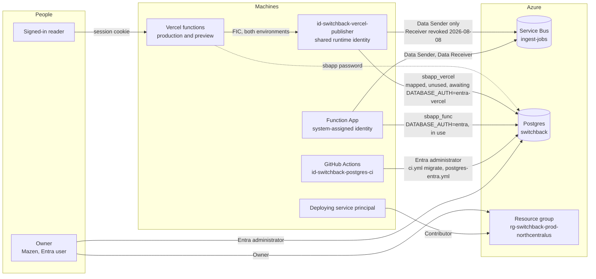

**One identity across the two Vercel environments, and four principals in the database.**
`id-switchback-vercel-publisher` is what Vercel production and Vercel preview both federate to —
one principal, one Postgres role (`sbapp_vercel`), one grant set across the two of them. The ingest
worker is not one of these clients: it authenticates as the Function App's own system-assigned
identity `3db30cfd-…`, whose role is `sbapp_func`, and the bullets below say why folding it in is
refused. `pgaadauth_list_principals` returns four Entra principals — the owner, the CI identity
`id-switchback-postgres-ci`, `sbapp_vercel` and `sbapp_func` — alongside the password roles
`sbadmin` and `sbapp`.

The two federated credentials distinguish the Vercel environments to Entra and to nothing else: the
access token carries the identity's object id, so Postgres, Azure RBAC and every policy downstream
see one caller. **That is the objection to this design, and it is now sharper than when it was
written.** Preview holds no connection string, so a preview deployment cannot reach production
Postgres today; moving Vercel onto this identity gives it back, by being a preview deployment
rather than by holding a secret, and it removes the ability to revoke one environment without the
other. What is lost is attribution rather than privilege — the two environments hold identical
grants either way — and `application_name` is what restores it. Attribution, not a boundary: any
client can set it to anything.

**What does change is how the credential is obtained, and that is the part worth deciding on.**
A preview deployment used to reach production Postgres by holding a secret — `DATABASE_URL`
carrying `sbapp`'s password, scoped by Vercel to the Preview environment. That variable is gone.
After the cutover it would reach production by being a preview deployment: the OIDC assertion is
injected by the platform as the `x-vercel-oidc-token` request header, not as an environment
variable, so it is **not** subject to Vercel's env-var scoping, and the other three inputs — client
id `cd074036-4c63-4d1e-8ebb-72f448bb95a2`,
the tenant id and the server hostname — are public identifiers that appear in this repository. The
failure scenario therefore changes shape rather than size: an actor who gets attacker-controlled
code into any preview deployment no longer needs to extract a scoped secret to read and write
production rows. Whether a fork's pull request can produce such a deployment depends on the Vercel
project's `gitForkProtection` setting, which is **UNVERIFIED** here — the API returned 403 to the
token available.

**The cheapest mitigation, if that is judged unacceptable: move the preview credential, not the
architecture.** Delete the `vercel-switchback-preview` federated credential from this identity and
place it on a second UAMI with its own Postgres role — `SELECT`-only, or its own database. That is
one identity, one credential move and one role, and it costs nothing per month. It deliberately
re-opens the multiplicity this change exists to remove, so it is worth doing only on its own merits.
The cheaper half, worth doing regardless, is to stop preview pointing at the production database at
all; that is a decision this change does not make, because folding it in would let a real question
ride along unexamined. What is **not** a mitigation, in principle rather than in practice: no
Postgres role, `pg_hba` entry or RLS predicate can tell the two Vercel environments apart, because
the FIC subject does not survive the token exchange — only the identity's object id does. Entra's
sign-in logs can, which makes it forensics, not enforcement.

**The move onto this identity is declared, not yet performed, and the diagram says so.** What is
deployed is the identity and its two federated credentials. What is not:

- `sbapp_runtime` does not exist, and is no longer planned. Read from the live catalogue on
  2026-08-08 as the owner's Entra administrator, `pg_roles` holds `sbadmin`, `sbapp`,
  `sbapp_vercel`, `sbapp_func`, `id-switchback-postgres-ci` and the owner's UPN, and
  `pgaadauth_list_principals` maps `sbapp_vercel` to `c9bfba39-…` and `sbapp_func` to
  `3db30cfd-…`. That two-role topology is the deployed one and the intended one: folding the two
  into one presupposes the worker moving onto the shared identity, which is the change the next
  bullet rules out. `infra/postgres-identity/roles.sql` converges and asserts both roles rather
  than renaming either.
- The ingest worker still runs on its own system-assigned identity, `3db30cfd-…`, and holds both
  Service Bus grants under it. It also already has a working Entra path to Postgres: `sbapp_func` is
  mapped to that principal and is a member of `sbapp`, so removing the worker's password does not
  require moving it onto the shared identity.
- The shared identity's Data Receiver on `ingest-jobs` was **revoked on 2026-08-08** — assignment
  `0090d328-0cee-592f-8359-e4cc64940694`, deleted after lifting `switchback-prod-no-delete` and
  restoring it. It was standing authority to drain the production ingest queue on an identity every
  Vercel deployment carries, previews included. `ingest.bicep` no longer declares it, so no deploy
  recreates it; the identity keeps Data Sender (`f1b97f59-263a-5e18-a1c0-40ce18436d52`), which is
  what Vercel actually needs. Dropping the declaration mattered as much as deleting the assignment:
  incremental ARM does not delete what a template stops declaring, but it does re-create what a
  template still names.

  Worth keeping: a `CanNotDelete` lock on a resource group refuses `DELETE` on **extension**
  resources inside it, role assignments included. The refusal is `ScopeLocked` and it names the
  group, not the assignment, which reads like the wrong error until you know that.

The solid Postgres edges are drawn from the object ids on both ends rather than from the names,
because a role mapped to the wrong principal fails only at first use. `roles.sql` asserts each role
against the object id its run was given, so that mismatch surfaces in the workflow instead.

Two things the diagram is meant to make obvious. The deploying service principal holds Contributor
at subscription scope and Role Based Access Control Administrator on the production resource group,
and neither reaches the database — it writes ARM, not rows. And the CI identity holds **no Azure
RBAC whatsoever**: its entire authority is the Postgres administrator grant, so a leak of it cannot
touch the resource group, the queue or the billing.

The second grant is unconditioned, which makes the deploying principal able to assign itself Owner
on that resource group. `infra/azure/main.bicepparam` measures it and says what constraining it
would take; the resource group's delete lock is a control against accident, not against this
principal.

`disableLocalAuth: true` on the Service Bus namespace and zero queue SAS rules are what make the
Service Bus edges solid. Postgres still has `passwordAuth: Enabled` because the two dashed edges are
real; see _What is left_ below.

### The federated exchange

No secret is stored at either end. Vercel mints an OIDC token per invocation, Entra checks the
issuer, subject and audience against a federated credential declared in Bicep, and hands back an
access token.

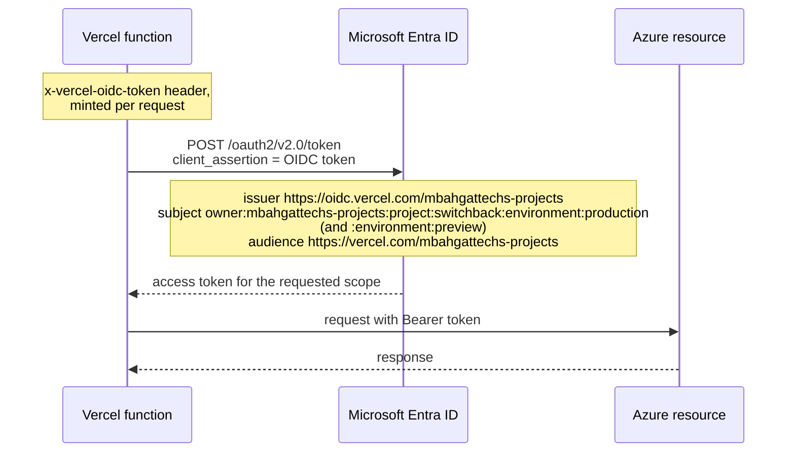

The same shape serves GitHub Actions, with issuer `https://token.actions.githubusercontent.com`
and subject `repo:mbahgatTech@81331884/switchback@1316632119:ref:refs/heads/master`. That subject
is GitHub's **immutable** form — account id and repository id rather than their names. It is not a
preference: this repository's OIDC tokens carry that form, so a credential written the readable
way is never matched and the exchange fails with `AADSTS700213`, quoting a subject that appears in
no template.

### The database token lifecycle

An access token is the _password_ on a Postgres connection, and it is short-lived. The design
below is what the pool has to do so that nothing ever needs restarting.

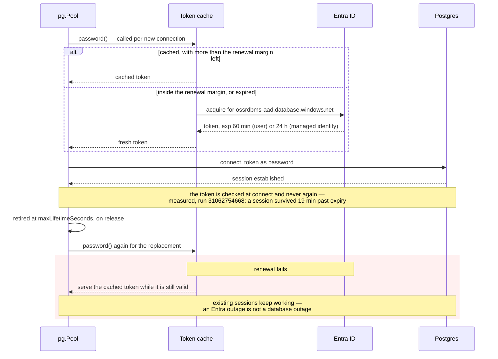

Three properties, and the reason for each. The mechanism each rests on was measured against the
versions this repository now pins exactly — `pg` 8.22.0, `@prisma/adapter-pg` 6.19.3 — by
`infra/postgres-identity/pg-password-callback-probe.mjs`, which prints the `pg` version it
measured and runs under `npm test`, so a driver upgrade that breaks any of them fails a build:

- **Acquire per connection, not per process.** `pg` accepts `password` as a function returning a
  promise and calls it once per _physical_ connection — proven by standing up a server that speaks
  the authentication handshake and recording the bytes: three concurrent checkouts produced three
  invocations and three distinct passwords on the wire, and releasing then re-acquiring a live
  connection produced none. `PrismaPg`'s constructor at 6.19.3 is
  `constructor(poolOrConfig: pg.Pool | pg.PoolConfig, options?)`, so the pool carrying that
  callback can be handed to Prisma directly.
- **Retire connections on a revocation budget, not a credential one.** `maxLifetimeSeconds` does
  **not** evict a connection that is currently checked out: pg-pool's timer moves the client to
  `_expired` and can only act in `release()`. Measured on the same harness — a connection held for
  2.5× its lifetime stayed open and was replaced only after it was released. `CONNECTION_LIFETIME_S`
  is 20 minutes, and what that number buys is a ceiling on how long a connection authenticated by a
  since-revoked identity keeps serving. With the firewall spanning the whole IPv4 internet, identity
  is the only boundary here, so that window is a security parameter.
- **Renew on the issuer's own hint, and never later than one handshake before expiry.** The renewal
  point is `refreshAfterTimestamp` — Entra's `refresh_in`, roughly half-life, which
  `@azure/identity` populates on both the client-assertion and managed-identity paths — bounded by
  `RENEW_MARGIN_MS`, which is `CLOCK_SKEW_MS + CONNECT_BUDGET_MS`, 5.5 minutes. The margin is that
  small because a session is not re-validated after connect (below), so it only has to cover the
  handshake plus skew.

  A larger margin would buy nothing, and this is the constraint that decides the design.
  `credential.getToken()` answers from MSAL's cache, and MSAL treats a token as expired only inside
  its own five-minute offset (`DEFAULT_TOKEN_RENEWAL_OFFSET_SEC`), so no request made earlier than
  that can return a fresher token than the one already held. Past `refresh_in` it refreshes in the
  background and returns the stale token meanwhile — which the cache detects by unchanged expiry and
  answers with a backoff rather than an alarm, because it is the normal path.

**Whether a session outlives its token: no, it is never re-checked.** Measured against the live
server, workflow run 31062754668. One connection polled every minute and one left idle both kept
serving 19.2 minutes past their token's expiry, on the same backend pid. Microsoft's documentation
speaks only about sign-in and does not answer this, so the measurement is the only evidence — and it
is load-bearing, because a margin sized for the handshake alone is only safe while it holds. Any
change to `RENEW_MARGIN_MS` needs it re-established.

Two failure modes are handled rather than assumed away. A renewal that fails serves the cached token
while it is still valid and suppresses the next attempt for `RENEW_RETRY_BACKOFF_MS`, so a
fast-failing Entra does not turn into one token request per connection — including once the cached
token is genuinely dead, which is the outage the backoff exists for. And a token served with less
life left than a connection attempt may take says so through `onTokenNearlyExpired`, which logs at
**error** level. It is unreachable on either healthy path, which is what makes it worth reading — an
earlier margin derived from connection lifetime instead fired it 28 times per 12 hours against a
60-minute token while handing out tokens with 9 minutes of life left.

**Both callbacks reach an alert rule, and on Vercel that took a push.** `entra-client.ts` passes
`createTokenAlarms()` from `packages/db/src/token-alarm.ts` to every token provider it builds. Each
alarm logs, and also POSTs a trace to `appi-switchback-ingest` over the Application Insights
ingestion API. Three things ruled out the alternatives:

- **A counter behind an endpoint reads nothing.** Vercel runs many short-lived instances and scrapes
  none of them, so a reader almost never reaches the instance that raised the alarm. That is the
  same structural blindness as an Azure rule over logs Azure cannot see.
- **An Azure rule over Vercel's logs cannot exist.** They reach no Azure resource, and no log drain
  is configured. Only a push from the instance that has the fault crosses that boundary.
- **The push must not depend on what is failing.** The ingestion API authenticates on the
  instrumentation key in the envelope, not on Entra, so a renewal failure can still be reported.

Measured on 2026-08-09: a trace posted from a workstation outside Azure returned
`itemsReceived: 1, itemsAccepted: 1` and was queryable about three minutes later as
`traces | where cloud_RoleName == "switchback-web"`. `switchback-db-token-alarm` in
`infra/azure/ingest.bicep` reads exactly that. A 200 alone is not treated as delivery — the
collector answers `itemsAccepted: 0` for a rejected envelope, and `createTraceSink` rejects on it.

The alarm is awaited rather than dropped, because an invocation that has answered its request is
frozen and an unawaited POST is one the platform may discard. It is bounded at `TRACE_TIMEOUT_MS`
and rate-limited per marker at `ALARM_MIN_INTERVAL_MS`, since `onTokenNearlyExpired` fires per
connection; what a window suppressed rides out on the next trace as `suppressedSincePrevious`. A
collector that is down costs the connection that timeout and nothing else — never the connection
itself.

**What leaves this silent is one variable.** With `APPLICATIONINSIGHTS_CONNECTION_STRING` absent
from Vercel Production there is no push and the console line is the whole signal, which on Vercel
means a live `vercel logs --follow` and nothing durable. `/api/version` reports `alarms` as
`application-insights` or `console` so the two can be told apart from outside. **Setting that
variable is a precondition of `DATABASE_AUTH=entra-vercel`, not a follow-up to it** — cutting the
site to token auth while the alarm is on `console` is what turns a transient refresh fault into an
outage nobody sees starting.

**What is wired, and what is switched on.** `packages/db/src/client.ts` builds both Prisma clients
through `createClient`, which reads `DATABASE_AUTH`. It defaults to `password` and behaves exactly
as it did before — so deploying this code changes nothing until a consumer is moved deliberately.
Set to `entra` or `entra-vercel` it builds a `pg.Pool` whose `password` is the token cache and
whose `maxLifetimeSeconds` is `CONNECTION_LIFETIME_S`, wraps it in `PrismaPg`, and hands that to
Prisma as `adapter`.

Three things had to move with it, because a driver adapter bypasses the connection string. Prisma
reads `connection_limit` and `pool_timeout` off the URL and `datasourceUrl` cannot be combined with
an adapter at all, so `BACKGROUND_POOL_SIZE` and the background pool's thirty-second wait are
restated as `pg.Pool`'s `max` and `connectionTimeoutMillis`; the request pool restates Prisma's own
default of `cores * 2 + 1`, which it would otherwise silently lose to `pg`'s default of ten. Losing
that sizing is the outage recorded in that file's own comment.
`packages/db/test/entra-pool.test.ts` asserts the constructed pool carries each of them.

The URL is split into discrete fields rather than passed through as `connectionString`, and that is
not a style choice. `pg` merges a parsed connection string **over** the explicit config, so a URL
carrying no password replaces the password callback with `null` — every connection would then
authenticate with nothing and the token would never be requested. Measured on `pg` 8.22.0 and
asserted in both directions. Splitting it also means `sslmode` is finally honoured: the deployed
URLs have carried `verify-full` all along, but Prisma's engines understand only
`disable`/`prefer`/`require` for that key, so the value leaves them at their default. Under the
adapter it becomes a real `rejectUnauthorized` plus hostname check for the first time.

**Where each consumer's token comes from.** `DATABASE_AUTH=entra` uses `DefaultAzureCredential`,
which covers the Function App's managed identity, a workload identity and an operator's `az login`
without naming any of them. `DATABASE_AUTH=entra-vercel` uses
`ClientAssertionCredential(tenantId, clientId, () => getVercelOidcToken())` from `@vercel/oidc`.
The callback is referenced and called later, never invoked at module level, because Vercel's OIDC
reference is explicit that on a deployed function the token is not in the environment at all — it
arrives as the `x-vercel-oidc-token` header of the request in scope. No custom audience is passed:
the deployed federated credentials trust Vercel's default,
`https://vercel.com/mbahgattechs-projects`.

**The worker runs on Entra; Vercel and its `entra-vercel` path do not.** `DATABASE_AUTH=entra` is
set on `func-switchback-ingest-37ywppu5p7fri` and nowhere else, so every Entra-authenticated Prisma
query executed against production so far is the worker's. The Vercel path has never run in a Vercel
runtime, and its named residual risk is unchanged: a connection opened from the cron drain or from
`waitUntil` work that outlives the response has no request in scope, so `getVercelOidcToken()` has
no header to read and that connection fails. A warm cache needs no assertion at all — the provider
renews on the issuer's `refresh_in`, roughly half-life, so a busy instance asks perhaps twice an
hour — and the exposure is a deployment whose _only_ traffic across a renewal is background work.
Capturing each request's header into a module-level holder closes even that, at the cost of holding
a bearer token in memory.

The identity Vercel presents is `id-switchback-vercel-publisher`, principal id `c9bfba39-…` — the
same one already trusted for Service Bus, and the one the `sbapp_vercel` database role is mapped
to.

Whether retiring connections is a correctness requirement or only hygiene turns on one question
nobody should answer from memory: **is the token checked only at connect, or is a live session
terminated when it expires?**

**It is checked only at connect. Measured, run 31062754668.** Two connections were opened with one
60-minute token and held for 79 minutes — 19 minutes past its expiry:

```
token_expires_at|2026-08-06T02:27:13.000Z
token_life_remaining_min|59.9
planned_hold_min|79
poll|59|past_expiry=-0.8min|ok
poll|60|past_expiry=0.2min|ok        <- the boundary
poll|79|past_expiry=19.2min|ok
idle-reuse|past_expiry=19.2min|pid=866503|ok
VERDICT|crossed_expiry|true
VERDICT|polled_survived|true|last_good_minute=79
VERDICT|idle_reuse_survived|true
```

Both shapes were covered deliberately. One connection was queried every minute, so it was never
idle and its survival cannot be confused with a reconnect — same backend throughout. The other sat
untouched for the whole 79 minutes and was queried for the first time 19 minutes _after_ the token
died, on backend pid 866503, which is the pooled-connection case the application actually has: a
connection that goes quiet for an hour and is then handed to a request.

**Three earlier rounds could not get this, and the reason is worth keeping.** The `soak` job used
the CI managed identity, and Azure issues managed-identity tokens with a 24-hour life while a
GitHub runner is capped at six — so it could not reach the boundary however long it held. A
token-lifetime policy does not close that: `configurable-token-lifetimes` states that "configuring
token lifetimes for managed identity service principals isn't supported". What does close it is a
**throwaway app registration**, whose token for this resource is exactly 60 minutes — measured,
`expires_in=3599`. `.github/workflows/token-expiry-probe.yml` federates one to this repository, has
the Entra administrator map it to a grantless database role, holds the two connections, drops the
role, and the Graph objects are deleted afterwards. It is a reproducible experiment rather than
part of the deployed system, and its header carries the two `az` commands to stand it up again.

Microsoft's own documentation never settles this, which is worth writing down so the next person
does not re-read it hoping. `security-entra-concepts` gives the lifetimes — "User tokens are valid
for up to 1 hour. Tokens for system-assigned managed identities are valid for up to 24 hours" — and
says a deleted principal "can still sign in until the token expires". Both are statements about
_establishing_ a connection. Neither says anything about a session already established. The
measurement above is what the prose could not give.

**What this changes.** Retiring connections at `maxLifetimeSeconds` is hygiene, not the only thing
standing between the app and an outage: a connection that outlives its token keeps working. The
renewal margin still matters, because every _new_ physical connection presents a token and that one
must be valid — which is exactly what the password callback provides. The claim the margin now
carries is the modest, arithmetic one: no connection is ever opened with a token that has less life
left than that connection can possibly consume. Bounding connection lifetime remains worth doing so
authority does not accumulate indefinitely in a long-lived pool, but it is defence in depth.

### Sign-in for people

Auth.js with the Prisma adapter and a **database** session strategy: a session row can be deleted,
so "sign out everywhere" and "this account was compromised" are one query, where a JWT cannot be
revoked before it expires. The cost is a read per request, which loading `ctx.user` needed anyway.
Apple sits behind a flag because its client secret is a JWT signed per use — hence the async
Auth.js factory. The iOS app borrows the website's sign-in: Expo Go hands out an `exp://…` redirect
no provider registers.

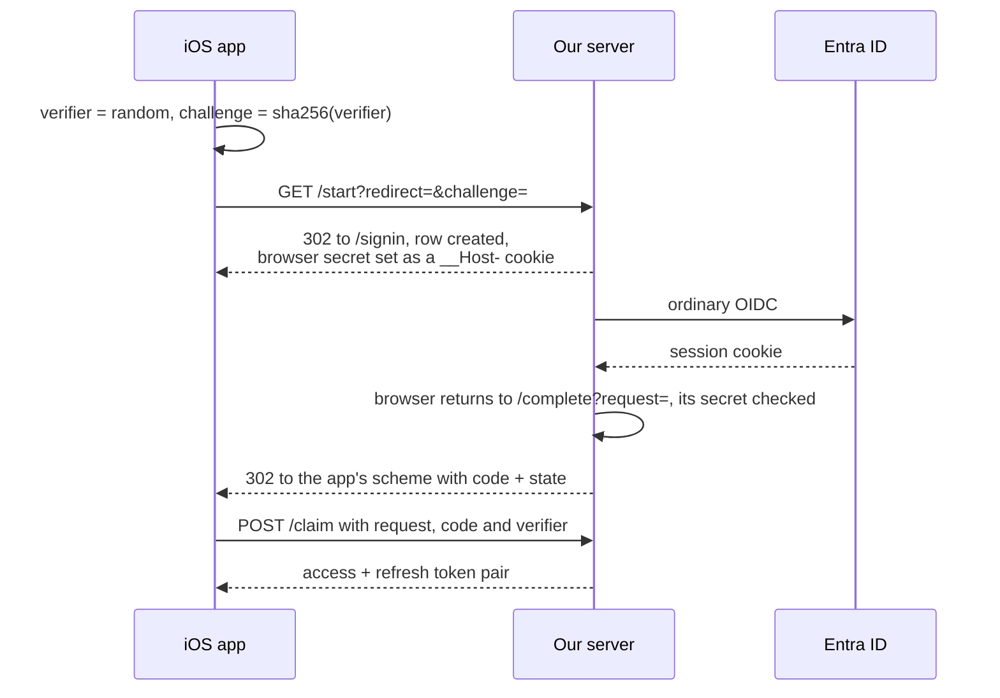

The provider only ever sees our own registered `https://` redirect. Four properties hold it together:
the code is worthless without the verifier that never left the device (PKCE applied to our own leg,
because on iOS any app may claim a URL scheme); everything is single-use inside one transaction; the
redirect is allow-listed when stored, not when used; and the row is bound to the authorising browser
as well as the claiming device, so a cross-site GET to `/complete` cannot mint a token pair on
somebody else's account.

### What is left

The refresh mechanism is proven at the pinned versions, both Prisma clients can be built on it, and
**the Function App runs on it**: `DATABASE_AUTH=entra` has been set there since
2026-08-08T17:27:04Z. Every other consumer is still password-authenticated. Three things remain,
each provable with passwords still enabled:

1. **The database roles.** Both already exist and are Entra-mapped —
   `infra/postgres-identity/roles.sql` converges `sbapp_vercel` against the shared identity's
   object id and `sbapp_func` against the worker's, then asserts each mapping rather than assuming
   it, because a security label follows the role's oid and an identity recreated since would leave
   a role matching nothing. That failure otherwise surfaces at first use, which is a web request.
   The `provision` action cannot run from a branch: the CI identity's federated credential trusts
   `refs/heads/master` alone, so it executes on merge. Against the deployed estate it creates
   nothing and only asserts.
2. **The Function App — done.** `databaseAuth='entra'` deploys `DATABASE_AUTH=entra` and an
   `INGEST_DATABASE_URL` naming `sbapp_func` with no password in it; `entraPoolConfig` refuses a URL
   that still carries one, so a half-done version fails at connect rather than quietly preferring
   the password. `sbapp_func` is Entra-mapped to this app's own **system-assigned** principal
   `3db30cfd-ea61-47ce-9b03-8b34ebc420b0` and is a member of `sbapp`, so it inherits the same table
   grants the password role has, and the server already has `activeDirectoryAuth: Enabled`. The
   deployment writes two application settings on the Function App; `ingest.bicep` declares no
   `Microsoft.DBforPostgreSQL` resource, so the server was not in the change set.

   The proof is the two-minute `ingestPump` heartbeat, whose gauges are read out of `ingest_jobs`:
   `switchback-ingest-queue-health build=7d59395… dead=1 staleLeases=1 …` at 17:45:12Z and the same
   line with `staleLeases=0` at 17:46:00Z. A changing gauge cannot come from anywhere but a query.

   **Rolling back is `databaseAuth='password'` and a `databaseUrl` carrying `sbapp`'s password**,
   redeployed. `passwordAuth` on the server is `Enabled`, so that way back is open. The deployment
   rewrites the whole application-settings collection, so `INGEST_PACKAGE_URL` has to name the live
   package on the way through — it is a parameter with no fallback for exactly that reason.

   **Do not move this app onto the shared identity.** The trigger binding sets no
   `__clientId`, so the host receives Service Bus messages as whatever principal the site runs
   under; an app running as `id-switchback-vercel-publisher` would need Data Receiver on
   `ingest-jobs` put back on it — the grant that was revoked precisely because that identity rides
   on every Vercel preview. `ingest.bicep` declares the queue and its three role assignments. Two
   principals with two Postgres roles is the cheaper arrangement and it is what is deployed.

3. **Vercel.** `DATABASE_AUTH=entra-vercel`, plus `AZURE_TENANT_ID` and the client id of
   `id-switchback-vercel-publisher`. The code exists and has never run in a Vercel runtime; the
   cold-cache-outside-a-request risk above is real and unmitigated.
4. **CI.** `ci.yml`'s `migrate` job composes a connection string from a freshly minted token for
   `id-switchback-postgres-ci` rather than reading a stored password, and **that path runs on every
   push to `master`**: `azure/login` and the grant-convergence step are unconditional, and run
   31246622902 reached production as `id-switchback-postgres-ci` and reported
   `switchback-runtime-grants tables=26 ungranted=0`. The half gated on `packages/db/prisma/`
   changing — `assert-pg-admin.ts`, `npm run db:generate` and `npm run db:push` — has run too: run
   31183187247 carried `244edf6` and its change to `spatial.sql`, and all three reported `success`
   against production, where the same steps report `skipped` in 31246622902.
   The hazard in that half already materialised once: `db push` runs as a role that is not
   `sbadmin`, so `trail_ways` and `trail_slug_aliases` were created owned by
   `id-switchback-postgres-ci` and `sbadmin`'s `ALTER DEFAULT PRIVILEGES` did not reach them. The
   repair that shipped is `scripts/converge-runtime-grants.ts`, which re-grants unconditionally
   after every push rather than relying on default privileges registered under one creating role.

`passwordAuth` is a parameter — `passwordAuthEnabled` in `main.bicep`, defaulting true — so the
flip is a reviewable deployment of its own rather than an edit to a template. It is gated on all
four of the above and on both administrator doors being re-proved in the same hour. Turning it off
first would lock the application out of its own database, and the way back is an ARM write that
itself authenticates against Entra.

The parameter also governs the admin password. `postgres.bicep` writes
`administratorLoginPassword` only when password authentication is on _and_ a value was supplied,
so a deployment that supplies nothing leaves the live credential untouched, and the flip ends with
no password in the deployment path at all.

One more thing, measured rather than suspected: **this repository is public.** Everything here is
readable by anyone, and a workflow artifact is downloadable by any authenticated GitHub user. That
is how a 371 MiB production dump — containing `sessions.sessionToken` and the `accounts` OAuth
tokens in plaintext, alongside real accounts and real GPS tracks — came to be published by run 31043403970. It was deleted on 2026-08-05, and the workflow that produced it is gone, but the
session and OAuth tokens it exposed should be treated as compromised. Whether this repository
should be public at all is an open owner decision, and every risk judgement in this document
assumes it is.

The certificate-verification gap that used to sit here is closed on two paths and open on one.
Under `DATABASE_AUTH=entra` the pool is given a real `rejectUnauthorized` and hostname check, and
CI's schema push gets `sslaccept=strict` alongside `sslmode=verify-full` from
`.github/scripts/pg-token-url.sh` — both parameters, because the two readers honour different
ones. `sslaccept=strict` is Prisma's half and is what verifies the chain and the hostname;
`sslmode=verify-full` is node-postgres's — the `pg.Client` that proves the token in the same job
reads it and verifies chain and hostname on it — and is inert for Prisma, whose engines understand
only `disable`/`prefer`/`require` for that key. In `password` mode Prisma still receives
`sslmode=verify-full` alone — a key it reads at a value it does not recognise, which leaves it at
the default — so until a consumer moves its TLS is unverified. Measured against Prisma 6.19.3 and
node-postgres 8.22.0; the full matrix is at the foot of `infra/azure/postgres.bicep`.

**Claim identity is writing, and one data condition is open. Measured against production
2026-08-08.**

`trail_ways` holds the claims; `trail_slug_aliases` is empty because no merge has retired a slug yet.
`sbapp` holds all four table privileges on both.

```sql
select relname, n_live_tup, n_tup_ins from pg_stat_user_tables
 where relname in ('trail_ways', 'trail_slug_aliases');
-- trail_ways          25238  26592     n_tup_ins exceeds the row count where a re-ingest re-claimed
-- trail_slug_aliases      0      0

select p, has_table_privilege('sbapp', 'trail_ways', p)
  from unnest(array['SELECT','INSERT','UPDATE','DELETE']) p;   -- t  t  t  t
```

**Those grants had to be placed explicitly, and the reason still binds for the next table.**
`ALTER DEFAULT PRIVILEGES` is registered per creating role, and the only registration in this
database is `FOR ROLE sbadmin`. The migrate job pushes as `id-switchback-postgres-ci`, so a table
arriving by that route is owned by it — `pg_tables` puts these two under that owner against 24 under
`sbadmin` — and inherits no grant at all. A table in that state is not merely unwritten: `resolveTrail`
reads `TrailWay` before it does anything else, so `42501 permission denied for table trail_ways`
unwinds the whole per-trail commit and the tile records as covered with nothing in it.
`scripts/converge-runtime-grants.ts` runs after every push, registers the missing default privileges,
grants over the tables already on the ground, and fails the job if any application table is short.

**102 groups — 204 trail rows — share byte-identical geometry**, by `md5(st_asbinary(geom))`, and 85
of those pairs are a relation against a way. Kibbie Lake Trail is one: way `162652736` and relation
`19086356`, same hash, same 634 points, both measuring 13,472.3 m geodesic, two live slugs both
serving 200. The stored `lengthM` disagrees across that pair — 13,473 on the relation, 13,064 on the
way — so the two pages a reader can open today differ by 409 m on a geometry that is the same bytes,
and the eventual backfill cannot take the stored column as its tiebreak. This is
exactly the duplication claim identity exists to prevent, and it predates that work — the rows were
written under `(osmType, osmId)` upserts, which cannot see that two ids describe one trail. With
`INGEST_TRAIL_IDENTITY` on `claim` no new pairs form; the existing ones are untouched, and merging
them needs a backfill that picks a winner per hash, moves user content onto it and retires the
loser's slug through `trail_slug_aliases`. Both tables are writable, so what blocks the backfill is
that nobody has written it.

`INGEST_TRAIL_IDENTITY` reads `claim` on the Function App, which is the only surface where it does
anything. Vercel **Production** still carries the name with an empty value; nothing there reads it.
`trailIdentityMode` resolves the flag at four call sites, all inside `packages/ingest`;
`pipelineDeps` at three, one there and two in `scripts/ingest.ts`, the operator drain that runs from
a shell rather than from a workspace the site builds — the root `workspaces` are `apps/*` and
`packages/*`, and `scripts/` has no manifest of its own. What confines the flag to the worker is not
their number but where they are:
`git grep -n -E "trailIdentityMode|pipelineDeps" -- apps/web packages/api` returns nothing, against
195 files under `apps/web` alone that the same traversal reads. The fifteen value symbols the
routers do import — `ensureCoverage`, `publishIngestSignals`, `requestArea`, `surveyArea`,
`tileJobKey`, `VERCEL_OIDC_HEADER`, `centroidOf`, `elevateLine`, `ensureNetworkCoverage`,
`getTerrain`, `loadNetworkSegments`, `networkJobKey`, `getGeocoder`, `TerrainSource` and `fillGaps`
— queue work and shape geometry; none resolves an identity mode. `apps/web/src/env.ts` does not
declare it, and the empty Vercel entry is residue that can be deleted whenever somebody is in the
project settings.

| Surface      | Read it back with                                                                                                             |
| ------------ | ----------------------------------------------------------------------------------------------------------------------------- |
| Function App | `az functionapp config appsettings list -g rg-switchback-prod-northcentralus -n func-switchback-ingest-37ywppu5p7fri -o json` |
| Vercel       | `vercel env pull` — **not** `vercel env ls`, which answers presence alone and reports an empty value as `Encrypted`           |

**A deploy of `ingest.bicep` from a shell that has not exported the flag fails the build.**
`ingest.bicepparam` resolves `ingestTrailIdentity` through
`readEnvironmentVariable('INGEST_TRAIL_IDENTITY')` with no fallback, so `BCP427` stops the
deployment before ARM is called. A fallback would be the whole hazard: the app reads `claim`, an
application-settings write replaces the collection whole, and `identity.ts` treats an absent
variable and `osm-id` identically — so a reverted app looks unchanged. The ceiling above keeps its
fallback because there the safe direction and the deployed value are the same one.

**No workflow deploys `infra/azure/ingest.bicep`.** No workflow deploys any template:
`infrastructure.yml` compiles the eight `infra/azure/*.bicep` templates and then builds
`main.bicepparam`, and the only job that carries a `what-if` or an apply is
gated on `vars.AZURE_INFRA_CLIENT_ID != ''`, which is unset — `gh variable list` returns
`AZURE_SUBSCRIPTION_ID` and `AZURE_WORKER_DEPLOY_CLIENT_ID` and nothing else, so that job is skipped
on every run. `.github/scripts/infra-deploy.sh` would take only `runtime-identity` and `main` in any
case. So a change to the ingest template reaches Azure on a human-run `az deployment group create` —
and that deployment rewrites the whole application-settings collection, so it must be handed the
live `INGEST_PACKAGE_URL`, or the app comes back running a different build.

**`ingest.bicepparam` is compiled by nothing, so a break in it surfaces at the deploy.** It resolves
`INGEST_OVERPASS_USER_AGENT`, `INGEST_TRAIL_IDENTITY` and
`INGEST_DATABASE_URL` through `readEnvironmentVariable` with no default, and that call runs at build
time, so `az bicep build-params` on it fails `BCP427` three times on a runner holding none of them —
and one of the three is a database URL, which is why it is not simply added to the compile loop.

## Design decisions, recorded once

- **Trail data is lazy per tile, not bulk-imported.** A global OSM import is tens of gigabytes to
  store, re-import and keep fresh, most of it ground nobody will open. Fetching a z9 tile when
  someone looks at it makes the corpus exactly the places people use, and freshness a 30-day TTL per
  tile. The cost is a cold first visit — hence partial results now rather than blocking on Overpass.
- **Elevation is terrarium PNGs from AWS Terrain Tiles, not a hosted elevation API.** Hosted APIs bill
  or rate-limit per point, and a 17 km trail sampled every 25 m is 680 points. Terrarium tiles are
  static objects on S3 with no quota, and that trail touches perhaps four z13 tiles — four GETs
  whatever the sampling density. The same DEM renders the default basemap, so no key or vendor stands
  between a clone of this repo and a working map.
- **The service worker cannot import anything.** It lives under `public/`, outside the module graph,
  so cache names and the static-asset pattern exist in two files. The alternative was Workbox and a
  build step, for a file whose failure mode is "the app is bricked until site data is cleared". A
  test that reads the worker as text and compares character for character makes the duplication safe.
- **A handover keeps queued writes and drops cached pages.** When the account on a browser changes,
  everything cached under `sb-` was fetched with the previous reader's cookie and goes; their queued
  reports and hikes are stamped `heldAt` and kept — a download can be fetched again, a report written
  on a ridge cannot. Reader-specific shell pages go entry by entry, not by deleting the shell cache,
  which would take the offline fallback and this build's chunks with them.
- **The map is a WebView on iOS while everything else is native.** `@maplibre/maplibre-react-native`
  needs a development build, which needs a Mac, and a second cartography to keep in step. The phone
  loads `/embed/map` from the same origin instead, so `buildStyle` and the trail layers are one
  module serving both clients. The protocol is declared in `packages/core/src/map-bridge.ts` and
  `safeParse`d at both ends, because the halves deploy separately. The map runs `browse` itself and
  returns summaries with geometry stripped: polylines must not cross a string channel on every pan.
- **Route planning runs on its own cached network.** The catalogue keeps a relation's primary line and
  drops anything under 200 m — right for a catalogue, wrong for routing, where the 150 m unnamed
  connector is what makes a loop possible. `RoutingTile`/`PathSegmentRow` cache every foot-legal way
  lazily on the same on-demand pattern, and the graph is built in the browser.
- **Background work holds its own connection pool.** Three code paths start ingest drains, each
  guarded only against a second of its own kind. Sharing the request pool meant background commits
  taking every connection and Auth.js's session lookup losing — which presents as a signed-out header
  and an empty map, not as a busy ingest. `BACKGROUND_POOL_SIZE` in `packages/db/src/client.ts` is
  the ceiling; `COMMIT_CONCURRENCY` derives itself from it.
- **Photograph bytes go straight to R2 from the browser** with a presigned PUT: Vercel's body limit is
  4.5 MB and a proxied upload pays for the bandwidth twice. SigV4 is implemented in
  `packages/api/src/storage.ts` — the AWS SDK is ~1.5 MB of bundle to produce one string.
- **Viewport queries use indexed bbox columns, not `ST_Intersects`.** A plain Prisma `where` composes
  with facets and paginates properly; PostGIS would mean a capped candidate id list intersected with
  facets afterwards, silently dropping matches when the cap bites. False positives are the better bug.
- **The route planner's profile constants must stay equal to ingest's.** `PROFILE_SPACING_M` and
  `RENDER_SIMPLIFY_M` in `routers/routes.ts` are copies of module-private values in
  `ingest/pipeline.ts`. Gain is measured under a 10 m hysteresis threshold (`GAIN_THRESHOLD_M`), so a
  profile sampled at 25 m and one at 60 m differ in _answer_, not resolution — let the two drift and
  a planned route reports different numbers from an ingested trail of the same shape.
- **Mobile state lives at module scope, not in a hook.** The tab bar destroys screen-owned state, so
  a recorder or a ping loop owned by the Record screen stops the first time somebody switches tabs —
  silently, on a safety feature whose own panel would go on claiming it was running. `record/store.ts`
  and `record/lifeline.ts` argue it from that; `offline/store.ts` from three screens needing one
  index. React subscribes through `useSyncExternalStore`.
- **Page sizes live in `apps/mobile/src/api/pages.ts`.** A page size is part of a React Query key and
  the offline layer seeds those keys from disk, so a seeded key off by one number seeds nothing and
  the screen shows its empty state on a phone holding the whole trail.
- **The design has no z-axis.** Depth is plate colour and hairline rules, never a drop shadow. No
  type can express that, so it is held by `apps/web/test/conventions.test.ts` and
  `apps/mobile/test/conventions.test.ts` reading source for shadow utilities and React Native's
  shadow props — which makes it, today, discoverable only by breaking it.
- **Survey red means the reader or their safety, and nothing else.** [design.md](design.md) owns the
  palette; what belongs here is where the colour stops. It is right on the position dot, an off-route
  banner, an overdue Lifeline, and a confirmation throwing away the reader's own hike. It is wrong on
  the record button, and wrong on a moderator's takedown in somebody else's row, where red reads as
  an accusation against them.
- **`admitIngest`'s ceiling is deliberately soft.** tRPC starts every call in a batch concurrently
  and the depth check is a bare `groupBy` under no transaction and no advisory lock, so one request
  can overshoot by `MAX_BATCH_SIZE` × `MAX_TILES_PER_REQUEST`. The obvious fix — an advisory lock
  around the count and the enqueue loop — becomes a global mutex held across up to 96 tile upserts
  and 96 job enqueues on the deliberate-area path, on a serverless deploy, past Prisma's interactive
  transaction budget. The per-caller allowance in `ingest/rate-limit.ts` is what bounds the
  overshoot instead: a batch that races past the ceiling still spends real tokens, so a caller
  cannot repeat the trick.
