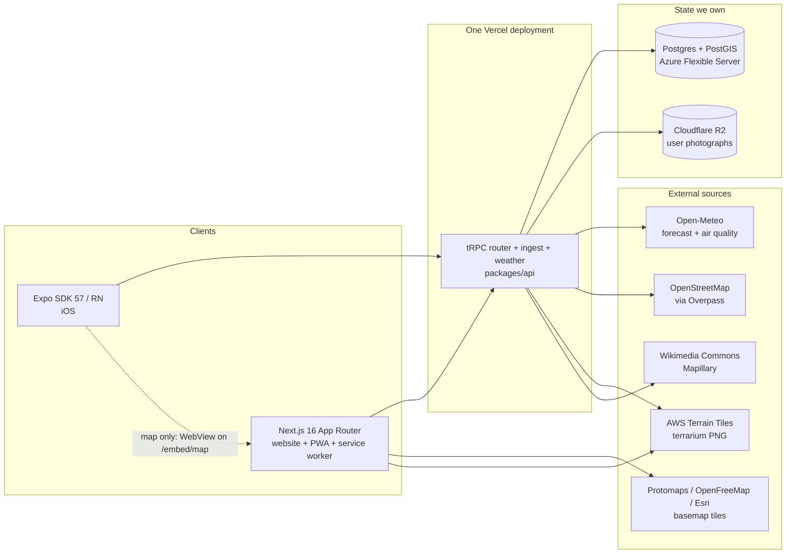
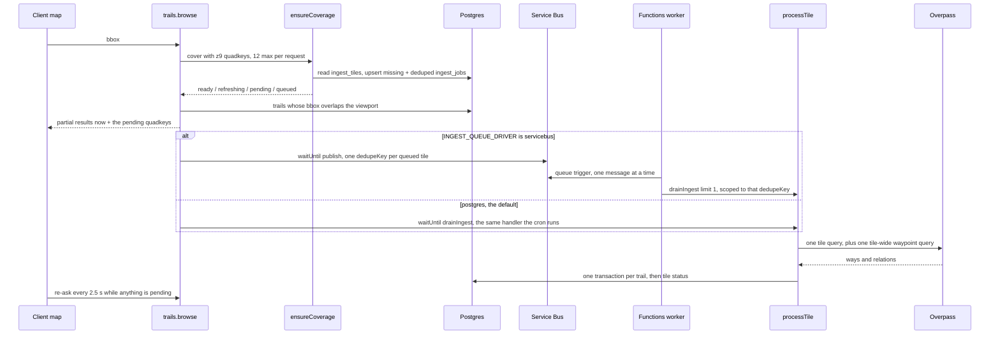
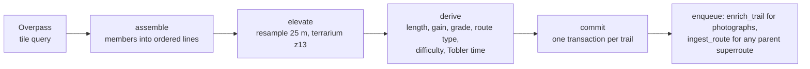
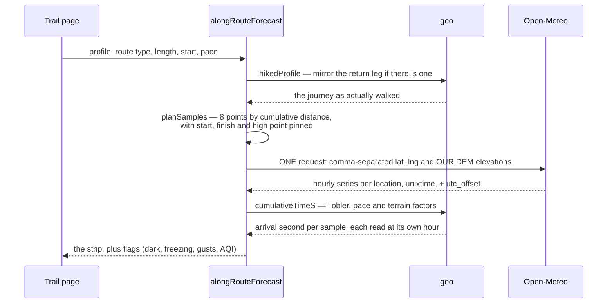
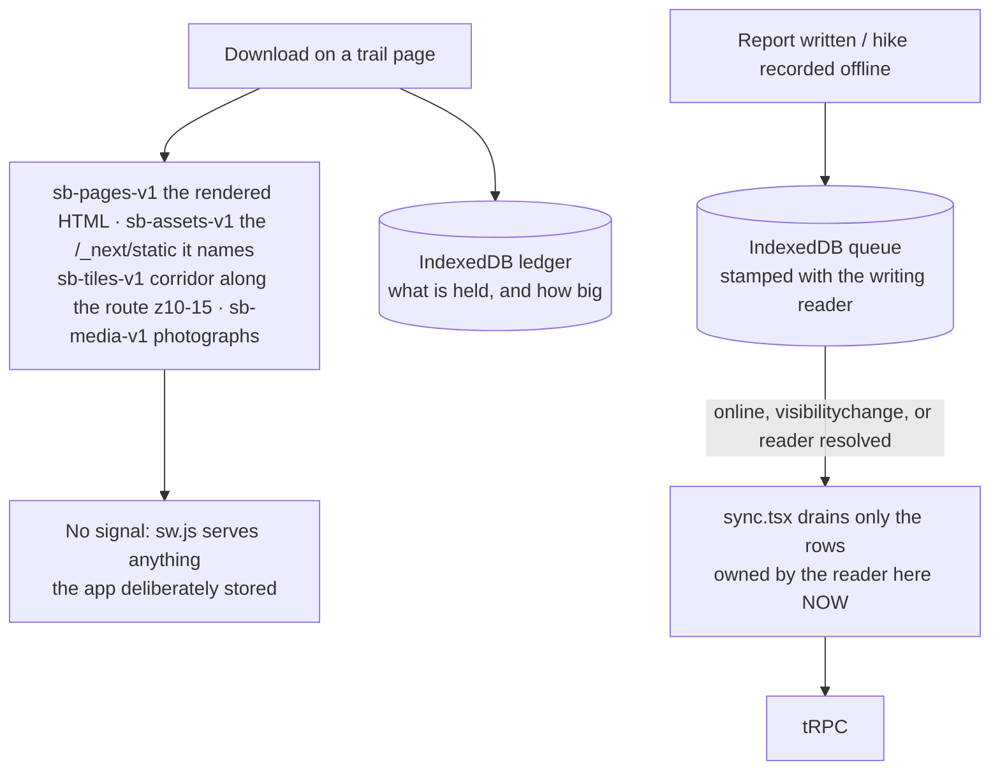
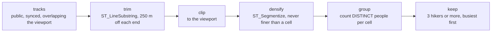
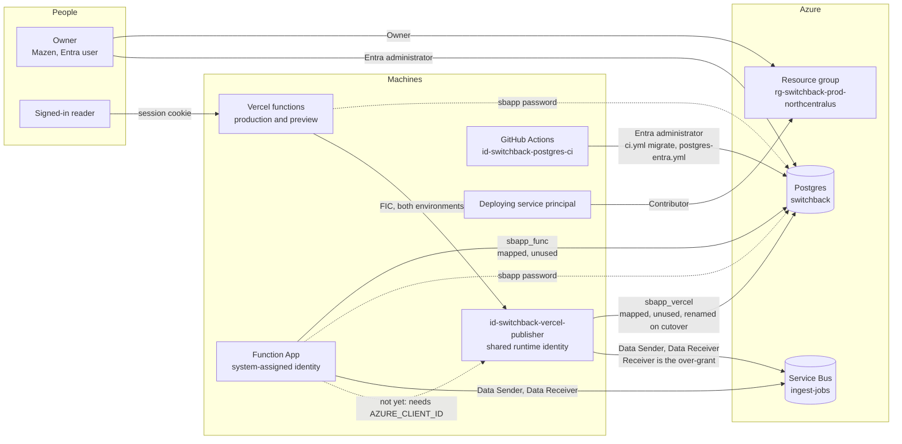
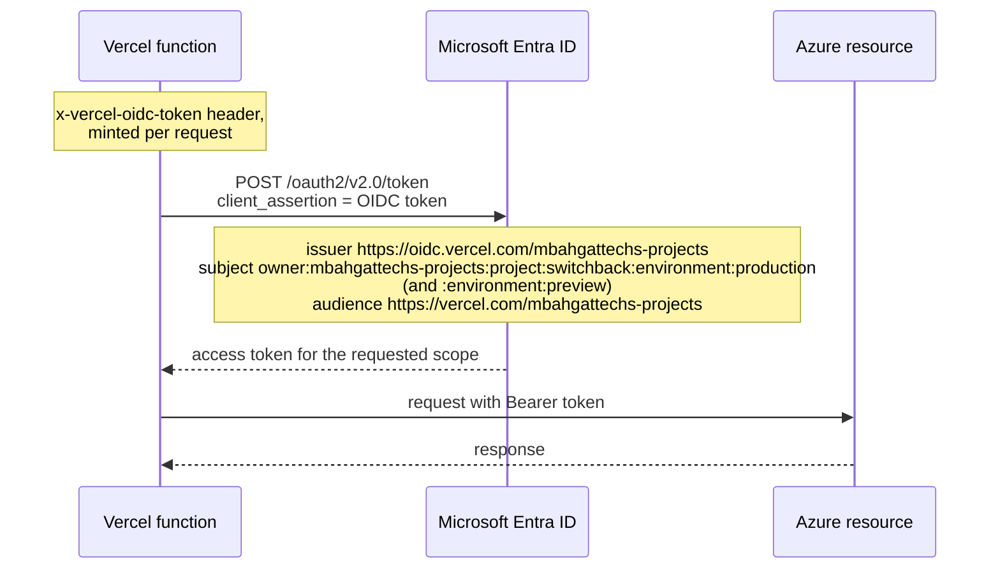
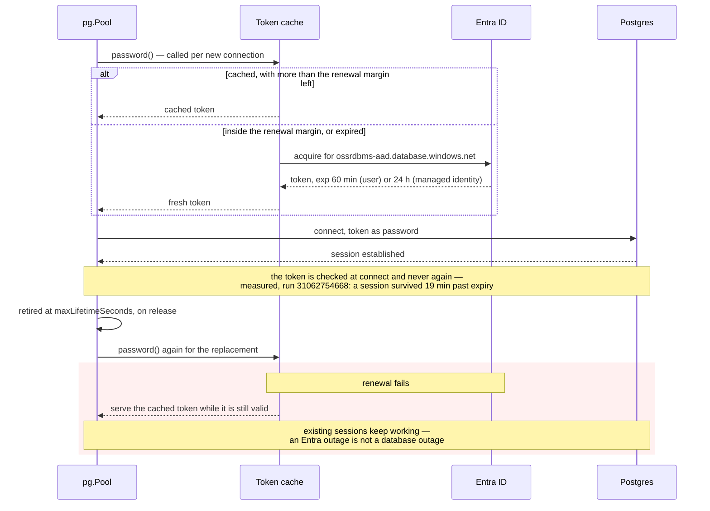
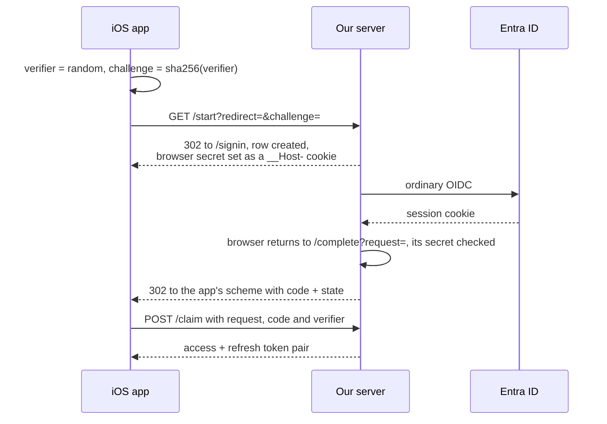

# Architecture

Switchback is trail discovery, planning and navigation: a Next.js website that is also a PWA, an
Expo/React Native iOS app, and one tRPC API both consume. There is no seeded trail corpus —
OpenStreetMap is read on demand, tile by tile, as people look at places. See also
[design.md](design.md), [mobile.md](mobile.md) and [auth-apple.md](auth-apple.md).

## System context




`packages/` holds the shared reasoning: `core` (types, zod schemas, difficulty and unit formulas,
the WebView protocol), `api` (tRPC routers, moderation, mobile token exchange, R2 signing), `db`
(Prisma schema — raw SQL confined to `spatial.ts`, the only file touching PostGIS columns), `geo`
(quadkeys, terrarium, Tobler, corridors, GPX/FIT, routing graph), `ingest` (Overpass, the tile
pipeline, the job queue and its admission control), `weather`, `busyness`, `ui` (one token source
for Tailwind and React Native). All source-only: no build step, no `dist/`.

## Lazy ingest: viewport to trails

The heart of the product. A viewport is covered with z9 quadkeys; tiles already in Postgres and
fresher than 30 days serve immediately, and the rest are queued while the request returns what we hold.



Inside `processTile`, per tile:



Three properties make this safe to run unattended. Every trail is keyed by `(osmType, osmId)` and
every write is an upsert, so an at-least-once queue is harmless. Each trail commits in its own
transaction and its own `try`, so one broken geometry costs one row rather than forty. And a tile
reaches `ready` only when Overpass answered — a failed tile keeps its reason, so the next request
re-queues instead of serving an empty map as though the ground held no trails.

**Durability.** `waitUntil` buys latency and nothing else; a deploy or timeout mid-flight loses the
work. So every kick also writes an `IngestJob` row that a Vercel Cron drains, and both paths run the
same idempotent handler. Claims are a visibility timeout, never a transaction held open for minutes,
which would exhaust a serverless pool. Admission control (`ingest/backpressure.ts`) is asked inside
`queueTiles` — the choke point every writing path crosses — rather than at the one button that has a
person behind it.

**One inline drain per instance, and a kick is carried rather than dropped.** The Overpass client
caps itself at two concurrent requests, so a second drain running alongside the first would only
pile claimed work behind it and sink the tile someone is waiting on. `api/inline-drain.ts`
serialises them and carries the tile keys of anything asked for meanwhile into a single follow-up
pass, because a drain is scoped to its caller's keys: dropped, the next reader's tile waits on a
poll or on the cron. Two edges of that: keys past `MAX_PENDING_KEYS` are left to the cron, and the
follow-up claims only its four oldest jobs, so a late key is asked for in the next pass and served
within a few. The cost is that every poll landing mid-drain now holds its invocation open until the
follow-up ends — 25 held invocations against 1 across a 60 s pass at the 2.5 s poll below — which is
what buys the follow-up enough `after()` budget to finish.

**Which queue drives it is `INGEST_QUEUE_DRIVER`**, read in `apps/web/src/env.ts` and branched on in
`kickIngest` and the drain cron. Unset or `postgres` is the original path, unchanged. On `servicebus`
the request publishes one `{dedupeKey}` message per queued tile and makes no Overpass call at all,
and an Azure Functions worker drains one job per message. `ingest_jobs` stays the queue of record
either way — a message names work, it never carries it, so a lost message costs a wait rather than a
tile. A timer pump in the worker re-derives the runnable head of `ingest_jobs` every two minutes and
tops the queue back up to eight, which is what keeps `priority DESC` meaningful behind a FIFO broker.
The cron still runs on `servicebus`, but calls `reclaimExpiredJobs` directly instead of draining:
lease recovery lives inside `drainJobs`, so skipping the drain would otherwise take it too.

**Two concurrent Overpass requests, deployment-wide.** `packages/ingest/src/overpass.ts` serializes
at 2 because Overpass allots slots per client IP, and Consumption auto-scaling fights that directly.
The chain is `functionAppScaleLimit: 1` and `WEBSITE_MAX_DYNAMIC_APPLICATION_SCALE_OUT: 1` for one
host instance, `FUNCTIONS_WORKER_PROCESS_COUNT: 1` for one Node process, one module-level
`OverpassClient` in that process, and `OVERPASS_MAX_CONCURRENT: 2` inside it — all declared in
`infra/azure/ingest.bicep`. The queue sets `requiresSession: false` so session count is not a second
multiplier. These are fair-use guarantees, not throughput knobs.

**Progress is polled, not streamed.** The client re-asks `browse` every 2.5 s while tiles are
outstanding. An SSE stream was the plan; with a twelve-tile cap it would cost a long-lived connection
and a held-open function per open map to carry a few messages. Revisit past hundreds of tiles.

**Long-distance routes bypass tiles.** A bbox query never recurses into member relations, so no tile
can see the Pacific Crest Trail itself — only its sections, each committed under its own name and
length. `processRoute` walks the `type=superroute` hierarchy by id, flattens it in declared order and
hands the members to the same assembler.

## Along-trail weather

A trailhead forecast describes the warmest, most sheltered point of the hike at an hour you are not
there. This samples the route and asks about each point at its own predicted arrival hour.




Three details carry the feature. Elevation is **sent**, not inferred — left alone Open-Meteo uses the
model cell's average, which over mountains can sit hundreds of metres below the summit; our own DEM
figure triggers its downscaling, and that is the difference between 8 °C and 1 °C. Timestamps come
back as `unixtime`, so matching an arrival to a forecast hour is integer comparison, not string
parsing across a DST boundary. And the plan is computed twice against the same pure function — once
to learn _where_ to ask, then again once the response has given us the trail's UTC offset and so what
"the next 07:00 local" means. No second call.

## Offline

Downloads are per trail and always user-initiated. The web unit of download is a **page**, not a data
blob — a trail page is server-rendered end to end, so keeping the HTML, the chunks it names, a
corridor of tiles and the photographs makes the offline page byte-for-byte the one you downloaded.




The service worker owns no URL patterns and does not know what a tile is: the app decides what is
worth keeping and writes it into a named cache, and the worker's whole rule is "if it is in one of
our caches, serve it". Caches are versioned by name rather than cleared on upgrade, and split
deliberately — four carry a hand-bumped `-v1` because their contents belong to the reader and a
deploy must not throw away a download made for a trip somebody is on; only `sb-shell-<build id>` is
build-scoped. `apps/web/test/offline-caches.test.ts` fails the build if the worker's copy of any of
these strings drifts from `src/offline/caches.ts`.

On iOS the same feature stores JSON payloads fetched with the procedures and arguments the screens
use, and `hydrate.ts` seeds them into the React Query cache under the same keys — never over live
data. The basemap is not included and the control says so: under Expo Go nothing can sit between the
map's WebView and its tile requests.

## The activity heatmap

Every public recording, aggregated onto a fixed lattice. Every control lives in the SQL rather than
the renderer, because k-anonymity applied client-side is k-anonymity an attacker declines by reading
the response. No row leaves with fewer than `HEATMAP_MIN_HIKERS` contributors, and no coordinate
leaves at all — only lattice indices.



**Trimming runs before clipping, and the order is load-bearing.** `ST_LineSubstring` takes fractions
of a line, so trimming the visible part rather than the whole track would move the censored zone as
the reader pans, and uncensor a front door the moment it sits mid-screen. Clipping second is also
what bounds the work, making cost track screen area rather than track length.

`packages/core/src/heatmap.ts` carries the numbered list of controls beside the constants they
justify, and records what was turned down: differential privacy, because noise sufficient to defeat
snapshot-differencing invents traffic on ground nobody has hiked.

## Authentication

Seven trust relationships. Four are identity-based and carry no secret at all; three still pass a
stored password, and moving those is the work in progress. This section is the single picture,
because until it existed the story lived in a Bicep comment, a workflow, a Vercel setting and two
people's memory.

### Who trusts whom

Solid edges are identity-based: the caller proves who it is and Entra issues a short-lived token.
Dashed edges are not. Two of the three carry the stored `sbapp` password; the third is a move not
yet made and carries no credential at all. `sbadmin`, which holds full DDL, is not drawn: it
reaches this server by password too, but the secret holding that password has no consumer left.



**One identity for every runtime client.** `id-switchback-vercel-publisher` is what Vercel
production, Vercel preview and the ingest worker are all intended to authenticate as — one
principal, one Postgres role, one grant set. Its two federated credentials distinguish the Vercel
environments to Entra and to nothing else: the access token carries the identity's object id, so
Postgres, Azure RBAC and every policy downstream see one caller. Preview writing production is
carried forward rather than created by this — preview already holds `DATABASE_URL` pointing at the
production server — but the consolidation does remove the ability to revoke one consumer without
the others. The two roles it replaces hold identical privileges, so nothing that was ever
differentiated is lost in _privilege_; what is lost there is attribution, and `application_name` is
what restores it. Attribution, not a boundary: any client can set it to anything.

**What does change is how the credential is obtained, and that is the part worth deciding on.**
Today a preview deployment reaches production Postgres by holding a secret — `DATABASE_URL`
carrying `sbapp`'s password, scoped by Vercel to the Preview environment. After the cutover it
reaches production by being a preview deployment: the OIDC assertion is injected by the platform as
the `x-vercel-oidc-token` request header, not as an environment variable, so it is not subject to
Vercel's env-var scoping, and the other three inputs — client id `cd074036-4c63-4d1e-8ebb-72f448bb95a2`,
the tenant id and the server hostname — are public identifiers that appear in this repository. The
failure scenario therefore changes shape rather than size: an actor who gets attacker-controlled
code into any preview deployment no longer needs to extract a scoped secret to read and write
production rows. Whether a fork's pull request can produce such a deployment depends on the Vercel
project's `gitForkProtection` setting, which is **UNVERIFIED** here — the API returned 403 to the
token available.

**The cheapest mitigation, if that is judged unacceptable: move the preview credential, not the
architecture.** Delete the `vercel-switchback-preview` federated credential from this identity and
place it on a second UAMI with its own Postgres role — `SELECT`-only, or its own database. That is
one identity, one credential move and one role, and it costs nothing per month. It deliberately
re-opens the multiplicity this change exists to remove, so it is worth doing only on its own merits.
The cheaper half, worth doing regardless, is to stop preview pointing at the production database at
all; that is a decision this change does not make, because folding it in would let a real question
ride along unexamined. What is **not** a mitigation, in principle rather than in practice: no
Postgres role, `pg_hba` entry or RLS predicate can tell the two Vercel environments apart, because
the FIC subject does not survive the token exchange — only the identity's object id does. Entra's
sign-in logs can, which makes it forensics, not enforcement.

**The consolidation is declared, not yet performed, and the diagram says so.** What is deployed is
the identity and its two federated credentials. What is not:

- `sbapp_runtime` does not exist. Read from the live catalog on 2026-08-06 as the owner's Entra
  administrator, `pg_roles` holds `sbapp`, `sbapp_func`, `sbapp_vercel` and `sbadmin`, and
  `pgaadauth_list_principals` maps `sbapp_vercel` to `c9bfba39-…` and `sbapp_func` to
  `3db30cfd-…` — the two-role topology this change replaces. `infra/postgres-identity/roles.sql`
  carries the `ALTER ROLE sbapp_vercel RENAME TO sbapp_runtime` that creates it, and that has run
  nowhere: the CI identity's federated credential trusts `refs/heads/master` alone, so the
  provisioning workflow cannot execute from a branch.
- The ingest worker still runs on its own system-assigned identity, `3db30cfd-…`, and still holds
  both Service Bus grants under it. Moving it is a change to `infra/azure/ingest.bicep`, which
  lives on `feat/servicebus-ingest` rather than here.
- Neither Service Bus grant is declared by any template on this branch. `ingest.bicep` owns the
  namespace and the queue, and therefore the grants scoped to them, and it lives on
  `feat/servicebus-ingest` rather than here. Live today, read with `az role assignment list --all`,
  the shared identity holds **both** Data Sender (`f1b97f59-263a-5e18-a1c0-40ce18436d52`) and Data
  Receiver (`0090d328-0cee-592f-8359-e4cc64940694`) on `ingest-jobs`. So the IaC in this branch
  understates what the principal can do on that queue, and an audit run from the repository alone
  reaches the wrong answer — which is why it is written here.

  Receiver is the half that matters. It was deployed before the grant moved out of this template,
  and incremental ARM does not delete what a template stops declaring, so removing it from Bicep is
  not a revocation. Revoking it was attempted and refused: the delete returns `ScopeLocked` naming
  `switchback-prod-no-delete`, the resource group's `CanNotDelete` lock, and lifting that is an
  Owner action. It is inert while no Service Bus receive code exists in this repository, and it
  becomes real capability — for every Vercel deployment, preview included — the moment the worker's
  code merges. Either revoke it before then, or let `ingest.bicep` adopt it in the change that moves
  the worker: the `guid()` inputs are identical, so the assignment it would create is this one.

The solid Postgres edges are drawn from the object ids on both ends rather than from the names,
because a role mapped to the wrong principal fails only at first use. `roles.sql` asserts the
mapping against the live catalog after the rename rather than assuming the rename carried it.

Two things the diagram is meant to make obvious. The deploying service principal holds Contributor
at subscription scope and Role Based Access Control Administrator on the production resource group,
and neither reaches the database — it writes ARM, not rows. And the CI identity holds **no Azure
RBAC whatsoever**: its entire authority is the Postgres administrator grant, so a leak of it cannot
touch the resource group, the queue or the billing.

The second grant is unconditioned, which makes the deploying principal able to assign itself Owner
on that resource group. `infra/azure/main.bicepparam` measures it and says what constraining it
would take; the resource group's delete lock is a control against accident, not against this
principal.

`disableLocalAuth: true` on the Service Bus namespace and zero queue SAS rules are what make the
Service Bus edges solid. Postgres still has `passwordAuth: Enabled` because the two dashed edges are
real; see _What is left_ below.

### The federated exchange

No secret is stored at either end. Vercel mints an OIDC token per invocation, Entra checks the
issuer, subject and audience against a federated credential declared in Bicep, and hands back an
access token.



The same shape serves GitHub Actions, with issuer `https://token.actions.githubusercontent.com`
and subject `repo:mbahgatTech@81331884/switchback@1316632119:ref:refs/heads/master`. That subject
is GitHub's **immutable** form — account id and repository id rather than their names. It is not a
preference: this repository's OIDC tokens carry that form, so a credential written the readable
way is never matched and the exchange fails with `AADSTS700213`, quoting a subject that appears in
no template.

### The database token lifecycle

An access token is the _password_ on a Postgres connection, and it is short-lived. The design
below is what the pool has to do so that nothing ever needs restarting.



Three properties, and the reason for each. The mechanism each rests on was measured against the
versions this repository now pins exactly — `pg` 8.22.0, `@prisma/adapter-pg` 6.19.3 — by
`infra/postgres-identity/pg-password-callback-probe.mjs`, which prints the `pg` version it
measured and runs under `npm test`, so a driver upgrade that breaks any of them fails a build:

- **Acquire per connection, not per process.** `pg` accepts `password` as a function returning a
  promise and calls it once per _physical_ connection — proven by standing up a server that speaks
  the authentication handshake and recording the bytes: three concurrent checkouts produced three
  invocations and three distinct passwords on the wire, and releasing then re-acquiring a live
  connection produced none. `PrismaPg`'s constructor at 6.19.3 is
  `constructor(poolOrConfig: pg.Pool | pg.PoolConfig, options?)`, so the pool carrying that
  callback can be handed to Prisma directly.
- **Retire connections on a revocation budget, not a credential one.** `maxLifetimeSeconds` does
  **not** evict a connection that is currently checked out: pg-pool's timer moves the client to
  `_expired` and can only act in `release()`. Measured on the same harness — a connection held for
  2.5× its lifetime stayed open and was replaced only after it was released. `CONNECTION_LIFETIME_S`
  is 20 minutes, and what that number buys is a ceiling on how long a connection authenticated by a
  since-revoked identity keeps serving. With the firewall spanning the whole IPv4 internet, identity
  is the only boundary here, so that window is a security parameter.
- **Renew on the issuer's own hint, and never later than one handshake before expiry.** The renewal
  point is `refreshAfterTimestamp` — Entra's `refresh_in`, roughly half-life, which
  `@azure/identity` populates on both the client-assertion and managed-identity paths — bounded by
  `RENEW_MARGIN_MS`, which is `CLOCK_SKEW_MS + CONNECT_BUDGET_MS`, 5.5 minutes. The margin is that
  small because a session is not re-validated after connect (below), so it only has to cover the
  handshake plus skew.

  A larger margin would buy nothing, and this is the constraint that decides the design.
  `credential.getToken()` answers from MSAL's cache, and MSAL treats a token as expired only inside
  its own five-minute offset (`DEFAULT_TOKEN_RENEWAL_OFFSET_SEC`), so no request made earlier than
  that can return a fresher token than the one already held. Past `refresh_in` it refreshes in the
  background and returns the stale token meanwhile — which the cache detects by unchanged expiry and
  answers with a backoff rather than an alarm, because it is the normal path.

**Whether a session outlives its token: no, it is never re-checked.** Measured against the live
server, workflow run 31062754668. One connection polled every minute and one left idle both kept
serving 19.2 minutes past their token's expiry, on the same backend pid. Microsoft's documentation
speaks only about sign-in and does not answer this, so the measurement is the only evidence — and it
is load-bearing, because a margin sized for the handshake alone is only safe while it holds. Any
change to `RENEW_MARGIN_MS` needs it re-established.

Two failure modes are handled rather than assumed away. A renewal that fails serves the cached token
while it is still valid and suppresses the next attempt for `RENEW_RETRY_BACKOFF_MS`, so a
fast-failing Entra does not turn into one token request per connection — including once the cached
token is genuinely dead, which is the outage the backoff exists for. And a token served with less
life left than a connection attempt may take says so through `onTokenNearlyExpired`, which logs at
**error** level. That is a weaker control than it should be: only the Function App's logs reach an
Azure alert rule, so on Vercel and in CI the log line is the whole signal. It is unreachable on
either healthy path, which is what makes it worth reading — an earlier margin derived from
connection lifetime instead fired it 28 times per 12 hours against a 60-minute token while handing
out tokens with 9 minutes of life left.

**What is wired, and what is switched on.** `packages/db/src/client.ts` builds both Prisma clients
through `createClient`, which reads `DATABASE_AUTH`. It defaults to `password` and behaves exactly
as it did before — so deploying this code changes nothing until a consumer is moved deliberately.
Set to `entra` or `entra-vercel` it builds a `pg.Pool` whose `password` is the token cache and
whose `maxLifetimeSeconds` is `CONNECTION_LIFETIME_S`, wraps it in `PrismaPg`, and hands that to
Prisma as `adapter`.

Three things had to move with it, because a driver adapter bypasses the connection string. Prisma
reads `connection_limit` and `pool_timeout` off the URL and `datasourceUrl` cannot be combined with
an adapter at all, so `BACKGROUND_POOL_SIZE` and the background pool's thirty-second wait are
restated as `pg.Pool`'s `max` and `connectionTimeoutMillis`; the request pool restates Prisma's own
default of `cores * 2 + 1`, which it would otherwise silently lose to `pg`'s default of ten. Losing
that sizing is the outage recorded in that file's own comment.
`packages/db/test/entra-pool.test.ts` asserts the constructed pool carries each of them.

The URL is split into discrete fields rather than passed through as `connectionString`, and that is
not a style choice. `pg` merges a parsed connection string **over** the explicit config, so a URL
carrying no password replaces the password callback with `null` — every connection would then
authenticate with nothing and the token would never be requested. Measured on `pg` 8.22.0 and
asserted in both directions. Splitting it also means `sslmode` is finally honoured: the deployed
URLs have carried `verify-full` all along, but Prisma's engines understand only
`disable`/`prefer`/`require` for that key, so the value leaves them at their default. Under the
adapter it becomes a real `rejectUnauthorized` plus hostname check for the first time.

**Where each consumer's token comes from.** `DATABASE_AUTH=entra` uses `DefaultAzureCredential`,
which covers the Function App's managed identity, a workload identity and an operator's `az login`
without naming any of them. `DATABASE_AUTH=entra-vercel` uses
`ClientAssertionCredential(tenantId, clientId, () => getVercelOidcToken())` from `@vercel/oidc`.
The callback is referenced and called later, never invoked at module level, because Vercel's OIDC
reference is explicit that on a deployed function the token is not in the environment at all — it
arrives as the `x-vercel-oidc-token` header of the request in scope. No custom audience is passed:
the deployed federated credentials trust Vercel's default,
`https://vercel.com/mbahgattechs-projects`.

**UNVERIFIED: none of this has run against the production database.** The code compiles, the pool
it constructs is asserted, and the driver behaviour underneath it is measured — but no consumer has
`DATABASE_AUTH` set anywhere, so no Entra-authenticated Prisma query has ever been executed. The
Vercel path in particular has never run in a Vercel runtime, and its named residual risk is
unchanged: a connection opened from the cron drain or from `waitUntil` work that outlives the
response has no request in scope, so `getVercelOidcToken()` has no header to read and that
connection fails. A warm cache needs no assertion at all — the provider renews on the issuer's
`refresh_in`, roughly half-life, so a busy instance asks perhaps twice an hour — and the exposure
is a deployment whose _only_ traffic across a renewal is background work. Capturing each request's
header into a module-level holder closes even that, at the cost of holding a bearer token in
memory.

The identity Vercel presents is `id-switchback-vercel-publisher`, principal id `c9bfba39-…` — the
same one already trusted for Service Bus, and the one the `sbapp_vercel` database role carries
until the rename in _What is left_ makes it `sbapp_runtime`.

Whether retiring connections is a correctness requirement or only hygiene turns on one question
nobody should answer from memory: **is the token checked only at connect, or is a live session
terminated when it expires?**

**It is checked only at connect. Measured, run 31062754668.** Two connections were opened with one
60-minute token and held for 79 minutes — 19 minutes past its expiry:

```
token_expires_at|2026-08-06T02:27:13.000Z
token_life_remaining_min|59.9
planned_hold_min|79
poll|59|past_expiry=-0.8min|ok
poll|60|past_expiry=0.2min|ok        <- the boundary
poll|79|past_expiry=19.2min|ok
idle-reuse|past_expiry=19.2min|pid=866503|ok
VERDICT|crossed_expiry|true
VERDICT|polled_survived|true|last_good_minute=79
VERDICT|idle_reuse_survived|true
```

Both shapes were covered deliberately. One connection was queried every minute, so it was never
idle and its survival cannot be confused with a reconnect — same backend throughout. The other sat
untouched for the whole 79 minutes and was queried for the first time 19 minutes _after_ the token
died, on backend pid 866503, which is the pooled-connection case the application actually has: a
connection that goes quiet for an hour and is then handed to a request.

**Three earlier rounds could not get this, and the reason is worth keeping.** The `soak` job used
the CI managed identity, and Azure issues managed-identity tokens with a 24-hour life while a
GitHub runner is capped at six — so it could not reach the boundary however long it held. A
token-lifetime policy does not close that: `configurable-token-lifetimes` states that "configuring
token lifetimes for managed identity service principals isn't supported". What does close it is a
**throwaway app registration**, whose token for this resource is exactly 60 minutes — measured,
`expires_in=3599`. `.github/workflows/token-expiry-probe.yml` federates one to this repository, has
the Entra administrator map it to a grantless database role, holds the two connections, drops the
role, and the Graph objects are deleted afterwards. It is a reproducible experiment rather than
part of the deployed system, and its header carries the two `az` commands to stand it up again.

Microsoft's own documentation never settles this, which is worth writing down so the next person
does not re-read it hoping. `security-entra-concepts` gives the lifetimes — "User tokens are valid
for up to 1 hour. Tokens for system-assigned managed identities are valid for up to 24 hours" — and
says a deleted principal "can still sign in until the token expires". Both are statements about
_establishing_ a connection. Neither says anything about a session already established. The
measurement above is what the prose could not give.

**What this changes.** Retiring connections at `maxLifetimeSeconds` is hygiene, not the only thing
standing between the app and an outage: a connection that outlives its token keeps working. The
renewal margin still matters, because every _new_ physical connection presents a token and that one
must be valid — which is exactly what the password callback provides. The claim the margin now
carries is the modest, arithmetic one: no connection is ever opened with a token that has less life
left than that connection can possibly consume. Bounding connection lifetime remains worth doing so
authority does not accumulate indefinitely in a long-lived pool, but it is defence in depth.

### Sign-in for people

Auth.js with the Prisma adapter and a **database** session strategy: a session row can be deleted,
so "sign out everywhere" and "this account was compromised" are one query, where a JWT cannot be
revoked before it expires. The cost is a read per request, which loading `ctx.user` needed anyway.
Apple sits behind a flag because its client secret is a JWT signed per use — hence the async
Auth.js factory. The iOS app borrows the website's sign-in: Expo Go hands out an `exp://…` redirect
no provider registers.



The provider only ever sees our own registered `https://` redirect. Four properties hold it together:
the code is worthless without the verifier that never left the device (PKCE applied to our own leg,
because on iOS any app may claim a URL scheme); everything is single-use inside one transaction; the
redirect is allow-listed when stored, not when used; and the row is bound to the authorising browser
as well as the claiming device, so a cross-site GET to `/complete` cannot mint a token pair on
somebody else's account.

### What is left

The refresh mechanism is proven at the pinned versions and both Prisma clients can be built on it,
but **no consumer has `DATABASE_AUTH` set**, so the path is password-authenticated end to end and
no Entra-authenticated Prisma query has ever run against production. Four things come off in this
order, each proved with passwords still enabled:

1. **The database role.** `sbapp_runtime` does not exist yet; `infra/postgres-identity/roles.sql`
   renames `sbapp_vercel` into it and then asserts the Entra security label survived the rename.
   That assertion is the gate, because the label follows the role's oid and a rename not carrying
   it would leave a role mapped to nothing — recoverable by the inverse rename, since nothing is
   dropped. It cannot run from a branch: the CI identity's federated credential trusts
   `refs/heads/master` alone, so this executes on merge.
2. **The Function App.** `DATABASE_AUTH=entra`, `AZURE_CLIENT_ID` for the shared identity, and a
   `DATABASE_URL` with the password removed. Its app setting still carries `sbapp`. Its identity
   block lives in `infra/azure/ingest.bicep`, on `feat/servicebus-ingest` (PR #42) rather than
   here, so the move cannot be made from this branch at all. Its Service Bus Data Receiver grant
   moves in that same change, and the shared identity already holds a Receiver assignment of its
   own on `ingest-jobs` — the over-grant described above, which is either revoked before PR #42
   merges or adopted by `ingest.bicep` in it.
3. **Vercel.** `DATABASE_AUTH=entra-vercel`, plus `AZURE_TENANT_ID` and the client id of
   `id-switchback-vercel-publisher`. The code exists and has never run in a Vercel runtime; the
   cold-cache-outside-a-request risk above is real and unmitigated.
4. **CI.** `ci.yml`'s `migrate` job composes a connection string from a freshly minted token for
   `id-switchback-postgres-ci` rather than reading a stored password. That path has never
   executed — it fires only when `packages/db/prisma/` changes — so it is written but unproven,
   and proving it means a no-op schema commit while passwords still work. One thing will bite
   when it is tried: `prisma db push` then runs as a role that is not `sbadmin`, so new tables
   would be owned by it and `sbadmin`'s `ALTER DEFAULT PRIVILEGES` would not apply.
   `ALTER ROLE "id-switchback-postgres-ci" SET role = 'sbadmin'` is the cheap fix, and is untested.

`passwordAuth` is a parameter — `passwordAuthEnabled` in `main.bicep`, defaulting true — so the
flip is a reviewable deployment of its own rather than an edit to a template. It is gated on all
four of the above and on both administrator doors being re-proved in the same hour. Turning it off
first would lock the application out of its own database, and the way back is an ARM write that
itself authenticates against Entra.

The parameter also governs the admin password. `postgres.bicep` writes
`administratorLoginPassword` only when password authentication is on _and_ a value was supplied,
so a deployment that supplies nothing leaves the live credential untouched, and the flip ends with
no password in the deployment path at all.

One more thing, measured rather than suspected: **this repository is public.** Everything here is
readable by anyone, and a workflow artifact is downloadable by any authenticated GitHub user. That
is how a 371 MiB production dump — containing `sessions.sessionToken` and the `accounts` OAuth
tokens in plaintext, alongside real accounts and real GPS tracks — came to be published by run 31043403970. It was deleted on 2026-08-05, and the workflow that produced it is gone, but the
session and OAuth tokens it exposed should be treated as compromised. Whether this repository
should be public at all is an open owner decision, and every risk judgement in this document
assumes it is.

The certificate-verification gap that used to sit here is closed on two paths and open on one.
Under `DATABASE_AUTH=entra` the pool is given a real `rejectUnauthorized` and hostname check, and
CI's schema push gets `sslaccept=strict` alongside `sslmode=verify-full` from
`.github/scripts/pg-token-url.sh` — both parameters, because the two readers honour different
ones. `sslaccept=strict` is Prisma's half and is what verifies the chain and the hostname;
`sslmode=verify-full` is node-postgres's — the `pg.Client` that proves the token in the same job
reads it and verifies chain and hostname on it — and is inert for Prisma, whose engines understand
only `disable`/`prefer`/`require` for that key. In `password` mode Prisma still receives
`sslmode=verify-full` alone — a key it reads at a value it does not recognise, which leaves it at
the default — so until a consumer moves its TLS is unverified. Measured against Prisma 6.19.3 and
node-postgres 8.22.0; the full matrix is at the foot of `infra/azure/postgres.bicep`.

## Design decisions, recorded once

- **Trail data is lazy per tile, not bulk-imported.** A global OSM import is tens of gigabytes to
  store, re-import and keep fresh, most of it ground nobody will open. Fetching a z9 tile when
  someone looks at it makes the corpus exactly the places people use, and freshness a 30-day TTL per
  tile. The cost is a cold first visit — hence partial results now rather than blocking on Overpass.
- **Elevation is terrarium PNGs from AWS Terrain Tiles, not a hosted elevation API.** Hosted APIs bill
  or rate-limit per point, and a 17 km trail sampled every 25 m is 680 points. Terrarium tiles are
  static objects on S3 with no quota, and that trail touches perhaps four z13 tiles — four GETs
  whatever the sampling density. The same DEM renders the default basemap, so no key or vendor stands
  between a clone of this repo and a working map.
- **The service worker cannot import anything.** It lives under `public/`, outside the module graph,
  so cache names and the static-asset pattern exist in two files. The alternative was Workbox and a
  build step, for a file whose failure mode is "the app is bricked until site data is cleared". A
  test that reads the worker as text and compares character for character makes the duplication safe.
- **A handover keeps queued writes and drops cached pages.** When the account on a browser changes,
  everything cached under `sb-` was fetched with the previous reader's cookie and goes; their queued
  reports and hikes are stamped `heldAt` and kept — a download can be fetched again, a report written
  on a ridge cannot. Reader-specific shell pages go entry by entry, not by deleting the shell cache,
  which would take the offline fallback and this build's chunks with them.
- **The map is a WebView on iOS while everything else is native.** `@maplibre/maplibre-react-native`
  needs a development build, which needs a Mac, and a second cartography to keep in step. The phone
  loads `/embed/map` from the same origin instead, so `buildStyle` and the trail layers are one
  module serving both clients. The protocol is declared in `packages/core/src/map-bridge.ts` and
  `safeParse`d at both ends, because the halves deploy separately. The map runs `browse` itself and
  returns summaries with geometry stripped: polylines must not cross a string channel on every pan.
- **Route planning runs on its own cached network.** The catalogue keeps a relation's primary line and
  drops anything under 200 m — right for a catalogue, wrong for routing, where the 150 m unnamed
  connector is what makes a loop possible. `RoutingTile`/`PathSegmentRow` cache every foot-legal way
  lazily on the same on-demand pattern, and the graph is built in the browser.
- **Background work holds its own connection pool.** Three code paths start ingest drains, each
  guarded only against a second of its own kind. Sharing the request pool meant background commits
  taking every connection and Auth.js's session lookup losing — which presents as a signed-out header
  and an empty map, not as a busy ingest. `BACKGROUND_POOL_SIZE` in `packages/db/src/client.ts` is
  the ceiling; `COMMIT_CONCURRENCY` derives itself from it.
- **Photograph bytes go straight to R2 from the browser** with a presigned PUT: Vercel's body limit is
  4.5 MB and a proxied upload pays for the bandwidth twice. SigV4 is implemented in
  `packages/api/src/storage.ts` — the AWS SDK is ~1.5 MB of bundle to produce one string.
- **Viewport queries use indexed bbox columns, not `ST_Intersects`.** A plain Prisma `where` composes
  with facets and paginates properly; PostGIS would mean a capped candidate id list intersected with
  facets afterwards, silently dropping matches when the cap bites. False positives are the better bug.
- **The route planner's profile constants must stay equal to ingest's.** `PROFILE_SPACING_M` and
  `RENDER_SIMPLIFY_M` in `routers/routes.ts` are copies of module-private values in
  `ingest/pipeline.ts`. Gain is measured under a 10 m hysteresis threshold (`GAIN_THRESHOLD_M`), so a
  profile sampled at 25 m and one at 60 m differ in _answer_, not resolution — let the two drift and
  a planned route reports different numbers from an ingested trail of the same shape.
- **Mobile state lives at module scope, not in a hook.** The tab bar destroys screen-owned state, so
  a recorder or a ping loop owned by the Record screen stops the first time somebody switches tabs —
  silently, on a safety feature whose own panel would go on claiming it was running. `record/store.ts`
  and `record/lifeline.ts` argue it from that; `offline/store.ts` from three screens needing one
  index. React subscribes through `useSyncExternalStore`.
- **Page sizes live in `apps/mobile/src/api/pages.ts`.** A page size is part of a React Query key and
  the offline layer seeds those keys from disk, so a seeded key off by one number seeds nothing and
  the screen shows its empty state on a phone holding the whole trail.
- **The design has no z-axis.** Depth is plate colour and hairline rules, never a drop shadow. No
  type can express that, so it is held by `apps/web/test/conventions.test.ts` and
  `apps/mobile/test/conventions.test.ts` reading source for shadow utilities and React Native's
  shadow props — which makes it, today, discoverable only by breaking it.
- **Survey red means the reader or their safety, and nothing else.** [design.md](design.md) owns the
  palette; what belongs here is where the colour stops. It is right on the position dot, an off-route
  banner, an overdue Lifeline, and a confirmation throwing away the reader's own hike. It is wrong on
  the record button, and wrong on a moderator's takedown in somebody else's row, where red reads as
  an accusation against them.
- **`admitIngest`'s ceiling is deliberately soft.** tRPC starts every call in a batch concurrently
  and the depth check is a bare `groupBy` under no transaction and no advisory lock, so one request
  can overshoot by `MAX_BATCH_SIZE` × `MAX_TILES_PER_REQUEST`. The obvious fix — an advisory lock
  around the count and the enqueue loop — becomes a global mutex held across up to 96 tile upserts
  and 96 job enqueues on the deliberate-area path, on a serverless deploy, past Prisma's interactive
  transaction budget. A rate limiter in front is the prerequisite, and does not exist yet.
