# Architecture

Switchback is trail discovery, planning and navigation: a Next.js website that is also a PWA, an
Expo/React Native iOS app, and one tRPC API both consume. There is no seeded trail corpus —
OpenStreetMap is read on demand, tile by tile, as people look at places. See also
[design.md](design.md), [mobile.md](mobile.md) and [auth-apple.md](auth-apple.md).

## System context

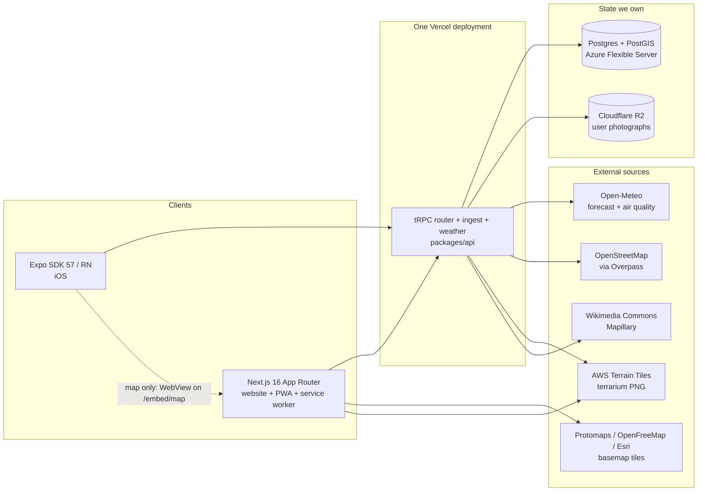

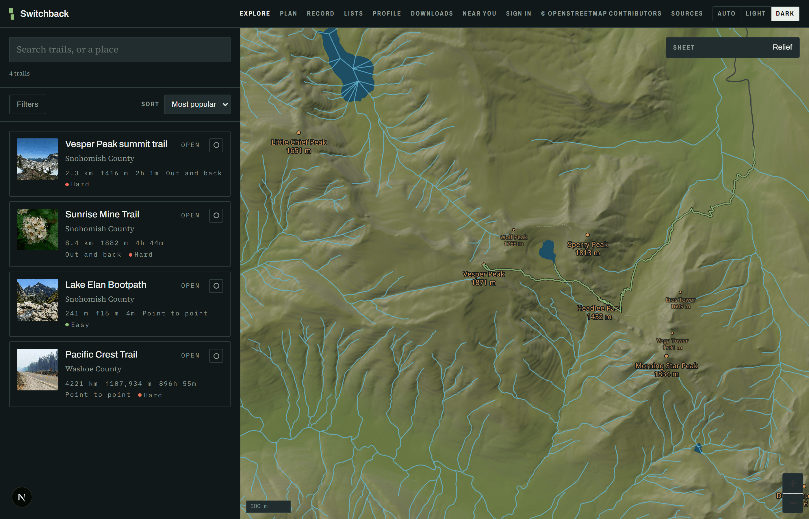

`packages/` holds the shared reasoning: `core` (types, zod schemas, difficulty and unit formulas,
the WebView protocol), `api` (tRPC routers, moderation, mobile token exchange, R2 signing), `db`
(Prisma schema — raw SQL confined to `spatial.ts`, the only file touching PostGIS columns), `geo`
(quadkeys, terrarium, Tobler, corridors, GPX/FIT, routing graph), `ingest` (Overpass, the tile
pipeline, the job queue and its admission control), `weather`, `busyness`, `ui` (one token source
for Tailwind and React Native). All source-only: no build step, no `dist/`.

## Lazy ingest: viewport to trails

The heart of the product. A viewport is covered with z9 quadkeys; tiles already in Postgres and
fresher than 30 days serve immediately, and the rest are queued while the request returns what we hold.

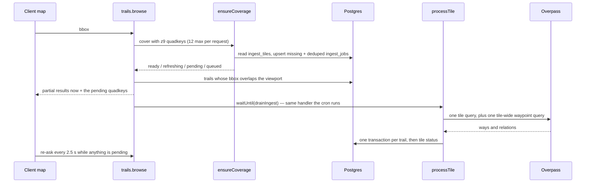

Inside `processTile`, per tile:

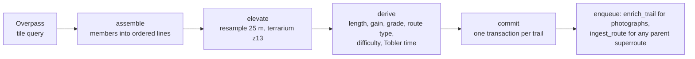

Three properties make this safe to run unattended. Every trail is keyed by `(osmType, osmId)` and
every write is an upsert, so an at-least-once queue is harmless. Each trail commits in its own
transaction and its own `try`, so one broken geometry costs one row rather than forty. And a tile
reaches `ready` only when Overpass answered — a failed tile keeps its reason, so the next request
re-queues instead of serving an empty map as though the ground held no trails.

**Durability.** `waitUntil` buys latency and nothing else; a deploy or timeout mid-flight loses the
work. So every kick also writes an `IngestJob` row that a Vercel Cron drains, and both paths run the
same idempotent handler. Claims are a visibility timeout, never a transaction held open for minutes,
which would exhaust a serverless pool. Admission control (`ingest/backpressure.ts`) is asked inside
`queueTiles` — the choke point every writing path crosses — rather than at the one button that has a
person behind it.

**Progress is polled, not streamed.** The client re-asks `browse` every 2.5 s while tiles are
outstanding. An SSE stream was the plan; with a twelve-tile cap it would cost a long-lived connection
and a held-open function per open map to carry a few messages. Revisit past hundreds of tiles.

**Long-distance routes bypass tiles.** A bbox query never recurses into member relations, so no tile
can see the Pacific Crest Trail itself — only its sections, each committed under its own name and
length. `processRoute` walks the `type=superroute` hierarchy by id, flattens it in declared order and
hands the members to the same assembler.

## Along-trail weather

A trailhead forecast describes the warmest, most sheltered point of the hike at an hour you are not
there. This samples the route and asks about each point at its own predicted arrival hour.

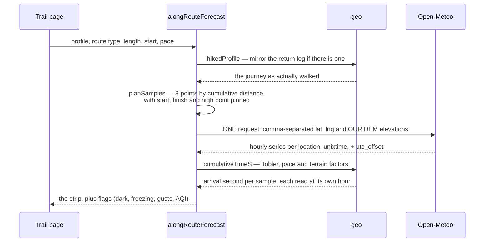

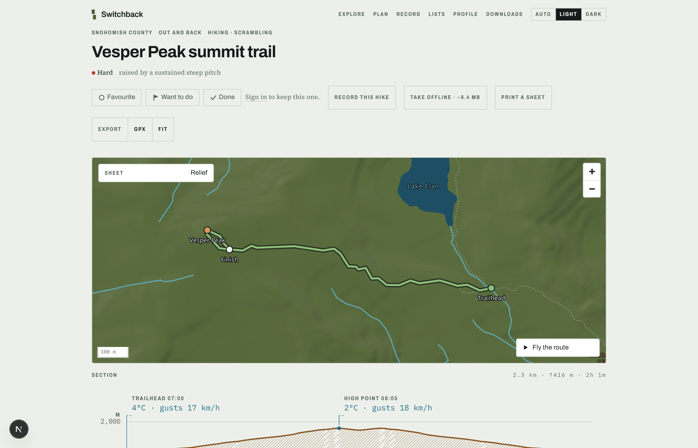

Three details carry the feature. Elevation is **sent**, not inferred — left alone Open-Meteo uses the
model cell's average, which over mountains can sit hundreds of metres below the summit; our own DEM
figure triggers its downscaling, and that is the difference between 8 °C and 1 °C. Timestamps come
back as `unixtime`, so matching an arrival to a forecast hour is integer comparison, not string
parsing across a DST boundary. And the plan is computed twice against the same pure function — once
to learn _where_ to ask, then again once the response has given us the trail's UTC offset and so what
"the next 07:00 local" means. No second call.

## Offline

Downloads are per trail and always user-initiated. The web unit of download is a **page**, not a data
blob — a trail page is server-rendered end to end, so keeping the HTML, the chunks it names, a
corridor of tiles and the photographs makes the offline page byte-for-byte the one you downloaded.

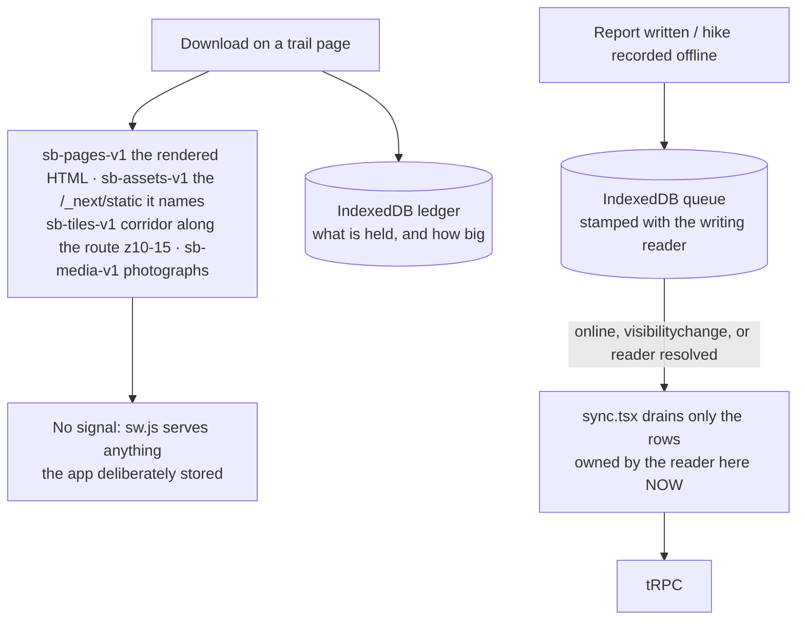

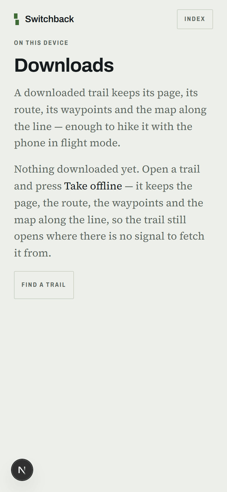

The service worker owns no URL patterns and does not know what a tile is: the app decides what is
worth keeping and writes it into a named cache, and the worker's whole rule is "if it is in one of
our caches, serve it". Caches are versioned by name rather than cleared on upgrade, and split
deliberately — four carry a hand-bumped `-v1` because their contents belong to the reader and a
deploy must not throw away a download made for a trip somebody is on; only `sb-shell-<build id>` is
build-scoped. `apps/web/test/offline-caches.test.ts` fails the build if the worker's copy of any of
these strings drifts from `src/offline/caches.ts`.

On iOS the same feature stores JSON payloads fetched with the procedures and arguments the screens
use, and `hydrate.ts` seeds them into the React Query cache under the same keys — never over live
data. The basemap is not included and the control says so: under Expo Go nothing can sit between the
map's WebView and its tile requests.

## The activity heatmap

Every public recording, aggregated onto a fixed lattice. Every control lives in the SQL rather than
the renderer, because k-anonymity applied client-side is k-anonymity an attacker declines by reading
the response. No row leaves with fewer than `HEATMAP_MIN_HIKERS` contributors, and no coordinate
leaves at all — only lattice indices.

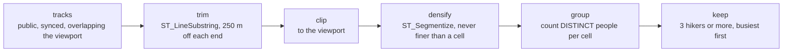

**Trimming runs before clipping, and the order is load-bearing.** `ST_LineSubstring` takes fractions
of a line, so trimming the visible part rather than the whole track would move the censored zone as
the reader pans, and uncensor a front door the moment it sits mid-screen. Clipping second is also
what bounds the work, making cost track screen area rather than track length.

`packages/core/src/heatmap.ts` carries the numbered list of controls beside the constants they
justify, and records what was turned down: differential privacy, because noise sufficient to defeat
snapshot-differencing invents traffic on ground nobody has hiked.

## Authentication

Seven trust relationships. Four are identity-based and carry no secret at all; three still pass a
stored password, and moving those is the work in progress. This section is the single picture,
because until it existed the story lived in a Bicep comment, a workflow, a Vercel setting and two
people's memory.

### Who trusts whom

Solid edges are identity-based: the caller proves who it is and Entra issues a short-lived token.
Dashed edges still carry a stored password. There are three of them, and one — `sbadmin` — holds
full DDL.

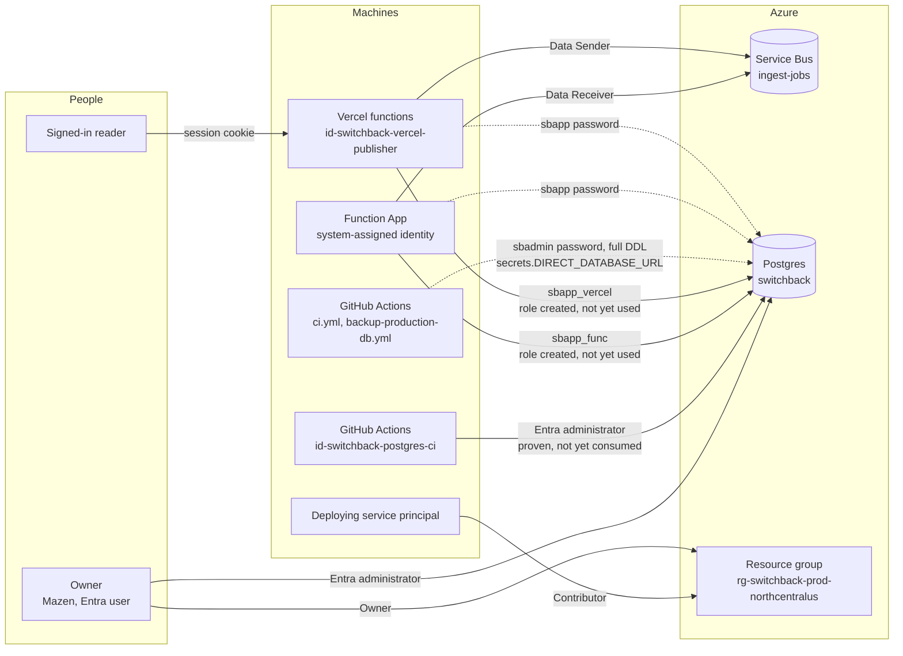

Read the two GitHub Actions boxes together, because the difference between them is the whole
point of this work. `id-switchback-postgres-ci` is an identity that reaches the database with no
password and is a working Entra administrator — but **nothing consumes it yet**. The schema push
in `.github/workflows/ci.yml` and the dump in `.github/workflows/backup-production-db.yml` both
still authenticate with `secrets.DIRECT_DATABASE_URL`, which is `sbadmin` and can create and drop
anything. That is the largest remaining credential in the system and it is a repository secret, so
its blast radius is everyone with write access to this repository.

Two things the diagram is meant to make obvious. The deploying service principal holds
Contributor and therefore cannot reach the database at all — it writes ARM, not rows. And the CI
identity holds **no Azure RBAC whatsoever**: its entire authority is the Postgres administrator
grant, so a leak of it cannot touch the resource group, the queue or the billing.

`disableLocalAuth: true` on the Service Bus namespace and zero queue SAS rules are what make the
two Service Bus edges solid rather than dashed. Postgres still has `passwordAuth: Enabled`
because the two dashed edges are real; see _What is left_ below.

### The federated exchange

No secret is stored at either end. Vercel mints an OIDC token per invocation, Entra checks the
issuer, subject and audience against a federated credential declared in Bicep, and hands back an
access token.

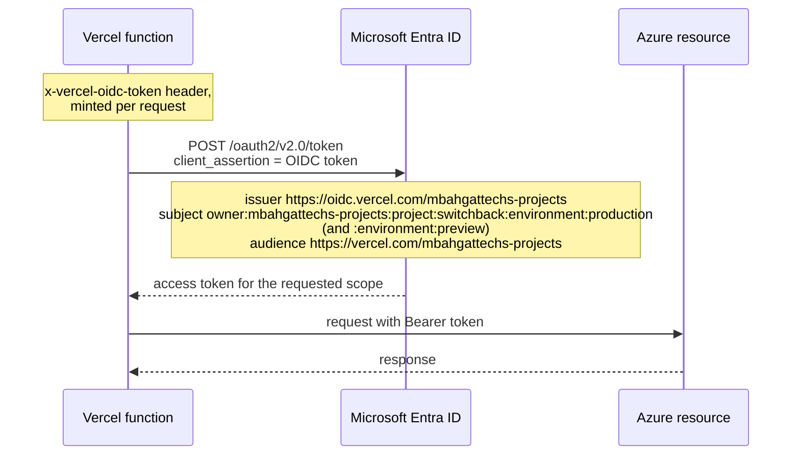

The same shape serves GitHub Actions, with issuer `https://token.actions.githubusercontent.com`
and subject `repo:mbahgatTech@81331884/switchback@1316632119:ref:refs/heads/master`. That subject
is GitHub's **immutable** form — account id and repository id rather than their names. It is not a
preference: this repository's OIDC tokens carry that form, so a credential written the readable
way is never matched and the exchange fails with `AADSTS700213`, quoting a subject that appears in
no template.

### The database token lifecycle

An access token is the _password_ on a Postgres connection, and it is short-lived. The design
below is what the pool has to do so that nothing ever needs restarting.

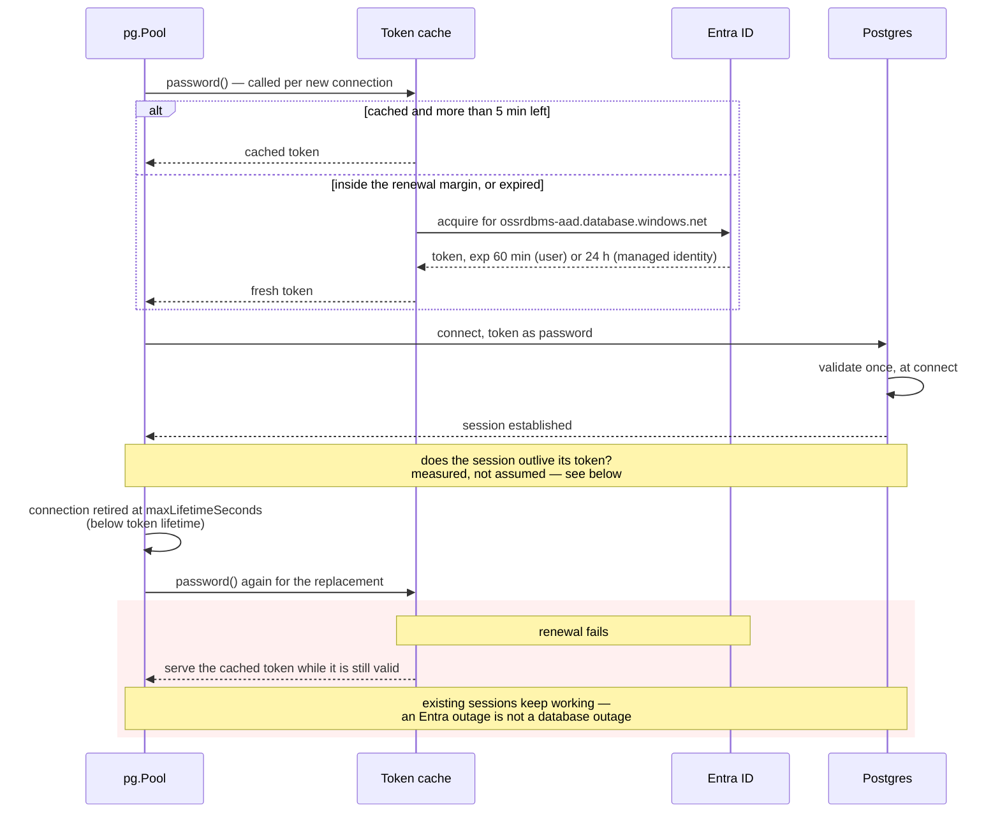

Three properties, and the reason for each. The mechanism each rests on was measured at the
version this repository pins, `@prisma/client` and `@prisma/adapter-pg` 6.19.3 with `pg` 8:

- **Acquire per connection, not per process.** `pg` accepts `password` as a function returning a
  promise and calls it once per _physical_ connection — proven by standing up a server that speaks
  the authentication handshake and recording the bytes: three concurrent checkouts produced three
  invocations and three distinct passwords on the wire, and releasing then re-acquiring a live
  connection produced none. `PrismaPg`'s constructor at 6.19.3 is
  `constructor(poolOrConfig: pg.Pool | pg.PoolConfig, options?)`, so the pool carrying that
  callback can be handed to Prisma directly.
- **Renew five minutes before expiry.** `RENEW_MARGIN_MS` in `packages/db/src/entra-token.ts`.
  Five because that is Entra's own tolerated clock skew, so treating the last five minutes as
  already gone removes skew from the problem rather than budgeting for it; it also leaves room for
  one failed renewal to be retried by the next connection while the current token still works.
- **Retire connections below the token lifetime.** `CONNECTION_LIFETIME_S`, thirty minutes,
  against a shortest issued lifetime of one hour. `pg.Pool`'s `maxLifetimeSeconds` retires the
  connection and the replacement invokes the password callback again — also measured, on the same
  harness.

What this does **not** yet do is run in production. `packages/db/src/client.ts` still builds both
Prisma clients from `DATABASE_URL` with a password in it; the token provider is tested and exported
but no call site consumes it. Wiring it is a separate change, because it also has to restate
`BACKGROUND_POOL_SIZE` and the background pool's thirty-second wait as `pg.Pool`'s `max` and
`connectionTimeoutMillis` — a driver adapter ignores the `connection_limit` and `pool_timeout`
parameters Prisma reads off the URL today, and `datasourceUrl` cannot be combined with an adapter
at all. Losing that sizing silently is the outage recorded in that file's own comment, so the
migration has to move it deliberately rather than inherit it.

Whether retiring connections is a correctness requirement or only hygiene turns on one question
nobody should answer from memory: **is the token checked only at connect, or is a live session
terminated when it expires?**

**That question is still open, and the attempt to close it is worth recording.** The `soak` action
of the `Postgres identity` workflow holds one connection and queries it every five minutes for
eighty, printing `pg_backend_pid()` each round so a silent reconnect cannot pass as survival. Run
31049068312 held backend pid 844034 from 21:32:50 to 22:52:53 UTC — same pid, same role, sixteen
probes, no error. It proves the session is stable for eighty minutes and **nothing about expiry**,
because the token it authenticated with reported `lifetime=1440min`: a managed identity gets 24
hours, not the hour the documentation quotes for a user. The test never reached the boundary it was
built to cross, and the job now exits non-zero and says so rather than reporting green.

A GitHub-hosted job is capped at six hours, so waiting the token out is not available there. Either
shorten the lifetime with an Entra token lifetime policy on that service principal, or hold the
connection from somewhere without the cap.

The thirty-minute connection lifetime is what makes the open question stop being load-bearing: a
connection is replaced, with a freshly minted token, long before the shortest token any of these
principals is issued could expire. If Azure does terminate expired sessions, no session lives long
enough to be terminated; if it does not, nothing accumulates authority granted an hour ago either
way. The answer is still worth having, and it is not worth blocking on.

### Sign-in for people

Auth.js with the Prisma adapter and a **database** session strategy: a session row can be deleted,
so "sign out everywhere" and "this account was compromised" are one query, where a JWT cannot be
revoked before it expires. The cost is a read per request, which loading `ctx.user` needed anyway.
Apple sits behind a flag because its client secret is a JWT signed per use — hence the async
Auth.js factory. The iOS app borrows the website's sign-in: Expo Go hands out an `exp://…` redirect
no provider registers.

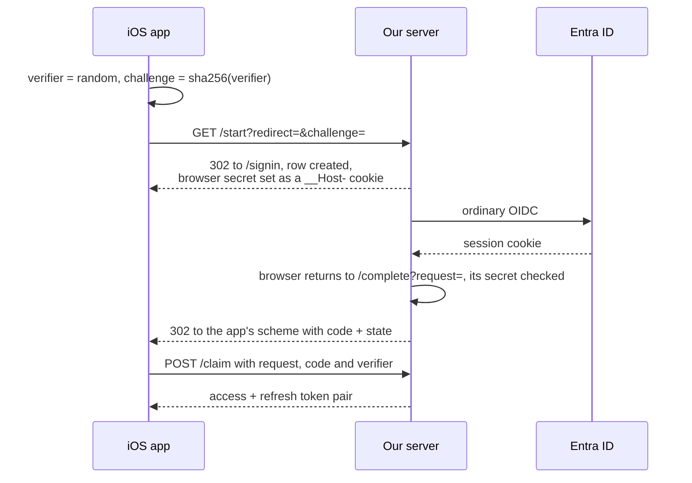

The provider only ever sees our own registered `https://` redirect. Four properties hold it together:
the code is worthless without the verifier that never left the device (PKCE applied to our own leg,
because on iOS any app may claim a URL scheme); everything is single-use inside one transaction; the
redirect is allow-listed when stored, not when used; and the row is bound to the authorising browser
as well as the claiming device, so a cross-site GET to `/complete` cannot mint a token pair on
somebody else's account.

### What is left

The database roles exist, and the refresh mechanism is proven at the pinned versions and covered by
tests — but **nothing consumes either yet**. Three passwords are still live, and they come off in
this order:

1. **The Function App.** The simplest, because it is a long-lived process with a system-assigned
   identity and no request scoping to solve. Its `DATABASE_URL` app setting still carries `sbapp`.
2. **CI and the backup workflow.** `id-switchback-postgres-ci` is a proven Entra administrator that
   nothing uses; `ci.yml` and `backup-production-db.yml` both still read
   `secrets.DIRECT_DATABASE_URL`, which is `sbadmin` with full DDL. Switching them cannot be
   rehearsed on a branch, because the federated credential trusts `refs/heads/master` alone. Two
   things will bite when it is tried: `prisma db push` would then run as a role that is not
   `sbadmin`, so new tables would be owned by it and `sbadmin`'s `ALTER DEFAULT PRIVILEGES` would
   not apply — `ALTER ROLE "id-switchback-postgres-ci" SET role = 'sbadmin'` is the cheap fix, and
   is untested.
3. **Vercel, which is a design problem rather than remaining work.** Its OIDC token arrives as the
   per-request `x-vercel-oidc-token` header and is never in `process.env` on a deployed function —
   `packages/ingest/src/publish.ts` documents this for the Service Bus path. `packages/db/src/client.ts`
   constructs its clients at module level, so a password callback fires with no request in scope
   and nothing to exchange. Threading the request's token to a connection opened during that
   request — `AsyncLocalStorage` is the obvious candidate — is unsolved, and background work started
   by `waitUntil` may open connections outside any request context at all.

`passwordAuth` stays `Enabled` until all three are moved. Turning it off first would lock the
application out of its own database with no way back that does not involve a restore.

Two smaller things, both measured rather than suspected:

- **The Prisma clients are not verifying the server's certificate.** The connection strings that
  are actually deployed carry `sslmode=verify-full` and nothing else, and Prisma ignores parameters
  it does not recognise — so the only TLS instruction it was given is one it does not read. The
  templates in `infra/azure/postgres.bicep` emit `sslaccept=strict` as well, but nothing propagates
  a template into a setting. libpq consumers (the workflows) are unaffected and do verify.
- **This repository is public.** Everything below is readable by anyone, and workflow artifacts —
  including the production database dump the backup workflow produces — are listed publicly and
  downloadable by any authenticated GitHub user. That dump contains real accounts and real GPS
  tracks.

## Design decisions, recorded once

- **Trail data is lazy per tile, not bulk-imported.** A global OSM import is tens of gigabytes to
  store, re-import and keep fresh, most of it ground nobody will open. Fetching a z9 tile when
  someone looks at it makes the corpus exactly the places people use, and freshness a 30-day TTL per
  tile. The cost is a cold first visit — hence partial results now rather than blocking on Overpass.
- **Elevation is terrarium PNGs from AWS Terrain Tiles, not a hosted elevation API.** Hosted APIs bill
  or rate-limit per point, and a 17 km trail sampled every 25 m is 680 points. Terrarium tiles are
  static objects on S3 with no quota, and that trail touches perhaps four z13 tiles — four GETs
  whatever the sampling density. The same DEM renders the default basemap, so no key or vendor stands
  between a clone of this repo and a working map.
- **The service worker cannot import anything.** It lives under `public/`, outside the module graph,
  so cache names and the static-asset pattern exist in two files. The alternative was Workbox and a
  build step, for a file whose failure mode is "the app is bricked until site data is cleared". A
  test that reads the worker as text and compares character for character makes the duplication safe.
- **A handover keeps queued writes and drops cached pages.** When the account on a browser changes,
  everything cached under `sb-` was fetched with the previous reader's cookie and goes; their queued
  reports and hikes are stamped `heldAt` and kept — a download can be fetched again, a report written
  on a ridge cannot. Reader-specific shell pages go entry by entry, not by deleting the shell cache,
  which would take the offline fallback and this build's chunks with them.
- **The map is a WebView on iOS while everything else is native.** `@maplibre/maplibre-react-native`
  needs a development build, which needs a Mac, and a second cartography to keep in step. The phone
  loads `/embed/map` from the same origin instead, so `buildStyle` and the trail layers are one
  module serving both clients. The protocol is declared in `packages/core/src/map-bridge.ts` and
  `safeParse`d at both ends, because the halves deploy separately. The map runs `browse` itself and
  returns summaries with geometry stripped: polylines must not cross a string channel on every pan.
- **Route planning runs on its own cached network.** The catalogue keeps a relation's primary line and
  drops anything under 200 m — right for a catalogue, wrong for routing, where the 150 m unnamed
  connector is what makes a loop possible. `RoutingTile`/`PathSegmentRow` cache every foot-legal way
  lazily on the same on-demand pattern, and the graph is built in the browser.
- **Background work holds its own connection pool.** Three code paths start ingest drains, each
  guarded only against a second of its own kind. Sharing the request pool meant background commits
  taking every connection and Auth.js's session lookup losing — which presents as a signed-out header
  and an empty map, not as a busy ingest. `BACKGROUND_POOL_SIZE` in `packages/db/src/client.ts` is
  the ceiling; `COMMIT_CONCURRENCY` derives itself from it.
- **Photograph bytes go straight to R2 from the browser** with a presigned PUT: Vercel's body limit is
  4.5 MB and a proxied upload pays for the bandwidth twice. SigV4 is implemented in
  `packages/api/src/storage.ts` — the AWS SDK is ~1.5 MB of bundle to produce one string.
- **Viewport queries use indexed bbox columns, not `ST_Intersects`.** A plain Prisma `where` composes
  with facets and paginates properly; PostGIS would mean a capped candidate id list intersected with
  facets afterwards, silently dropping matches when the cap bites. False positives are the better bug.
- **The route planner's profile constants must stay equal to ingest's.** `PROFILE_SPACING_M` and
  `RENDER_SIMPLIFY_M` in `routers/routes.ts` are copies of module-private values in
  `ingest/pipeline.ts`. Gain is measured under a 10 m hysteresis threshold (`GAIN_THRESHOLD_M`), so a
  profile sampled at 25 m and one at 60 m differ in _answer_, not resolution — let the two drift and
  a planned route reports different numbers from an ingested trail of the same shape.
- **Mobile state lives at module scope, not in a hook.** The tab bar destroys screen-owned state, so
  a recorder or a ping loop owned by the Record screen stops the first time somebody switches tabs —
  silently, on a safety feature whose own panel would go on claiming it was running. `record/store.ts`
  and `record/lifeline.ts` argue it from that; `offline/store.ts` from three screens needing one
  index. React subscribes through `useSyncExternalStore`.
- **Page sizes live in `apps/mobile/src/api/pages.ts`.** A page size is part of a React Query key and
  the offline layer seeds those keys from disk, so a seeded key off by one number seeds nothing and
  the screen shows its empty state on a phone holding the whole trail.
- **The design has no z-axis.** Depth is plate colour and hairline rules, never a drop shadow. No
  type can express that, so it is held by `apps/web/test/conventions.test.ts` and
  `apps/mobile/test/conventions.test.ts` reading source for shadow utilities and React Native's
  shadow props — which makes it, today, discoverable only by breaking it.
- **Survey red means the reader or their safety, and nothing else.** [design.md](design.md) owns the
  palette; what belongs here is where the colour stops. It is right on the position dot, an off-route
  banner, an overdue Lifeline, and a confirmation throwing away the reader's own hike. It is wrong on
  the record button, and wrong on a moderator's takedown in somebody else's row, where red reads as
  an accusation against them.
- **`admitIngest`'s ceiling is deliberately soft.** tRPC starts every call in a batch concurrently
  and the depth check is a bare `groupBy` under no transaction and no advisory lock, so one request
  can overshoot by `MAX_BATCH_SIZE` × `MAX_TILES_PER_REQUEST`. The obvious fix — an advisory lock
  around the count and the enqueue loop — becomes a global mutex held across up to 96 tile upserts
  and 96 job enqueues on the deliberate-area path, on a serverless deploy, past Prisma's interactive
  transaction budget. A rate limiter in front is the prerequisite, and does not exist yet.
