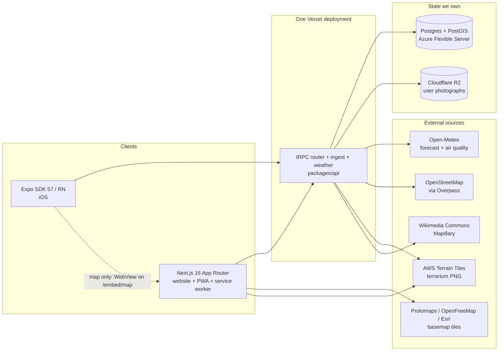
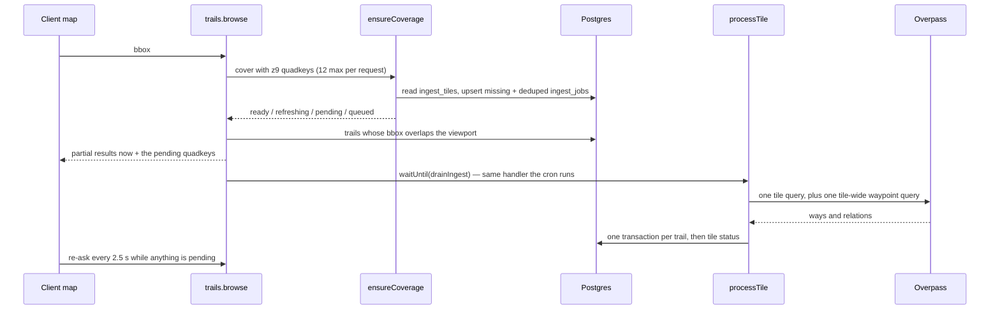
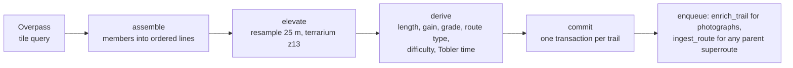
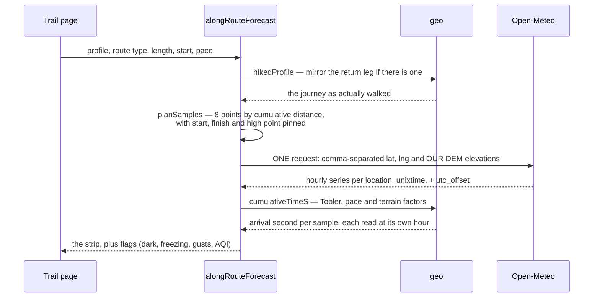
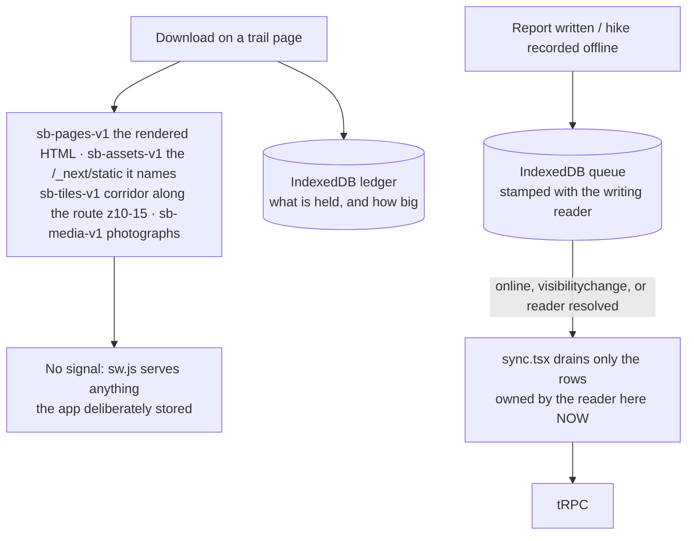
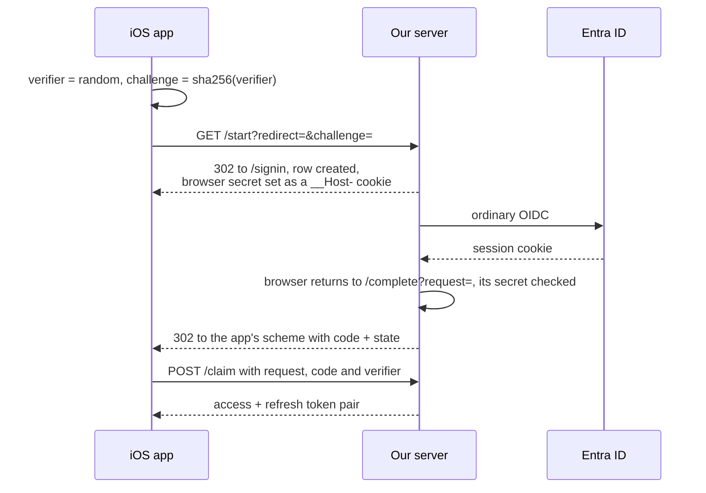

# Architecture

Switchback is trail discovery, planning and navigation: a Next.js website that is also a PWA, an
Expo/React Native iOS app, and one tRPC API both consume. There is no seeded trail corpus —
OpenStreetMap is read on demand, tile by tile, as people look at places. See also
[design.md](design.md), [mobile.md](mobile.md) and [auth-apple.md](auth-apple.md).

## System context

`packages/` holds the shared reasoning: `core` (types, zod schemas, difficulty and unit formulas,
the WebView protocol), `api` (tRPC routers, moderation, mobile token exchange, R2 signing), `db`
(Prisma schema — raw SQL confined to `spatial.ts`, the only file touching PostGIS columns), `geo`
(quadkeys, terrarium, Tobler, corridors, GPX/FIT, routing graph), `ingest` (Overpass, the tile
pipeline, the job queue and its admission control), `weather`, `busyness`, `ui` (one token source
for Tailwind and React Native). All source-only: no build step, no `dist/`.

## Lazy ingest: viewport to trails

The heart of the product. A viewport is covered with z9 quadkeys; tiles already in Postgres and
fresher than 30 days serve immediately, and the rest are queued while the request returns what we hold.

Inside `processTile`, per tile:

Three properties make this safe to run unattended. Every trail is keyed by `(osmType, osmId)` and
every write is an upsert, so an at-least-once queue is harmless. Each trail commits in its own
transaction and its own `try`, so one broken geometry costs one row rather than forty. And a tile
reaches `ready` only when Overpass answered — a failed tile keeps its reason, so the next request
re-queues instead of serving an empty map as though the ground held no trails.

**Durability.** `waitUntil` buys latency and nothing else; a deploy or timeout mid-flight loses the
work. So every kick also writes an `IngestJob` row that a Vercel Cron drains, and both paths run the
same idempotent handler. Claims are a visibility timeout, never a transaction held open for minutes,
which would exhaust a serverless pool. Admission control (`ingest/backpressure.ts`) is asked inside
`queueTiles` — the choke point every writing path crosses — rather than at the one button that has a
person behind it.

**Progress is polled, not streamed.** The client re-asks `browse` every 2.5 s while tiles are
outstanding. An SSE stream was the plan; with a twelve-tile cap it would cost a long-lived connection
and a held-open function per open map to carry a few messages. Revisit past hundreds of tiles.

**Long-distance routes bypass tiles.** A bbox query never recurses into member relations, so no tile
can see the Pacific Crest Trail itself — only its sections, each committed under its own name and
length. `processRoute` walks the `type=superroute` hierarchy by id, flattens it in declared order and
hands the members to the same assembler.

## Along-trail weather

A trailhead forecast describes the warmest, most sheltered point of the hike at an hour you are not
there. This samples the route and asks about each point at its own predicted arrival hour.

Three details carry the feature. Elevation is **sent**, not inferred — left alone Open-Meteo uses the
model cell's average, which over mountains can sit hundreds of metres below the summit; our own DEM
figure triggers its downscaling, and that is the difference between 8 °C and 1 °C. Timestamps come
back as `unixtime`, so matching an arrival to a forecast hour is integer comparison, not string
parsing across a DST boundary. And the plan is computed twice against the same pure function — once
to learn _where_ to ask, then again once the response has given us the trail's UTC offset and so what
"the next 07:00 local" means. No second call.

## Offline

Downloads are per trail and always user-initiated. The web unit of download is a **page**, not a data
blob — a trail page is server-rendered end to end, so keeping the HTML, the chunks it names, a
corridor of tiles and the photographs makes the offline page byte-for-byte the one you downloaded.

The service worker owns no URL patterns and does not know what a tile is: the app decides what is
worth keeping and writes it into a named cache, and the worker's whole rule is "if it is in one of
our caches, serve it". Caches are versioned by name rather than cleared on upgrade, and split
deliberately — four carry a hand-bumped `-v1` because their contents belong to the reader and a
deploy must not throw away a download made for a trip somebody is on; only `sb-shell-<build id>` is
build-scoped. `apps/web/test/offline-caches.test.ts` fails the build if the worker's copy of any of
these strings drifts from `src/offline/caches.ts`.

On iOS the same feature stores JSON payloads fetched with the procedures and arguments the screens
use, and `hydrate.ts` seeds them into the React Query cache under the same keys — never over live
data. The basemap is not included and the control says so: under Expo Go nothing can sit between the
map's WebView and its tile requests.

## Auth

Auth.js with the Prisma adapter and a **database** session strategy: a session row can be deleted, so
"sign out everywhere" and "this account was compromised" are one query, where a JWT cannot be revoked
before it expires. The cost is a read per request, which loading `ctx.user` needed anyway. Apple sits
behind a flag because its client secret is a JWT signed per use — hence the async Auth.js factory. The
iOS app borrows the website's sign-in: Expo Go hands out an `exp://…` redirect no provider registers.

The provider only ever sees our own registered `https://` redirect. Four properties hold it together:
the code is worthless without the verifier that never left the device (PKCE applied to our own leg,
because on iOS any app may claim a URL scheme); everything is single-use inside one transaction; the
redirect is allow-listed when stored, not when used; and the row is bound to the authorising browser
as well as the claiming device, so a cross-site GET to `/complete` cannot mint a token pair on
somebody else's account.

## Design decisions, recorded once

- **Trail data is lazy per tile, not bulk-imported.** A global OSM import is tens of gigabytes to
  store, re-import and keep fresh, most of it ground nobody will open. Fetching a z9 tile when
  someone looks at it makes the corpus exactly the places people use, and freshness a 30-day TTL per
  tile. The cost is a cold first visit — hence partial results now rather than blocking on Overpass.
- **Elevation is terrarium PNGs from AWS Terrain Tiles, not a hosted elevation API.** Hosted APIs bill
  or rate-limit per point, and a 17 km trail sampled every 25 m is 680 points. Terrarium tiles are
  static objects on S3 with no quota, and that trail touches perhaps four z13 tiles — four GETs
  whatever the sampling density. The same DEM renders the default basemap, so no key or vendor stands
  between a clone of this repo and a working map.
- **The service worker cannot import anything.** It lives under `public/`, outside the module graph,
  so cache names and the static-asset pattern exist in two files. The alternative was Workbox and a
  build step, for a file whose failure mode is "the app is bricked until site data is cleared". A
  test that reads the worker as text and compares character for character makes the duplication safe.
- **A handover keeps queued writes and drops cached pages.** When the account on a browser changes,
  everything cached under `sb-` was fetched with the previous reader's cookie and goes; their queued
  reports and hikes are stamped `heldAt` and kept — a download can be fetched again, a report written
  on a ridge cannot. Reader-specific shell pages go entry by entry, not by deleting the shell cache,
  which would take the offline fallback and this build's chunks with them.
- **The map is a WebView on iOS while everything else is native.** `@maplibre/maplibre-react-native`
  needs a development build, which needs a Mac, and a second cartography to keep in step. The phone
  loads `/embed/map` from the same origin instead, so `buildStyle` and the trail layers are one
  module serving both clients. The protocol is declared in `packages/core/src/map-bridge.ts` and
  `safeParse`d at both ends, because the halves deploy separately. The map runs `browse` itself and
  returns summaries with geometry stripped: polylines must not cross a string channel on every pan.
- **Route planning runs on its own cached network.** The catalogue keeps a relation's primary line and
  drops anything under 200 m — right for a catalogue, wrong for routing, where the 150 m unnamed
  connector is what makes a loop possible. `RoutingTile`/`PathSegmentRow` cache every foot-legal way
  lazily on the same on-demand pattern, and the graph is built in the browser.
- **Background work holds its own connection pool.** Three code paths start ingest drains, each
  guarded only against a second of its own kind. Sharing the request pool meant background commits
  taking every connection and Auth.js's session lookup losing — which presents as a signed-out header
  and an empty map, not as a busy ingest. `BACKGROUND_POOL_SIZE` in `packages/db/src/client.ts` is
  the ceiling; `COMMIT_CONCURRENCY` derives itself from it.
- **Photograph bytes go straight to R2 from the browser** with a presigned PUT: Vercel's body limit is
  4.5 MB and a proxied upload pays for the bandwidth twice. SigV4 is implemented in
  `packages/api/src/storage.ts` — the AWS SDK is ~1.5 MB of bundle to produce one string.
- **Viewport queries use indexed bbox columns, not `ST_Intersects`.** A plain Prisma `where` composes
  with facets and paginates properly; PostGIS would mean a capped candidate id list intersected with
  facets afterwards, silently dropping matches when the cap bites. False positives are the better bug.
