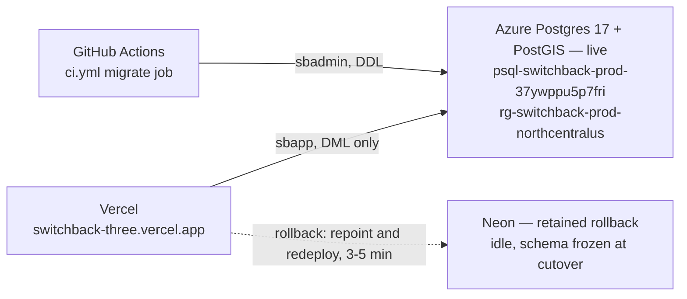

# Switchback's production database, on Azure

One **Azure Database for PostgreSQL Flexible Server** — PostgreSQL 17 with PostGIS, in its own
resource group, described entirely in Bicep. It replaced **Neon** and nothing else: the app stays
on Vercel, photographs stay in Cloudflare R2, CI stays on GitHub Actions.

**Production has served from Azure since 2026-07-30, about 20:09 UTC.** Neon is retained, intact
and idle, as the rollback.



---

## Read this first

- **The admin password is known again, and it is not the one that was lost.** The old value was
  never recorded anywhere and could not be read back out of ARM, which blocked every redeploy. On
  2026-08-05 it was deliberately _set_ to a freshly generated 48-character value rather than
  recovered — `az rest PATCH` with the body in a file outside the repository, deleted immediately.
  It now lives in **three** places: the owner's password manager, a 0600 file on the owner's
  machine, and the `DIRECT_DATABASE_URL` repository secret, which `ci.yml` and the backup workflow
  both read. The third is the one that matters for blast radius: anyone with write access to this
  repository can add a workflow step that prints it, so compromise of repository write access is
  compromise of the database administrator. It remains unreadable from ARM, so a redeploy still has
  to be given the same value.
- **There is now a path into this database that needs no password at all.** The owner is a declared
  Microsoft Entra administrator; see [Connecting by hand, with no
  password](#connecting-by-hand-with-no-password). That is what stops "the password is not recorded
  anywhere" from ever being an outage again.
- **No SLA.** The subscription is **Visual Studio Enterprise**, which carries dev/test terms and no
  service-level agreement, and Microsoft may suspend instances that look like production use. This
  database is production use. That is a business risk this file cannot mitigate, only name.
- **The spending limit is `On`.** If the credit runs out, Azure **deallocates every resource in the
  subscription** — see the last row of [Signals](#signals-that-something-is-wrong). The
  subscription was already over its $150 credit on other workloads before this database billed
  anything, so headroom here is negative.
- **The two budget drifts are converged.** Both were blocked on the admin password; the deployment
  of 2026-08-05 applied them. The resource-group budget needed its own start date — ARM will not
  create a monthly budget beginning before the current month — which is why `budgetStartDate` and
  `workloadBudgetStartDate` are two parameters rather than one.
- **Neon's schema is frozen at the cutover commit** and nothing keeps it current, so a rollback is
  now two steps rather than one. See [Rollback expiry](#rollback-expiry).
- **There is a portable backup, and it has been restored.** Point-in-time restore only restores
  into Azure; `.github/workflows/backup-production-db.yml` produces a dump that does not, and
  proves it by loading it and comparing. See [Backups](#backups) for what it does not carry.

---

## Something is wrong

### Signals that something is wrong

A 500 on its own tells you nothing. These do:

| Symptom                                                             | Cause                                                               |
| ------------------------------------------------------------------- | ------------------------------------------------------------------- |
| `/api/version` fine, `/nearby` and `/trails/*` 500                  | Prisma cannot reach Azure — firewall, TLS, or wrong port            |
| `prepared statement "s0" already exists`                            | Pooled URL missing `pgbouncer=true` (General Purpose only)          |
| `SSL connection required`                                           | `sslmode=verify-full` missing from a URL                            |
| `function st_dwithin(geography, geography, numeric) does not exist` | PostGIS not created, or not on `search_path`                        |
| `/nearby` correct but slower than 3 s                               | `trails_geom_geography_gist` missing or unused — sequential scan    |
| Search returns nothing for a trail you know exists                  | `trails_search_vector_gin` or `trails_name_trgm` missing            |
| Everyone signed out                                                 | `sessions` rows lost in the window. Expected, self-healing          |
| Every page 1–2 s slower                                             | Wrong region. Not fixable in place                                  |
| Azure active connections pinned at the ceiling                      | Pool sizing — check `BACKGROUND_POOL_SIZE` against the tier         |
| Every route 500, and the server is gone from the portal             | The credit ran out and the spending limit deallocated it. See below |

`/api/version` reads no database, so a green `/api/version` proves nothing about Postgres —
`/nearby` and `/trails/llanberis-path` do.

That last row is the one with no five-minute fix. The recovery is either to wait for the next
billing month or to remove the spending limit, which converts the subscription to pay-as-you-go
and starts charging a card. Roll back to Neon while deciding.

**If a symptom is not fixable in five minutes, roll back first and diagnose afterwards.** Neon is
warm and the cost of rolling back is one redeploy.

### Rolling back to Neon

Neon is retained, populated and reachable. Rolling back is a Vercel change and a redeploy.

1. **Get the Neon connection strings.** They are on this machine, in two files:

   ```bash
   cat ~/.sb-neon.url          # direct endpoint  -> DIRECT_DATABASE_URL
   cat ~/.sb-neon-pooled.url   # pooled endpoint  -> DATABASE_URL
   ```

   If those are gone, the **Neon console** connection-string panel is the source that survives
   everything else; reset the role password there and rebuild the URL if it is no longer shown.

   **Not** from a GitHub Actions secret — those are write-only, so a rollback copy in one is not a
   copy. And no longer from Vercel: the Neon integration variables that used to make
   `POSTGRES_URL_NON_POOLING` readable there are deleted and the integration is disconnected.

   Then set `DATABASE_URL` and `DIRECT_DATABASE_URL` in Vercel → Production back to those values.

2. Redeploy. Poll `/api/version`. Run the six smoke routes.
   **Time to restore service: about 3–5 minutes**, nearly all of it the redeploy.

3. **Push the schema to Neon before trusting it.** Its schema is frozen at the cutover commit — see
   [Rollback expiry](#rollback-expiry). If anything has shipped since, reconcile it by hand:

   ```bash
   DATABASE_URL='<neon-pooled>' DIRECT_DATABASE_URL='<neon-direct>' npm run db:push
   ```

   Read the diff Prisma proposes before accepting it. `db:push` loads `.env` through `dotenv-cli`,
   which does not override variables already present in the environment — so the two above win, but
   check the host it prints before answering any prompt.

4. Revert the repository secrets `DATABASE_URL` / `DIRECT_DATABASE_URL` to the Neon values.
5. Reconcile in reverse: rows written to Azure since cutover exist only there. This is manual — no
   script here performs it. Replay by hand if the set turns out to matter.
6. **Leave Azure running and intact** until the cause is understood. Do not delete the evidence.

#### Rollback expiry

**Neon's schema is frozen at the cutover commit, and nothing keeps it current.** Keeping it current
would have meant a second `db push` against Neon from `ci.yml`. That was proposed, never added, and
is not going to be: a schema migration running unwatched against the one copy of the data that
exists if Azure is broken is a worse failure mode than the one it prevents. So the first schema
change shipped after 2026-07-30 20:09 UTC makes a rollback two steps rather than one, and the
further past the cutover, the larger the diff `db push` proposes against a database holding the
only copy of anything Azure has lost. Survivable while it is a column or two. It stops being
survivable quietly.

The Azure-only write set has the same shape: it has to stay small enough to replay by hand, and it
grows every day. **Keep Neon for at least 30 days,** and treat the rollback as expiring rather than
permanent. Neon suspends idle compute automatically and retains the data, so a warm rollback costs
nothing.

---

## Backups

Two of them, because they fail in different ways.

### Azure point-in-time restore — the floor

Free, automatic, and the fastest way back from a bad `db push`. Measured 2026-08-05:

| Fact                   | Value                                                               |
| ---------------------- | ------------------------------------------------------------------- |
| Retention configured   | 14 days, locally redundant, `geoRedundantBackup: Disabled`          |
| Earliest restore point | `2026-07-30T16:32:40Z` — the server's own creation                  |
| Full backups taken     | Daily, one per day since creation, plus continuous transaction logs |
| Server state           | `Ready`, `replicationRole: Primary` — eligible                      |

```bash
az postgres flexible-server show \
  --resource-group rg-switchback-prod-northcentralus \
  --name psql-switchback-prod-37ywppu5p7fri \
  --query 'backup' -o json
```

**The window is as deep as the server is old, not 14 days.** The server was created on 2026-07-30,
so today it reaches back six days. It becomes a true 14-day window on 2026-08-13, and until then
the retention setting is a ceiling rather than a fact.

Two limits worth knowing before relying on it. A restore provisions a **new** Flexible Server —
about $57/month for as long as it exists, against a subscription that is already over its credit
with the spending limit `On`. And it restores into Azure and nowhere else, which is no help if the
subscription is what failed.

### The logical dump — the portable half

`.github/workflows/backup-production-db.yml`, run on demand. It runs on a runner because this
machine cannot reach 5432; the workflow header says why in full.

It takes the census and the dump inside **one exported transaction snapshot**, restores the dump
into a throwaway PostGIS container in the same run, runs `infra/backup/census.sql` against both,
and fails unless the two are byte-identical. A dump nobody has restored is a hope, so the run
either produces a verified archive or a red job — never an unexamined file.

`infra/backup/rehearse-locally.sh` is the same comparison against a synthetic database in Docker,
which is how `census.sql` is tested without touching production.

**What comes out, and who can read it:**

| Artifact                     | Contents                                     | Retention      | Readable by                                                        |
| ---------------------------- | -------------------------------------------- | -------------- | ------------------------------------------------------------------ |
| `switchback-production-dump` | `-Fc` archive of the whole database          | 3 days (input) | **withheld entirely unless the repository is private** — see below |
| `switchback-backup-evidence` | census, diff, schema-only SQL, TOC, manifest | 30 days        | anyone who can read the repository, which today is everyone        |

**An Actions artifact is readable by everyone who can read the repository.** On a public
repository that is every GitHub account, not "every collaborator" — which is what this file and
the workflow both used to say, while the repository was already public. What that mistake cost:
run 31043403970 published a 371 MiB full dump for a day. `sessions.sessionToken` and the
`accounts` `refresh_token`, `access_token` and `id_token` columns are stored in plaintext, so
that archive was an account-takeover primitive for every account in it, not a privacy problem.
It was deleted on 2026-08-05; the two session rows and the OAuth tokens it exposed should still
be treated as compromised.

The workflow no longer trusts a comment about visibility. It asks the API, and uploads the dump
only on a `private == true` answer — a failed call, a deleted step or a renamed field all
withhold it. The dump is still taken, restored and compared either way, so the verification runs
on a public repository; only the durable copy is refused, and the run summary says so rather than
skipping quietly.

**A GitHub artifact is a proving ground, not a home.** It is unencrypted and its deletion leaves
no audit trail. It is not encrypted on purpose: a passphrase minted by a workflow and kept only
in a repository secret cannot be read back, which is exactly the failure this file already
records for the admin password. A durable off-Azure copy belongs in a private container in a
Storage account inside `rg-switchback-prod-northcentralus`, where the delete lock, a lifecycle
rule and Azure's own access logs already apply. Nothing in this repository does that yet, so
while the repository stays public there is no dump-based rollback — Azure's own point-in-time
restore, which reaches back to the server's creation and deepens to 14 days on 2026-08-13, is
the one that remains.

The archive is **371 MiB**. The personal data in it is currently one account, one user row, two
sessions and no recorded activities: 43,179 trails, 384,209 waypoints, 107,672 photo rows and
33,709 ingest jobs are all derived from OpenStreetMap. That is a statement about today, not
about the design — the retention is short, and the visibility gate exists, because of what this
archive will hold once people use the product.

### Restoring the dump

Download the artifact, check it against `MANIFEST.txt`, then — into any server that has PostGIS
available, which the archive needs and does not carry:

```bash
createdb --template=template0 --encoding=UTF8 --lc-collate=C.UTF-8 --lc-ctype=C.UTF-8 switchback
psql -d switchback -c "ALTER DATABASE switchback SET default_text_search_config = 'pg_catalog.simple';"
psql -d switchback -c 'CREATE ROLE sbadmin; CREATE ROLE sbapp;'   # where they do not already exist
pg_restore -d switchback --exit-on-error switchback-prod-<timestamp>.dump
```

`--exit-on-error` is not optional. `pg_restore`'s default is to continue and print a count of
ignored errors at the end, which is how a restore that dropped a whole section still looks like it
worked.

**Four things the archive does not carry**, each of which has to be supplied by hand:

- **`default_text_search_config`.** Production sets it as an Azure _server_ parameter, so pg_dump
  cannot see it. Left at the default of `pg_catalog.english`, future ingest tokenises differently
  from the rows that arrived and search quietly stops finding trails.
- **Role passwords.** Roles are named in the dump; their credentials are not, and never were.
- **The SRID catalogue PostGIS ships.** `spatial_ref_sys` is registered with
  `pg_extension_config_dump` under a filter several hundred ranges long, so only SRIDs added by
  hand are in the dump — `CREATE EXTENSION postgis` supplies the rest. Restore into a database
  without PostGIS and SRID 4326 is simply absent, which fails every `::geography` cast in the
  product. This is why the verification asserts that the SRIDs the data _uses_ are present rather
  than diffing the whole table: production runs PostGIS 3.6.1 and the rehearsal container 3.5, and
  their shipped catalogues legitimately disagree.
- **An override of a shipped SRID.** Editing 3857's definition in place puts it inside that filter,
  so it would not be backed up. Nothing here does that; this is the note that would make it
  noticeable if something ever did.

One more thing pg_dump cannot carry, which is why the verification restores as `azuresu` rather
than `sbadmin`: **ownership of a table an extension creates.** `spatial_ref_sys` belongs to
whoever ran `CREATE EXTENSION postgis`, which on this server is Azure's internal superuser. A
restore elsewhere will have it owned by whoever runs the restore, and nothing about the product
depends on that.

---

## What it provisions

| File               | What it is                                                                                     |
| ------------------ | ---------------------------------------------------------------------------------------------- |
| `main.bicep`       | Subscription-scoped. Creates the resource group, then calls the modules. Outputs the hostname. |
| `postgres.bicep`   | The server: compute, storage, backups, firewall, server parameters, the database.              |
| `monitoring.bicep` | Log Analytics workspace, the alert action group, and the workload budget.                      |
| `lock.bicep`       | The resource group's `CanNotDelete` lock. A module because locks are resource-group scoped.    |
| `main.bicepparam`  | Every non-secret parameter. Committed. The password is **not** here and never may be.          |

| Resource          | Value                                                           |
| ----------------- | --------------------------------------------------------------- |
| Resource group    | `rg-switchback-prod-northcentralus`                             |
| Region            | North Central US (Chicago)                                      |
| Server            | `psql-switchback-prod-37ywppu5p7fri`                            |
| Version           | PostgreSQL 17, PostGIS 3.6.1                                    |
| Compute           | Burstable `Standard_B2s` — 2 vCore, 4 GiB, 414 user connections |
| Storage           | 64 GiB Premium SSD (240 IOPS), autogrow on                      |
| Backups           | 14 days, locally redundant, no geo-redundancy                   |
| High availability | None                                                            |
| Database          | `switchback`, collation `C.UTF-8` (matched to Neon)             |
| Admin login       | `sbadmin` (migration/CI); app connects as `sbapp`               |
| Network           | Public, one firewall rule spanning the internet                 |
| Extensions        | `postgis`, `pg_trgm`, `btree_gist` allow-listed                 |
| Delete lock       | `switchback-prod-no-delete`, `CanNotDelete`, **in place**       |
| Authentication    | Microsoft Entra **and** password, both enabled                  |

The server name's 13-character suffix is a pure function of the resource group id, so a redeploy
reconciles this server rather than provisioning beside it.

### Connecting by hand, with no password

This is the break-glass path, and it exists because the admin password once was not recorded
anywhere and nothing could be deployed. It needs no stored credential at all: the owner is a
declared Microsoft Entra administrator of the server, so an `az login` is enough.

```bash
az login
export PGHOST=psql-switchback-prod-37ywppu5p7fri.postgres.database.azure.com
export PGUSER="$(az ad signed-in-user show --query userPrincipalName -o tsv)"
export PGDATABASE=switchback
export PGSSLMODE=verify-full
# Without this libpq looks only in ~/.postgresql/root.crt under verify-full and fails closed,
# which reads as a rejected credential. Point it at the system trust store instead. The path
# is Debian/Ubuntu; on Fedora or RHEL use /etc/pki/tls/certs/ca-bundle.crt, and on macOS with
# Homebrew openssl "$(brew --prefix)/etc/openssl@3/cert.pem".
export PGSSLROOTCERT=/etc/ssl/certs/ca-certificates.crt
export PGPASSWORD="$(az account get-access-token --resource-type oss-rdbms --query accessToken -o tsv)"
psql -c 'select current_user'
unset PGPASSWORD
```

The username is the full UPN including the `#EXT#` part for a guest account — Azure matches the
token to the role by object id, but the role's _name_ is the UPN, and psql sends the name.

**When that does not work.**

- _`root certificate file "…/.postgresql/root.crt" does not exist`_, or a certificate-verify
  failure: `PGSSLROOTCERT` is unset or points at the wrong path for this distribution. This is the
  most common way the recipe above fails on a fresh machine.
- _The token expired._ Entra issues these with a randomised 60–90 minute life (one measured on
  2026-08-05 carried 78 minutes), so a session opened yesterday needs a fresh one; re-run the
  `PGPASSWORD` line.
- _The password is rejected._ Check `az account show` is the right tenant before suspecting the
  database, and check `PGUSER` is the full UPN.
- _`server closed the connection unexpectedly` while the server's `connections_failed` metric
  stays at zero._ The server never saw the attempt, so the problem is the local network path — a
  VPN holding the default route does this. Run it from a GitHub Actions runner instead: dispatch
  the `Postgres identity` workflow with the **`inspect`** action, which takes the same federated
  token path and reads the same things, with no password anywhere. Do **not** reach for `survey`
  here: that action authenticates with `secrets.DIRECT_DATABASE_URL` and exists only to describe
  the repository secrets, so it is useless in exactly the case where the password is the problem.

**Everything above the `psql` line has now been run by a person; the `psql` line has not.** On
2026-08-05 the owner's machine produced the UPN the recipe expects
(`mazenbahgat_outlook.com#EXT#@mazenbahgatoutlook.onmicrosoft.com`) and a token for
`https://ossrdbms-aad.database.windows.net` whose `oid` claim is
`8c682736-d90b-4c33-a718-1916597894f8` — the same object id the server carries as its human Entra
administrator, which is what the match is made on. What remains unproven is the connection itself,
because that machine cannot reach 5432 at all. Treat the first real `psql` as a test of the recipe
as well as of the database, and correct this file if it is wrong.

Password authentication is still enabled, so `sbadmin` remains available as the second break-glass.
Its password is not in ARM and not readable from Vercel, but it **is** in the `DIRECT_DATABASE_URL`
repository secret as well as the owner's password manager — see "Read this first". Re-deploying the
template requires passing the same value.

### Machine identities

| Principal                        | Database role               | May do                           |
| -------------------------------- | --------------------------- | -------------------------------- |
| Owner (Entra user)               | the UPN                     | administer                       |
| `id-switchback-postgres-ci`      | `id-switchback-postgres-ci` | administer, so `db push` can DDL |
| `func-switchback-ingest-…` MSI   | `sbapp_func`                | exactly what `sbapp` may do      |
| `id-switchback-vercel-publisher` | `sbapp_vercel`              | exactly what `sbapp` may do      |

The two application roles hold their privileges by membership in `sbapp` rather than by a copied
list of grants, so they cannot drift from it — including for a table `prisma db push` creates
tomorrow, which `sbapp`'s default privileges already cover. `infra/postgres-identity/` holds the
SQL, and the `provision` action of the `Postgres identity` workflow applies and re-verifies it.

ARM cannot create these: they are SQL objects behind `pgaadauth_create_principal_with_oid`, which
runs in the database as an Entra administrator. A `Microsoft.Resources/deploymentScripts` resource
could run it and keep the call inside the template, and it was rejected: it provisions a container
instance and a storage account on every deployment, on a subscription whose spending limit
deallocates everything when the credit runs out, to run two idempotent statements. The workflow is
declarative in the way that matters — the files are the source of truth, the run re-asserts and
re-verifies them — and costs nothing.

### Cost

| Line                                        | USD / month |
| ------------------------------------------- | ----------- |
| Compute — Burstable `Standard_B2s`          | 49.64       |
| Storage — 64 GiB Premium SSD @ $0.115/GiB   | 7.36        |
| Backup — 14 days, inside the free allotment | 0.00        |
| **Total**                                   | **57.00**   |

Pay-as-you-go list prices for North Central US, verified against the retail API.

The $150 monthly credit is **not** headroom for this workload. Measured for July 2026 with
`Microsoft.CostManagement/query`:

| Resource group                                  | USD        |
| ----------------------------------------------- | ---------- |
| `rg-mazenbahgat-8881`                           | 179.85     |
| `me_plant-environment_plant_together_centralus` | 11.52      |
| `plant_together`                                | 0.02       |
| `rg-switchback-prod-northcentralus`             | 0.00       |
| **Subscription total**                          | **191.39** |

The subscription is already over its credit before this database has billed anything, so the real
headroom is **negative**. The design was already sized to the Burstable tier for exactly this
reason. What it changes is the _alerting_: a subscription-scoped budget cannot say anything about
this database when 94% of the spend is somebody else's, which is why `monitoring.bicep` carries a
second, resource-group-scoped budget.

### The two budgets, converged

Both drifts were fixed by the deployment of 2026-08-05, which was possible because the admin
password is known again — a redeploy writes `administratorLoginPassword` to whatever
`PGADMIN_PASSWORD` holds, so it could not be attempted while the value was lost.

| Budget                      | Was      | Now                                                                         |
| --------------------------- | -------- | --------------------------------------------------------------------------- |
| `switchback-database`       | `Create` | Created. The resource-group-scoped one, the only number about this workload |
| `switchback-monthly-credit` | `Modify` | Converged to the declared ramp, 90% + 100%                                  |

Creating the first one needed a second parameter. ARM refuses to create a monthly budget whose
start date is before the current month, and the subscription budget — created in July and holding
a live window nobody should move — keeps `2026-07-01`. Hence `budgetStartDate` and
`workloadBudgetStartDate`, which are not duplication but two different immutable facts.

`main.bicep`'s header lists the other `what-if` diffs, which are provider-assigned residue and
never converge. Read it before concluding the template has drifted.

---

## Four decisions that look odd

**North Central US, not Virginia.** Both East US and East US 2 are _offer-restricted_ for this
subscription: `az postgres flexible-server list-skus --location eastus2` returns zero supported
editions and the reason "Subscriptions are restricted from provisioning in this region", and
`eastus` says the same. Of the four regions available — North Central US, Central US, Canada
Central, West US 3 — Chicago is closest to Vercel's `iad1` and Neon's AWS `us-east-1`. So the
database is roughly **20 ms further** from the application than Virginia would have been, and a
tRPC call pays that round trip several times. Pricing is identical, so the $57.00 total is
unaffected. A Flexible Server cannot be moved between regions afterwards.

**Burstable, which means no PgBouncer.** Azure's pooler is not available on this tier. That is a
real loss, bought deliberately: General Purpose `Standard_D2ds_v5` plus this storage is about
$137/month, 91% of the credit, and the spending limit _deallocates every resource_ when the credit
runs out. `Standard_B2s` allows 414 user connections against a Vercel fleet holding at most ~15 per
warm instance, so there is nothing for a pooler to solve yet.

It also deletes a failure class: the pooler runs transaction pooling with
`pgbouncer.max_prepared_statements` defaulting to `0`, and Prisma uses named prepared statements
for essentially every query. Getting that wrong produces intermittent
`prepared statement "s0" already exists` that appears only under concurrency — it passes every
smoke test and fails in production.

Escalating later is two values in `main.bicepparam` (`tier = 'GeneralPurpose'`,
`skuName = 'Standard_D2ds_v5'`) and a redeploy; PgBouncer, the pooled port and the `pgbouncer=true`
URL parameter all follow from the tier. Watch for sustained `active_connections` above ~300, or
`connection_failed` in the server log.

**One firewall rule, `0.0.0.0`–`255.255.255.255`.** Vercel serverless functions on this plan have
no static outbound IPs — dedicated egress is an Enterprise feature — and neither do GitHub-hosted
runners. There is no range to allowlist. A private endpoint is not the alternative it looks like:
it would put the server on an Azure virtual network, and Vercel's functions run in Vercel's own AWS
infrastructure with no route into it. Azure also refuses to mix public and private access and will
not let a server move between them, so choosing private now would be a one-way door.

So the perimeter is a credential, and these are the compensating controls:

- TLS mandatory (`require_secure_transport`) and **verified** rather than merely encrypted — see
  [Connection-string shape](#connection-string-shape) for why `require` would not be enough.
- A 13-character deterministic hostname suffix, so scanners walking dictionary names find nothing.
- A high-entropy, SCRAM-only admin password, and `connection_throttle.enable` backing off repeated
  failed logins.
- `log_connections` / `log_disconnections` shipping to Log Analytics, so an unexpected login leaves
  a record.
- The one that bounds the blast radius: **the credential Vercel carries is `sbapp`, not
  `sbadmin`**. It can read and write rows and is refused `CREATE TABLE`, which
  `scripts/verify-migration.ts` asserts by connecting as it and trying.

The residual risk is therefore _leakage_ rather than brute force, which makes the credential
inventory the thing to keep honest:

| Store             | Value                                 | Notes                                            |
| ----------------- | ------------------------------------- | ------------------------------------------------ |
| GitHub secret     | `DATABASE_URL`                        | read by `ci.yml`'s `migrate` job                 |
| GitHub secret     | `DIRECT_DATABASE_URL`                 | `prisma db push` runs through this, so `sbadmin` |
| Vercel Production | `DATABASE_URL`, `DIRECT_DATABASE_URL` | `sbapp` — the web app never carries `sbadmin`    |
| Vercel Preview    | `DATABASE_URL`, `DIRECT_DATABASE_URL` | separate entries, added after the cutover        |

The three `AZURE_*` GitHub secrets are gone, and so are the seventeen `POSTGRES_*` / `PG*` /
`NEON_*` variables the Vercel↔Neon marketplace integration had put into the project — five of them
complete Neon connection strings, two the bare password, one (`POSTGRES_URL_NO_SSL`) a connection
string with TLS switched off, all scoped to Production **and Preview**. The integration itself is
disconnected, so they do not come back. Verify rather than trust this paragraph:

```bash
gh secret list --repo mbahgatTech/switchback
npx vercel env ls
```

GitHub's values cannot be read back, so the `Notes` column is design intent plus what each consumer
demonstrably requires, not a readback. If you need to know what a secret contains, the only honest
answer is to set it again from a source you trust.

**No geo-redundant backup, no high availability.** Both would be reasonable on a database without a
warm standby. This one has Neon: the disaster procedure is "point `DATABASE_URL` back at Neon and
redeploy", minutes to restore with no data loss up to the cutover. Geo-restore takes minutes to
hours, has up to an hour of RPO, and cannot do point-in-time restore at all.

`geoRedundantBackup` is **immutable after creation**. If Neon is ever decommissioned this becomes
the weak point, and changing it means rebuilding the server. Say so out loud at that time rather
than discovering it.

---

## Deploying

Every shell block below writes intermediate files under `$TMP`. Define it once, before the first
block, and use one shell for the whole procedure:

```bash
TMP="${TMPDIR:-/tmp}"
```

Not `$TEMP`: that is a Windows variable Git Bash inherits and is unset on Linux, macOS and in a
container, where `"$TEMP/pgpw"` expands to `/pgpw` — a write at the filesystem root that either
fails or, as root, succeeds somewhere nobody will think to shred. The admin password is the file in
question.

### Prerequisite: register the resource provider

The first deployment fails with `MissingSubscriptionRegistration` unless this has run. Idempotent,
a minute or two.

```bash
az account set --subscription 5cb9e7c3-0e31-4388-94e9-b36eab4bf977
az provider register --namespace Microsoft.DBforPostgreSQL --wait
```

### Prerequisite: `DEPLOY_DELETE_LOCK=false` unless you can write locks

`main.bicep` declares the resource group's `CanNotDelete` lock and `deployDeleteLock` defaults to
`true`. Creating a lock is `Microsoft.Authorization/locks/write`, which built-in **Contributor**
does not have — it is excluded by the `Microsoft.Authorization/*/Write` entry in Contributor's
`notActions`. The service principal that deploys this subscription holds Contributor at
subscription scope and nothing else, so with the default left alone **both `az deployment sub
create` and `az deployment sub what-if` fail** — the first with `AuthorizationFailed`, the second
with `InvalidTemplateDeployment` wrapping the same denial, because preflight is preflight:

```
ERROR: (AuthorizationFailed) The client '…' does not have authorization to perform action
'Microsoft.Authorization/locks/write' over scope '…/providers/Microsoft.Authorization/locks/
switchback-prod-no-delete' or the scope is invalid.
```

Export the override for the run and both work again:

```bash
export DEPLOY_DELETE_LOCK=false
```

### Prerequisite: `DEPLOY_DATABASE=false` against a server that already has one

`main.bicep` declares the `switchback` database and `deployDatabase` defaults to `true`, which is
right for a from-scratch build and wrong for every redeploy after it. Charset and collation are
fixed by `CREATE DATABASE` and cannot be altered, so ARM has no update to perform — and the
provider does not treat re-declaring them as a no-op. It rejects a PUT carrying the value the
server itself reads back:

```
Invalid value given for parameter collation. Specify a valid parameter value.
```

Measured 2026-08-05 against this server, whose `az postgres flexible-server db show` reports
`"collation": "C.UTF-8"` — the exact string being sent. The deployment fails _after_ the server
resource has been written, which is the worst place to stop.

```bash
export DEPLOY_DATABASE=false
```

### Prerequisite: Entra authentication before Entra administrators

On a server whose `activeDirectoryAuth` is still `Disabled`, ARM refuses an `administrators` child
— and refuses it at preview time too, so `what-if` returns `BadRequest` on that resource instead of
a change list, and the one deployment that restarts the production database cannot be reviewed
first. Bootstrapping therefore takes two runs: one with `entraAuthEnabled = true` and
`entraAdministrators` empty, then one with the list filled in. Enabling it installs the `pgaadauth`
extension and **restarts the server**; adding administrators afterwards does not.

On the live server this was done imperatively, and the deployment that followed converged it. The
restart was watched with the site under a request every twenty seconds and never dropped one.

**A failed run is genuinely a no-op — it does not rotate the admin password.** ARM authorizes the
whole template at preflight, before any resource is touched, so the deployment is rejected rather
than partially applied and `administratorLoginPassword` is never written.

Leave the committed default at `true`, and expect to keep exporting the override: ARM authorizes
each declared operation against the _action_, not against whether the value would change, so a
template that declares the lock issues a PUT and needs the permission on every run, lock already in
place or not. **The override is permanent for a Contributor-only principal** — do not read it as
drift. The same `notActions` entry means a Contributor cannot _remove_ the lock either, which is
the point of the design.

### Deploy

The admin password never reaches `argv`, a committed file, or a log line. It is generated into a
file under `$TMP`, exported into the environment, and read from there by `readEnvironmentVariable`
in `main.bicepparam`.

`openssl rand -hex 32` rather than `-base64`, and that is not a style preference: three places in
this repository parse `DATABASE_URL` with the WHATWG URL parser (`apps/web/src/env.ts`,
`packages/db/src/client.ts`, `vitest.config.ts`). A `/` in the userinfo — which base64 emits about
half the time — does **not** throw. It terminates the authority, the host silently becomes
something else, and the failure names nothing useful. Hex has no such characters.

```bash
openssl rand -hex 32 > "$TMP/pgpw"
export PGADMIN_PASSWORD="$(cat "$TMP/pgpw")"

az deployment sub create \
  --name switchback-db \
  --location northcentralus \
  --template-file infra/azure/main.bicep \
  --parameters infra/azure/main.bicepparam
```

**Put that password in a password manager now, before going any further.** This is the only moment
it is readable — see [Redeploying](#redeploying) for what depends on it.

Read the outputs — hostname, ports, and the two connection-string templates, none of which contains
the password:

```bash
az deployment sub show --name switchback-db --query properties.outputs -o json
```

Then shred the scratch files. This is **not** an archival step; the password manager above is the
only copy that survives:

```bash
rm -f "$TMP/pgpw"
unset PGADMIN_PASSWORD
```

**Preview before applying**, especially on a redeploy:

```bash
az deployment sub what-if \
  --location northcentralus \
  --template-file infra/azure/main.bicep \
  --parameters infra/azure/main.bicepparam
```

`what-if` runs the same preflight authorization check as a real deployment, and reports its failure
as `InvalidTemplateDeployment` wrapping `Authorization failed for template resource
'switchback-prod-no-delete'` — so grepping for `AuthorizationFailed` alone will miss it.

### Connection-string shape

On the Burstable tier every URL uses port **5432** and none carries `pgbouncer=true`:

```
postgresql://sbadmin:…@<host>:5432/switchback?sslmode=verify-full&sslaccept=strict
postgresql://sbapp:…@<host>:5432/switchback?sslmode=verify-full&sslaccept=strict
```

`sslmode=verify-full` rather than `require`, and `sslaccept=strict` alongside it, are both
load-bearing — see the note at the foot of `postgres.bicep`. `require` encrypts the session and
then accepts whatever certificate it is handed, which on an endpoint reachable from all of IPv4
authenticates nothing; `verify-full` is the libpq half and `sslaccept=strict` is the Prisma half,
and each client ignores the other's parameter.

libpq looks for a root store in `~/.postgresql/root.crt` and fails closed when it is absent, so
anything running `psql`, `pg_dump` or `pg_restore` against these URLs must also set
`PGSSLROOTCERT` to a bundle containing DigiCert Global Root G2 and Microsoft RSA Root CA 2017. On
Debian and Ubuntu that is `/etc/ssl/certs/ca-certificates.crt`; both roots are already in it.

`DATABASE_URL` and `DIRECT_DATABASE_URL` are identical on this tier, and that is correct rather
than redundant — `schema.prisma` requires `directUrl` to exist, and keeping the split means the
eventual General Purpose escalation is a pure environment-variable change with no code diff. On
General Purpose, `DATABASE_URL` moves to `:6432` and gains `&pgbouncer=true`.

Do **not** add `connection_limit` to either URL. `backgroundUrl()` in `packages/db/src/client.ts`
only injects `connection_limit=10` when the URL does not already carry one, so setting a smaller
value on `DATABASE_URL` silently shrinks the _ingest_ pool too — while `COMMIT_CONCURRENCY` in
`packages/ingest/src/pipeline.ts` still derives six concurrent commits from the unchanged constant.
Six commits against five connections is a pool timeout on every drain.

### Redeploying

Re-running the template is a no-op, not a second server. `main.bicep`'s header lists the properties
`what-if` reports and which never converge; read that before concluding it has drifted.

**The exception with teeth is the password.** ARM cannot read the current password, so whatever is
passed is written. Pass the _same_ value every time — a redeploy with a freshly generated password
silently rotates the admin credential and every connection string carrying it stops working,
including the ones Vercel is using to serve the site. Which means the value has to be readable at
that moment, and there is exactly one place it can live: **a password-manager entry.** Not the
`$TMP` file, which the deploy procedure shreds; not a GitHub Actions secret, which cannot be read
back; not Vercel, which is deliberately never given the admin credential. If it is not in a
password manager it is not anywhere, and "pass the same value every time" is an instruction nobody
can carry out. Recovering from that is out of band and out of scope for this file.

Deleting a Flexible Server deletes all of its backups, irrecoverably, which is what the resource
group's `CanNotDelete` lock exists to prevent.

### The delete lock

`switchback-prod-no-delete` is **in place** on `rg-switchback-prod-northcentralus`. Confirm with:

```bash
az lock list --resource-group rg-switchback-prod-northcentralus -o table
```

It is declared in `main.bicep` (module `deleteLock`, in `lock.bicep`), so deploying as a principal
that can write locks maintains it:

```bash
unset DEPLOY_DELETE_LOCK          # or export DEPLOY_DELETE_LOCK=true
# …then deploy exactly as under "Deploy", passing the *same* admin password
```

The password caveat above applies in full: this is a deployment, so it writes
`administratorLoginPassword`. Placing the lock through the template and changing the admin
credential by accident is one command, not two.

If the lock has to be replaced by hand instead — by an Owner who is not running the deployment —
the name must match the template **exactly**, or the next deployment adds a second lock beside the
first and `what-if` reports `switchback-prod-no-delete` as a `Create` in perpetuity:

```bash
az lock create --name switchback-prod-no-delete --lock-type CanNotDelete \
  --resource-group rg-switchback-prod-northcentralus \
  --notes "Production database for Switchback. This group holds the Postgres server and its only backups, plus the Log Analytics workspace carrying the connection audit log and the alerts that would notice a problem. Deleting the server destroys every user account, every recorded GPS track and 19,157 trails, and the backups go with it. Declared in infra/azure/main.bicep. Removing this lock is a deliberate act: say why, in the pull request that does it."
```

Copy the `--notes` text from `lockNotes` in `main.bicep` rather than writing your own: `what-if`
compares declared properties, not just existence, so notes that differ read as a permanent `Modify`
— the same never-converging diff as a wrong name, in a quieter costume. **The live lock's notes are
a shortened paraphrase and do not match `lockNotes`,** so expect exactly that until a deployment
rewrites them.

---

## The least-privilege application role

`sbapp` is the credential Vercel carries. ARM cannot run SQL, so `postgres.bicep` names the role
but cannot create it. This step does, and `scripts/verify-migration.ts` turns it from an intention
into a checked claim. It has been run; it is written out because it has to be run again against any
rebuilt server.

Pick a _different_ password from `sbadmin`'s — the whole point is that a leak of the web credential
is not a leak of the admin one. Connect as `sbadmin` with `psql`, then:

```sql
-- Substitute the sbapp password by hand. Deliberately a plain top-level statement rather than
-- a DO $$ … $$ block: a statement executed through PL/pgSQL `EXECUTE format(…%L…)` is quoted
-- back verbatim in PostgreSQL's `CONTEXT:` line when it raises, which means a failure prints
-- the password in cleartext to whatever is reading stderr. A top-level statement's error does
-- not quote its own text. If you do wrap this in a DO block, pass `-v VERBOSITY=terse` to psql,
-- which suppresses DETAIL/HINT/CONTEXT.
CREATE ROLE sbapp LOGIN PASSWORD '…';
-- …or, if it already exists:
-- ALTER ROLE sbapp LOGIN PASSWORD '…';

REVOKE ALL ON SCHEMA public FROM sbapp;
GRANT CONNECT ON DATABASE switchback TO sbapp;
GRANT USAGE ON SCHEMA public TO sbapp;
GRANT SELECT, INSERT, UPDATE, DELETE ON ALL TABLES IN SCHEMA public TO sbapp;
GRANT USAGE, SELECT ON ALL SEQUENCES IN SCHEMA public TO sbapp;
ALTER DEFAULT PRIVILEGES IN SCHEMA public
  GRANT SELECT, INSERT, UPDATE, DELETE ON TABLES TO sbapp;
ALTER DEFAULT PRIVILEGES IN SCHEMA public
  GRANT USAGE, SELECT ON SEQUENCES TO sbapp;
```

The two `ALTER DEFAULT PRIVILEGES` statements are the ones people leave out. Without them the
grants cover the tables that exist right now, and the next `prisma db push` that adds a table
produces a `permission denied` on a table the app has never seen — at runtime, in production, on
whichever page reads it first.

Then confirm the boundary rather than assuming it:

```sql
SELECT rolname, rolsuper, rolcreatedb, rolcreaterole, rolbypassrls,
       pg_has_role(rolname, 'azure_pg_admin', 'member') AS is_pg_admin
FROM pg_roles WHERE rolname = 'sbapp';
```

All six should be false. `verify:migration` asserts the same thing from the other side, by
connecting _as_ `sbapp` and requiring `CREATE TABLE` to be refused, which is the version that
cannot be fooled by a misread catalogue.

---

## Verifying

`scripts/verify-migration.ts` compares a source and a target and prints a table of pass/fail. Worth
re-running after any restore, any rebuild, and any cutover. It prints no connection string and no
row of user data, and exits non-zero on any failure.

```bash
export NEON_VERIFY_URL='postgresql://…@…neon.tech/switchback?sslmode=verify-full'
export AZURE_VERIFY_URL='postgresql://sbadmin:…@…postgres.database.azure.com:5432/switchback?sslmode=verify-full&sslaccept=strict'
export AZURE_APP_VERIFY_URL='postgresql://sbapp:…@…postgres.database.azure.com:5432/switchback?sslmode=verify-full&sslaccept=strict'
export NEON_CHECKSUMS="$TMP/neon-checksums.txt"
export AZURE_CHECKSUMS="$TMP/azure-checksums.txt"
npm run verify:migration
```

| Variable                       | If omitted                                                              |
| ------------------------------ | ----------------------------------------------------------------------- |
| `NEON_VERIFY_URL`              | The script prints a usage error and exits 1 before connecting           |
| `AZURE_VERIFY_URL`             | Same                                                                    |
| `AZURE_APP_VERIFY_URL`         | Recorded as a **failure**, not a skip                                   |
| `NEON_CHECKSUMS`               | Recorded as a **failure** (`checksums · source file not found at`)      |
| `AZURE_CHECKSUMS`              | Same, for the target                                                    |
| `CHECKSUM_SNAPSHOT_CONSISTENT` | Treated as not `1`, which loosens the ingest-derived tables to warnings |

**None of the first five is optional.** Omitting one produces a red run, not a shorter one: the
least-privilege role is listed by `postgres.bicep` as a compensating control for a firewall
spanning the whole internet, and silently skipping its check would turn a missing environment
variable into a clean bill of health. A green run means every check ran.

Checksum files are `table|rows|md5` per line, computed in SQL on each side. On the source they must
be taken from _inside the transaction snapshot `pg_dump` used_, and `CHECKSUM_SNAPSHOT_CONSISTENT=1`
is the assertion that they were. Without it the ingest-derived tables (trails, waypoints, tiles,
jobs, sessions) are compared against a live Neon that keeps taking writes, so a difference in those
is a warning rather than a failure. `photos` is deliberately not on the forgiving list: it holds
user uploads as well as ingest-derived hero images, and treating somebody's lost photograph as
expected churn is the wrong default.

### What each check catches

`pg_restore` exiting 0 proves that a program finished. This proves rather more, and every check
exists because there is a specific way a migration can look complete and not be:

| Check                                                 | Catches                                                                             |
| ----------------------------------------------------- | ----------------------------------------------------------------------------------- |
| Source and target hosts differ                        | A run comparing a database to itself, which otherwise passes everything             |
| Per-table `count(*)` + `md5` of every row, both sides | A missing table, a short table, a corrupted row, a lost geometry or tsvector        |
| Absolute row-count floors                             | A restore that loaded nothing — two empty databases match perfectly                 |
| Every table from `schema.prisma` present              | A table that never arrived                                                          |
| All 8 indexes from `spatial.sql`, by name             | An index that did not rebuild                                                       |
| `trails_centroid_gist` **absent**                     | The one index `spatial.sql` deliberately drops                                      |
| `pg_index.indisvalid`                                 | An index that rebuilt broken                                                        |
| Foreign-key count matches source                      | A `post-data` section that never ran                                                |
| `default_text_search_config`, collation               | Future ingest tokenising differently from the rows that arrived                     |
| `sum(ST_Length(geom::geography))`, `sum(ST_NPoints)`  | Truncated or altered geometry                                                       |
| `DISTINCT ST_SRID = {4326}` exactly                   | A lost SRID — every row count stays perfect and every distance goes wrong           |
| NULL-geometry counts per column                       | Rows arriving without their geometry                                                |
| Two named trails compared by WKB hash                 | Truncation on the longest line in the corpus                                        |
| `trailIdsNear` id set, both sides                     | Different answers to the query the product runs                                     |
| `EXPLAIN` names `trails_geom_geography_gist`          | An index that is present, valid, and _unused_ — 3,850 ms versus 178 ms on `/nearby` |

The last migration run reported **72 checks, 72 passed, 0 warnings, 0 failed**, with source and
target checksum files byte identical.

---

## Cutting over

**Already done.** Kept because the same steps apply to any rebuild. Steps 1 and 3–8 ran; step 2 was
dropped as incoherent and step 9 was deliberately not done — both are covered under
[Rolling back](#rolling-back-to-neon) and [Rollback expiry](#rollback-expiry).

Preconditions: verification green, and a low-traffic hour. Avoid 04:17 UTC —
`apps/web/vercel.json` runs the ingest drain cron then.

1. **Record the moment.** Note `T0` in UTC. Anything written to Neon after this exists only there.

2. **Save the way back — somewhere you can read it.** Not a GitHub Actions secret: those are
   write-only, so a rollback copy in one is not a copy. Put the Neon pooled and direct strings
   where a human can read them at 2am — here, `~/.sb-neon.url` and `~/.sb-neon-pooled.url`, plus
   the password-manager entry that holds the database credentials.

3. **Repoint production.** Change `DATABASE_URL` and `DIRECT_DATABASE_URL` in Vercel to the Azure
   values. Decide deliberately whether Preview moves too; leaving Preview on Neon doubles as a live
   rollback rehearsal. If the edit is refused or the value reverts, an integration owns the
   variable — disconnect the Neon _storage integration_ first (that does not delete the Neon
   database, so the rollback survives), then set it by hand. This is where a cutover stalls.

4. **Redeploy.** An environment-variable change does nothing to a running deployment, which is the
   single most common way a cutover appears to have done nothing. Fire the deploy hook, or press
   Redeploy in the dashboard.

5. **Wait for the alias**, exactly as `ci.yml`'s deploy job does: poll
   `https://switchback-three.vercel.app/api/version` until `.commit` matches and `.environment` is
   `production`.

6. **Smoke-test the six routes** from `ci.yml`: `/`, `/explore`, `/nearby`,
   `/trails/llanberis-path`, `/attribution`, `/manifest.webmanifest`. All 200, no redirects.

7. **Prove it is actually on Azure**, which none of the above does. Two checks:

   - `SELECT count(*) FROM pg_stat_activity WHERE datname = 'switchback'` on Azure should go from
     ~0 to non-zero, while Neon's connection count falls to zero.
   - Post a review through the UI and confirm the row lands in Azure's `reviews` and **not** in
     Neon's. That is the definitive test and it takes thirty seconds.

8. **Update the repository secrets** `DATABASE_URL` and `DIRECT_DATABASE_URL` to the Azure values,
   so `ci.yml`'s `migrate` job pushes schema to the live database.

9. **Delete any migration-scoped secrets.** Two of the three `AZURE_*` secrets carried `sbadmin`, a
   member of `azure_pg_admin` that can execute DDL against production. Before cutover they
   addressed a database nothing depended on; afterwards they addressed the live one, readable by
   any workflow anyone adds later. That is the blast-radius argument being quietly given up.

   **Done — and the caveat is which half of it is provable.** Only the deletion is:

   ```bash
   gh secret list --repo mbahgatTech/switchback | grep AZURE_
   ```

   No output means the deletion happened. **What it cannot tell you is whether the step ran in the
   right order.** Those two secrets were also the last remaining copy of the admin password. The
   instruction was to give it a home a human can read _before_ deleting them, precisely because
   deleting first converts "an unreadable copy exists" into "no copy exists at all" — and a
   password manager leaves no evidence anything here can query. **Treat the admin password as
   unconfirmed rather than safe** until someone who ran the step says otherwise.

### What can be lost, honestly

**Downtime: effectively zero.** The dump is a consistent snapshot that does not block writers, the
restore happens on a database nobody is using, and Vercel switches the alias atomically.

**Data loss: bounded by the window, not by the dump.** Anything written to Neon between the
snapshot and the moment Vercel starts talking to Azure exists only in Neon. Three sources:

- the drain cron, once a day at 04:17 UTC — just do not migrate in that minute;
- viewport ingest, which is **self-healing**: it is derived from OpenStreetMap and re-queueing the
  tiles regenerates it;
- human writes — `users`, `accounts`, `sessions`, `reviews`, `photos`, `activities`,
  `activity_samples`, `trail_lists`, `trail_list_items`, `completions`, `planned_routes`,
  `lifeline_sessions`, `mobile_refresh_tokens`. **This is the irreplaceable set.** A lost
  `activities` + `activity_samples` pair is somebody's recorded walk; a lost `photos` row leaves an
  orphaned object in R2 that nothing will ever reference. Losing `sessions` rows signs everyone out
  — cosmetic, self-healing, and the first thing anyone notices.

The web app's offline write queue (`apps/web/src/offline/`) replays some in-flight writes after
cutover, which partly cushions this.

**Closing the window is a manual job and no script here does it.** `verify:migration` only reads,
and no `reconcile` script exists. Replaying means `WHERE "createdAt" >= T0` on the human-authored
tables above, inserted `ON CONFLICT (id) DO NOTHING` — every id in `schema.prisma` is a `cuid()`
and there is not one `autoincrement()`, so there are no sequences to resync and no collisions. It
covers **inserts only**; updates and deletes made in the window are not recoverable this way. So
plan any cutover on the assumption that **writes in the window are not automatically recovered** —
tolerable because the window is minutes, ingest is self-healing and the irreplaceable set is small,
not because the recovery exists. Nothing is _lost_ while Neon is retained: anything stranded there
can still be read and replayed by hand by someone with both credentials in front of them.

### If you ever have to move the data again

The local route to Azure **corrupts TLS records under sustained `COPY`**
(`SSL error: sslv3 alert bad record mac`), which killed both a 4-way parallel restore and a
single-stream one part way through. The data was loaded table by table with retries, the largest
table in 13 chunks. A runner does not have this problem; plan for it if you are on a workstation.

Two things the preflight caught before any data moved, both now fixed in these files:

- **Collation.** Neon is `C.UTF-8`; this template said `en_US.utf8`, which is Azure's default. Byte
  order against dictionary order — every `ORDER BY name` would have silently reordered.
- **`default_text_search_config`.** Neon is `pg_catalog.simple`; Azure defaults to
  `pg_catalog.english`. No current query consults it (every `to_tsvector` /
  `websearch_to_tsquery` in the codebase names `'english'` explicitly), but it is matched anyway.

---

## Known follow-up

Operational items outstanding are in [Read this first](#read-this-first). This one is code:

- **`packages/db/scripts/apply-spatial.ts`** constructs a bare `new PrismaClient()`, so all of
  `spatial.sql` — including three `CREATE EXTENSION` and every `CREATE INDEX` — runs over
  `DATABASE_URL`, the _pooled_ endpoint. Harmless on Burstable, where both URLs are the same 5432
  endpoint. It becomes DDL through a transaction-mode pooler the moment General Purpose is adopted,
  which is precisely what the `url`/`directUrl` split exists to prevent. One line: read
  `DIRECT_DATABASE_URL ?? DATABASE_URL` into `datasourceUrl`.
